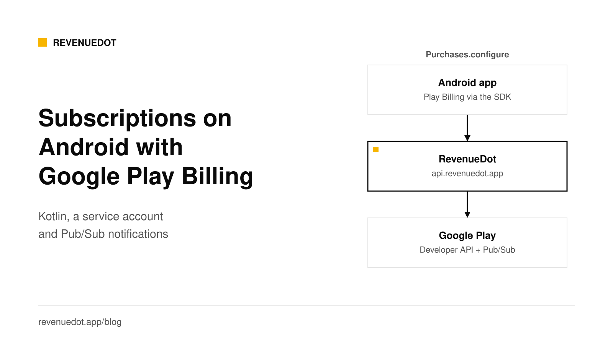
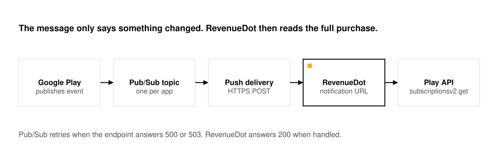
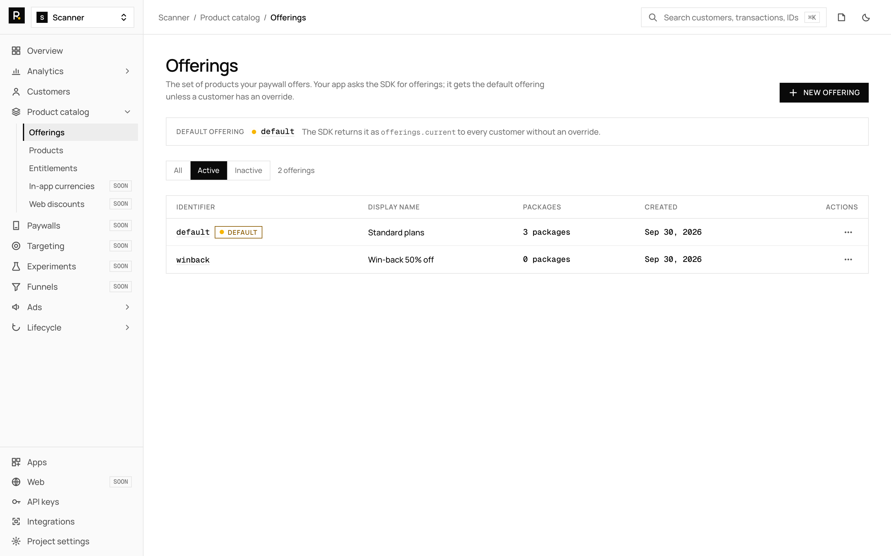

# Android subscriptions with Google Play Billing, Kotlin and RTDN

To add Google Play subscriptions to an Android app, create a subscription and base plan in Play Console, add the RevenueDot SDK (`app.revenuedot.purchases:purchases`, which wraps Google Play Billing), call `Purchases.configure` with your app's key, and call `awaitOfferings` and `awaitPurchase`. On the server side you need two things: a service account so the backend can read each purchase from the Google Play Developer API, and real-time developer notifications (RTDN) on Pub/Sub so it hears about renewals and refunds. RevenueDot is that backend.



## What you need

- A Google Play Console developer account and an app with a package name.
- A Google Cloud project (any project works for the service account and Pub/Sub topic).
- Android Studio and a Kotlin app.
- A RevenueDot Cloud project. [Sign up free](https://app.revenuedot.app/signup).

Google's [Play Billing documentation](https://developer.android.com/google/play/billing/getting-ready) notes that by August 31, 2026, all new apps and updates to existing apps must use Billing Library version 8 or later. The RevenueDot SDK bundles the Billing Library: version 10.23.3 uses Billing Library 8.3.0 ([source](https://github.com/revenuedot/purchases-android/blob/10.23.3-revenuedot/gradle/libs.versions.toml)). Keep the SDK current.

## Step 1: Create the subscription in Play Console

Google's [help page](https://support.google.com/googleplay/android-developer/answer/140504) describes a three-level setup.

1. **Create the subscription.** On the Subscriptions page, click **Create subscription**. The Product ID must start with a number or a lowercase letter and be at most 40 characters. Add a name.
2. **Add a base plan.** Choose auto-renewing, prepaid or installments, then set the billing period, grace period and account hold.
3. **Set prices.** Use **Update prices** for bulk pricing by region.
4. **Activate.** Click **Save**, then **Activate**, so the base plan can be bought.

Write down the Product ID and the Base plan ID. RevenueDot's product ID for a Google Play subscription is `subscriptionId:basePlanId`, for example `pro:monthly`. A plain `pro` matches every base plan of that subscription.

## Step 2: Create a service account

The service account is how RevenueDot reads each purchase from Google. It uses it to verify the purchase, acknowledge it (Google refunds purchases that nobody acknowledges within three days), look up refunds and run store actions such as refund and defer. Google's [security guidance](https://developer.android.com/google/play/billing/security) says to verify on a secure backend with `purchases.subscriptionsv2.get` and to acknowledge from the server so a purchase is not refunded when the customer does not reopen the app.

1. In [Google Cloud](https://console.cloud.google.com/apis/library/androidpublisher.googleapis.com), enable the **Google Play Android Developer API** for your project.
2. Under **IAM, Service accounts**, create a service account. Open it, choose **Keys, Add key, JSON**, and download the file.
3. In Play Console, open **Users and permissions** and invite the service account's email. Google's [API access guide](https://developers.google.com/android-publisher/getting_started) says billing needs "View financial data, orders, and cancellation survey responses" and "Manage orders and subscriptions". RevenueDot's guide also lists **View app information**.
4. In RevenueDot, create a **Google Play** app with your package name. Open it, drop in the JSON file and click **Check credentials**.

New Play Console permissions can take up to 36 hours to apply. Until then the check says the account "works but cannot see this app yet". Keep the JSON file secret. Anyone who holds it can read your orders.

Without a service account, RevenueDot answers 503 (code 7101) to a Google receipt, and the SDK keeps the purchase and retries once you add it.

## Step 3: Set up real-time developer notifications

The purchase flow tells your backend about the first purchase. RTDN tells it about everything after that: renewals, cancellations, grace periods, account holds, refunds. Google says RTDN runs on Cloud Pub/Sub, and that you must call the Developer API after each message to get the complete status. RevenueDot does that for you.



1. Copy the app's notification URL from RevenueDot. It looks like `https://api.revenuedot.app/v1/notifications/google/{app_id}`.
2. In [Google Cloud, Pub/Sub](https://console.cloud.google.com/cloudpubsub/topic/list), create a topic named `projects/{project_id}/topics/{topic_name}`.
3. Give `google-play-developer-notifications@system.gserviceaccount.com` the **Pub/Sub Publisher** role on the topic. Google's guide gives this exact account.
4. Add a subscription to the topic with delivery type **Push** and the RevenueDot URL as the endpoint. Google suggests push when you are unsure, because it is easier to implement.
5. In Play Console, open **Monetize, Monetization setup**, find **Real-time developer notifications**, enable it, paste the full topic name, and choose either **Subscriptions and voided purchases only** or all notifications for subscriptions and one-time products. Click **Send test message**, then **Save changes**.
6. In RevenueDot, the app's notification status turns **Ready** when the test message arrives.

**If publishing fails.** RevenueCat's [notification guide](https://www.revenuecat.com/docs/platform-resources/server-notifications/google-server-notifications) notes that organizations created after May 3, 2024 have "Domain Restricted Sharing" enabled by default, which can block the Google service account. Override that constraint at the project level.

**What RevenueDot answers.** It returns 200 when a message is handled, a duplicate, for another package or about an invalid token, so Pub/Sub stops retrying. It returns 500 or 503 for temporary failures, so Pub/Sub delivers again. RevenueDot also asks Google once a day for voided purchases of the last 30 days, as a backup for missed refund messages.

### The notification types

Google's [RTDN reference](https://developer.android.com/google/play/billing/rtdn-reference) defines these subscription types. These are the ones that change access:

| Type | Value | Meaning |
|---|---|---|
| `SUBSCRIPTION_PURCHASED` | 4 | A new subscription was purchased |
| `SUBSCRIPTION_RENEWED` | 2 | An active subscription renewed |
| `SUBSCRIPTION_IN_GRACE_PERIOD` | 6 | The subscription entered a grace period |
| `SUBSCRIPTION_ON_HOLD` | 5 | The subscription entered account hold |
| `SUBSCRIPTION_RECOVERED` | 1 | Recovered from hold or resumed from pause |
| `SUBSCRIPTION_CANCELED` | 3 | Canceled voluntarily or involuntarily |
| `SUBSCRIPTION_EXPIRED` | 13 | The subscription expired |
| `SUBSCRIPTION_REVOKED` | 12 | Revoked before expiry |
| `SUBSCRIPTION_PAUSED` | 10 | The subscription was paused |
| `SUBSCRIPTION_DEFERRED` | 9 | The renewal time was extended |

Voided-purchase messages (product type 1 for subscriptions, 2 for one-time products) carry refunds and chargebacks.

## Step 4: Create the catalog in RevenueDot

1. **Products:** add `pro:monthly` to the Google Play app.
2. **Entitlements:** add `pro` and attach the product.
3. **Offerings:** create `default` with a `$rc_monthly` package holding the product, and make it current.

See [products and entitlements](https://revenuedot.app/docs/concepts/products-and-entitlements). The same offering can hold an App Store product too, so one catalog serves both stores.



## Step 5: Add the RevenueDot SDK and configure it with your key

Add the dependency from Maven Central. The RevenueDot SDK is published there under the group `app.revenuedot.purchases`.

```kotlin
// build.gradle.kts (module)
dependencies {
    implementation("app.revenuedot.purchases:purchases:10.23.3")
}
```

Call `configure` once, in your `Application` class. On RevenueDot Cloud there is nothing else to set, because the SDK already sends its requests to `https://api.revenuedot.app`.

```kotlin
import android.app.Application
import com.revenuecat.purchases.Purchases
import com.revenuecat.purchases.PurchasesConfiguration

class MainApplication : Application() {
    override fun onCreate() {
        super.onCreate()
        Purchases.configure(PurchasesConfiguration.Builder(this, "goog_YourPublicKey").build())
    }
}
```

The RevenueDot SDK is built from RevenueCat's open-source SDK (MIT license), so your code imports `com.revenuecat.purchases.*` and calls `Purchases`. It sends every request to RevenueDot, including diagnostics, paywall events and ad events, and needs no RevenueCat account. The [Android SDK guide](https://revenuedot.app/docs/sdks/android) has the details.

Register the class with `android:name=".MainApplication"` in the manifest. RevenueCat's [Android guide](https://www.revenuecat.com/docs/getting-started/installation/android) also says to set the purchasing Activity's `launchMode` to `standard` or `singleTop`, so a purchase is not cancelled when the customer must authenticate in another app.

**Self-hosting?** Set `Purchases.proxyURL` to your own server before `configure`, and set `EntitlementVerificationMode.DISABLED`, because your server signs its responses with its own key. The [Android SDK guide](https://revenuedot.app/docs/sdks/android) shows the code.

**Already ship the RevenueCat SDK?** You can keep it. Set `Purchases.proxyURL` to `https://api.revenuedot.app` before `configure`, set `EntitlementVerificationMode.DISABLED`, and call `syncPurchases()` once after the update. Purchases, customer info and offerings then go to RevenueDot. RevenueCat's Android SDK still sends diagnostics, paywall events and ad events to RevenueCat's hosts, even with a proxy URL. The RevenueDot SDK sends them to RevenueDot. Its Kotlin packages are the same, so swapping it in is a dependency change. [Connect your app](https://revenuedot.app/docs/getting-started/connect-your-app) shows the code, and [Migrate from RevenueCat](https://revenuedot.app/migrate-from-revenuecat) gives the order of steps.

## Step 6: Offerings, purchase, restore and entitlement check

These are the SDK's coroutine helpers.

```kotlin
import android.app.Activity
import com.revenuecat.purchases.PurchaseParams
import com.revenuecat.purchases.Purchases
import com.revenuecat.purchases.PurchasesTransactionException
import com.revenuecat.purchases.awaitCustomerInfo
import com.revenuecat.purchases.awaitOfferings
import com.revenuecat.purchases.awaitPurchase
import com.revenuecat.purchases.restorePurchasesWith

suspend fun isPro(): Boolean =
    Purchases.sharedInstance.awaitCustomerInfo().entitlements["pro"]?.isActive == true

suspend fun buyFirstPackage(activity: Activity): Boolean {
    val offerings = Purchases.sharedInstance.awaitOfferings()
    val pkg = offerings.current?.availablePackages?.firstOrNull() ?: return false
    return try {
        val result = Purchases.sharedInstance.awaitPurchase(
            PurchaseParams.Builder(activity, pkg).build()
        )
        result.customerInfo.entitlements["pro"]?.isActive == true
    } catch (e: PurchasesTransactionException) {
        if (e.userCancelled) false else throw e
    }
}

fun restore(onDone: (Boolean) -> Unit) {
    Purchases.sharedInstance.restorePurchasesWith(
        onError = { onDone(false) },
        onSuccess = { info -> onDone(info.entitlements["pro"]?.isActive == true) },
    )
}
```

Call `buyFirstPackage` from a coroutine in your Compose screen or ViewModel, with the current Activity. In your UI, show `pkg.product.title` and `pkg.product.price.formatted` on the button, and add a **Restore purchases** button that calls `restore`.

What happens on the server: the SDK posts the Google purchase token to `POST /v1/receipts`. RevenueDot reads the purchase from the Play Developer API, acknowledges it and answers with customer info. From then on RTDN keeps the state current.

## Step 7: Test

1. In Play Console, add testers under **Setup, License testing**, and publish the app to an **internal test** track.
2. Install the app from the track on a device with a tester account.
3. Configure the SDK with the `goog_` key and buy. Google marks the purchase as a test purchase, and RevenueDot records it as sandbox. Test subscriptions renew every few minutes.
4. Check that the RTDN status reads **Ready**, and that the customer appears in the dashboard with an active `pro` entitlement.
5. For a quick check with no Google account, use a RevenueDot Test Store app and its `test_` key in a debug build. Test Store keys stop the app in a release build on purpose.

Before you ship, run a purchase with a license tester and check that it reaches the customer page and your webhooks. See [sandbox testing](https://revenuedot.app/docs/guides/sandbox-testing).

## Common errors and fixes

| Symptom | Cause | Fix |
|---|---|---|
| Check says "works but cannot see this app yet" | Play Console permissions take time | Wait up to 36 hours |
| Purchase retries and never completes | No service account on the app (503, code 7101) | Upload the JSON key |
| Test message does not arrive | Publisher role missing on the topic, or the push URL is wrong | Grant the role, copy the URL again. See [notifications not arriving](https://revenuedot.app/docs/help/store-notifications-not-arriving) |
| Domain restriction error in Cloud | Domain Restricted Sharing blocks the Google account | Override the constraint on the project |
| Purchase refunded after three days | The purchase was never acknowledged | Keep the service account working so RevenueDot acknowledges it |
| Entitlement inactive after purchase | Product not attached to `pro` or the ID is not `subscriptionId:basePlanId` | Fix the product ID and attachment |

## Do it with RevenueDot

1. [Create a free account](https://app.revenuedot.app/signup). Cloud is free up to $10,000 in monthly tracked revenue.
2. Add a Google Play app, upload the service account key and click **Check credentials**.
3. Create the Pub/Sub topic and push subscription with RevenueDot's URL, then send the test message.
4. Create the product, the `pro` entitlement and the `default` offering.
5. Add `app.revenuedot.purchases:purchases:10.23.3` and configure it with your `goog_` key.

[Start free on RevenueDot Cloud](https://app.revenuedot.app/signup)

## FAQ

### Do I need a backend for Google Play subscriptions?

Google recommends verifying purchases on a secure backend, and acknowledging them there, so a purchase is not refunded when the customer never reopens the app. A hosted or self-hosted backend such as RevenueDot does that without code from you.

### What are real-time developer notifications?

They are Pub/Sub messages that Google Play sends when a subscription changes: renewal, cancellation, grace period, hold, refund. The message is a signal, and your backend then reads the full state from the Google Play Developer API.

### Which API verifies a Google Play subscription?

`purchases.subscriptionsv2.get`. Google marks the older `purchases.subscriptions` resource deprecated and points to `SubscriptionPurchaseV2` instead. See [Server-side receipt validation](https://revenuedot.app/blog/server-side-receipt-validation).

### What does the service account need?

Access to the Google Play Android Developer API in Google Cloud, plus Play Console permissions for financial data and for managing orders and subscriptions. RevenueDot also lists View app information.

### Can I use the same RevenueDot offering on iOS and Android?

Yes. A package holds one product per app, so one offering can hold your App Store product and your Google Play product.

**About RevenueDot.** RevenueDot is an open-source (AGPL-3.0) backend for in-app purchases and subscriptions on the App Store, Google Play and the web. Start free on [RevenueDot Cloud](https://app.revenuedot.app/signup), free up to $10,000 in monthly tracked revenue, or self-host it with Docker and Postgres. New apps install the [RevenueDot SDK](../docs/sdks/README.md) and pass their key. Apps that ship the RevenueCat SDK point its proxy URL at RevenueDot and keep their code, offerings and customers. Read the [quickstart](../docs/getting-started/quickstart.md) or the code on [GitHub](https://github.com/revenuedot/revenuedot).
