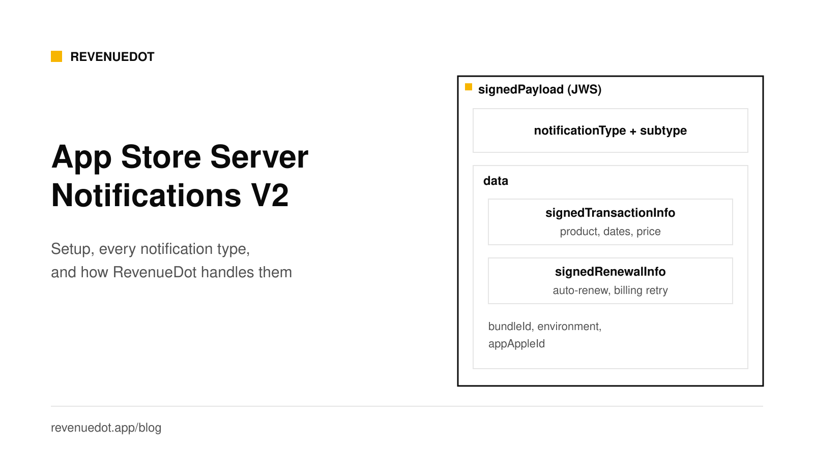
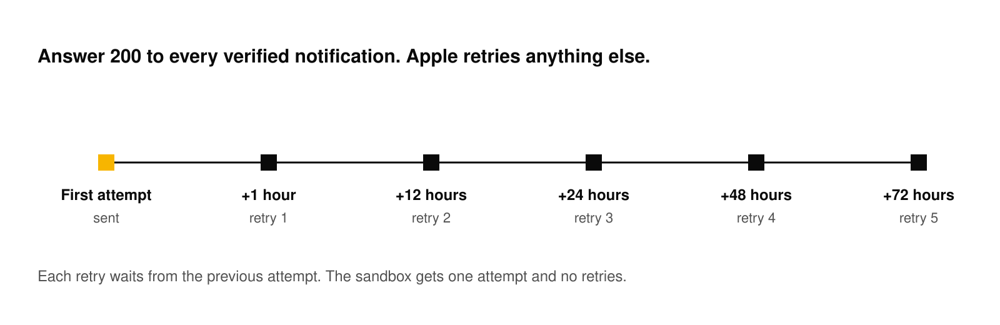
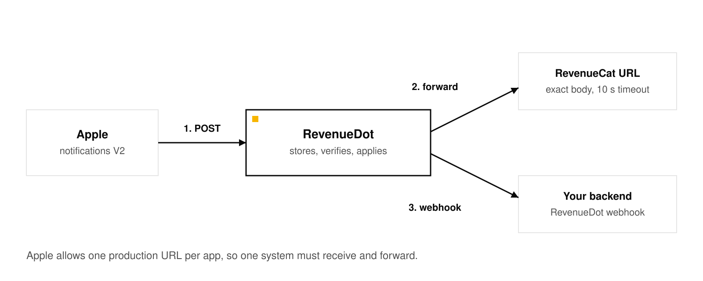

# App Store Server Notifications V2: setup and notification types

App Store Server Notifications V2 are HTTPS POST requests that Apple sends to your server when something changes in a customer's purchase: a new subscription, a renewal, a failed payment, a refund. Each body holds one field, `signedPayload`, a JSON Web Signature that you verify and decode. You set one production URL and one optional sandbox URL in App Store Connect, answer HTTP 200 to every verified notification, and read the `notificationType` and `subtype` to decide what the customer may use.



Sources are Apple's [App Store Server Notifications documentation](https://developer.apple.com/documentation/appstoreservernotifications), read on October 1, 2026.

## What you need

- A public HTTPS endpoint. Apple's [setup guide](https://developer.apple.com/documentation/appstoreservernotifications/enabling-app-store-server-notifications) says your server must support TLS 1.2 or later.
- Access to App Store Connect with the Account Holder, Admin, App Manager or Marketing role (per Apple's [help page](https://developer.apple.com/help/app-store-connect/configure-in-app-purchase-settings/enter-server-urls-for-app-store-server-notifications)).
- An In-App Purchase key if you also call the App Store Server API. See [Server-side receipt validation](https://revenuedot.app/blog/server-side-receipt-validation).
- Either your own code to verify and apply notifications, or a backend that does it, such as RevenueDot.

## Step 1: Choose the URL

Pick an HTTPS URL for production, and optionally a second for the sandbox. You can use the same URL for both. If you add a port, Apple requires 443 or a value of 1024 or higher.

With RevenueDot, the URL is generated for you per app: `https://api.revenuedot.app/v1/notifications/apple/{app_id}` on Cloud, or the same path on your own server.

If your firewall uses an allow list, add Apple's subnet `17.0.0.0/8`. Apple says it applies to both sandbox and production.

## Step 2: Set it in App Store Connect

Per Apple's [help page](https://developer.apple.com/help/app-store-connect/configure-in-app-purchase-settings/enter-server-urls-for-app-store-server-notifications):

1. Open your app, then **App Information**, then **App Store Server Notifications** under General Information.
2. Under **Production Server URL**, click **Set Up URL**, enter the URL, choose **Version 2** and click **Save**.
3. Do the same under **Sandbox Server URL**.

Apple's notes: if you give only a production URL, the App Store sends both environments there. If you give only a sandbox URL, nothing arrives in production. Version 1 is marked deprecated, and Apple says to use V2 for new implementations. Sandbox metadata changes can take up to an hour to appear.

## Step 3: Send a test notification

Apple's App Store Server API can send a test to your URL. Call **Request a Test Notification**, then use the returned `testNotificationToken` with **Get Test Notification Status** to see how your server answered. The `TEST` notification arrives in V2 format whichever version you configured.

Apple's open-source [Node library](https://github.com/apple/app-store-server-library-node) shows the call:

```typescript
const client = new AppStoreServerAPIClient(encodedKey, keyId, issuerId, bundleId, Environment.SANDBOX)
await client.requestTestNotification()
```

With RevenueDot, the app page shows **Ready** after the first valid notification, test or real. See [store notifications not arriving](https://revenuedot.app/docs/help/store-notifications-not-arriving) if it does not.

## Step 4: Verify and decode the payload

Apple's [`responseBodyV2`](https://developer.apple.com/documentation/appstoreservernotifications/responsebodyv2) page describes the format. The body is JSON with one key:

```json
{ "signedPayload": "eyJhbGciOiJFUzI1NiIsIng1YyI6WyJ..." }
```

To read it, you split the JWS, Base64URL-decode the payload and validate the signature with the algorithm named in the header. The decoded payload holds `notificationType`, `subtype` and a `data` object. When present, `data.signedTransactionInfo` and `data.signedRenewalInfo` are themselves signed JWS strings that you verify the same way. Never act on a notification you did not verify.

Apple's library does this for you. In Node:

```typescript
const verifier = new SignedDataVerifier(appleRootCAs, true, Environment.PRODUCTION, bundleId, appAppleId)
const notification = await verifier.verifyAndDecodeNotification(signedPayload)
```

Apple's library page lists the same functions in Swift, Java, Python and Node, plus `verifyAndDecodeTransaction` and `verifyAndDecodeRenewalInfo`. The first argument is Apple's root certificates from its PKI site.

Also check that the `bundleId` in the payload is yours, and that the environment matches the URL that received it.

## Step 5: Answer correctly

Apple's [response rules](https://developer.apple.com/documentation/appstoreservernotifications/responding-to-app-store-server-notifications):

- HTTP **200** to **206** means success.
- HTTP **40x** or **50x** makes the App Store retry.
- All other codes count as unsuccessful.



After a failure, V2 retries five times, at 1, 12, 24, 48 and 72 hours after the previous attempt. Retries are production-only: the sandbox tries once. If your server was down, call **Get Notification History**, which returns notifications for the past 180 days (30 in the sandbox). You can always rebuild state with **Get Transaction History** and **Get All Subscription Statuses**.

Do the real work after you answer. Verify, store the raw body, return 200, then process from a queue. A slow handler that times out looks like a failure and causes retries and duplicates. Deduplicate on `notificationUUID`.

## Every notification type

Apple's [`notificationType`](https://developer.apple.com/documentation/appstoreservernotifications/notificationtype) page defines these values. The last column says what RevenueDot does with each.

| notificationType | Subtypes | Apple's meaning | RevenueDot |
|---|---|---|---|
| `SUBSCRIBED` | `INITIAL_BUY`, `RESUBSCRIBE` | The customer subscribed for the first time, or resubscribed | Applies it |
| `DID_RENEW` | none, `BILLING_RECOVERY` | The subscription renewed, or recovered from a failed renewal | Applies it |
| `DID_FAIL_TO_RENEW` | none, `GRACE_PERIOD` | A renewal failed due to a billing issue and billing retry began. With `GRACE_PERIOD`, keep giving access | Applies it, records a billing issue |
| `GRACE_PERIOD_EXPIRED` | none | The grace period ended without renewing, so access can end | Applies it |
| `DID_CHANGE_RENEWAL_STATUS` | `AUTO_RENEW_ENABLED`, `AUTO_RENEW_DISABLED` | The customer turned auto-renew on or off, or the App Store did after a refund request | Applies it |
| `DID_CHANGE_RENEWAL_PREF` | `UPGRADE`, `DOWNGRADE`, none | The customer changed plans. Upgrades take effect now, downgrades at the next renewal, empty means a downgrade was cancelled | Applies it |
| `EXPIRED` | `VOLUNTARY`, `BILLING_RETRY`, `PRICE_INCREASE`, `PRODUCT_NOT_FOR_SALE`, none | The subscription expired, for the reason in the subtype | Applies it |
| `OFFER_REDEEMED` | `UPGRADE`, `DOWNGRADE`, none | A customer with an active subscription redeemed an offer | Applies it |
| `ONE_TIME_CHARGE` | none | The customer bought a consumable, non-consumable or non-renewing subscription | Applies it |
| `PRICE_INCREASE` | `PENDING`, `ACCEPTED` | The customer was told about a price increase | Applies it, records consent state |
| `REFUND` | none | The App Store refunded a transaction | Applies it, records the refund |
| `REFUND_DECLINED` | none | The App Store declined a refund request | Records the outcome for Refund Control |
| `REFUND_REVERSED` | none | Apple reversed a granted refund after a dispute. Reinstate access | Applies it |
| `CONSUMPTION_REQUEST` | none | The customer asked for a refund and Apple wants consumption data. Answer within 12 hours | Answers it with Refund Control |
| `REVOKE` | none | A Family Sharing entitlement is no longer available through sharing | Applies it |
| `RENEWAL_EXTENDED` | none | The App Store extended one subscription's renewal date | Applies it |
| `RENEWAL_EXTENSION` | `SUMMARY`, `FAILURE` | Progress of a mass extension you requested | Stores and acknowledges it |
| `RESCIND_CONSENT` | none | A parent or guardian withdrew consent for a child's app use | Stores and acknowledges it |
| `EXTERNAL_PURCHASE_TOKEN` | `CREATED`, `ACTIVE_TOKEN_REMINDER`, `UNREPORTED` | For apps that report external purchase tokens | Stores and acknowledges it |
| `TEST` | none | Sent when you call Request a Test Notification | Marks setup health ready |
| `METADATA_UPDATE`, `MIGRATION`, `PRICE_CHANGE` | none | Only for apps that use the Advanced Commerce API | Stores and acknowledges it |

Apple groups the same events by what happened in its [life-cycle tables](https://developer.apple.com/documentation/appstoreservernotifications/notificationtype). The patterns you will meet most:

| What happened | notificationType and subtype |
|---|---|
| First subscription in a group | `SUBSCRIBED` / `INITIAL_BUY` |
| Customer comes back after expiry, with or without an offer | `SUBSCRIBED` / `RESUBSCRIBE` |
| Customer cancels in Settings | `DID_CHANGE_RENEWAL_STATUS` / `AUTO_RENEW_DISABLED` |
| Renewal payment fails, grace period on | `DID_FAIL_TO_RENEW` / `GRACE_PERIOD` |
| Renewal fails, no grace period | `DID_FAIL_TO_RENEW` with no subtype |
| Retry succeeds | `DID_RENEW` / `BILLING_RECOVERY` |
| Billing retry ends | `EXPIRED` / `BILLING_RETRY` |
| Customer lets it lapse | `EXPIRED` / `VOLUNTARY` |
| Apple refunds the purchase | `REFUND` |

Apple says that after a billing failure the App Store keeps retrying for 60 days, or until the customer fixes the problem or cancels.

## How RevenueDot handles each notification

RevenueDot's endpoint, `POST /v1/notifications/apple/{app_id}`, does this for every request:

1. It stores the raw body first, so nothing is lost.
2. It verifies the JWS chain against Apple's root certificate.
3. It checks the bundle ID, and your Apple app ID if you set one. A wrong bundle gets **400**, which shows as failed in App Store Connect.
4. For a state-changing type, it updates the subscription, then compares the old and new state and records events such as `RENEWAL`, `CANCELLATION` or `BILLING_ISSUE`. Your webhooks get them, in RevenueCat's format.
5. It answers **200**, including for notifications about purchases it has never seen. Those are stored, and applied only when **Track new purchases from server-to-server notifications** is on.
6. It answers **500** only when it fails itself, so Apple retries.

`EXPIRATION` comes from a background job, not from Apple's `EXPIRED`, so access ends at the right time even when a notification is late. See [subscriptions and events](https://revenuedot.app/docs/concepts/subscriptions-and-events) for which change gives which event.

## Forwarding during a migration

App Store Connect holds one production URL per app, so only one system can receive Apple's notifications directly. If you move from RevenueCat to RevenueDot, point Apple at RevenueDot and let it forward each notification to RevenueCat. Apple's [enabling guide](https://developer.apple.com/documentation/appstoreservernotifications/enabling-app-store-server-notifications) describes the single-URL setup.



```bash
curl -s -X POST https://api.revenuedot.app/v2/projects/$PROJECT_ID/apps/$APP_ID \
  -H "Authorization: Bearer $SECRET_KEY" -H "Content-Type: application/json" \
  -d '{"app_store":{"notification_forward_url":"https://<your RevenueCat App Store notification URL>"}}'
```

RevenueDot copies the exact body, byte for byte, with a 10-second timeout, in the background, so a slow receiver never delays Apple. The last forward's HTTP status shows on the app page. The [dual-run guide](https://revenuedot.app/docs/migrate/dual-run) has the rest, and the [migration post](https://revenuedot.app/blog/migrating-from-revenuecat-without-data-loss) gives the full order. Forwarding was tested with a test URL. It has not yet run against RevenueCat's real notification endpoints.

## Common errors and fixes

| Symptom | Cause | Fix |
|---|---|---|
| Nothing arrives in the sandbox | Only a production URL set, or the sandbox URL points elsewhere | Set the Sandbox Server URL too |
| Nothing arrives at all | Endpoint not public HTTPS, or TLS older than 1.2 | Check the certificate and the firewall (allow `17.0.0.0/8`) |
| App Store Connect shows failures | Your server answered something other than 2xx | Return 200 for verified notifications |
| 400 from RevenueDot, "notification is for bundle id X" | A different app's bundle ID | Use one URL per app |
| Notification stored, access unchanged | A purchase RevenueDot has not seen | Turn on `track_new_purchases`, or let the app sync |
| Signature fails | Wrong root certificates or clock | Use Apple's PKI roots and sync your clock |

## Do it with RevenueDot

1. [Create a free account](https://app.revenuedot.app/signup) and add an App Store app with your bundle ID.
2. Upload the In-App Purchase key (`.p8`, Key ID, Issuer ID).
3. Copy the notification URL and set it for production and sandbox in App Store Connect, as Version 2.
4. Request a test notification and wait for **Ready**.
5. Add a webhook under **Integrations, Webhooks** to hear about each change in your backend.

[Start free on RevenueDot Cloud](https://app.revenuedot.app/signup)

## FAQ

### What is the difference between App Store Server Notifications V1 and V2?

V1 sends a plain JSON body with a receipt and is deprecated. V2 sends a signed JWS, `signedPayload`, with a notification type, a subtype and signed transaction and renewal info. Apple says to use V2 for new implementations.

### How many times does Apple retry a failed notification?

For V2, five times, at 1, 12, 24, 48 and 72 hours after the previous attempt, in production only. The sandbox makes one attempt. Apple's Get Notification History endpoint covers the last 180 days.

### What should my endpoint return?

HTTP 200, or any code from 200 to 206, when you verified and accepted the notification. A 40x or 50x makes Apple retry.

### Do I still need the App Store Server API if I use notifications?

Yes, for recovery and history. Notifications tell you about changes, and the API lets you read the current truth, fetch missed notifications and test your endpoint.

### Can two systems receive the same notification?

Not directly, because App Store Connect holds one production URL per app. Receive in one system and forward the exact body to the other. RevenueDot does this with `notification_forward_url`.

**About RevenueDot.** RevenueDot is an open-source (AGPL-3.0) backend for in-app purchases and subscriptions on the App Store, Google Play and the web. Start free on [RevenueDot Cloud](https://app.revenuedot.app/signup), free up to $10,000 in monthly tracked revenue, or self-host it with Docker and Postgres. New apps install the [RevenueDot SDK](../docs/sdks/README.md) and pass their key. Apps that ship the RevenueCat SDK point its proxy URL at RevenueDot and keep their code, offerings and customers. Read the [quickstart](../docs/getting-started/quickstart.md) or the code on [GitHub](https://github.com/revenuedot/revenuedot).
