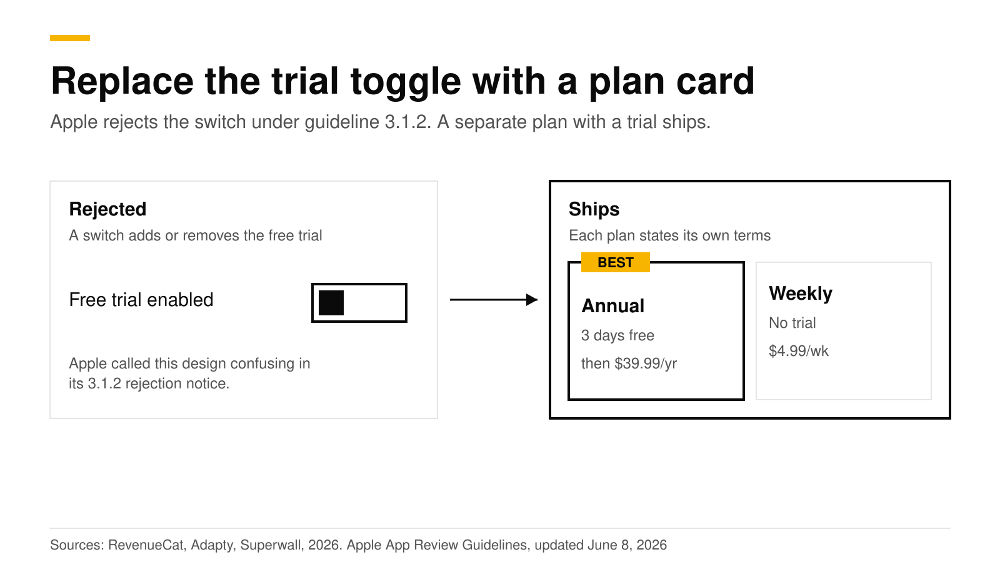
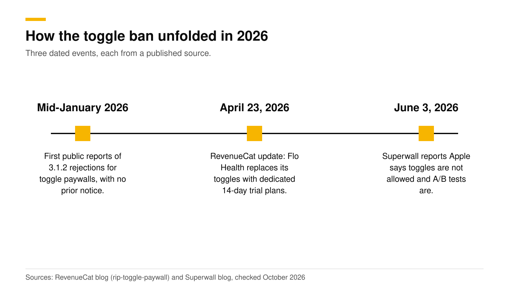
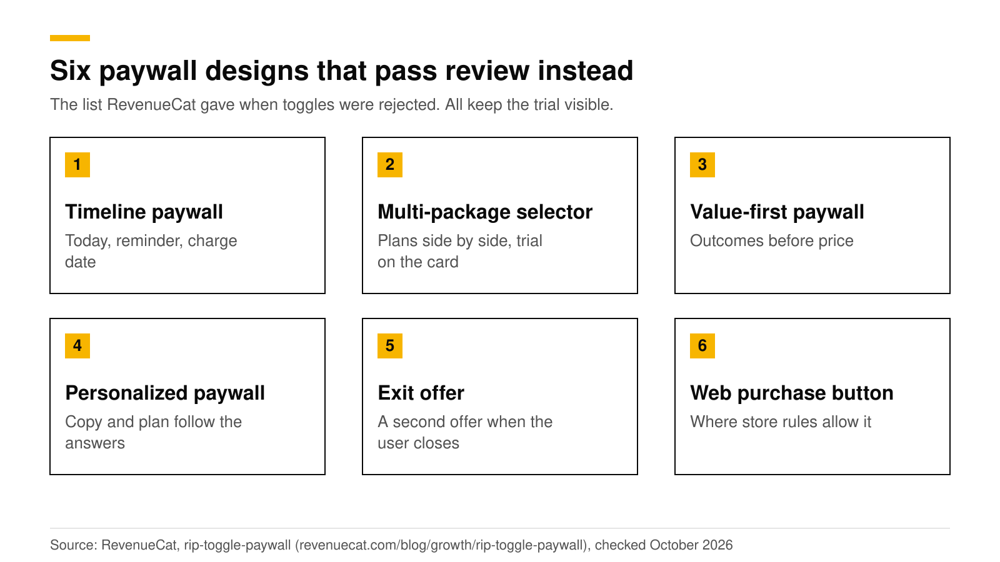

# Apple free trial toggle rejection: what to ship instead (2026)

Apple rejects iOS paywalls that include a switch to add or remove a free trial. Rejections began in mid-January 2026 and cite App Review Guideline 3.1.2, the subscriptions section. The fix is to show the trial as part of a plan: two plan cards side by side, one with the trial, each saying exactly what it costs and when it renews. A/B testing and remote paywall changes are still allowed.

This post covers what Apple rejects, the exact guideline numbers, what to ship instead, and one related rule, rating prompts in onboarding (guideline 5.6.3 in RevenueCat's report). It is part of our [paywall best practices guide](paywall-best-practices-2026.md). Facts were checked in October 2026 against Apple's guidelines page, last updated June 8, 2026, and the vendor reports linked below.

## The short answer

- **What is rejected:** a toggle on the purchase screen that adds or removes a free trial from the subscription. Apple's rejection notice says the design is confusing and may stop users from understanding that they commit to an auto-renewing subscription that starts charging after the trial ([RevenueCat](https://www.revenuecat.com/blog/growth/rip-toggle-paywall)).
- **Which guideline:** 3.1.2, Subscriptions. The rejection notices cite it. The guideline text itself does not mention toggles ([Apple](https://developer.apple.com/app-store/review/guidelines/)).
- **Since when:** mid-January 2026, with no announcement or grace period ([Adapty](https://adapty.io/blog/your-toggle-paywall-is-about-to-get-rejected/)).
- **Platforms:** iOS. Adapty notes that toggles remain possible on Android and the web.
- **What is allowed:** a trial attached directly to a plan and clearly described. Superwall reports that Apple also confirmed remote paywall updates and A/B tests are allowed ([Superwall](https://superwall.com/blog/external-checkout-a-b-testing-and-trial-toggles-confirmed-apples-rules-for-ios)).

## What is a toggle paywall, and why did it spread?

A toggle paywall shows a switch labeled something like "Free trial enabled". By default the switch is off, which shows an annual plan with immediate payment. Flip it on and the paywall changes to a weekly plan with a trial. Most users never touched it, so most saw the annual plan.

It spread because it worked. Adapty says the pattern "doubled revenue for many apps" ([Adapty](https://adapty.io/blog/your-toggle-paywall-is-about-to-get-rejected/)), and RevenueCat's write-up cites one indie developer who doubled weekly revenue after adopting it. Superwall's account is that too many apps used it as a dark pattern, nudging users to a plan they did not realize they chose. Apple banned the pattern instead of judging each case.

The toggle also appears in older case studies. Two of RevenueCat's published paywall redesigns, including a 72% lift in install-to-trial, added a trial toggle along with other changes ([RevenueCat case studies](https://www.revenuecat.com/blog/growth/paywall-redesigns-case-studies/)). Do not copy the toggle from those examples.

## How did the ban unfold?

| Date | Event | Source |
|---|---|---|
| Mid-January 2026 | Developers receive identical 3.1.2 rejection notices for toggle paywalls | [RevenueCat](https://www.revenuecat.com/blog/growth/rip-toggle-paywall) |
| April 23, 2026 | RevenueCat updates its post: Flo Health replaced its toggles with dedicated 14-day trial plan options | [RevenueCat](https://www.revenuecat.com/blog/growth/rip-toggle-paywall) |
| June 3, 2026 | Superwall publishes notes from an off-the-record meeting: toggles are not allowed, and A/B testing is | [Superwall](https://superwall.com/blog/external-checkout-a-b-testing-and-trial-toggles-confirmed-apples-rules-for-ios) |

Superwall's June 3 post comes from a meeting that was off the record, so treat it as the vendor's account and not as a policy document. Apple's own guidelines, last updated June 8, 2026, do not name toggles.

## Which guideline numbers matter?

| Guideline | What it says, in short | Why it matters here |
|---|---|---|
| 3.1.2(a) | Auto-renewable subscriptions must give ongoing value and last at least seven days. They may offer a free trial through the information set in App Store Connect. Apps that trick users into subscribing under false pretenses are removed. | The trial belongs to the product, set up in App Store Connect. Bait-and-switch is the worry behind the ban. |
| 3.1.2(c) | Before asking a customer to subscribe, clearly describe what the user gets for the price. | Say what the plan costs, how often, and what you get. |
| 5.6.1 | Use Apple's provided API to prompt for reviews. Custom review prompts are disallowed. | Do not build your own rating dialog. |
| 5.6.3 | Manipulating charts, search, reviews or referrals is not permitted. | RevenueCat reports Apple citing this for rating prompts in onboarding. |

Source for all rows: [Apple App Review Guidelines](https://developer.apple.com/app-store/review/guidelines/), checked October 2026. Apple's subscription page adds two pricing rules: the billed amount must be the most prominent price on the purchase screen, and a free-trial purchase flow must say how long the trial lasts and what is billed after it ([Apple](https://developer.apple.com/app-store/subscriptions/)).

## What should you ship instead?

RevenueCat's post lists six alternatives. We rank them by how little they change your current paywall.

1. **A separate plan card with the trial.** Show annual (with a 3-day trial) and weekly (without) as two cards. Each card states its own terms. This is the smallest change from a toggle.
2. **A trial timeline.** Show today, the reminder and the charge date. Blinkist's version raised trial conversions 23% ([Growth.design](https://growth.design/case-studies/trial-paywall-challenge)). See [Free trial timeline paywall](free-trial-timeline-paywall.md).
3. **A multi-package selector.** Show weekly, monthly and annual side by side, with a trial badge on the plans that have one (Adapty's suggestion). See [Weekly vs annual subscriptions](weekly-vs-annual-subscriptions.md).
4. **A conditional paywall.** Show trial wording to customers who are eligible for the intro offer, and plain purchase wording to those who are not.
5. **A value-first paywall.** Lead with outcomes and social proof before price. See [Multi-page paywalls](multi-page-paywalls.md).
6. **An exit offer.** Offer a second plan when the user closes the paywall. See [Paywall exit offers](paywall-exit-offers.md).

A web purchase button is a seventh option where store rules allow external purchases. RevenueCat also reports that Flo Health moved to dedicated 14-day trial plan options.

## What about rating prompts in onboarding?

RevenueCat reports that Apple has started rejecting apps that ask for a rating during onboarding, citing guideline 5.6.3, and that the guideline itself is not new ([RevenueCat](https://www.revenuecat.com/blog/engineering/dont-prompt-ratings-during-onboarding)). Apple's text for 5.6.3 is about manipulating charts, search, reviews or referrals. It does not mention rating prompts directly, and 5.6.1 says custom review prompts are disallowed, so we cannot give you Apple's word on onboarding specifically. The safe rule is the one RevenueCat gives: remove rating prompts from onboarding and ask after the user finishes something, such as a first completed task, with Apple's own prompt API.

## Checklist before you submit

1. No switch changes the plan or adds a trial.
2. Every plan card shows its price and billing period. The billed amount is the largest number.
3. The trial plan says how long the trial lasts and what is billed after it.
4. The button label matches the selected plan.
5. Restore, Terms and Privacy links are on the screen.
6. No rating prompt in onboarding.
7. Every remote variant follows the same rules. Superwall notes that non-compliant remote paywalls face the same penalties as rejected builds.

## How to do this with RevenueDot

1. In the dashboard open **Paywalls** and pick **Annual first** or **Trial timeline**. Both use plan cards and no switch. See the [paywalls guide](https://revenuedot.app/docs/guides/paywalls).
2. In the **Package** component settings, choose which package each card sells and which one is selected when the paywall opens. In the preview toggle **Intro offer** to check the card with and without a trial.
3. Use the text variables `{{ product.price_per_period }}` and `{{ product.offer_period_with_unit }}` so the price and trial length always match the store.
4. Set an intro-offer text on the Text components that mention the trial. The SDK then shows trial wording to customers who are eligible for the offer and the normal wording to those who are not.
5. Test your change with an experiment between two offerings. See [targeting and experiments](https://revenuedot.app/docs/guides/targeting-and-experiments), the [experiments page](https://revenuedot.app/features/experiments) and the [paywalls feature page](https://revenuedot.app/features/paywalls).

RevenueDot's templates do not include a trial toggle. The open-source [Focus sample app](https://github.com/revenuedot/examples) never uses one and offers a separate plan card with the trial.

[Start free on RevenueDot Cloud](https://app.revenuedot.app/signup) (free up to $10,000 monthly tracked revenue).

## FAQ

### Is a free trial toggle still allowed on iOS?

No. Apple has rejected toggle paywalls under guideline 3.1.2 since mid-January 2026. Superwall reports Apple said the toggle is not allowed in any form. A trial attached to a plan is allowed.

### Does guideline 3.1.2 mention toggles?

No. The guideline text says nothing about toggles. The rejection notice cites 3.1.2 and says the design is confusing and may hide the renewing charge. The ban comes from enforcement, not from new guideline text.

### Can I still A/B test my paywall?

Yes. Superwall reports that Apple said remote paywall updates and A/B tests are allowed. Every variant still has to follow the guidelines.

### Are rating prompts in onboarding rejected?

RevenueCat reports rejections under guideline 5.6.3. Apple's guideline 5.6.1 tells developers to use Apple's review prompt API and disallows custom review prompts. Ask after a user finishes something, never in onboarding.

### Do toggles still work on Android or the web?

Adapty says toggles remain viable on Android and the web. The App Review rule applies to iOS. Check Google Play policy yourself before you ship one, since we have not verified it.

**About RevenueDot.** RevenueDot is an open-source (AGPL-3.0) backend for in-app purchases and subscriptions that works with the RevenueCat SDK. Start free on [RevenueDot Cloud](https://app.revenuedot.app/signup), free up to $10,000 in monthly tracked revenue, or self-host it with Docker and Postgres. Point the SDK's proxy URL at RevenueDot and keep your app code, your offerings and your customers. Read the [quickstart](../docs/getting-started/quickstart.md) or the code on [GitHub](https://github.com/revenuedot/revenuedot).
