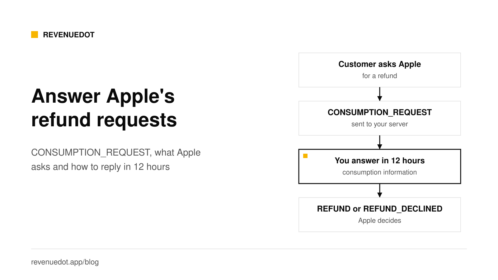
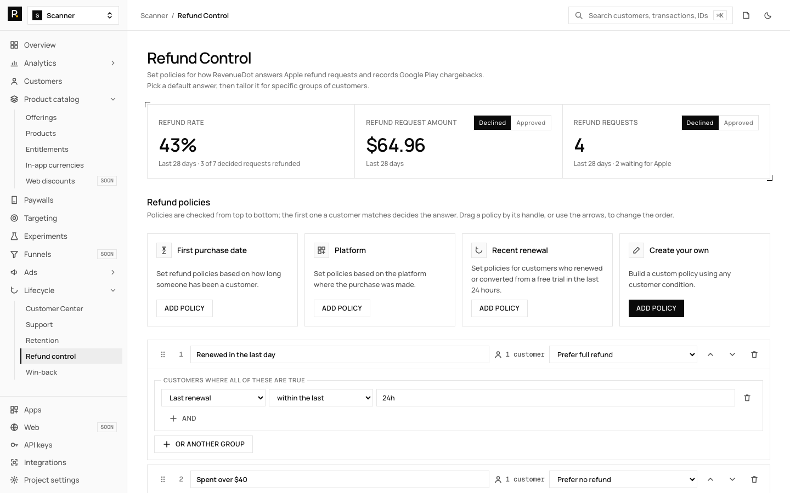
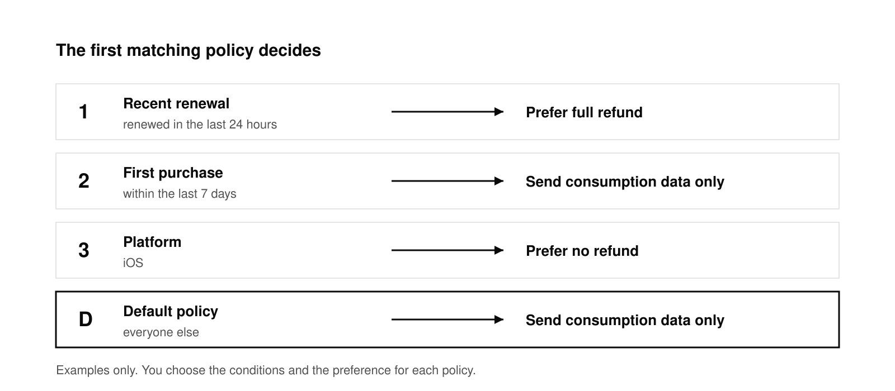

# Apple refund requests: CONSUMPTION_REQUEST and how to answer it

When a customer asks Apple for a refund on an in-app purchase, Apple sends your server a `CONSUMPTION_REQUEST` notification. You have 12 hours to answer by calling the App Store Server API's Send Consumption Information endpoint, but only if the customer agreed to share their data. Apple weighs your answer, including your refund preference, with other factors, then decides. It tells you the result with a `REFUND` or `REFUND_DECLINED` notification.

This post follows Apple's [Send Consumption Information](https://developer.apple.com/documentation/appstoreserverapi/send-consumption-information) documentation, read on October 1, 2026.

## The short answer

- **Trigger:** a customer starts a refund request with Apple. Apple sends the `CONSUMPTION_REQUEST` notification type to your App Store Server Notifications V2 URL.
- **Deadline:** Apple says to respond within 12 hours of receiving the `CONSUMPTION_REQUEST` notification.
- **Condition:** answer only if the customer gave consent. If not, Apple says not to respond.
- **Effect:** the App Store uses your information to inform its refund decision. It is one input, not a veto.
- **Outcome:** a `REFUND` notification when Apple refunds, `REFUND_DECLINED` when it does not.
- **Automate it:** RevenueDot's Refund Control sends the answer from rules you set once.

## How the flow works

1. The customer asks for a refund. Apple documents several in-app entry points, `beginRefundRequest` among them.
2. Apple sends `CONSUMPTION_REQUEST` to your server. Apple's [notification type list](https://developer.apple.com/documentation/appstoreservernotifications/notificationtype) describes it as the customer initiating a refund request and the App Store requesting consumption data.
3. Your server decodes the signed payload and reads the transaction ID. See [App Store Server Notifications V2](https://revenuedot.app/blog/app-store-server-notifications-v2) for how to verify the payload.
4. You call `PUT` on the Send Consumption Information endpoint with the transaction ID. Apple answers `202` when it received the data.
5. Apple decides. If it refunds, you receive `REFUND`. If not, `REFUND_DECLINED`.

Apple's endpoint answers `202` on success, `400` for an invalid request, `401` for a bad JWT, `404` when the transaction ID is not found, `429` over the rate limit and `500` for a server error to retry.

## Two versions of the endpoint

Apple documents two request bodies, and you should know which one you use.

| | Send Consumption Information V1 | Send Consumption Information (current) |
|---|---|---|
| Path | `PUT /inApps/v1/transactions/consumption/{transactionId}` | `PUT /inApps/v2/transactions/consumption/{transactionId}` |
| Products | Consumables and auto-renewable subscriptions | Any product type, including non-consumables and non-renewing subscriptions |
| Refund preference | Numbers 0 to 3 | `GRANT_FULL`, `GRANT_PRORATED` or `DECLINE` |
| Usage data | Status, play time, account tenure, lifetime dollars, user status | A `consumptionPercentage` in milliunits, plus delivery status |

Sources: the [V1 endpoint](https://developer.apple.com/documentation/appstoreserverapi/send-consumption-information-v1), the [current endpoint](https://developer.apple.com/documentation/appstoreserverapi/send-consumption-information) and the [`ConsumptionRequest`](https://developer.apple.com/documentation/appstoreserverapi/consumptionrequest) body. Apple's [changelog](https://developer.apple.com/documentation/appstoreserverapi/app-store-server-api-changelog) (version 1.19, December 2025) says to use the current endpoint for every In-App Purchase that does not use the Advanced Commerce API, and the current endpoint refuses Advanced Commerce purchases. RevenueDot's Refund Control follows that rule: V1 only when the signed transaction has `advancedCommerceInfo`, the current endpoint otherwise.

## Consent comes first

Apple is firm that you must obtain valid consent from the customer before sharing their personal data through this API, and that you, the developer, are solely responsible for getting it. Apple's guidance:

- Valid consent is freely given, specific, informed and unambiguous.
- Tell customers that you will give Apple some of their data to help review refund requests, and that they can withdraw consent at any time.
- Opt-in is a higher standard than opt-out.
- Do not use the App Tracking Transparency prompt for this consent. Apple says the two are unrelated.
- Answer your privacy label questions about the data you share.

The API rejects a `customerConsented` value other than `true` with HTTP 400. If you have no consent, send nothing.

Put the wording in your terms or privacy policy, and ideally in your onboarding. Apple cannot advise on the legal wording for your region. Ask a lawyer.

## The V1 fields Apple wants

All of these are required in a V1 body except `refundPreference`:

| Field | What it says |
|---|---|
| `customerConsented` | Must be `true` |
| `consumptionStatus` | 0 undeclared, 1 not consumed, 2 partially consumed, 3 fully consumed |
| `deliveryStatus` | 0 delivered and working, 1 quality issue, 2 wrong item, 3 server outage, 4 in-game currency change, 5 other |
| `platform` | The platform on which the customer used the purchase |
| `playTime` | Engagement buckets from 0 to 7: 0 undeclared, 1 is 0 to 5 minutes, up to 7 for over 16 days |
| `accountTenure` | The age of the customer's account |
| `lifetimeDollarsPurchased` | Total USD of purchases across platforms, in buckets |
| `lifetimeDollarsRefunded` | Total USD of refunds, in buckets |
| `sampleContentProvided` | `true` if you offered a free sample or trial first |
| `appAccountToken` | The UUID from the notification's transaction, or an empty string |
| `userStatus` | The status of the customer's account |
| `refundPreference` | 0 undeclared, 1 you prefer a refund, 2 you prefer no refund, 3 no preference |

For any field you would rather not provide, Apple allows an "undeclared" value, such as 0, or an empty string for `appAccountToken`.

## Your preference is a nudge

Apple says your refund preference is one of several factors it weighs. It will not follow it blindly. Think about what is true and use it honestly:

- **A renewal the customer did not notice**, such as a trial that converted yesterday and was never opened. Preferring a refund is fair, and it keeps a customer you would lose anyway from becoming a chargeback or a bad review.
- **A customer who used the product heavily** over weeks. Sending real usage with a decline preference is fair.
- **A server outage on your side.** Say so in `deliveryStatus` and prefer a refund.

Do not misstate facts. The consumption data comes from your records, and it is shared under the customer's consent.

## Answer automatically with Refund Control

Writing the notification handler, the JWT, the bucket mapping and the retry logic is real work and a lasting maintenance cost. RevenueDot's [Refund Control](https://revenuedot.app/docs/guides/refund-control) does it with rules.

**Before you start.** Connect the App Store with the app's In-App Purchase key and turn on Version 2 notifications ([guide](https://revenuedot.app/docs/guides/app-store)). RevenueDot sends the answer with the same key. Make sure your terms tell customers that you share this data with Apple. RevenueDot sends nothing until you confirm consent in the dashboard.

**Set the policies.** Open **Lifecycle, Refund control**.

1. Tick **Customers agreed to share consumption data with Apple**.
2. Add policies from the templates: **First purchase date** (for example within 7 days), **Platform**, **Recent renewal** (renewed or converted from a trial in the last 24 hours), or **Create your own** from the audience builder (country, spend, email, attributes and more).
3. Pick each policy's **refund preference**.
4. Drag the policies into order and save.

| Preference | What Apple gets |
|---|---|
| Prefer full refund | Consumption information with `refundPreference` `GRANT_FULL` |
| Prefer prorated refund | Consumption information with `refundPreference` `GRANT_PRORATED`, so Apple refunds the unused part |
| Prefer no refund | Consumption information with `refundPreference` `DECLINE` |
| Send consumption data only | Consumption information with no `refundPreference` |
| Do not respond | Nothing |

The first policy whose conditions match the customer decides. The **default policy** covers everyone else. Each card shows how many of your customers it would decide for.

**What RevenueDot fills in from its own records** (the current endpoint):

| Field | How it is set |
|---|---|
| `consumptionPercentage` | Prepaid subscriptions: the share of the period passed, from the product's duration. Consumables that grant an in-app currency: the share of that purchase's currency spent, oldest coins first. Left out for auto-renewable subscriptions (Apple computes it) and when RevenueDot cannot tell |
| `deliveryStatus` | `DELIVERED`, because RevenueDot granted the purchase |
| `sampleContentProvided` | `true` when the customer had a free trial |
| `refundPreference` | From the policy |

Advanced Commerce purchases get the V1 body instead, with the V1 fields above filled from the customer's history. The [Refund Control guide](https://revenuedot.app/docs/guides/refund-control) lists every rule.

If Apple's API fails, RevenueDot retries after 5 minutes, 15 minutes and then every hour, and stops 5 minutes before the 12-hour deadline. A repeated notification for the same purchase is never answered twice.

**See the results.** Cards show the last 28 days: refund rate (approved divided by decided), refund request amount and request counts, split by approved and declined. A table lists each request with its policy, whether the answer went out and the outcome. The same data is in the API at `GET /v2/projects/{project_id}/refund_requests`.

**Other stores.** Google Play has no consumption API. A refund or chargeback arrives as a voided purchase and there is nothing to answer, so RevenueDot records it as an approved refund request and the cards cover every store. Stripe and Amazon refunds are recorded the same way.

Watch your first few requests in the table, and check that each one shows as answered before its deadline.

## Build your own handler

If you prefer to write it, the pieces are:

1. Verify the notification (see the V2 post) and branch on `notificationType === "CONSUMPTION_REQUEST"`.
2. Return 200 at once, then process from a queue.
3. Look up the customer by `appAccountToken` or the original transaction ID, and compute the fields from your records.
4. Sign an ES256 JWT with your In-App Purchase key ([JWT rules](https://developer.apple.com/documentation/appstoreserverapi/generating-json-web-tokens-for-api-requests): `aud` is `appstoreconnect-v1`, valid for up to 60 minutes).
5. `PUT` the body to the endpoint. Retry on 5xx and 429, with a stop before the 12-hour limit.
6. Store the outcome from `REFUND` and `REFUND_DECLINED` so you can measure what your answers achieve.

## Do it with RevenueDot

1. [Create a free account](https://app.revenuedot.app/signup) and add your App Store app, with its In-App Purchase key.
2. Set the notification URL in App Store Connect as Version 2, for production and sandbox.
3. Add the consent wording to your terms, then tick the consent box in **Lifecycle, Refund control**.
4. Create your policies, with a default policy last.
5. Watch the **Refund requests** table for your first requests.

[Start free on RevenueDot Cloud](https://app.revenuedot.app/signup)

## FAQ

### How long do I have to respond to a CONSUMPTION_REQUEST?

12 hours from the notification, per Apple's documentation. RevenueDot stops its retries 5 minutes before that deadline.

### Do I have to respond to refund requests?

No. Apple says to respond only when the customer consented to share data, and the response is optional otherwise. Apple uses your answer as one input to its decision, so ignoring it means Apple decides without your data.

### Will Apple follow my refund preference?

Not necessarily. Apple says your preference is one of a variety of factors. Use it honestly and measure the outcomes through `REFUND` and `REFUND_DECLINED`.

### What does REFUND_DECLINED mean?

Apple declined the refund request. It is the notification you get when a request that you may have answered ends without a refund. Apple's list of types defines it as the App Store declining a refund request.

### Does Google Play have the same flow?

No. Google Play has no consumption API. Refunds and chargebacks arrive as voided purchases and there is nothing to answer.

**About RevenueDot.** RevenueDot is an open-source (AGPL-3.0) backend for in-app purchases and subscriptions on the App Store, Google Play and the web. Start free on [RevenueDot Cloud](https://app.revenuedot.app/signup): free up to $10,000 in monthly tracked revenue, then 0.5%, never more than $999 a month. New apps install the [RevenueDot SDK](../docs/sdks/README.md) and pass their key. Apps that ship the RevenueCat SDK point its proxy URL at RevenueDot and keep their code, offerings and customers. Read the [quickstart](../docs/getting-started/quickstart.md) or the code on [GitHub](https://github.com/revenuedot/revenuedot).
