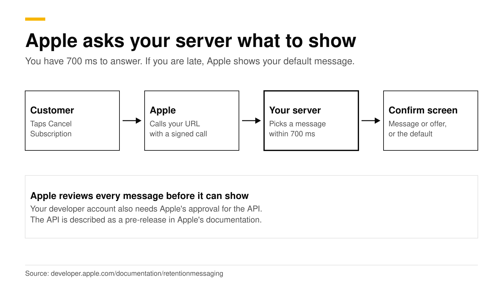
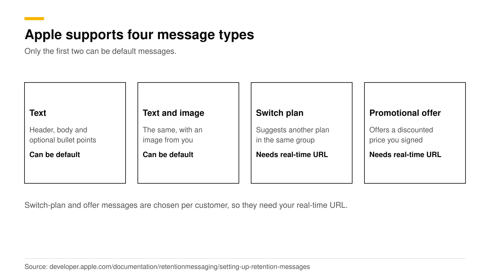
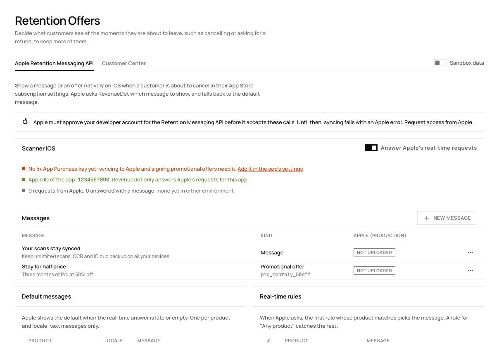

# Apple's Retention Messaging API: setup, approval and offers

Apple's Retention Messaging API lets your server choose the message a customer sees on the App Store's Confirm Cancellation page. When a subscriber taps Cancel Subscription in their Apple account, Apple can call your server, you pick a message in under 700 milliseconds, and Apple shows it. The message can be plain text, a suggested cheaper plan or a promotional offer. Apple reviews every message first, and Apple's documentation still calls the API a pre-release that you request access to.

This post explains how the API works, what approval means, and how to set it up with RevenueDot under **Lifecycle > Retention**. Every Apple fact links to Apple's documentation and was checked in October 2026.

## The short answer

- **What it is:** a server-to-server service that selects which message the system shows when a customer views subscription details and might cancel ([Apple](https://developer.apple.com/documentation/retentionmessaging)).
- **Where it shows:** on the Confirm Cancellation page after the customer taps Cancel Subscription. They can continue to cancel, tap Keep Subscription, redeem an offer or take a suggested plan (same source).
- **Four message types:** text only, text with an image, switch plan and promotional offer.
- **Approval:** Apple sends every uploaded message for checking and shows only those in the `APPROVED` state ([Apple](https://developer.apple.com/documentation/retentionmessaging/setting-up-retention-messages)). Apple's documentation also calls the API a pre-release and tells you to request access.
- **Speed:** your real-time answer must arrive within 700 ms in production, or Apple shows your default message.
- **In RevenueDot:** add messages, defaults and real-time rules under **Lifecycle > Retention > Apple Retention Messaging API**, then select **Sync to Apple**.

## How does the Retention Messaging API work?

You prepare messages ahead of time, and either let Apple show a default for each product and locale, or answer in real time with the message that fits each customer.

1. **You upload messages.** Each has header text and body text, and some have an image. Messages go to Apple automatically for checking.
2. **You set a default message** for every auto-renewable subscription in every locale. Only text messages, with or without an image, can be defaults.
3. **You optionally add a real-time URL.** Apple sends a POST to your Get Retention Message endpoint when a customer views subscription details. The request is a signed JWS payload with the product id, locale, original transaction id and other context. You answer with a `RealtimeResponseBody` and a 200 status ([Apple](https://developer.apple.com/documentation/retentionmessaging/responding-to-realtime-retention-messaging-requests)).
4. **Apple falls back to your default** if the real-time call fails for any reason, including a timeout.

Apple lists these supported systems: iOS 15.1 or later, iPadOS 15.1 or later, visionOS 1 or later and macOS 14 or later ([Apple](https://developer.apple.com/documentation/retentionmessaging)). Messages exist in nine locales: de-DE, en-US, es-419, fr-FR, it-IT, ja-JP, ko-KR, pt-BR and zh-CN ([Apple](https://developer.apple.com/documentation/retentionmessaging/setting-up-retention-messages)).

## What message types exist?

| Type | What the customer sees | Default allowed | Needs real-time URL |
|---|---|---|---|
| Text | Header, body and optional bullet points | Yes | No |
| Text with image | The same, with your image | Yes | No |
| Switch plan | Text plus a suggested subscription | No | Yes |
| Promotional offer | Text plus a discounted promotional offer | No | Yes |

A switch-plan message must suggest a subscription in the same subscription group as the customer's current one. A promotional-offer message needs a promotional offer created in App Store Connect, and your answer includes the offer's signature and the message id ([Apple](https://developer.apple.com/documentation/retentionmessaging/setting-up-retention-messages)).

## Who can use it, and what does approval mean?

There are two separate approvals. Do not confuse them.

1. **Access to the API.** Apple's documentation describes the API as a pre-release and tells developers to express interest through its request-access page ([Apple](https://developer.apple.com/documentation/retentionmessaging)). The page needs an Apple Developer sign-in. RevenueDot's dashboard warns that until Apple approves your account, syncing fails with an Apple error.
2. **Approval of each message.** Uploaded images and messages go to Apple for checking, and the system shows only `APPROVED` content. Apple also warns against uploading misleading or inaccurate content.

A third gate applies to real-time answers. Your server must pass a performance test in the sandbox environment before you can set a real-time URL for production. Apple runs it against your endpoint, and the response time threshold comes back in the test configuration, about 700 ms ([Apple](https://developer.apple.com/documentation/retentionmessaging/initiate-performance-test)). In production, a late answer means Apple uses your default ([Apple](https://developer.apple.com/documentation/retentionmessaging/setting-up-retention-messaging-endpoint)).

Apple's changelog shows the API is moving fast. It started as a pre-release on July 16, 2025, added the performance test on December 9, 2025, added the real-time URL endpoints on March 31, 2026, and added 12-month commitment plans to switch-plan messages on April 27, 2026 ([Apple](https://developer.apple.com/documentation/retentionmessaging/retention-messaging-changelog)). Read the changelog before you build, since the details can change.

Apple limits the call rate per hour per app. The sandbox gets 10% of the production limits, and a request over the limit gets HTTP 429 with a `Retry-After` header ([Apple](https://developer.apple.com/documentation/retentionmessaging/identifying-rate-limits)).

## How do you set it up with RevenueDot?

RevenueDot hosts the real-time URL, signs offers and keeps your messages, so you do not build the endpoint yourself. Our [retention guide](https://revenuedot.app/docs/guides/retention) has the full steps.

1. **Request access from Apple** first, at Apple's request-access page.
2. **Open Lifecycle > Retention > Apple Retention Messaging API** and pick the App Store app. The app needs its In-App Purchase key ([connect the App Store](https://revenuedot.app/docs/guides/app-store)) and its Apple ID, the number in its App Store URL.
3. **Add messages.** Each has a header of up to 66 characters and a body of up to 144 in RevenueDot's editor. A message can also suggest another plan or carry a promotional offer.
4. **Set a default message** for each product and locale. Apple shows it when the real-time call fails. Defaults must be plain messages.
5. **Add real-time rules.** For a product, or any product, choose which message to answer with. The first rule whose product matches wins, and a rule for "Any product" catches the rest.
6. **Select Sync to Apple (sandbox).** RevenueDot uploads the messages, sets the defaults and registers its real-time URL, `https://<your server>/v1/retention/apple/<app id>`.
7. **Pass Apple's performance test,** then select **Sync to Apple (production)**.

What RevenueDot does on each call: it checks Apple's signature and app id, refuses a request signed more than 5 minutes earlier, and answers within Apple's 700 ms limit. Production requests are answered only once the app's Apple ID is set. If a promotional offer cannot be signed, for example because the key is broken, RevenueDot answers with no message and Apple shows your default. A promotional offer answer is signed with your In-App Purchase key. An uploaded message cannot change, so add a new one to change the text.

**Before you rely on it.** Apple sends real traffic only after it approves your account for the Retention Messaging API. The App Store Save Outcomes chart reads zero until that happens ([charts guide](https://revenuedot.app/docs/guides/charts)). Run the sandbox sync and the performance test before you rely on it.

## Customer Center or Apple's cancel screen?

Use both. They reach customers in different places.

| | Customer Center offer | Apple Retention Messaging |
|---|---|---|
| Where it shows | In your app, before the customer cancels | On Apple's Confirm Cancellation page |
| Who sees it | Customers who cancel from your app screen | Customers who cancel in their Apple account |
| Message types | An offer, with a survey | Text, image, switch plan or offer |
| Approval | Promotional offer set up in App Store Connect | Apple's access approval, message review and performance test |
| Platform | iOS and Android | Apple platforms only |
| RevenueDot location | **Lifecycle > Retention > Customer Center** | **Lifecycle > Retention > Apple Retention Messaging API** |

A customer who cancels in their Apple account never opens your in-app screen, which is why the Apple page matters. Our post on [reducing subscription churn](reduce-subscription-churn.md) shows how the two fit with win-back campaigns and billing grace periods.

## What should a good retention message say?

Say one true thing that is specific to the product. Apple tells you not to upload misleading or inaccurate content, and the safest messages are plain.

- **Name what they lose.** "Your scans stay synced. Keep unlimited scans, OCR and iCloud backup on all your devices."
- **State an offer exactly.** "Stay for half price. Three months of Pro at 50% off." Create the promotional offer in App Store Connect first.
- **Suggest a plan that fits.** A switch-plan message to a cheaper tier in the same group is a real alternative, not a trick.
- **Do not hide Cancel.** The customer can still continue canceling.

Test the outcome with the [App Store Save Outcomes chart](https://revenuedot.app/charts/app-store-save-outcomes) once Apple sends traffic, and read the [churn rate chart](https://revenuedot.app/charts/churn-rate) over the same period. For one-offer-at-a-time testing, see the [A/B testing guide](paywall-ab-testing-guide.md).

## Do it with RevenueDot

1. Create a free project and add your App Store In-App Purchase key ([connect your app](https://revenuedot.app/docs/getting-started/connect-your-app)).
2. Request access to the Retention Messaging API from Apple.
3. Write two or three messages and a default for each product and locale.
4. Add a real-time rule and sync to the sandbox.
5. Pass Apple's performance test and sync to production.
6. Watch churn and the save outcomes chart.

[Start for free on RevenueDot Cloud](https://app.revenuedot.app/signup). Pro costs $0 until your apps make $10,000 a month. The [Customer Center feature page](https://revenuedot.app/features/customer-center) covers the in-app side.

## FAQ

### What is Apple's Retention Messaging API?

It is a server-to-server service that lets you choose the message shown on the App Store's Confirm Cancellation page when a customer is about to cancel. Messages can be text, a suggested plan or a promotional offer, and Apple reviews each one.

### Do I need Apple's approval to use it?

Yes. Apple's documentation describes the API as a pre-release and asks you to request access. Apple also checks every message you upload and shows only approved ones.

### How fast must my server answer?

Within 700 milliseconds in production. If the call fails or is late, Apple shows the default message you set for that product and locale.

### Can the message include a discount?

Yes. A promotional-offer message pairs text with a promotional offer you created in App Store Connect. Your server answers with the signed offer and the message id, which RevenueDot does for you.

### What does it cost in RevenueDot?

Nothing extra. It is part of RevenueDot, and every feature comes with Pro on RevenueDot Cloud, which costs $0 until your apps make $10,000 a month.

**About RevenueDot.** RevenueDot is an open-source (AGPL-3.0) backend for in-app purchases and subscriptions that works with the RevenueCat SDK. Start for free on [RevenueDot Cloud](https://app.revenuedot.app/signup): Pro costs $0 until your apps make $10,000 a month, then 0.5% of revenue above $10,000, never more than $999 a month. Point the SDK's proxy URL at RevenueDot and keep your app code, your offerings and your customers. Read the [quickstart](../docs/getting-started/quickstart.md) or the code on [GitHub](https://github.com/revenuedot/revenuedot).
