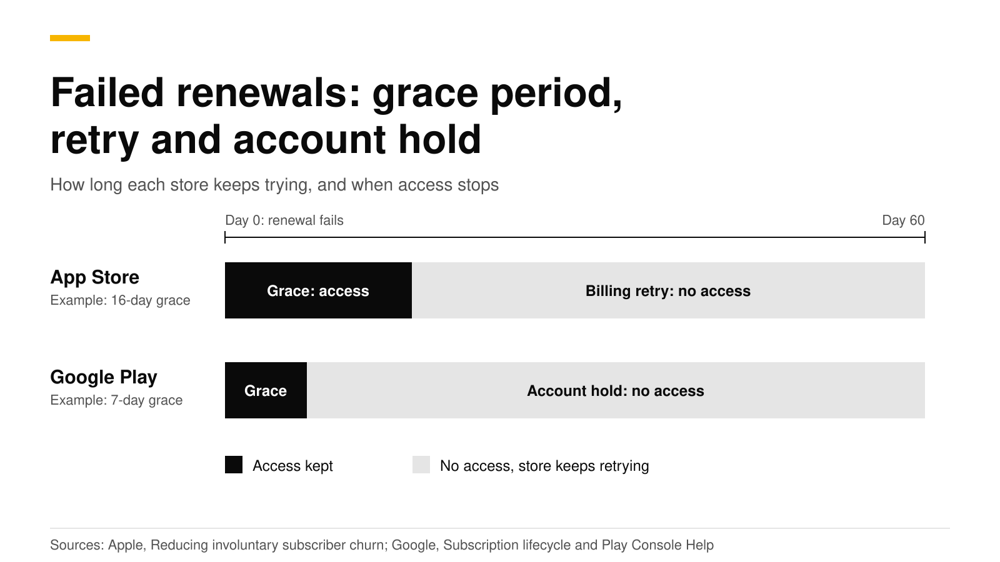
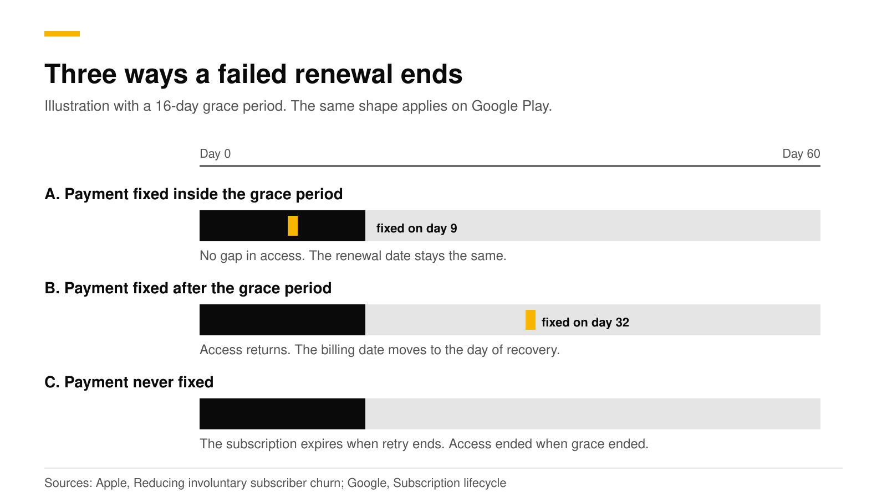

# Billing grace period and account hold: recover failed renewals

When a renewal charge fails, neither store cancels the subscription at once. Apple retries for up to 60 days and lets you turn on a billing grace period of 3, 16 or 28 days where the customer keeps access. Google Play runs a grace period, then an account hold where access stops, and by default the two together last 60 days. Customers who lose a subscription to a failed card are called involuntary churn, and a short setup recovers many of them.

This post explains each store's timeline, the notifications that tell your server what happened, how to keep access right in your app, and how to test it. Sources are Apple, Google and RevenueCat docs, checked in October 2026.



## The short answer

- **Apple.** A failed renewal puts the subscription in billing retry, and the App Store tries to collect for up to 60 days ([Apple](https://developer.apple.com/documentation/storekit/reducing-involuntary-subscriber-churn)).
- **Apple grace period.** Optional, set per app, 3, 16 or 28 days. A weekly subscription gets 6 days at most. The customer keeps full access during it ([Apple](https://developer.apple.com/help/app-store-connect/manage-subscriptions/enable-billing-grace-period-for-auto-renewable-subscriptions)).
- **Google grace period.** On by default for auto-renewing base plans. You can change its length or turn it off ([Android Developers](https://developer.android.com/google/play/billing/lifecycle/subscriptions)).
- **Google account hold.** Starts after the grace period and removes access. The default length is 60 days minus the grace period ([Google](https://support.google.com/googleplay/android-developer/answer/16631229)).
- **Recovery.** Fix inside Apple's grace period and nothing is interrupted. Fix later and the billing date moves to the recovery date. Google behaves the same way for account hold.

## What is involuntary churn?

Apple defines it as subscribers who do not intend to leave but whose subscription fails to renew, usually because of a billing issue. Because it has nothing to do with customer satisfaction, Apple suggests designing for it with a grace period, in-app prompts, or both ([Apple](https://developer.apple.com/documentation/storekit/reducing-involuntary-subscriber-churn)). Common causes are an expired card or a low balance.

## How long does each store keep trying?



| | App Store | Google Play |
|---|---|---|
| Access during grace | Yes, if you turn grace on | Yes, on by default |
| Grace length | 3, 16 or 28 days (6 for weekly) | You choose. A 0-day setting still waits at least 1 day, silently |
| After grace | Billing retry continues, no access | Account hold, no access |
| Total recovery window | Up to 60 days | Grace plus hold. Default hold is 60 days minus grace |
| Billing date after recovery in grace | Unchanged | Unchanged |
| Billing date after later recovery | Moves to the recovery date | Moves to the recovery date |
| System prompt to the user | iOS 16.4 and later show a payment sheet at app launch | A snackbar when you call the In-App Messaging API |

Sources: [Apple](https://developer.apple.com/documentation/storekit/reducing-involuntary-subscriber-churn), [Apple App Store Connect help](https://developer.apple.com/help/app-store-connect/manage-subscriptions/enable-billing-grace-period-for-auto-renewable-subscriptions), [Apple subscriptions](https://developer.apple.com/app-store/subscriptions/), [Android Developers](https://developer.android.com/google/play/billing/lifecycle/subscriptions) and [Google Play Help](https://support.google.com/googleplay/android-developer/answer/16631229).

Two Apple details worth knowing. The grace period is applied when the billing error happens and cannot change for that customer afterward. And it does not apply to monthly subscriptions with a 12-month commitment. Apple also notes that if a subscription is recovered within 60 days, the days of paid service resume from the recovery date, which protects the one-year count for the 85% proceeds rate ([Apple](https://developer.apple.com/app-store/subscriptions/)).

Two Google details. The default account hold was raised on December 1, 2025 from 30 days to an automatically calculated value, and Google tells developers to read the state from the API instead of assuming a static number ([Google Play Help](https://support.google.com/googleplay/android-developer/answer/16631229)). And a "silent" grace period of up to a day keeps the subscription in the active state with no notification, so a notification may not arrive on the day the charge fails.

## How do I turn on the grace period?

**On Apple.** In App Store Connect open your app, then **Subscriptions**, then **Billing Grace Period**, and click **Set Up Billing Grace Period**. Pick 3, 16 or 28 days. It applies to every subscription in the app, not to single products ([Apple](https://developer.apple.com/help/app-store-connect/manage-subscriptions/enable-billing-grace-period-for-auto-renewable-subscriptions)). Apple recommends turning it on in the sandbox first, testing, then turning on production. You can apply it to all renewals, or only to existing paid renewals ([Apple](https://developer.apple.com/app-store/subscriptions/)).

**On Google Play.** Each auto-renewing base plan has Grace period and Account hold settings in Play Console. Google warns that a length below the default can reduce the number of recovered subscriptions ([Android Developers](https://developer.android.com/google/play/billing/lifecycle/subscriptions)).

## Which notifications tell my server what happened?

| State | App Store Server Notifications V2 | Google Play real-time notification | RevenueDot status |
|---|---|---|---|
| Renewal fails, grace on | `DID_FAIL_TO_RENEW` with subtype `GRACE_PERIOD` | `SUBSCRIPTION_IN_GRACE_PERIOD` | `in_grace_period` |
| Grace ends, still retrying | `GRACE_PERIOD_EXPIRED` | `SUBSCRIPTION_ON_HOLD` | `in_billing_retry` |
| Payment recovered | `DID_RENEW` with subtype `BILLING_RECOVERY` | `SUBSCRIPTION_RENEWED` or `SUBSCRIPTION_RECOVERED` | `active` |
| Recovery fails | `EXPIRED` with subtype `BILLING_RETRY` | `SUBSCRIPTION_EXPIRED` | `expired` |

Apple's notification list is on its [notificationType page](https://developer.apple.com/documentation/appstoreservernotifications/notificationtype). Google's states and notifications are in its [subscription lifecycle guide](https://developer.android.com/google/play/billing/lifecycle/subscriptions), which also says to call `purchases.subscriptionsv2.get` when a notification arrives, because it is the source of truth. RevenueDot's statuses are from its [subscription lifecycle reference](https://revenuedot.app/docs/concepts/subscriptions-and-events).

## How should my app treat a customer in a billing problem?

Treat grace as paid access and retry or hold as no access. Apple's `Transaction.currentEntitlements` includes subscriptions in the `subscribed` and `inGracePeriod` states, and leaves out `inBillingRetryPeriod`, `expired` and `revoked` ([Apple](https://developer.apple.com/documentation/storekit/transaction/currententitlements)). On Android, `queryPurchasesAsync` still returns purchases in grace and stops returning them during account hold ([Android Developers](https://developer.android.com/google/play/billing/lifecycle/subscriptions)). A server-backed SDK gives you the same rule through entitlements. RevenueCat's SDK keeps a subscription in grace active, and it says the subscription is considered cancelled but not expired until the grace period ends ([RevenueCat](https://www.revenuecat.com/docs/subscription-guidance/how-grace-periods-work)).

Then ask the customer to fix the payment method. With StoreKit 2 you can read the grace state and show a banner:

```swift
let statuses = try await product.subscription?.status ?? []
for status in statuses {
    guard case .verified(let renewal) = status.renewalInfo else { continue }
    if status.state == .inGracePeriod, let end = renewal.gracePeriodExpirationDate {
        showPaymentBanner(until: end) // link to https://apps.apple.com/account/billing
    }
}
```

Apple's own deep link to the billing page is `https://apps.apple.com/account/billing` on iOS and macOS. Starting in iOS 16.4, a failed renewal also makes the system show a payment sheet when the app launches, and you can delay or suppress it with StoreKit messages ([Apple](https://developer.apple.com/app-store/subscriptions/)). On Android, call the In-App Messaging API when the app opens, and link to `https://play.google.com/store/account/subscriptions?sku=<product>&package=<package>` ([Android Developers](https://developer.android.com/google/play/billing/subscriptions)).

## How do I test grace and retry?

- **Xcode.** In a StoreKit test session, set `shouldEnterBillingRetryOnRenewal` and `billingGracePeriodIsEnabled` to `true`, and call `resolveIssueForTransaction(identifier:)` to simulate the fix ([Apple](https://developer.apple.com/documentation/storekittest/sktestsession/billinggraceperiodisenabled)).
- **Google Play.** Play Billing Lab, with a license tester account, moves a test subscription into grace or account hold in one click. Test grace lasts 5 minutes and test account hold 10 minutes ([Android Developers](https://developer.android.com/google/play/billing/test)).
- **No store.** RevenueDot's Test Store has a `billing_issue` scenario with 7 days of grace. See [testing in-app purchases](sandbox-testing-in-app-purchases.md).

## Do it with RevenueDot

RevenueDot reads each store's state and gives you one status per subscription and one webhook event.

1. Connect the store: the [App Store guide](https://revenuedot.app/docs/guides/app-store) (In-App Purchase key and notification URL) and the [Google Play guide](https://revenuedot.app/docs/guides/google-play) (service account and Pub/Sub push). Without notifications you learn about a failure only when the app next opens.
2. Add a webhook. A failed renewal sends `BILLING_ISSUE` with `grace_period_expiration_at_ms`, then `CANCELLATION` because the subscription will not renew, as in the Test Store's `billing_issue` scenario. A recovery sends `RENEWAL`, and a lost customer gets `EXPIRATION` ([webhook events](https://revenuedot.app/docs/api/webhook-events)).
3. Send `BILLING_ISSUE` to your email or push tool. RevenueDot's integrations, such as [Braze](https://revenuedot.app/integrations/braze), [Customer.io](https://revenuedot.app/integrations/customer-io) and [OneSignal](https://revenuedot.app/integrations/onesignal), get every event a webhook gets.
4. Check one customer in the API. `status` is `in_grace_period` or `in_billing_retry`, and `gives_access` says whether to give access:

```bash
curl -s "https://api.revenuedot.app/v2/projects/$PROJECT_ID/customers/user_1/subscriptions" \
  -H "Authorization: Bearer $SECRET_KEY"
# ... "status": "in_grace_period", "gives_access": true, "auto_renewal_status": "will_renew" ...
```

Track the result on the [churn rate chart](https://revenuedot.app/charts/churn-rate) and the [subscription status chart](https://revenuedot.app/charts/subscription-status). The stores' paths are tested against mocked Apple and Google APIs, and a real run in each sandbox is still pending, so test with real sandbox accounts first.

[Start free on RevenueDot Cloud](https://app.revenuedot.app/signup) (free up to $10,000 monthly tracked revenue). See also the [webhooks feature page](https://revenuedot.app/features/webhooks).

## FAQ

### Should I enable a billing grace period?

Yes. Apple says a grace period gives subscribers uninterrupted service and avoids losing days of paid service and revenue if Apple recovers the payment in time ([Apple](https://developer.apple.com/documentation/storekit/reducing-involuntary-subscriber-churn)). On Google Play it is on by default, and shortening it can reduce recovered subscriptions.

### How long does Apple retry a failed renewal?

Up to 60 days. The grace period, if you enable it, sits at the start of that window ([Apple](https://developer.apple.com/documentation/storekit/product/subscriptioninfo/renewalinfo/graceperiodexpirationdate)).

### What is account hold on Google Play?

It is the period after any grace period when Google still retries the payment but the user must not have access. If the hold ends with the payment unresolved, the subscription expires ([Google Play Help](https://support.google.com/googleplay/android-developer/answer/12154973)).

### Does a recovered subscriber keep the original renewal date?

If the payment is fixed inside the grace period, yes on both stores. If it is fixed after the grace period, the billing date moves to the date of recovery ([Apple](https://developer.apple.com/documentation/storekit/reducing-involuntary-subscriber-churn), [Android Developers](https://developer.android.com/google/play/billing/lifecycle/subscriptions)).

### Can I email customers whose payment failed?

Yes. Use the billing-issue event from your server, since both stores also show their own prompts. RevenueDot sends `BILLING_ISSUE` to webhooks and email tools, and the event includes when grace ends.

**About RevenueDot.** RevenueDot is an open-source (AGPL-3.0) backend for in-app purchases and subscriptions that works with the RevenueCat SDK. Start free on [RevenueDot Cloud](https://app.revenuedot.app/signup), free up to $10,000 in monthly tracked revenue, or self-host it with Docker and Postgres. Point the SDK's proxy URL at RevenueDot and keep your app code, your offerings and your customers. Read the [quickstart](../docs/getting-started/quickstart.md) or the code on [GitHub](https://github.com/revenuedot/revenuedot).
