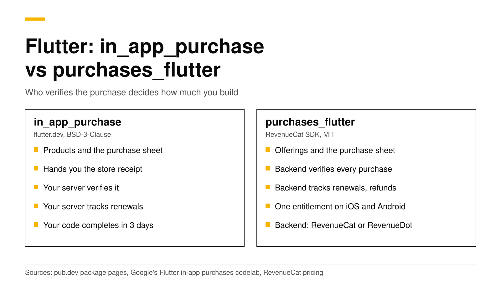

# Flutter in_app_purchase vs purchases_flutter: which to use

Use `in_app_purchase` when you want to own everything and are ready to build a server; use `purchases_flutter` when you want a backend to verify purchases and track subscriptions for you. `in_app_purchase` is the flutter.dev plugin. It loads products, runs the purchase and hands you the store's receipt, and the rest is your job: Google's own codelab builds a Dart server with Cloud Firestore to verify purchases and follow renewals. `purchases_flutter` is RevenueCat's MIT-licensed SDK. It sends each purchase to a backend, which can be RevenueCat or an open-source server such as RevenueDot, and gives your app one answer to "is this user Pro?" on iOS and Android.

This post compares the two packages with code side by side, shows what each costs, and says when each one fits. Every Flutter, Google and RevenueCat fact links its source and was checked in October 2026.



## The short answer

- **`in_app_purchase`** is published by flutter.dev under BSD-3-Clause, version 3.3.1, for Android, iOS and macOS ([pub.dev](https://pub.dev/packages/in_app_purchase)). It does not verify purchases for you.
- **`purchases_flutter`** is published by revenuecat.com under MIT, version 10.14.0, for iOS, Android, macOS and web ([pub.dev](https://pub.dev/packages/purchases_flutter)). It needs a backend that speaks RevenueCat's API.
- **Pick `in_app_purchase`** if you sell on one store, already run a backend, or must not depend on any vendor.
- **Pick `purchases_flutter`** if you sell subscriptions on both stores and want entitlements, webhooks and charts without writing store server code.
- **Cost:** `in_app_purchase` costs your engineering time. `purchases_flutter` with RevenueCat is free up to $2,500 in monthly tracked revenue, then 1% ([RevenueCat](https://www.revenuecat.com/pricing/)). With RevenueDot Cloud it is free up to $10,000.

## What does each package do?

The two packages sit at different layers. `in_app_purchase` is a thin layer over StoreKit and Google Play Billing. `purchases_flutter` wraps the same store libraries and adds a client for a subscription server.

| | `in_app_purchase` | `purchases_flutter` |
|---|---|---|
| Publisher and license | flutter.dev, BSD-3-Clause | revenuecat.com, MIT |
| Platforms | Android, iOS, macOS | iOS, Android, macOS, web |
| Load products and buy | Yes | Yes, through offerings and packages |
| Verify a purchase | Your server, against each store's API | The backend |
| Acknowledge Google purchases within 3 days | Your code calls `completePurchase` | The backend |
| Renewals, refunds and billing failures | Your server, from store notifications | The backend |
| One entitlement across iOS and Android | Your server and your database | Built in (`entitlements.active`) |
| Webhooks, charts, paywalls, experiments | Build them | From the backend |

The `in_app_purchase` README is clear about the split. It tells you to call `completePurchase` "after verifying the purchase receipt and the delivering the content to the user", and points to Apple's and Google's own verification guides for that step ([pub.dev](https://pub.dev/packages/in_app_purchase)). It also warns that failing to complete a purchase within 3 days "will result in a refund on Android".

## What does the server behind in_app_purchase look like?

Google's Flutter codelab, "Adding in-app purchases to your Flutter app", builds the full setup ([Google codelab](https://codelabs.developers.google.com/codelabs/flutter-in-app-purchases)). Its parts:

1. **Sign-in** with Firebase Authentication, so each purchase belongs to a user.
2. **A Dart backend** that receives purchase tokens from the app.
3. **Verification** against the Google Play Developer API and the App Store server, with service account credentials for each store.
4. **Storage** of purchases in Cloud Firestore.
5. **Tracking** of renewals and cancellations through Google Cloud Pub/Sub and App Store notifications.

The codelab explains why: with a server, "you can securely verify transactions", and users cannot unlock premium features by changing the device clock. That is the right design. It is also a lot of work for a small team, and the work never ends: both stores change their APIs, and every new edge case, such as grace periods, refunds, upgrades or account transfers, lands on your server. Our [server-side validation guide](server-side-receipt-validation.md) shows how much code the verification step alone takes.

## The same purchase, side by side

### With in_app_purchase

```dart
import 'dart:async';
import 'package:in_app_purchase/in_app_purchase.dart';

final iap = InAppPurchase.instance;
late final StreamSubscription<List<PurchaseDetails>> purchaseSub;

void startStore() {
  // Every purchase, restore and update arrives on this stream.
  purchaseSub = iap.purchaseStream.listen(onPurchases);
}

Future<void> buyPro() async {
  // On Android, the ID is the Play subscription ID.
  final response = await iap.queryProductDetails({'pro_monthly'});
  final product = response.productDetails.first;
  // Subscriptions are bought as non-consumables.
  await iap.buyNonConsumable(purchaseParam: PurchaseParam(productDetails: product));
}

Future<void> onPurchases(List<PurchaseDetails> purchases) async {
  for (final p in purchases) {
    if (p.status == PurchaseStatus.purchased || p.status == PurchaseStatus.restored) {
      // Your server checks this token with Apple or Google and records access.
      final ok = await myServer.verify(p.productID, p.verificationData.serverVerificationData);
      if (ok) setPro(true);
    }
    if (p.pendingCompletePurchase) {
      await iap.completePurchase(p); // Within 3 days on Android, or Google refunds it.
    }
  }
}

// The Restore purchases button: restored purchases arrive on purchaseStream.
Future<void> restore() => iap.restorePurchases();
```

`myServer.verify` is the part you write. It holds your App Store key and your Google service account, calls each store, stores the result, and must later learn about renewals and refunds from store notifications.

### With purchases_flutter and RevenueDot

```dart
import 'dart:io' show Platform;
import 'package:purchases_flutter/purchases_flutter.dart';

Future<void> startStore() async {
  // One line of setup sends the SDK to RevenueDot instead of RevenueCat.
  await Purchases.setProxyURL('https://api.revenuedot.app');
  await Purchases.configure(
    PurchasesConfiguration(Platform.isIOS ? 'appl_YourKey' : 'goog_YourKey'),
  );
}

Future<bool> buyPro() async {
  final offerings = await Purchases.getOfferings();
  final package = offerings.current?.monthly;
  if (package == null) return false;
  final result = await Purchases.purchase(PurchaseParams.package(package));
  return result.customerInfo.entitlements.active.containsKey('pro');
}

// The Restore purchases button
Future<bool> restore() async {
  final info = await Purchases.restorePurchases();
  return info.entitlements.active.containsKey('pro');
}
```

There is no `verify` function to write. The backend verifies the purchase with Apple or Google, acknowledges Google purchases, receives store notifications, and answers with the customer's entitlements. Drop the `setProxyURL` line and the same code talks to RevenueCat. Our [Flutter tutorial](flutter-in-app-purchases-tutorial.md) builds a full paywall with this package.

## What goes wrong most often?

Each package has its own traps. Knowing them up front saves a rejected build or a week of support email.

**With `in_app_purchase`, from its README** ([pub.dev](https://pub.dev/packages/in_app_purchase)):

1. **Forgetting `completePurchase`.** On Android the purchase is refunded after 3 days. On iOS and macOS the purchase stays in Apple's queue, is delivered to the app again and again, and blocks the next purchase of the same product.
2. **Expecting consumables to restore.** Google Play treats a consumed product as no longer owned, so `restorePurchases` cannot bring it back. Credit balances must live on your server.
3. **Changing plans on Android.** To upgrade or downgrade a Google Play subscription, you pass a `GooglePlayPurchaseParam` with a `ChangeSubscriptionParam` to `buyNonConsumable`. Your server must then follow the old and new purchase tokens.

**With `purchases_flutter` against RevenueDot, from our [Flutter docs](../docs/sdks/flutter.md):**

1. **Calling `configure` before `setProxyURL` finishes.** Await `setProxyURL` first, or the first requests go to RevenueCat.
2. **Turning on enforced entitlement verification.** The stock package checks signatures against RevenueCat's key, so `EntitlementVerificationMode.enforced` fails every request. The default, disabled, is correct.
3. **Shipping a Test Store key.** `test_` keys work only in debug builds. Release builds need the `appl_` and `goog_` keys.

The first list is code you maintain forever. The second list is setup you get right once.

## What does each choice cost?

| | Package | Backend | What you pay |
|---|---|---|---|
| `in_app_purchase` + your server | Free (BSD-3-Clause) | You build and run it | Engineering time, hosting and upkeep |
| `purchases_flutter` + RevenueCat | Free (MIT) | Hosted by RevenueCat | Free to $2,500 in monthly tracked revenue, then 1% ([RevenueCat](https://www.revenuecat.com/pricing/)) |
| `purchases_flutter` + RevenueDot Cloud | Free (MIT) | Hosted by RevenueDot | Free to $10,000 in monthly tracked revenue, then 0.5% capped at $999 a month ([pricing](https://revenuedot.app/pricing)) |

At $50,000 in monthly tracked revenue, RevenueCat's fee is $500 a month. The [fee calculator](https://revenuedot.app/tools/revenuecat-fee-calculator) works it out for your numbers, and our [RevenueCat pricing explainer](revenuecat-pricing-explained.md) shows worked bills.

## When does each one fit?

**`in_app_purchase` fits when:**

- You sell on one store, or only consumables whose balance you already keep on your server.
- You already run a backend and have someone who will own the App Store Server API, Google's Play Developer API and both stores' notifications.
- Your rules forbid any purchase vendor, and you do not want to self-host one.

**`purchases_flutter` fits when:**

- You sell subscriptions on both iOS and Android and want one entitlement across them.
- You want webhooks, charts, paywalls or experiments without building them.
- You want to switch backends later without rewriting purchase code. The SDK talks to RevenueCat by default and to RevenueDot with `setProxyURL`.

If you already ship `in_app_purchase` and want a backend's records without rewriting your purchase flow, the RevenueCat SDK documents `syncPurchases` for that case: "Call this when using your own implementation of in-app purchases" ([pub.dev](https://pub.dev/documentation/purchases_flutter/latest/purchases_flutter/Purchases/syncPurchases.html)). Most apps do better with one purchase package, not two.

## Do it with RevenueDot

RevenueDot is an open-source server that speaks the RevenueCat SDK's API. You install the stock `purchases_flutter` package, add one `setProxyURL` line, and get:

- Purchase verification and Google acknowledgement for the [App Store](https://revenuedot.app/stores/app-store) and [Google Play](https://revenuedot.app/stores/google-play).
- One customer and one entitlement across platforms, with your own user IDs through `logIn`.
- [Webhooks](https://revenuedot.app/features/webhooks), [charts](https://revenuedot.app/charts/mrr), [paywalls](https://revenuedot.app/features/paywalls) and [experiments](https://revenuedot.app/features/experiments).
- The [Flutter SDK page](https://revenuedot.app/sdks/flutter) and the [Flutter docs](../docs/sdks/flutter.md) with every setup detail.

The limits matter. Flutter web does not work against RevenueDot with the stock package, because its web plugin ignores `setProxyURL`. RevenueDot's fork of `purchases_flutter` fixes this; it installs as a git dependency at tag `10.13.2-revenuedot`, because the pub.dev name belongs to RevenueCat ([Flutter docs](../docs/sdks/flutter.md)). No real store purchase has run end to end against RevenueDot yet, so test each store in its sandbox before launch. The [RevenueCat comparison](https://revenuedot.app/compare/revenuedot-vs-revenuecat) lists the other differences.

[Start free on RevenueDot Cloud](https://app.revenuedot.app/signup) (free up to $10,000 monthly tracked revenue).

## FAQ

### Is in_app_purchase enough for Flutter subscriptions?

It is enough to sell them. It is not enough to trust them: the README leaves receipt verification to you ([pub.dev](https://pub.dev/packages/in_app_purchase)), and renewals and refunds reach a server, not the app. Google's codelab adds a Dart and Firestore backend for exactly that ([Google codelab](https://codelabs.developers.google.com/codelabs/flutter-in-app-purchases)).

### Do I need a RevenueCat account to use purchases_flutter?

No. The package is MIT-licensed and works with any backend that speaks RevenueCat's API. With RevenueDot you create a RevenueDot project, use its `appl_` and `goog_` keys, and call `setProxyURL` before `configure`.

### Can I use in_app_purchase and purchases_flutter together?

You can, but most apps should not. Both listen to the same store transactions. If you keep your own purchase code, the RevenueCat SDK's `syncPurchases` exists for that case ([pub.dev](https://pub.dev/documentation/purchases_flutter/latest/purchases_flutter/Purchases/syncPurchases.html)).

### Which package works on Flutter web?

`purchases_flutter` lists web support ([pub.dev](https://pub.dev/packages/purchases_flutter)), and `in_app_purchase` lists Android, iOS and macOS ([pub.dev](https://pub.dev/packages/in_app_purchase)). With RevenueDot, the stock web plugin still calls RevenueCat, so use RevenueDot's fork from its git tag for Flutter web ([Flutter docs](../docs/sdks/flutter.md)).

### Can I move from in_app_purchase to purchases_flutter later?

Yes. Replace the purchase code with `purchases_flutter`, configure the backend, and call `syncPurchases` once on the first launch of the update so existing subscribers are recorded. See [restore purchases on iOS and Android](restore-purchases-ios-android.md) for when to use `syncPurchases` and when to use `restorePurchases`.

**About RevenueDot.** RevenueDot is an open-source (AGPL-3.0) backend for in-app purchases and subscriptions that works with the RevenueCat SDK. Start free on [RevenueDot Cloud](https://app.revenuedot.app/signup): free up to $10,000 in monthly tracked revenue, then 0.5%, never more than $999 a month. Point the SDK's proxy URL at RevenueDot and keep your app code, your offerings and your customers. Read the [quickstart](../docs/getting-started/quickstart.md) or the code on [GitHub](https://github.com/revenuedot/revenuedot).
