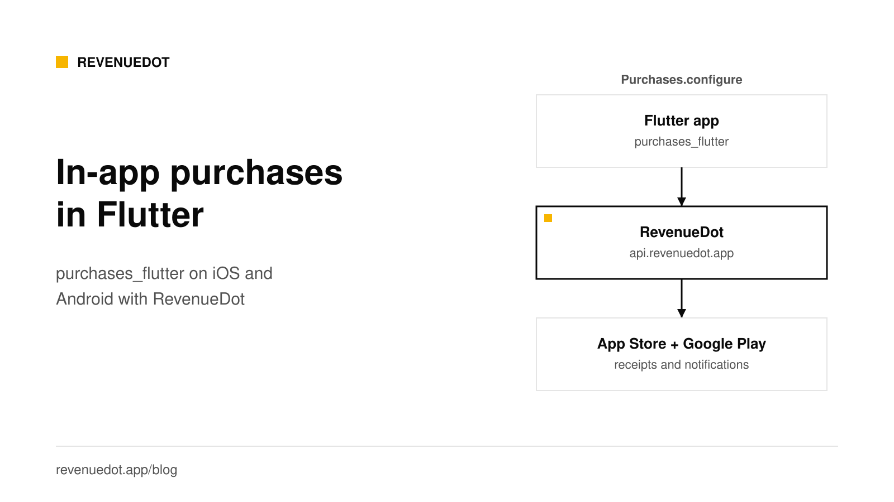
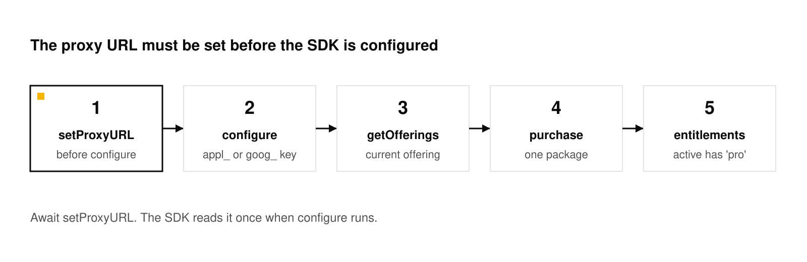

# Flutter in-app purchases and subscriptions with purchases_flutter

To add in-app purchases to a Flutter app, add the RevenueDot SDK to `pubspec.yaml` as a git dependency (the package is still named `purchases_flutter`), call `await Purchases.configure` with your app's key, then load offerings, call `Purchases.purchase` and check `customerInfo.entitlements.active`. RevenueDot is the backend: it verifies each App Store and Google Play purchase and answers with the customer's entitlements. On RevenueDot Cloud the key is the only setup. The same Dart code runs on iOS, Android and Flutter web.



## What you need

- Flutter 3.22 or later. RevenueCat's [Flutter installation guide](https://www.revenuecat.com/docs/getting-started/installation/flutter) lists it as the minimum, and says an iOS deployment target of 13.0 or higher must be set in `ios/Podfile` when you use CocoaPods. The RevenueDot SDK's [pubspec.yaml](https://github.com/revenuedot/purchases-flutter/blob/10.13.2-revenuedot/pubspec.yaml) sets the same Flutter minimum.
- An App Store Connect app with a subscription, and a Google Play Console app with a subscription. You can start with one platform.
- A RevenueDot Cloud project. [Sign up free](https://app.revenuedot.app/signup).

The steps: create the products, connect the stores, build the catalog, install the SDK, configure it, build the paywall, test.

## Step 1: Create the subscription in each store

Create the same plan on each platform you ship.

- **App Store:** in App Store Connect, create a subscription group and an auto-renewable subscription with a Product ID such as `pro_monthly`. Apple's [help page](https://developer.apple.com/help/app-store-connect/manage-subscriptions/offer-auto-renewable-subscriptions) lists each field.
- **Google Play:** in Play Console, create a subscription with a Product ID, add a **base plan** with a billing period, set prices, and click **Activate**. Google's [help page](https://support.google.com/googleplay/android-developer/answer/140504) explains that hierarchy: subscription, then base plan, then pricing.

Write down both IDs. For Google Play subscriptions, RevenueDot's product ID is `subscriptionId:basePlanId`, for example `pro:monthly`.

For step-by-step store screens, see [How to add subscriptions to a SwiftUI app](https://revenuedot.app/blog/swiftui-subscriptions-tutorial) and [Android with Google Play Billing](https://revenuedot.app/blog/android-google-play-billing-subscriptions).

## Step 2: Connect the stores to RevenueDot

In RevenueDot, add one app per store.

| Store | What RevenueDot needs | Guide |
|---|---|---|
| App Store | Bundle ID, an In-App Purchase key (`.p8`, Key ID, Issuer ID), and the notification URL set as Version 2 in App Store Connect | [App Store](https://revenuedot.app/docs/guides/app-store) |
| Google Play | Package name, a service account JSON key with Play Console access, and a Pub/Sub push subscription for real-time developer notifications | [Google Play](https://revenuedot.app/docs/guides/google-play) |

The dashboard checks each credential and shows whether notifications arrive.

## Step 3: Create the product, entitlement and offering

1. **Products:** add `pro_monthly` to the App Store app and `pro:monthly` to the Google Play app.
2. **Entitlements:** add `pro`. Attach both products to it.
3. **Offerings:** create `default`, add a `$rc_monthly` package, put both products in it (one per app), and make the offering current.

A package holds one product per app, so one offering serves both platforms. See [offerings and packages](https://revenuedot.app/docs/concepts/offerings-and-packages).


## Step 4: Add the RevenueDot SDK to pubspec.yaml

Add the RevenueDot SDK as a git dependency. Its package name is still `purchases_flutter`, so every import stays the same. It installs from git because the pub.dev names belong to RevenueCat.

```yaml
# pubspec.yaml
dependencies:
  purchases_flutter:
    git:
      url: https://github.com/revenuedot/purchases-flutter.git
      ref: 10.13.2-revenuedot
```

Run `flutter pub get`, then confirm the iOS target in `ios/Podfile`:

```ruby
platform :ios, '13.0'
```

On Android, RevenueCat says to set the Activity's `launchMode` to `standard` or `singleTop` so that a purchase is not cancelled when the customer must authenticate in another app. Check `android/app/src/main/AndroidManifest.xml`.

The RevenueDot SDK is built from RevenueCat's open-source SDK (MIT license), so your code imports `package:purchases_flutter/purchases_flutter.dart` and calls `Purchases`. It sends every request to RevenueDot and needs no RevenueCat account. The [Flutter SDK guide](https://revenuedot.app/docs/sdks/flutter) has the details.

## Step 5: Configure the SDK with your app's key

Call `configure` once, before `runApp`. On RevenueDot Cloud there is nothing else to set, because the SDK already sends its requests to `https://api.revenuedot.app`.

```dart
import 'package:flutter/foundation.dart';
import 'package:purchases_flutter/purchases_flutter.dart';

// kIsWeb and defaultTargetPlatform work on every platform, including Flutter web.
final apiKey = kIsWeb
    ? 'test_YourKey'
    : defaultTargetPlatform == TargetPlatform.iOS
        ? 'appl_YourKey'
        : 'goog_YourKey';

Future<void> initPurchases() async {
  await Purchases.configure(PurchasesConfiguration(apiKey));
}

Future<void> main() async {
  WidgetsFlutterBinding.ensureInitialized();
  await initPurchases();
  runApp(const MyApp());
}
```



**Flutter web works too, with the `test_` key.** The SDK's web part is built from RevenueDot's purchases-js, which buys only with Test Store (`test_`) keys today ([web SDK guide](https://revenuedot.app/docs/sdks/web)). The code picks the key with `kIsWeb` and `defaultTargetPlatform` from `package:flutter/foundation.dart`, because `Platform` from `dart:io` throws on the web.

**Self-hosting?** Await `Purchases.setProxyURL` with your own server's address before `configure`, and keep the verification mode at its default, `disabled`, because your server signs its responses with its own key. It works on iOS, Android and Flutter web. The [Flutter SDK guide](https://revenuedot.app/docs/sdks/flutter) shows the code.

## Step 6: Build the paywall

Load the current offering, show its packages, buy, restore and read the entitlement.

```dart
import 'package:flutter/material.dart';
import 'package:flutter/services.dart' show PlatformException;
import 'package:purchases_flutter/purchases_flutter.dart';

class PaywallScreen extends StatefulWidget {
  const PaywallScreen({super.key});
  @override
  State<PaywallScreen> createState() => _PaywallScreenState();
}

class _PaywallScreenState extends State<PaywallScreen> {
  List<Package> packages = [];
  bool isPro = false;
  String? error;

  @override
  void initState() {
    super.initState();
    Purchases.addCustomerInfoUpdateListener(_apply);
    _load();
  }

  void _apply(CustomerInfo info) {
    if (!mounted) return;
    setState(() => isPro = info.entitlements.active.containsKey('pro'));
  }

  Future<void> _load() async {
    try {
      final offerings = await Purchases.getOfferings();
      _apply(await Purchases.getCustomerInfo());
      setState(() => packages = offerings.current?.availablePackages ?? []);
    } on PlatformException catch (e) {
      setState(() => error = e.message);
    }
  }

  Future<void> _buy(Package package) async {
    try {
      final result = await Purchases.purchase(PurchaseParams.package(package));
      _apply(result.customerInfo);
    } on PlatformException catch (e) {
      final code = PurchasesErrorHelper.getErrorCode(e);
      if (code != PurchasesErrorCode.purchaseCancelledError) {
        setState(() => error = e.message);
      }
    }
  }

  Future<void> _restore() async => _apply(await Purchases.restorePurchases());

  @override
  Widget build(BuildContext context) {
    if (isPro) return const Center(child: Text('You have Pro'));
    return ListView(padding: const EdgeInsets.all(16), children: [
      for (final p in packages)
        FilledButton(
          onPressed: () => _buy(p),
          child: Text('${p.storeProduct.title}, ${p.storeProduct.priceString}'),
        ),
      TextButton(onPressed: _restore, child: const Text('Restore purchases')),
      if (error != null) Text(error!, style: const TextStyle(color: Colors.red)),
    ]);
  }
}
```

`Purchases.purchasePackage` still works but is deprecated in the 10.x line. The `PurchaseParams.package` form is the current one.

**Expected output:** the screen lists one button per package. After a sandbox purchase, `isPro` turns true, and the dashboard shows the customer with an active `pro` entitlement and an `INITIAL_PURCHASE` event.

## Optional: identify your own users

Without an app user ID, the SDK starts with an anonymous ID (it begins with `$RCAnonymousID:`) and keeps it on the device. That is fine for an app with no accounts. If your app has sign-in, call `logIn` after the customer signs in, so their purchases follow them to a new phone and to your web app.

```dart
// After your own sign-in succeeds:
final result = await Purchases.logIn(myUserId);
final isPro = result.customerInfo.entitlements.active.containsKey('pro');

// When the customer signs out:
await Purchases.logOut();
```

When an anonymous customer who already bought something calls `logIn`, their purchases move to the identified user. RevenueDot keeps one customer record per app user ID and lists the old anonymous ID as an alias. The rules for who owns a purchase that two accounts both restore are the project's transfer behavior. They are explained in [customers and app user IDs](https://revenuedot.app/docs/concepts/customers-and-app-user-ids) and the [restore guide](https://revenuedot.app/docs/help/restore-purchases).

Use the same user ID on every platform, and never put a secret in it. The ID appears in dashboards, webhooks and logs.

## Already ship the RevenueCat SDK? Keep it and add one line

If your Flutter app already ships RevenueCat's `purchases_flutter` from pub.dev with RevenueCat's backend, you can keep it on iOS and Android. The change is three lines. Add the proxy URL before `configure`, keep your current keys if you ran the [importer](https://revenuedot.app/docs/migrate/importer), and call `syncPurchases` once on the first launch of the update, so subscribers who bought while the app talked to RevenueCat keep access.

```dart
// iOS and Android only: RevenueCat's package ignores the proxy URL on Flutter web.
await Purchases.setProxyURL('https://api.revenuedot.app');
await Purchases.configure(PurchasesConfiguration(Platform.isIOS ? 'appl_YourKey' : 'goog_YourKey'));
// Once, after this update:
await Purchases.syncPurchases();
```

Keep the verification mode at its default, `disabled`. RevenueCat's package checks signatures against RevenueCat's key, so `enforced` would fail every request. Its web plugin also ignores `setProxyURL`, so for Flutter web install the RevenueDot SDK instead. Old app versions keep calling RevenueCat until their owners update, so run both systems side by side for a while. [Connect your app](https://revenuedot.app/docs/getting-started/connect-your-app) shows the code, and [Migrate from RevenueCat](https://revenuedot.app/migrate-from-revenuecat) gives the order of steps.

## Step 7: Test

**With no store account.** Create a **Test Store** app in RevenueDot, add a product and a Test Store price, and pass its `test_` key to `configure`. The SDK shows a Test Store dialog. Tap **Test valid purchase**. Test Store keys work only in debug builds, so ship with the `appl_` and `goog_` keys. For a local server, the iOS simulator reaches your Mac at `localhost` and the Android emulator at `10.0.2.2`.

**On iOS.** Create a sandbox tester under **Users and Access, Sandbox** in App Store Connect and sign in with it under **Settings, App Store, Sandbox Account**. Sandbox subscriptions renew in minutes.

**On Android.** Add license testers in Play Console under **Setup, License testing**, publish the app to an internal test track, and install from that track. Test subscriptions renew every few minutes.

Before you ship, run one sandbox purchase on each store and check that it reaches the customer page and your webhooks. See [sandbox testing](https://revenuedot.app/docs/guides/sandbox-testing).

## Common errors and fixes

| Symptom | Cause | Fix |
|---|---|---|
| Offerings are empty | Product IDs differ between the store and RevenueDot, or the offering is not current | Match the IDs, make the offering current |
| Web calls reach RevenueCat | RevenueCat's `purchases_flutter` from pub.dev is installed, and its web plugin ignores `setProxyURL` | Install the RevenueDot SDK from its git tag (Step 4) |
| Every request fails with a signature error | `enforced` verification mode with RevenueCat's package or a self-hosted server | Remove it. Disabled is the default |
| Purchase succeeds on Android, entitlement missing | No service account on the Google Play app | Add it. RevenueDot answers 503 (code 7101) until then and the SDK retries |
| `Unsupported operation` error on the web | `Platform` from `dart:io` does not work on the web | Pick the key with `kIsWeb` and `defaultTargetPlatform` from `package:flutter/foundation.dart`, as Step 5 shows |

## Do it with RevenueDot

1. [Create a free account](https://app.revenuedot.app/signup). Cloud is free up to $10,000 in monthly tracked revenue.
2. Add your App Store and Google Play apps with their credentials.
3. Create the product, the `pro` entitlement and the `default` offering.
4. Add the RevenueDot SDK to `pubspec.yaml` and call `Purchases.configure` with your `appl_` and `goog_` keys.
5. Add a webhook under **Integrations, Webhooks** so your own backend hears about purchases.

[Start free on RevenueDot Cloud](https://app.revenuedot.app/signup)

## FAQ

### Which Flutter package do I use for subscriptions?

Use the RevenueDot SDK. Its package name is `purchases_flutter`, and it installs from RevenueDot's git tag, `10.13.2-revenuedot`. It calls RevenueDot by default, so you pass only your app's key. RevenueCat's `purchases_flutter` from pub.dev also works with RevenueDot on iOS and Android when you call `Purchases.setProxyURL` before `configure`.

### Does purchases_flutter work with a backend other than RevenueCat?

Yes. The RevenueDot SDK calls `https://api.revenuedot.app` by default, and `Purchases.setProxyURL` points it, or RevenueCat's package, at your own server. Your Dart code does not change.

### Do I need the in_app_purchase package as well?

No. `purchases_flutter` wraps StoreKit and Google Play Billing for you, and it handles verification through the backend. Use one purchase package, not two.

### Can I use one entitlement for iOS and Android?

Yes. Attach the App Store product and the Google Play product to the same entitlement, and put both in one package. Your app checks `entitlements.active['pro']` on both platforms.

### Does it work on Flutter web?

Yes, with the RevenueDot SDK. On the web it buys with a Test Store (`test_`) key today. RevenueCat's package from pub.dev does not work on the web with RevenueDot, because its web plugin ignores the proxy URL.

**About RevenueDot.** RevenueDot is an open-source (AGPL-3.0) backend for in-app purchases and subscriptions on the App Store, Google Play and the web. Start free on [RevenueDot Cloud](https://app.revenuedot.app/signup), free up to $10,000 in monthly tracked revenue, or self-host it with Docker and Postgres. New apps install the [RevenueDot SDK](../docs/sdks/README.md) and pass their key. Apps that ship the RevenueCat SDK point its proxy URL at RevenueDot and keep their code, offerings and customers. Read the [quickstart](../docs/getting-started/quickstart.md) or the code on [GitHub](https://github.com/revenuedot/revenuedot).
