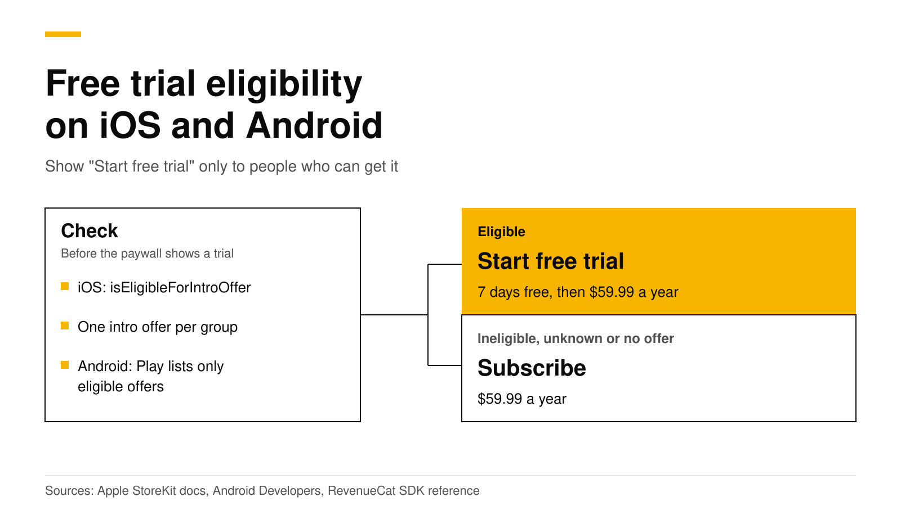

# How to check free trial eligibility on iOS and Android

On iOS, ask StoreKit 2: `product.subscription?.isEligibleForIntroOffer` is `true` only when the user can still get an introductory offer in that subscription group. On Android, Google Play does the check for you, because `subscriptionOfferDetails` lists only the offers the user is eligible for. With the RevenueCat SDK, call `checkTrialOrIntroductoryPriceEligibility` on iOS and read `subscriptionOptions` on Android. Show "Start free trial" only on a clear yes.

This post covers each store's rule, the code, the button text and sandbox tests. Every Apple, Google and RevenueCat fact links its source and was checked in October 2026.



## The short answer

- **Apple** gives each customer one introductory offer per [subscription group](https://revenuedot.app/glossary/subscription-group). Existing subscribers never qualify, even when they switch plans ([Apple](https://developer.apple.com/documentation/storekit/implementing-introductory-offers-in-your-app)).
- **StoreKit 2** answers with `Product.SubscriptionInfo.isEligibleForIntroOffer`, available since iOS 15 ([Apple](https://developer.apple.com/documentation/storekit/product/subscriptioninfo/iseligibleforintrooffer)).
- **Google Play** returns only the offers a user is eligible for, and offers a base plan to anyone who picks a stale offer ([Android Developers](https://developer.android.com/google/play/billing/integrate)).
- **The RevenueCat SDK** returns one of four statuses on iOS. On Android it always returns unknown, so you read the product's subscription options instead ([pub.dev](https://pub.dev/documentation/purchases_flutter/latest/purchases_flutter/Purchases/checkTrialOrIntroductoryPriceEligibility.html)).
- **When in doubt, show the regular price.** A paywall that promises a trial the user will not get misleads them, and Apple removes apps that trick users into a subscription ([App Review Guidelines 3.1.2](https://developer.apple.com/app-store/review/guidelines/)).

## Who gets a free trial on the App Store?

Apple ties the trial to the subscription group. A customer who has used an introductory offer on any product in a group cannot get another one in that group ([Apple](https://developer.apple.com/documentation/storekit/implementing-introductory-offers-in-your-app)). A free trial is one of three kinds of [introductory offer](https://revenuedot.app/glossary/introductory-offer), next to "pay as you go" and "pay up front", so the same rule covers all three.

| Customer | Eligible for the intro offer? |
|---|---|
| Never subscribed to the group | Yes, always |
| Subscribed before, has lapsed, never used an intro offer in the group | Yes |
| Subscribed before and used an intro offer in the group | No |
| Subscribes now and upgrades, downgrades or crossgrades | No, even if they never used an intro offer |

So a monthly subscriber should not see "7 days free" on a yearly plan in the same group. To reach lapsed users who already had their trial, use a [promotional offer](ios-promotional-offers-signature.md) or a [win-back offer](https://revenuedot.app/glossary/win-back-offer) instead.

## How do you check eligibility with StoreKit 2?

Read the `isEligibleForIntroOffer` property. Apple describes it as `true` when the customer can get an intro offer on this subscription or any other in the same group. Apple also warns that it can be `true` when you never set up an intro offer, so check that an offer exists as well ([Apple](https://developer.apple.com/documentation/storekit/product/subscriptioninfo/iseligibleforintrooffer)).

```swift
import StoreKit

/// Returns the free trial to show, or nil when the paywall should show the plain price.
func freeTrialToShow(for product: Product) async -> Product.SubscriptionOffer? {
    guard let subscription = product.subscription,
          let intro = subscription.introductoryOffer,  // nil when no intro offer is set up
          intro.paymentMode == .freeTrial else { return nil }
    // true only if the user has not used an intro offer in this group.
    return await subscription.isEligibleForIntroOffer ? intro : nil
}
```

If you only know the group ID, the static `Product.SubscriptionInfo.isEligibleForIntroOffer(for:)` answers for the whole group ([Apple](https://developer.apple.com/documentation/storekit/product/subscriptioninfo/iseligibleforintrooffer(for:))). Both APIs are async, so check once when the paywall loads.

## Who gets a free trial on Google Play?

On Google Play you set the rule per offer. A trial usually uses "new customer acquisition", which means the user never had this subscription, or never had any subscription in the app, depending on the option you pick. "Developer determined" means your app decides, and such an offer cannot be bought outside your app ([Google Play Console Help](https://support.google.com/googleplay/android-developer/answer/12154973)). Our [base plans and offers guide](google-play-base-plans-and-offers.md) covers the third type, upgrade, and how offers map to iOS.

You do not compute eligibility yourself. `queryProductDetailsAsync` returns up to 50 offers per subscription that the user is eligible for ([Android Developers](https://developer.android.com/google/play/billing/integrate)). So if a free trial offer is in the list, the user can get it.

```kotlin
// productDetails comes from queryProductDetailsAsync. Play lists only eligible offers.
val offers = productDetails.subscriptionOfferDetails.orEmpty()

val trial = offers.firstOrNull { offer ->
    offer.offerId != null && // null means the plain base plan
        offer.pricingPhases.pricingPhaseList.firstOrNull()?.priceAmountMicros == 0L
}
val basePlan = offers.first { it.offerId == null }
val chosen = trial ?: basePlan // buy with chosen.offerToken
```

`getOfferId` returns null for a regular base plan ([reference](https://developer.android.com/reference/com/android/billingclient/api/ProductDetails.SubscriptionOfferDetails)). A free phase has a price of 0 micros, and each phase also gives you its formatted price, billing period and cycle count ([reference](https://developer.android.com/reference/com/android/billingclient/api/ProductDetails.PricingPhase)).

A developer-determined offer is in the list too, because Play cannot judge your rule. Filter it out by tag unless your logic says the user qualifies.

## How does the RevenueCat SDK report eligibility?

`checkTrialOrIntroductoryPriceEligibility` takes product IDs and returns a status for each one ([pub.dev](https://pub.dev/documentation/purchases_flutter/latest/purchases_flutter/Purchases/checkTrialOrIntroductoryPriceEligibility.html)). The iOS SDK names the same method `checkTrialOrIntroDiscountEligibility`.

| Status | Meaning | What the paywall shows |
|---|---|---|
| Eligible | The user can get the trial or intro price | The trial or intro terms |
| Ineligible | The user cannot get it | The regular price |
| No intro offer exists | The product has no trial or intro price | The regular price |
| Unknown | The SDK could not decide | The regular price |

The statuses come from the [Flutter enum](https://pub.dev/documentation/purchases_flutter/latest/purchases_flutter/IntroEligibilityStatus.html). The SDK's own note says to show the regular price on unknown ([purchases-ios source](https://github.com/RevenueCat/purchases-ios/blob/main/Sources/Purchasing/Purchases/PurchasesType.swift)).

Where the answer comes from depends on the platform:

- **iOS with StoreKit 2**, the SDK default, checks on the device with `isEligibleForIntroOffer` ([TrialOrIntroPriceEligibilityChecker.swift](https://github.com/RevenueCat/purchases-ios/blob/main/Sources/Purchasing/TrialOrIntroPriceEligibilityChecker.swift), [StoreKitVersion.swift](https://github.com/RevenueCat/purchases-ios/blob/main/Sources/Misc/StoreKitVersion.swift)).
- **iOS with StoreKit 1** reads the receipt on the device, then asks the backend about any product it could not decide ([TrialOrIntroPriceEligibilityChecker.swift](https://github.com/RevenueCat/purchases-ios/blob/main/Sources/Purchasing/TrialOrIntroPriceEligibilityChecker.swift)).
- **Android** always returns unknown. RevenueCat's docs say to use `subscriptionOptions` there, because it holds only the offers the customer is eligible for ([RevenueCat](https://www.revenuecat.com/docs/subscription-guidance/subscription-offers)).

In Flutter, one function covers both stores:

```dart
import 'dart:io' show Platform;
import 'package:purchases_flutter/purchases_flutter.dart';

Future<bool> canStartFreeTrial(StoreProduct product) async {
  if (Platform.isAndroid) {
    // Google Play only lists offers this user is eligible for.
    final options = product.subscriptionOptions ?? [];
    return options.any((o) => o.freePhase != null);
  }
  if (product.introductoryPrice == null) return false;
  final result = await Purchases.checkTrialOrIntroductoryPriceEligibility([product.identifier]);
  return result[product.identifier]?.status ==
      IntroEligibilityStatus.introEligibilityStatusEligible;
}
```

`subscriptionOptions` and `freePhase` are Google Play only fields on `StoreProduct` and `SubscriptionOption` ([StoreProduct](https://pub.dev/documentation/purchases_flutter/latest/models_store_product_wrapper/StoreProduct-class.html), [SubscriptionOption](https://pub.dev/documentation/purchases_flutter/latest/models_subscription_option_wrapper/SubscriptionOption-class.html)). On Android, buying the package lets the SDK pick the longest free trial the user is eligible for. Tag a developer-determined offer `rc-ignore-offer` if it must never be picked that way ([RevenueCat](https://www.revenuecat.com/docs/subscription-guidance/subscription-offers)).

## What should the button and price say?

The button and the line under the price must match what the store will charge. Apple asks you to describe clearly what the user gets for the price before they subscribe ([guideline 3.1.2(c)](https://developer.apple.com/app-store/review/guidelines/)).

| Case | Button | Price line |
|---|---|---|
| Eligible for a free trial | Start free trial | 7 days free, then $59.99 a year |
| Eligible for an intro price | Subscribe | $1.99 for the first month, then $9.99 a month |
| Ineligible, unknown or no offer | Subscribe | $59.99 a year |

A few rules keep the text honest:

1. **Build the text from the store's data.** Take the trial length and price from the offer, not from a typed string.
2. **Put the price after the trial in the same line.** Users should see what they pay when the trial ends.
3. **Check each plan on its own.** On a two-plan paywall, the yearly plan may have a trial while the monthly plan does not.
4. **Do not add a trial switch.** Show the trial as part of a plan. Our post on the [free trial toggle rejection](apple-free-trial-toggle-rejection.md) explains why.

For eligible users, a [trial timeline paywall](free-trial-timeline-paywall.md) shows what happens on each day of the trial.

## How do you test eligibility in the sandbox?

Each store lets you reset a test user, so you can test the eligible case again.

- **Apple sandbox.** Clear the Sandbox Apple Account's purchase history in App Store Connect, or on the device under Settings, Developer. Then sign out and back in to clear the cache. After that, the account is eligible for introductory offers again ([Apple](https://developer.apple.com/documentation/storekit/testing-in-app-purchases-with-sandbox)).
- **Google Play.** A license tester can use the Play Billing Lab option "Test free trial or introductory offer" to take a trial again and again. Google also asks you to test with a normal account now and then ([Android Developers](https://developer.android.com/google/play/billing/test)).

Test the ineligible case too: after a trial, the paywall should show the regular price. Our [sandbox testing guide](sandbox-testing-in-app-purchases.md) walks through each test setup.

## Do it with RevenueDot

RevenueDot is an open-source server that speaks the RevenueCat SDK's API. You keep the stock SDK and change its proxy URL, so the code above does not change. Here is how eligibility works with it:

- **StoreKit 2 on iOS.** The SDK checks eligibility on the device and does not ask the server. This is the SDK's default, so most apps need nothing more.
- **StoreKit 1 on iOS.** RevenueDot implements the SDK's `intro_eligibility` endpoint, but it answers `null` for every product. The SDK reads that as unknown, and the paywall should show the regular price ([what differs](../docs/migrate/what-differs.md)). If you still run StoreKit 1 and want trial text, switch the SDK to StoreKit 2.
- **Google Play.** The SDK reads eligible offers from Play on the device, as shown above.

[RevenueDot paywalls](https://revenuedot.app/features/paywalls) handle the text for you. In the editor, a text component holds a second, intro-offer text, and the preview has a switch to show the paywall as an eligible or an ineligible customer would see it. Texts can use device-filled variables such as `{{ product.offer_period_with_unit }}` and `{{ product.price_per_period }}` ([paywalls guide](../docs/guides/paywalls.md)). The **Trial timeline** template starts you with a trial explainer.

No real store purchase has run end to end against RevenueDot yet, so test each store in its sandbox before launch. RevenueCat is free up to $2,500 in monthly tracked revenue, then 1% ([RevenueCat](https://www.revenuecat.com/pricing)), and the [fee calculator](https://revenuedot.app/tools/revenuecat-fee-calculator) works out your bill. See the [RevenueCat comparison](https://revenuedot.app/compare/revenuedot-vs-revenuecat) and [pricing](https://revenuedot.app/pricing).

[Start for free on RevenueDot Cloud](https://app.revenuedot.app/signup). Pro costs $0 until your apps make $10,000 a month.

## FAQ

### Can a user get a second free trial on iOS?

Not in the same subscription group. Apple allows one introductory offer per group per customer ([Apple](https://developer.apple.com/documentation/storekit/implementing-introductory-offers-in-your-app)). To give returning users a deal, use a promotional offer, which needs a [server signature](ios-promotional-offers-signature.md).

### Why does checkTrialOrIntroductoryPriceEligibility always return unknown on Android?

The RevenueCat SDK documents it as iOS only, and Android always returns unknown ([pub.dev](https://pub.dev/documentation/purchases_flutter/latest/purchases_flutter/Purchases/checkTrialOrIntroductoryPriceEligibility.html)). On Android, Play already filters the offers, so check `subscriptionOptions` for a free phase.

### Is isEligibleForIntroOffer only available on iOS 17?

No. Both the property and the `isEligibleForIntroOffer(for:)` method list iOS 15.0 as their first version ([Apple](https://developer.apple.com/documentation/storekit/product/subscriptioninfo/iseligibleforintrooffer)).

### What happens if a user taps an offer they cannot get on Google Play?

Play tells them they are not eligible and lets them buy the base plan instead ([Android Developers](https://developer.android.com/google/play/billing/integrate)). Load product details when the paywall opens, so it shows current offers.

**About RevenueDot.** RevenueDot is an open-source (AGPL-3.0) backend for in-app purchases and subscriptions that works with the RevenueCat SDK. Start for free on [RevenueDot Cloud](https://app.revenuedot.app/signup): Pro costs $0 until your apps make $10,000 a month, then 0.5% of revenue above $10,000, never more than $999 a month. Point the SDK's proxy URL at RevenueDot and keep your app code, your offerings and your customers. Read the [quickstart](../docs/getting-started/quickstart.md) or the code on [GitHub](https://github.com/revenuedot/revenuedot).
