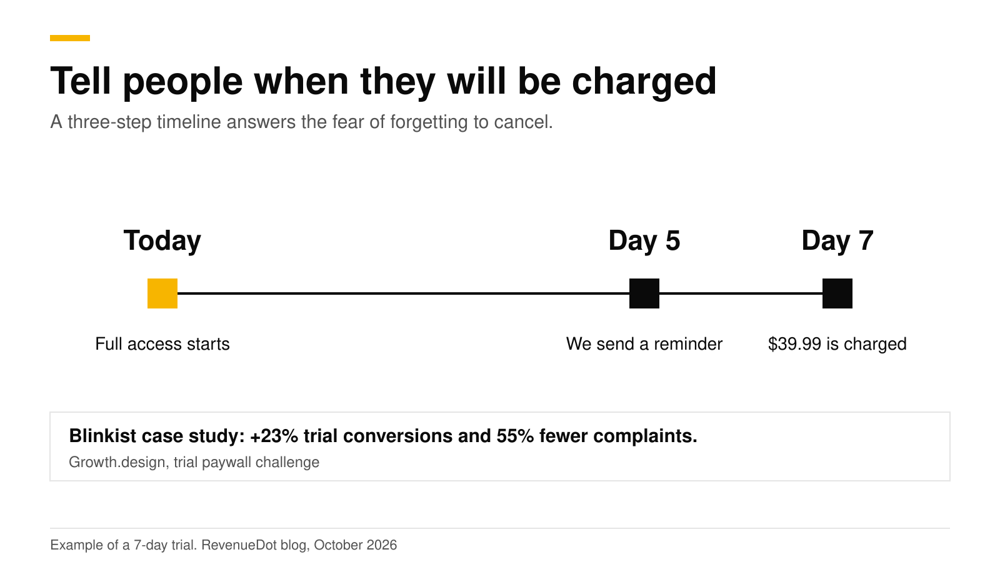
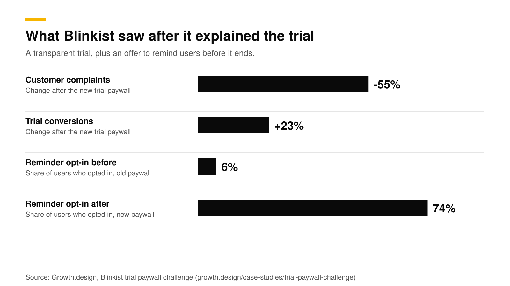
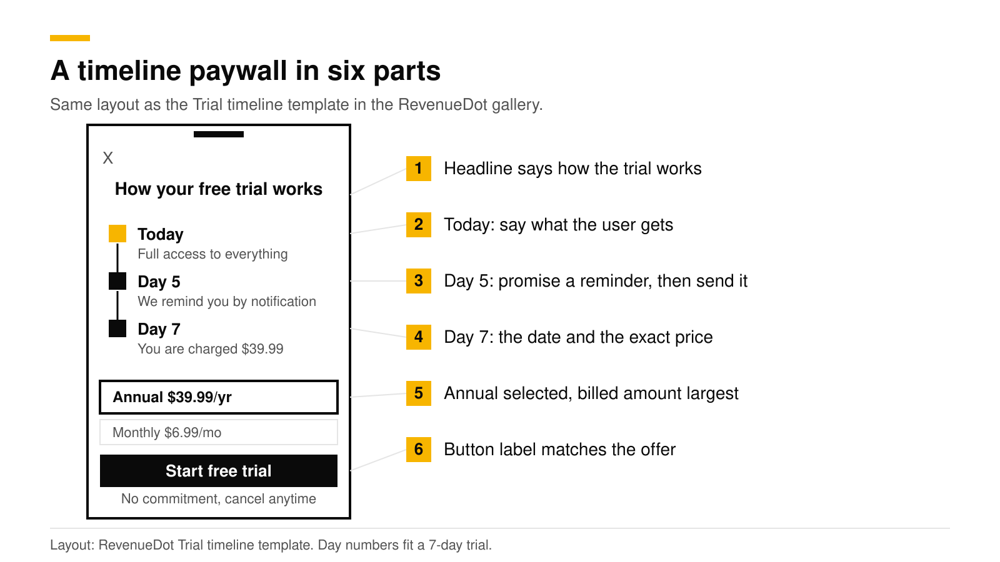

# Free trial timeline paywall: why it works and how to build it

A free trial timeline paywall lists, in three short steps, what happens today, when the reminder arrives and when the first charge lands. It works because it removes the user's biggest fear: forgetting to cancel and being charged. In Blinkist's case study, a transparent trial paywall raised trial conversions by 23% and cut complaints by 55%. Pepper reports a 50% lifetime value lift from a timeline paywall.

This post explains why the timeline works, what to write in each step, and how to build one. It is part of our [paywall best practices guide](paywall-best-practices-2026.md). All results below are the sources' own, checked in October 2026.

## Key numbers

- **+23% trial conversions and 55% fewer customer complaints** for Blinkist after it replaced feature messaging with trial transparency ([Growth.design](https://growth.design/case-studies/trial-paywall-challenge)).
- **Reminder opt-in rose from 6% to 74%** in the same test, because the paywall offered to notify users before the trial ended ([Growth.design](https://growth.design/case-studies/trial-paywall-challenge)).
- **+50% lifetime value** for Pepper's timeline paywall, which was tested on 5% of users first and then scaled to over half ([Superwall case study](https://superwall.com/case-studies/pepper)).
- **89.4% of trial starts happen on install day**, so the paywall in your first session decides most of your trial volume ([Adapty](https://adapty.io/blog/mobile-app-monetization-2026/)).
- **About 55% of cancellations on 3-day trials happen on day 0**, and trials shorter than 4 days convert to paid at about 25.5% ([RevenueCat 2025](https://revenuecat.com/state-of-subscription-apps-2025)).

## Why does a timeline lift trial starts?

Three reasons, all about trust.

1. **It names the fear.** Growth.design calls forgetting to cancel a trial and being charged the number one customer fear in the Blinkist case, and says the winning variant spoke to it instead of listing benefits. A timeline answers the fear before the user has to ask.
2. **It makes a promise the app can keep.** "We will remind you on day 5" is a commitment. When the app then asks for notification permission in the same moment, users can see the reason for the request. That is likely why opt-in went from 6% to 74% in Blinkist's test.
3. **It gives the charge a date.** A vague "then $39.99 per year" is easy to forget. "Day 7: you are charged $39.99" is a fact the user can plan around. People who start knowing the date are less likely to feel tricked, which fits the 55% drop in complaints.

This also fits the refund data. RevenueCat's 2025 report found that hard-paywall apps see more refunds than freemium apps (5.8% against 3.4%), and surprise at the first charge is one plausible cause. A clear timeline addresses it.

Be careful with the claim. Blinkist's variant also offered to remind users before the trial ended, so the lift comes from the whole package of transparency plus a reminder, not from the timeline graphic alone.

## What goes in each step of the timeline?

For a 7-day trial, use three steps.

| Step | What to write | Why |
|---|---|---|
| Today | "Full access to everything." Name what unlocks. | The user sees the value they get now. |
| Day 5 | "We remind you by notification." | Promises the reminder, and explains the permission prompt. |
| Day 7 | "You are charged $39.99. Cancel anytime before." Use the exact price and period. | Gives the charge a date and an amount. |

Rules that keep the timeline honest:

- **Use the real trial length.** For a 3-day trial the steps are Today, Day 2 reminder and Day 3 charge. Compute the dates from the product, not by hand.
- **Send the reminder you promise.** If the timeline says you will remind them, schedule it. A broken promise is worse than no timeline.
- **State the price once, in full.** Apple requires that the purchase flow for a free trial clearly say how long the trial lasts and the price billed after it ends ([Apple, subscriptions](https://developer.apple.com/app-store/subscriptions/)).
- **Keep the billed amount the largest price.** Per-week breakdowns and savings go below it, in smaller type (same Apple page).
- **Do not hide the trial behind a switch.** A free-trial on/off toggle gets iOS apps rejected under guideline 3.1.2. Attach the trial to a plan card instead. See [Apple's free-trial toggle rejection](apple-free-trial-toggle-rejection.md).

## How do you build a trial timeline paywall?

Follow these steps.

1. **Set up the trial in the store.** Create a subscription with a free introductory offer in App Store Connect or Google Play Console. Apple's guideline 3.1.2(a) lets auto-renewable subscriptions offer a free trial through App Store Connect, and the subscription period must last at least seven days ([Apple guidelines](https://developer.apple.com/app-store/review/guidelines/)).
2. **Write the headline.** "How your free trial works" is plain and tested. Put it at the top of the page, under a small close button.
3. **Add the three steps** with an icon each. Use the user's first name or goal if you have it from onboarding.
4. **Add two plan cards** with the trial plan selected and the billed amount largest. Put "No commitment, cancel anytime" under the button, and one disclosure line with the trial length and price.
5. **Make the button say what happens.** "Start free trial" for a trial plan, "Continue" otherwise. Keep the label the same as the selected plan's offer.
6. **Schedule the reminder.** Ask for notification permission on the page before this one or on this one, and send the notification on the date shown.
7. **Test it against your current paywall.** Pepper started with 5% of users and scaled once the timeline beat every other design it tested.

## Where does the timeline go in the flow?

Put it on the page where the user decides, next to the price. In a multi-page paywall, put it on the second page, after value and before plans. See [Multi-page paywalls](multi-page-paywalls.md). Lazyweb found that most onboarding flows show a generic screen right before the paywall, and recommends a value recap or plan reveal instead ([Lazyweb](https://www.lazyweb.com/research/what-screen-comes-right-before-the-onboarding-paywall)). The timeline works best after a [quiz and a plan reveal](onboarding-quiz-before-paywall.md).

## How to do this with RevenueDot

RevenueDot ships a **Trial timeline** template, built on this pattern.

1. Open **Paywalls** in the dashboard and pick **Trial timeline** from the template gallery.
2. Choose the offering, add your app name, an accent color, and your Terms and Privacy links, then select **Create paywall**.
3. Edit it in the visual editor. The Timeline component takes steps with an icon, a title and a description, and the plan cards are Package components with annual selected. Texts can use store variables such as `{{ product.price_per_period }}` and `{{ product.offer_period_with_unit }}`, so the price and trial length always match the store.
4. Check **Problems** above the preview. You cannot publish while it lists errors. Switch the intro-offer preview on to see the trial state.
5. Publish, and show it with `PaywallView()` on iOS or the matching call on Android, React Native and Flutter.
6. To test it, put the timeline paywall on one offering and your current paywall on another, then start an experiment. See [targeting and experiments](https://revenuedot.app/docs/guides/targeting-and-experiments) and [the paywalls guide](https://revenuedot.app/docs/guides/paywalls).

The timeline paywall is also the first template in the [paywalls feature page](https://revenuedot.app/features/paywalls) gallery. Track the result on the [trial conversion rate chart](https://revenuedot.app/charts/trial-conversion-rate). RevenueDot does not send the reminder notification for you. Your app schedules it. The open-source [Focus sample app](https://github.com/revenuedot/examples) shows a three-step timeline in its paywall.

[Start for free on RevenueDot Cloud](https://app.revenuedot.app/signup). Pro costs $0 until your apps make $10,000 a month.

## FAQ

### What is a free trial timeline paywall?

It is a paywall section that shows the trial as dated steps: today you get full access, on day 5 you get a reminder, and on day 7 you are charged. It tells users exactly when the first charge happens.

### Does a timeline paywall really increase conversions?

Two published cases say yes. Blinkist saw 23% more trial conversions and 55% fewer complaints, and Pepper saw 50% more lifetime value. Both are single-app results, so run your own test before you roll it out.

### How long should my free trial be?

RevenueCat's 2025 report found trials of 17 to 32 days had the highest median trial-to-paid conversion (45.7%), and trials under 4 days the lowest (about 25.5%). Longer trials need more reminders. Apple requires a subscription period of at least seven days, and a free trial is set up as an offer in App Store Connect.

### Can I send the reminder from RevenueDot?

The reminder is a notification your app schedules on the user's device. RevenueDot sends webhooks for purchases and renewals, which your own backend can use to send email reminders.

### Will Apple approve a timeline paywall?

A timeline is one of the compliant alternatives RevenueCat lists after Apple began rejecting trial toggles ([RevenueCat](https://www.revenuecat.com/blog/growth/rip-toggle-paywall)). Keep the trial on a plan, show the price and length clearly, and make the billed amount the biggest price.

**About RevenueDot.** RevenueDot is an open-source (AGPL-3.0) backend for in-app purchases and subscriptions that works with the RevenueCat SDK. Start for free on [RevenueDot Cloud](https://app.revenuedot.app/signup): Pro costs $0 until your apps make $10,000 a month, then 0.5% of revenue above $10,000, never more than $999 a month. Point the SDK's proxy URL at RevenueDot and keep your app code, your offerings and your customers. Read the [quickstart](../docs/getting-started/quickstart.md) or the code on [GitHub](https://github.com/revenuedot/revenuedot).
