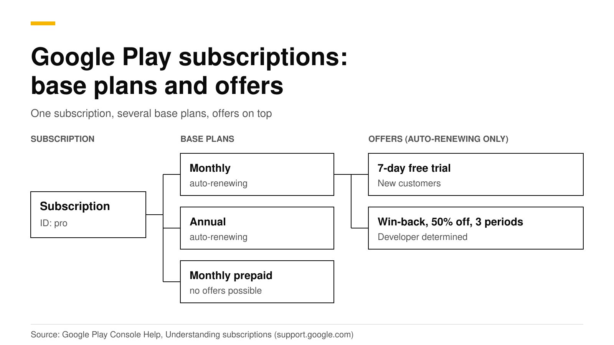
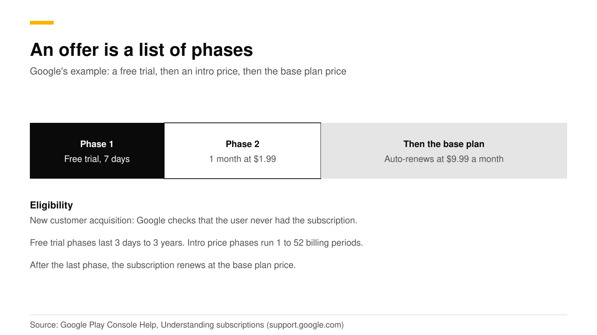

# Google Play base plans and offers explained for iOS developers

On Google Play, one subscription holds several base plans, and each base plan can have offers. A base plan sets the billing period, the renewal type and the price. An offer adds a free trial or a discount for customers who meet the eligibility rule you set. In code you do not buy a product ID. You buy a base plan or an offer through an offer token.

If you know iOS, think of the Play subscription as the thing your customer gets access to, a base plan as one of your iOS subscription products (monthly, annual), and an offer as an introductory, promotional or win-back offer. This post gives the full mapping, the rules, and the Kotlin and RevenueCat code. The sources are Google's Play Console and Android developer docs, checked in October 2026.



## The short answer

- **Three objects.** A subscription is a set of benefits. A base plan defines billing period, renewal type and price. An offer defines a discount for eligible users ([Google](https://support.google.com/googleplay/android-developer/answer/12154973)).
- **Many base plans per subscription.** For example monthly auto-renewing, monthly prepaid and annual auto-renewing (same source).
- **Offers only on auto-renewing base plans.** One base plan can have many offers (same source).
- **Three eligibility types.** New customer acquisition, upgrade, and developer determined (same source).
- **Limits.** Up to 250 base plans and offers per subscription, with at most 50 active at once (same source).
- **In code.** Read `ProductDetails.getSubscriptionOfferDetails()`, choose one, and pass its offer token to `launchBillingFlow` ([Android Developers](https://developer.android.com/google/play/billing/integrate)).

## How do Google Play subscriptions map to iOS?

| On iOS | On Google Play |
|---|---|
| Subscription group | One or more subscriptions. Tiers such as basic and premium are separate subscriptions |
| Subscription product (monthly, annual) | Base plan of a subscription |
| Introductory, promotional, win-back, offer code | Offer on a base plan |
| Product ID `pro_monthly` | Subscription ID plus base plan ID, such as `pro` and `monthly` |
| Level (upgrade, downgrade, crossgrade) | Replacement mode when switching. See [upgrades and downgrades](subscription-upgrades-downgrades.md) |
| Billing grace period | Grace period, then account hold. See [grace period and retry](billing-grace-period-and-retry.md) |

Google describes tiers such as 100 GB, 1 TB and 10 TB as separate subscriptions, and billing periods as separate base plans of one subscription ([Google](https://support.google.com/googleplay/android-developer/answer/12154973)). RevenueDot names a Google Play product `subscriptionId:basePlanId`, for example `pro:monthly` ([Google Play setup](https://revenuedot.app/docs/guides/google-play)).

## What is a base plan?

A base plan is the standard way to buy a subscription. Anyone can buy one. It has these fields, from [Google's help page](https://support.google.com/googleplay/android-developer/answer/12154973):

- **Billing period.** How long the entitlement lasts.
- **Renewal type.** Auto-renewing, prepaid (no automatic renewal, with top-ups) or installments. Installments are available only in Brazil, France, Italy and Spain.
- **Regional availability and price.** You set availability and price for each country or region.
- **Grace period and account hold.** What happens when a renewal payment fails.
- **Base plan and offer changes.** When to charge someone who switches to this base plan or one of its offers.
- **Resubscribe and tags.** A tag is an optional label of up to 20 characters that you can read in the API. You can add up to 20 tags.

You cannot delete subscriptions, base plans or offers, or reuse their IDs. A base plan or offer can be draft, inactive or active, and inactive ones keep serving existing subscribers ([Google](https://support.google.com/googleplay/android-developer/answer/12154973)).

## What is an offer?

An offer gives eligible users a lower price or a free period, and it is built from phases. A phase is either a free trial (3 days up to 3 years) or an introductory price. An introductory price can be an absolute amount, a fixed discount or a percentage discount, charged once or for 1 to 52 billing periods. After the last phase, the subscription renews at the base plan price ([Google](https://support.google.com/googleplay/android-developer/answer/12154973)).



RevenueCat adds that an offer can have up to two pricing phases ([RevenueCat](https://www.revenuecat.com/docs/subscription-guidance/subscription-offers/google-play-offers)).

Offers can only be created for auto-renewing base plans. They default to the base plan's regions, and you can pick a subset.

### Who is eligible for an offer?

Google evaluates two of the three eligibility types for you.

| Eligibility | Rule | Who decides |
|---|---|---|
| New customer acquisition | The user never had this subscription, or never had any subscription in the app | Google Play |
| Upgrade | The user has a subscription you name, and optionally a billing period. You can cap redemptions per user | Google Play |
| Developer determined | Your app decides, for example a second-chance trial or a win-back | Your app |

Because your app decides, a developer-determined offer cannot be bought outside the app. Google's own example is a win-back offer, 50% off for 3 months, tagged `WINBACK-50-OFF` ([Google](https://support.google.com/googleplay/android-developer/answer/12154973)).

Play also watches for people who try to get around trial rules. A customer who does not meet the criteria can still buy the base plan, without the trial or intro price.

## How do I buy a specific base plan or offer in code?

`queryProductDetailsAsync` returns subscription details with up to 50 offers the user is eligible for. If your app shows an offer that is out of date and the user picks it, Play tells them they are not eligible and lets them buy the base plan ([Android Developers](https://developer.android.com/google/play/billing/integrate)). Do not cache `ProductDetails`, because stale objects can make `launchBillingFlow` fail.

```kotlin
// productDetails comes from queryProductDetails(...), as in Google's integration guide.
val options = productDetails.subscriptionOfferDetails.orEmpty()

// offerId is null for the plain base plan and set for an offer.
val winback = options.firstOrNull { "WINBACK-50-OFF" in it.offerTags }
val basePlan = options.firstOrNull { it.offerId == null && it.basePlanId == "monthly" }
val chosen = winback ?: basePlan ?: return

val params = BillingFlowParams.newBuilder()
    .setProductDetailsParamsList(
        listOf(
            BillingFlowParams.ProductDetailsParams.newBuilder()
                .setProductDetails(productDetails)
                .setOfferToken(chosen.offerToken)
                .build()
        )
    )
    .build()
billingClient.launchBillingFlow(activity, params)
```

`getOfferTags`, `getOfferId`, `getBasePlanId` and `getOfferToken` are methods of `SubscriptionOfferDetails` ([Android Developers](https://developer.android.com/reference/com/android/billingclient/api/ProductDetails.SubscriptionOfferDetails)). Each pricing phase tells you the price, billing period and cycle count ([reference](https://developer.android.com/reference/com/android/billingclient/api/ProductDetails.PricingPhase)). Use them to show the customer the exact terms before they tap buy.

Google's pages also note that, by August 31, 2026, new apps and updates must use Play Billing Library 8 or later, and that an extension to November 1, 2026 can be requested ([Android Developers](https://developer.android.com/google/play/billing/subscriptions)). Check that your library is current.

## How does the RevenueCat SDK pick an offer?

If you pass a `Package` or `StoreProduct` to `PurchaseParams.Builder`, RevenueCat's Android SDK picks the offer for you in this order ([RevenueCat](https://www.revenuecat.com/docs/subscription-guidance/subscription-offers)):

1. The longest free trial the customer is eligible for.
2. If none, the cheapest introductory period they are eligible for.
3. If none, the base plan.

Two cautions from the same page. Developer-determined offers count in that automatic choice, so tag any offer you never want applied automatically with `rc-ignore-offer`. And `subscriptionOptions` holds only the offers this customer is eligible for. To choose by hand:

```kotlin
val basePlan = storeProduct.subscriptionOptions?.basePlan
val freeTrial = storeProduct.subscriptionOptions?.freeTrial
val lapsed = storeProduct.subscriptionOptions?.withTag("lapsed-customers")?.firstOrNull()

lapsed?.let {
    Purchases.sharedInstance.purchaseWith(
        PurchaseParams.Builder(activity, it).build(),
        onError = { error, userCancelled -> /* handle */ },
        onSuccess = { transaction, customerInfo -> /* grant access */ }
    )
}
```

## Do it with RevenueDot

RevenueDot works with the same RevenueCat SDK calls, so the code above does not change. The server side adds three things:

- **Products.** Create each Play product with `store_identifier` `subscriptionId:basePlanId`. A bare subscription ID such as `pro` matches every base plan of that subscription ([Android tutorial](android-google-play-billing-subscriptions.md)).
- **Offer records.** Each period stores its offer: a free-trial phase gets `offer_type: free_trial`, an introductory phase `introductory`, and a later period of an offer `unspecified`. `offer_code` holds the Google offer ID in webhooks and exports ([offer table](https://revenuedot.app/docs/guides/win-back-offers)).
- **Notifications.** Real-time developer notifications make RevenueDot read the purchase again from the Play Developer API, so a trial converting or an offer ending shows up as a renewal event ([subscription lifecycle](https://revenuedot.app/docs/concepts/subscriptions-and-events)).

You create base plans and offers in Play Console. RevenueDot's `create_in_store` call makes only the subscription and one listing, and leaves base plans and prices to the console. Google Play has no separate win-back type, so build one as a developer-determined offer and tag it.

[Start free on RevenueDot Cloud](https://app.revenuedot.app/signup) (free up to $10,000 monthly tracked revenue). See also the [Google Play store page](https://revenuedot.app/stores/google-play), the [Android SDK guide](https://revenuedot.app/sdks/android) and our [Android billing tutorial](android-google-play-billing-subscriptions.md).

## FAQ

### Can one Google Play subscription have monthly and annual prices?

Yes. Make a base plan for each billing period. Google's example subscription has a monthly auto-renewing plan, a monthly prepaid plan and an annual auto-renewing plan ([Google](https://support.google.com/googleplay/android-developer/answer/12154973)).

### What happens if a user is not eligible for the offer I show?

Play tells them they are not eligible and lets them buy the base plan instead. Refresh the product details so your paywall shows only offers that user can get ([Android Developers](https://developer.android.com/google/play/billing/integrate)).

### Can I delete an offer or base plan?

No. You can deactivate it. Existing subscribers keep going until they cancel, and IDs cannot be reused ([Google](https://support.google.com/googleplay/android-developer/answer/12154973)).

### How do I give a free trial to new subscribers only?

Create an offer on an auto-renewing base plan with the eligibility "New customer acquisition", one free trial phase and the regions you want. Choose whether "new" means never had this subscription or never had any subscription in the app ([Google](https://support.google.com/googleplay/android-developer/answer/12154973)).

### Does a free trial on Google Play work like Apple's?

The idea is the same, but Play models it as an offer phase of 3 days to 3 years, and eligibility is part of the offer. On Apple, the introductory offer is a separate object and each customer gets one per subscription group ([Apple](https://developer.apple.com/app-store/subscriptions/)).

**About RevenueDot.** RevenueDot is an open-source (AGPL-3.0) backend for in-app purchases and subscriptions on the App Store, Google Play and the web. Start free on [RevenueDot Cloud](https://app.revenuedot.app/signup): free up to $10,000 in monthly tracked revenue, then 0.5%, never more than $999 a month. New apps install the [RevenueDot SDK](../docs/sdks/README.md) and pass their key. Apps that ship the RevenueCat SDK point its proxy URL at RevenueDot and keep their code, offerings and customers. Read the [quickstart](../docs/getting-started/quickstart.md) or the code on [GitHub](https://github.com/revenuedot/revenuedot).
