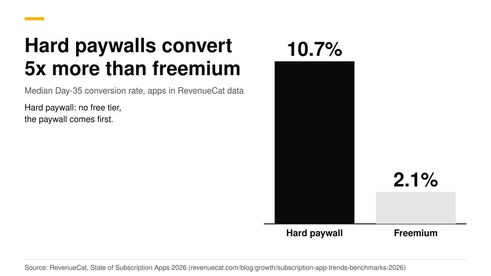
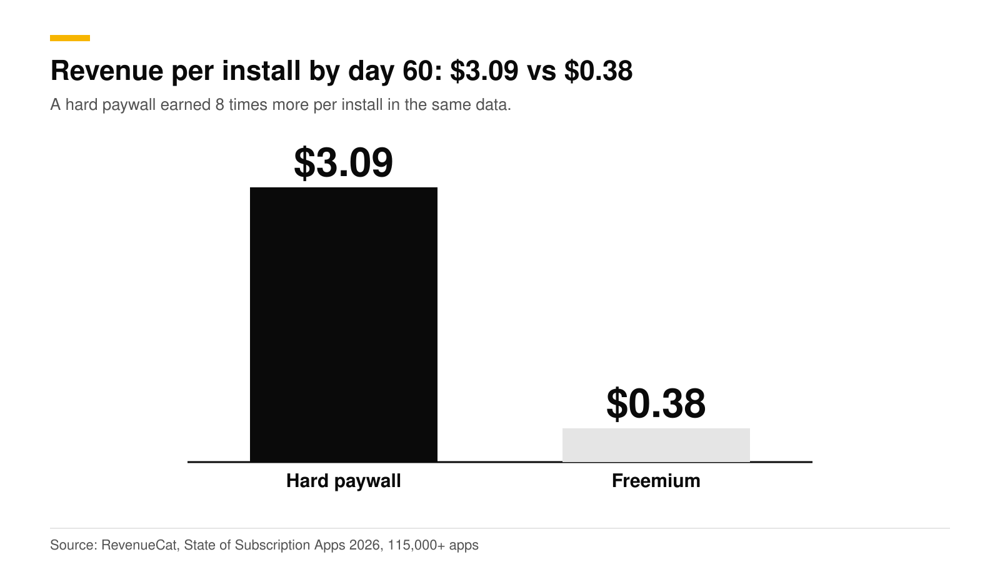
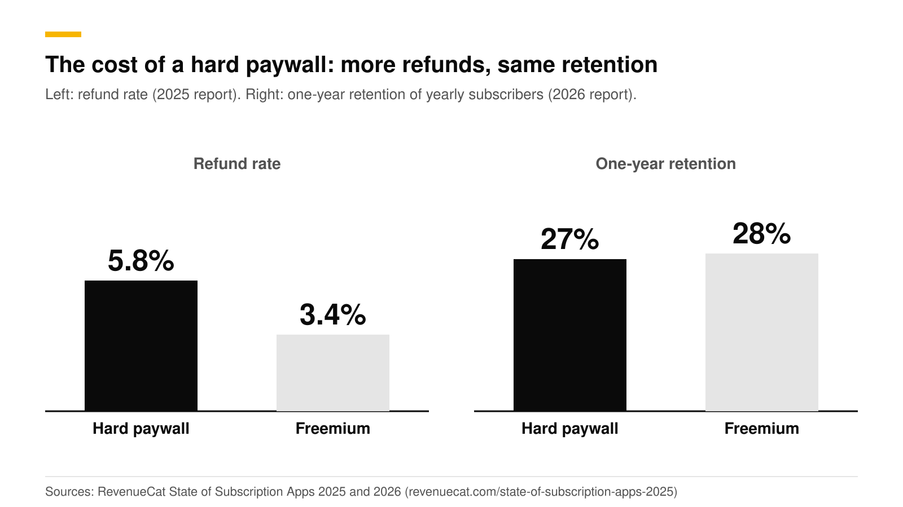

# Hard paywall vs freemium: conversion and revenue data

Hard paywalls convert about five times more users than freemium. RevenueCat's 2026 report puts the median Day-35 conversion rate at 10.7% for hard-paywall apps and 2.1% for freemium apps, and revenue per install at day 60 at $3.09 against $0.38. One-year retention of yearly subscribers is nearly the same, at 27% and 28%. Hard paywalls pay for that lead with more refunds.

This post lays out the data, the trade-offs, and a way to choose. It is one part of our [paywall best practices guide](paywall-best-practices-2026.md). The numbers are RevenueCat's, checked in October 2026.

## The short answer

- **Conversion:** 10.7% for hard paywalls against 2.1% for freemium, as median Day-35 conversion in RevenueCat's 2026 data. RevenueCat states it as trial-to-paid conversion ([RevenueCat 2026](https://www.revenuecat.com/blog/growth/subscription-app-trends-benchmarks-2026)).
- **Revenue per install at day 60:** $3.09 against $0.38, which is 8 times more (same source).
- **Retention:** 27% of yearly subscribers on hard-paywall apps were still subscribed after one year, against 28% on freemium apps. RevenueCat calls the gap statistically negligible (same source).
- **Refunds:** the 2025 edition of the report found a 5.8% refund rate for hard paywalls against 3.4% for freemium ([RevenueCat 2025](https://revenuecat.com/state-of-subscription-apps-2025)).
- **Scale:** the 2026 report covers over 115,000 apps and more than $16 billion in revenue.

The 2025 edition measured the same comparison as 12.11% against 2.18% by Day 35. The two reports differ by about a point on the hard-paywall side, so treat "about 5 times" as the stable finding and the exact percentages as approximate.

## What is a hard paywall, and what is freemium?

A **hard paywall** asks for a subscription or trial before the user gets the core of the app. There is no free tier, or the free tier is only the onboarding. Apps that use this model typically show the paywall at the end of onboarding.

**Freemium** lets the user keep using a free version, and asks them to upgrade later, usually when they hit a limit or want a premium feature.

There are shades between them. A **soft paywall** shows the paywall during onboarding but lets the user close it and continue with limits. A **metered** model gives a free allowance, such as three scans a day, and then asks for payment. The RevenueCat data compares the two ends.

## How much more does a hard paywall earn?

Per install, a hard paywall earned $3.09 by day 60 in RevenueCat's data, against $0.38 for freemium. This is the number that matters for paid acquisition. If you pay $2 for an install, a $3.09 return by day 60 can work, and $0.38 cannot.

Two things make the gap bigger than the conversion gap alone. First, hard-paywall apps put the offer in front of every new user, so the trial rate is high. Second, Adapty reports that 89.4% of trial starts happen on install day ([Adapty 2026](https://adapty.io/blog/mobile-app-monetization-2026/)), and RevenueCat's 2025 report puts it at 82%. A freemium app that waits for a later upgrade moment misses most of its trial starts.

## What does a hard paywall cost?

| Measure | Hard paywall | Freemium | Source |
|---|---|---|---|
| Median Day-35 conversion | 10.7% | 2.1% | [RevenueCat 2026](https://www.revenuecat.com/blog/growth/subscription-app-trends-benchmarks-2026) |
| Revenue per install, day 60 | $3.09 | $0.38 | [RevenueCat 2026](https://www.revenuecat.com/blog/growth/subscription-app-trends-benchmarks-2026) |
| One-year retention of yearly subscribers | 27% | 28% | [RevenueCat 2026](https://www.revenuecat.com/blog/growth/subscription-app-trends-benchmarks-2026) |
| Refund rate | 5.8% | 3.4% | [RevenueCat 2025](https://revenuecat.com/state-of-subscription-apps-2025) |

The cost is refunds, not churn. Users who pay before they have seen much of the app ask for their money back more often. That points to two fixes: show the trial terms clearly so no one is surprised by the charge (see [the free trial timeline paywall](free-trial-timeline-paywall.md)), and make the first session deliver value fast. The [onboarding quiz](onboarding-quiz-before-paywall.md) helps with both, since it shows the user a plan built from their answers before they pay.

## When is freemium still the better choice?

The data is a median across many apps. Freemium can still win in four cases:

1. **Your growth comes from the free tier.** If free users invite others, share output, or create content that brings in new users, the free tier is a marketing channel.
2. **Value takes weeks to show.** A tool that needs data, a team or a habit to become useful will lose users on a paywall they have no reason to trust yet.
3. **You have network effects.** A chat or collaboration app is worth little with few users.
4. **Your category is not a subscription category.** Adapty found that trials and weekly plans behave differently by category. In its data, Education apps had only 71.3% of trials start on install day, while Entertainment had 94.5% ([Adapty state of subscriptions](https://adapty.io/state-of-in-app-subscriptions/)). A category with slower decisions suits a longer free path.

If none of these fit, a hard paywall after a personalized quiz is the stronger default. Use a soft version of it (a visible close button and a limited free mode) if you are unsure, and move to hard once you see the data.

## How do you decide for your app?

Use a four-step test.

1. **Write down your cost per install and your target payback time.** If you buy installs, a $3.09-per-install outcome and a $0.38 outcome lead to very different ad budgets.
2. **List what a user gets in the first five minutes.** If there is a clear result (a plan, a scan, an edit), show the paywall right after it. If there is no result yet, a hard paywall is risky.
3. **Run both.** Create two offerings, one with a hard paywall at the end of onboarding and one with a soft paywall, and split new users between them. Wait for enough customers in each variant, at least 100 per variant before you read the result.
4. **Judge by revenue per new user over 30 to 60 days, not trial starts.** A hard paywall that lifts trial starts but doubles refunds can still lose.

## How to do this with RevenueDot

RevenueDot lets you run this test without an app release.

1. Create two offerings, for example `hard` and `soft`, in the dashboard. See [targeting and experiments](https://revenuedot.app/docs/guides/targeting-and-experiments).
2. Build a paywall for each from the [paywalls gallery](https://revenuedot.app/docs/guides/paywalls). Use the Trial timeline template for the hard offering, so the trial is clear. Publish both.
3. Open **Experiments**, select **New experiment**, pick the two offerings and the share of customers to enroll, then **Start**. Customers keep the same variant for as long as the experiment runs.
4. Read **Results**: customers per variant, conversions, trials, revenue, revenue per customer and the chance the treatment converts better. Wait for at least 100 customers in each variant.
5. Watch the outcome on the [paywall conversion chart](https://revenuedot.app/charts/paywall-conversion-rate) and the [trial conversion rate chart](https://revenuedot.app/charts/trial-conversion-rate). See also the [experiments feature page](https://revenuedot.app/features/experiments) and the [paywalls feature page](https://revenuedot.app/features/paywalls).

Experiments compare two offerings at a time. Experiment results show conversions, trials and revenue, so check refunds in your store reports before you call a winner.

[Start for free on RevenueDot Cloud](https://app.revenuedot.app/signup). Pro costs $0 until your apps make $10,000 a month.

## FAQ

### What conversion rate should a hard paywall get?

RevenueCat's 2026 median is 10.7% by Day 35, and the 2025 report's median was 12.11%. Your category changes the number. Use these as a rough yardstick and measure your own baseline first.

### Does a hard paywall hurt retention?

In RevenueCat's data, no. One-year retention of yearly subscribers was 27% for hard-paywall apps and 28% for freemium apps, a gap RevenueCat calls statistically negligible. Refunds are the cost: 5.8% against 3.4% in the 2025 report.

### Is a hard paywall allowed on the App Store?

Yes. Apple's guidelines let apps charge for access and offer a free trial. They require that you clearly describe what the user gets for the price before asking them to subscribe (guideline 3.1.2(c)), and that the subscription lasts at least seven days (3.1.2(a)) ([Apple](https://developer.apple.com/app-store/review/guidelines/)). See [Apple's free-trial toggle rejection](apple-free-trial-toggle-rejection.md) for what to avoid.

### Can I start freemium and move to a hard paywall later?

Yes, and an experiment is the safe way to do it. Send a share of new users to the hard-paywall offering, compare revenue per customer, and widen the share if it wins. Existing free users should keep what they already have.

### Which is better for a new app with no data?

Start with a hard paywall after a short quiz if the app gives a clear result in the first session. Otherwise start soft. Either way, test, because the medians above hide wide differences between categories.

**About RevenueDot.** RevenueDot is an open-source (AGPL-3.0) backend for in-app purchases and subscriptions on the App Store, Google Play and the web. Start for free on [RevenueDot Cloud](https://app.revenuedot.app/signup): Pro costs $0 until your apps make $10,000 a month, then 0.5% of revenue above $10,000, never more than $999 a month. New apps install the [RevenueDot SDK](../docs/sdks/README.md) and pass their key. Apps that ship the RevenueCat SDK point its proxy URL at RevenueDot and keep their code, offerings and customers. Read the [quickstart](../docs/getting-started/quickstart.md) or the code on [GitHub](https://github.com/revenuedot/revenuedot).
