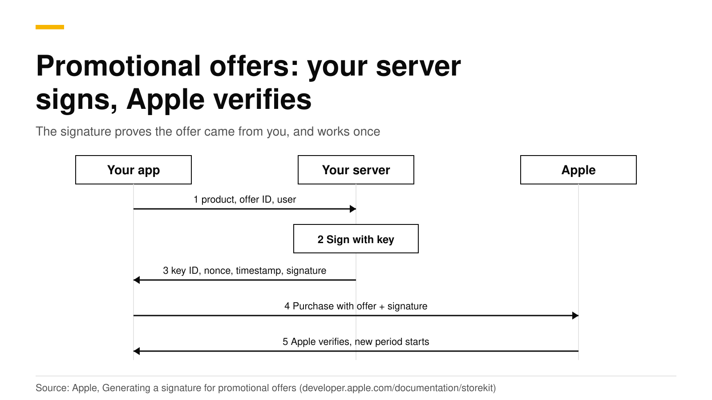
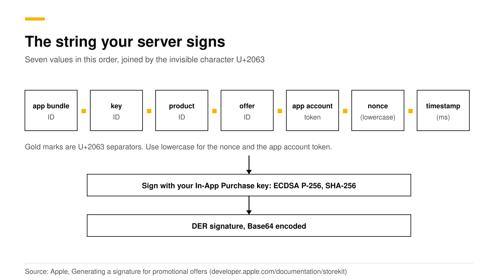

# iOS promotional offers: how the signature works and how to sign

A promotional offer is a discount your app shows to someone who has subscribed before. Apple only accepts it if your server signs it with your In-App Purchase key. Your server joins seven values into one string, signs it with ECDSA and SHA-256, and returns the signature with a key ID, a nonce and a timestamp. The app attaches those to the purchase, and Apple checks them.

RevenueDot does the signing for you. When the RevenueCat SDK asks for an offer, RevenueDot signs it with the app's In-App Purchase key. This post shows what is inside the signature, so you can sign it yourself or debug a failure. Sources are Apple and RevenueCat docs, checked in October 2026.



## The short answer

- **Why a signature.** Your server holds a private key that never ships in the app. The signature proves the offer came from you ([Apple](https://developer.apple.com/documentation/storekit/setting-up-promotional-offers)).
- **What is signed.** App bundle ID, key ID, product ID, offer ID, app account token, nonce and timestamp, joined with the invisible character U+2063 ([Apple](https://developer.apple.com/documentation/storekit/generating-a-signature-for-promotional-offers)).
- **How.** Sign with your PKCS #8 private key using ECDSA with SHA-256. The result is DER-formatted. Encode it as Base64 (same source).
- **One use only.** Each payload, signature and nonce is valid for one buy request, even if that purchase fails (same source).
- **Who qualifies.** Apple treats anyone with an existing or expired subscription in the app as eligible. Your own rules narrow that down ([Apple](https://developer.apple.com/documentation/storekit/implementing-promotional-offers-in-your-app)).

## Which offer needs a signature?

Only promotional offers do. RevenueCat's iOS offers guide lists the four types and which ones need your In-App Purchase key ([RevenueCat](https://www.revenuecat.com/docs/subscription-guidance/subscription-offers/ios-subscription-offers)). The "Signature" column below is our reading of how each type is purchased.

| Offer type | Who gets it | Signature from your server |
|---|---|---|
| Introductory offer | New subscribers, applied by Apple | No |
| Promotional offer | Existing and lapsed subscribers, chosen by your app | Yes |
| Offer code | New and existing subscribers who hold a code | No. See [offer codes](ios-subscription-offer-codes.md) |
| Win-back offer | Lapsed subscribers on iOS 18 and later | No. See [RevenueDot's win-back guide](https://revenuedot.app/docs/guides/win-back-offers) |

Apple lets you have up to 10 active promotional offers per subscription. The offer can be pay as you go, pay up front or free. You cannot limit it to some countries. After you create it, you can edit only the price ([Apple](https://developer.apple.com/help/app-store-connect/manage-subscriptions/set-up-promotional-offers-for-auto-renewable-subscriptions)).

## Step 1: Generate the In-App Purchase key

Create the key in App Store Connect under **Users and Access, Integrations, In-App Purchase**. Apple says the key does not expire and works for any app in your account. You can download the private half only once, so store it somewhere safe. Never put it in your app, a code repository or any client-side code ([Apple](https://developer.apple.com/documentation/storekit/setting-up-promotional-offers)).

## Step 2: Build and sign the string

Combine these values in this order with the character `⁣` between them. Use lowercase for the nonce and the app account token ([Apple](https://developer.apple.com/documentation/storekit/generating-a-signature-for-promotional-offers)).



Here is a Node.js version of the steps. Node's `createSign` returns a DER-encoded ECDSA signature for an EC key, which is the format Apple wants.

```js
import { createSign, randomUUID } from "node:crypto";
import { readFileSync } from "node:fs";

const KEY_ID = "ABC123DEFG"; // the In-App Purchase key's ID
const PRIVATE_KEY = readFileSync("AuthKey_ABC123DEFG.p8", "utf8");

export function signOffer({ bundleId, productId, offerId, appAccountToken = "" }) {
  const nonce = randomUUID().toLowerCase();
  const timestamp = Date.now(); // UNIX time in milliseconds
  const payload = [
    bundleId, KEY_ID, productId, offerId,
    appAccountToken.toLowerCase(), nonce, timestamp,
  ].join("⁣");
  const signature = createSign("SHA256").update(payload).sign(PRIVATE_KEY, "base64");
  return { keyIdentifier: KEY_ID, nonce, timestamp, signature };
}
```

Apple suggests checking your signatures with the public half of the key. You can make it with `openssl ec -in AuthKey_ABC123DEFG.p8 -pubout -out public_key.pem`.

## Step 3: Return the values and buy in the app

Your endpoint answers with the signature, the nonce, the timestamp and the key ID, over HTTPS. Apple's advice is to sign when you display the offer, to keep the delay short ([Apple](https://developer.apple.com/documentation/storekit/implementing-promotional-offers-in-your-app)). In StoreKit 2, the app passes them as a purchase option:

```swift
let option = Product.PurchaseOption.promotionalOffer(
    offerID: "winback_half_price",   // the offer identifier from App Store Connect
    keyID: keyIdentifier,
    nonce: nonce,                    // UUID
    signature: signatureData,        // the Base64 string decoded to Data
    timestamp: timestamp             // Int, milliseconds
)
let result = try await product.purchase(options: [option])
```

The `nonce` must be lowercase. If you also set `appAccountToken(_:)` on the purchase, the same value must go into the signature ([Apple](https://developer.apple.com/documentation/storekit/product/purchaseoption/promotionaloffer%28offerid:keyid:nonce:signature:timestamp:%29)). If Apple finds that the signature does not match the payment, the transaction fails. StoreKit 2 also has a variant that takes a compact JWS signature, `promotionalOffer(_:compactJWS:)`. This post covers the classic signature.

## How does the RevenueCat SDK do this?

With RevenueCat's SDK you write no signing code. You ask for the offer, and the SDK calls your backend. RevenueCat's guide shows the calls ([RevenueCat](https://www.revenuecat.com/docs/subscription-guidance/subscription-offers/ios-subscription-offers)):

```swift
// Use the Promotional Offer Product Code from App Store Connect.
if let discount = package.storeProduct.discounts.first(where: {
    $0.offerIdentifier == "winback_half_price"
}) {
    let promoOffer = try await Purchases.shared.promotionalOffer(
        forProductDiscount: discount,
        product: package.storeProduct
    )
    // Show the offer's terms, then buy:
    Purchases.shared.purchase(package: package, promotionalOffer: promoOffer) {
        transaction, customerInfo, error, userCancelled in
        // Check customerInfo.entitlements as usual.
    }
}
```

RevenueCat's guide says to match on the offer's product code, not its reference name. It also says Apple enforces the existing-or-lapsed rule, so a customer who does not qualify sees the regular price.

## Do it with RevenueDot

The SDK's call goes to `POST /v1/offers` on your RevenueDot server. RevenueDot signs the offer with the app's In-App Purchase key, the same key it uses to read subscription history from Apple, and returns the key ID, nonce, timestamp and signature in the SDK's response format. The steps:

1. Add the In-App Purchase key to the app in the dashboard ([App Store guide](https://revenuedot.app/docs/guides/app-store)).
2. Create the promotional offer in App Store Connect.
3. Use the code above. Keep the proxy URL pointed at RevenueDot.

A trimmed version of the request the SDK sends looks like this. You never have to make it yourself.

```bash
curl -s https://api.revenuedot.app/v1/offers \
  -H "Authorization: Bearer $APPL_PUBLIC_KEY" \
  -H "X-StoreKit-Version: 2" -H "Content-Type: application/json" \
  -d '{"app_user_id":"user_1","generate_offers":[{"offer_id":"winback_half_price","product_id":"pro_monthly"}]}'
# {"offers":[{"key_id":"ABC123DEFG","offer_id":"winback_half_price","product_id":"pro_monthly",
#   "signature_data":{"nonce":"...","signature":"...","timestamp":1790800914034}}]}
```

Details that matter:

- **The app account token.** RevenueDot signs the app user ID as the token when it is a UUID, and an empty token otherwise. That matches what the SDK puts on the StoreKit 2 payment.
- **No key, no signature.** Without an In-App Purchase key, RevenueDot answers with error code 7234, and only that offer fails. A Test Store key gets the same answer.
- **Where it is used.** The Customer Center's cancellation and refund offers use the same signing ([retention guide](https://revenuedot.app/docs/guides/retention)).
- **What it records.** A promotional redemption arrives as a period with `offer_type: promotional`, and `offer_code` holds the offer identifier.

Status today: the signature format is checked by contract tests that verify it with the key's public half, and no promotional offer has been redeemed on a real device against RevenueDot yet. Run one sandbox purchase before you ship ([sandbox testing](sandbox-testing-in-app-purchases.md)).

[Start for free on RevenueDot Cloud](https://app.revenuedot.app/signup). Pro costs $0 until your apps make $10,000 a month. See the [App Store store page](https://revenuedot.app/stores/app-store), [win-back feature page](https://revenuedot.app/features/win-back) and [iOS SDK guide](https://revenuedot.app/sdks/ios).

## FAQ

### Why does my promotional offer purchase fail?

Apple fails the transaction when the signature does not match the payment. Check that the bundle ID, key ID, product ID and offer ID are exact, that the nonce and token are lowercase, that you did not reuse a nonce, and that the app account token you signed is the one you set on the purchase. After a failure you need a new signature ([Apple](https://developer.apple.com/documentation/storekit/implementing-promotional-offers-in-your-app)).

### Do I need a server to sign promotional offers?

Yes. The private key must never be in the app, so a server or a service such as RevenueDot has to sign each offer ([Apple](https://developer.apple.com/documentation/storekit/setting-up-promotional-offers)).

### How do I decide who is eligible?

Apple covers the basic rule: the customer must have an existing or expired subscription. You add the rest. Apple suggests using the `DID_CHANGE_RENEWAL_STATUS` server notification, which fires when auto-renew changes, to find customers who may be about to leave ([Apple](https://developer.apple.com/documentation/storekit/implementing-promotional-offers-in-your-app)).

### How many promotional offers can one subscription have?

Up to 10 active at once ([Apple](https://developer.apple.com/help/app-store-connect/manage-subscriptions/set-up-promotional-offers-for-auto-renewable-subscriptions)).

### Is a promotional offer the same as a win-back offer?

No. A win-back offer is for lapsed subscribers on iOS 18 and later, Apple shows it in several places, and it needs no signature. A promotional offer is shown by your app and needs one ([RevenueDot](https://revenuedot.app/docs/guides/win-back-offers)).

**About RevenueDot.** RevenueDot is an open-source (AGPL-3.0) backend for in-app purchases and subscriptions that works with the RevenueCat SDK. Start for free on [RevenueDot Cloud](https://app.revenuedot.app/signup): Pro costs $0 until your apps make $10,000 a month, then 0.5% of revenue above $10,000, never more than $999 a month. Point the SDK's proxy URL at RevenueDot and keep your app code, your offerings and your customers. Read the [quickstart](../docs/getting-started/quickstart.md) or the code on [GitHub](https://github.com/revenuedot/revenuedot).
