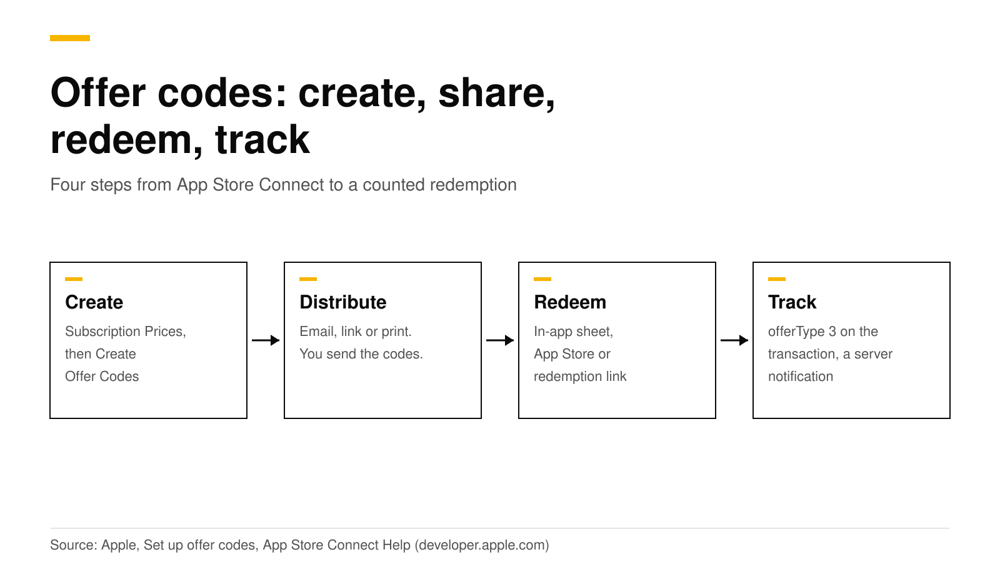
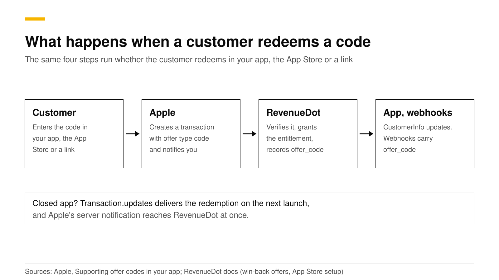

# iOS subscription offer codes: create, redeem and track

An offer code is a code you create in App Store Connect that gives a customer a free or discounted subscription for a set time. You create it, send it by email, link or print, and the customer redeems it in the App Store or in a sheet inside your app. Apple sends your server a notification, and the transaction carries the offer type "code" so you can count it.

This post walks through all four steps with the Swift code, the limits Apple sets, and how a backend such as RevenueDot records each redemption. Every Apple and RevenueCat fact links its source and was checked in October 2026.



## The short answer

- **Two production code types.** One-time-use codes are unique and each works once. Custom codes are a word you choose, such as `SPRINGPROMO`, with a redemption limit you set ([Apple](https://developer.apple.com/help/app-store-connect/manage-subscriptions/set-up-offer-codes)).
- **Limits.** Each app can have up to 1,000,000 codes per quarter, shared across all its subscriptions. Codes expire after six months at most ([Apple](https://developer.apple.com/help/app-store-connect/manage-subscriptions/set-up-offer-codes)).
- **Offer types.** Free, pay as you go or pay up front, for new, existing or expired subscribers, as you choose (same source).
- **Redeem.** Customers use a redemption link, the App Store's code entry, or your in-app sheet. In SwiftUI that is `offerCodeRedemption`, in UIKit `presentOfferCodeRedeemSheet` ([Apple](https://developer.apple.com/documentation/storekit/supporting-offer-codes-in-your-app)).
- **Track.** In the app, `transaction.offer?.type == .code`. On your server, `offerType` is `3` and the notification type is `OFFER_REDEEMED`, `SUBSCRIBED` or `ONE_TIME_CHARGE` (same Apple page).

## Which type of offer code should I use?

Apple lets you pick per offer. The choice depends on how many people you will reach and how tightly you want to control access.

| | One-time-use codes | Custom codes |
|---|---|---|
| What it looks like | Unique codes, one per person | One word you choose, up to 64 characters |
| Batch size | 500 to 25,000 per batch | Redemption limit up to 25,000 per batch |
| Expiry | Six months at most | Optional, six months at most when set |
| Each customer can redeem | One code per offer | One code per offer |
| Best for | Small campaigns, restricted access | Large campaigns, mass distribution |

Source for the table: [Apple, Set up offer codes](https://developer.apple.com/help/app-store-connect/manage-subscriptions/set-up-offer-codes). You can make more than one batch for the same offer. Custom codes cannot be edited after you create them, and a custom code cannot be shared between two offers for the same app unless you deactivate it first.

## How do I create an offer code in App Store Connect?

Use an account with the Account Holder, Admin, App Manager or Marketing role. Apple's [offer code guide](https://developer.apple.com/help/app-store-connect/manage-subscriptions/set-up-offer-codes) gives the full steps. The short version:

1. Open your app, then **Subscriptions**, choose the group and the subscription.
2. In **Subscription Prices**, click **+** and choose **Create Offer Codes**.
3. Enter a reference name. You will see it again in Sales and Trends reports and in StoreKit transactions.
4. Pick who is eligible: **new subscribers** (never subscribed in the group), **existing subscribers** (including those in billing retry or a grace period while auto-renew is on) and **expired subscribers**. You can tick more than one.
5. If the subscription has an introductory offer, choose whether code redeemers also get it first.
6. Choose countries, then **Pay as you go**, **Pay up front** or **Free**, the duration and the price.
7. Click **Confirm**. You cannot edit an offer afterward. Create a new one to change eligibility.
8. Open **View all Subscription Pricing**, then **Offer Codes**, select the offer, and click **Create One-Time Use Codes** or **Create Custom Codes**. Codes can take up to an hour before customers can redeem them, and your app must be in the Ready for Sale state.

A "Free" offer has one extra choice. If you tick the box that stops the subscription from renewing at the end of the offer, the customer gets a commitment-free trial.

Apple also warns that existing subscribers can only redeem codes that upgrade them or keep them at the same level of their subscription group ([Apple, subscriptions](https://developer.apple.com/app-store/subscriptions/)). The redemption sheet rejects codes that would cause a downgrade ([Apple](https://developer.apple.com/documentation/storekit/supporting-offer-codes-in-your-app)).

## How do I distribute offer codes?

Apple does not send the codes for you. You download the one-time-use codes as a CSV file from App Store Connect and send them through your own channels: email, a printed card, a partner, or a support reply. Apple lists ideas such as a win-back email, event flyers, a referral program, and a code for a customer with a support problem ([Apple](https://developer.apple.com/app-store/subscriptions/)).

You can also build a redemption link. For one-time-use codes, copy the example link from the offer's detail page and add the code to the end. The downloaded file already includes these links. RevenueCat documents the format as `https://apps.apple.com/redeem?ctx=offercodes&id={apple_app_id}&code={code}`, where the ID is your Apple app ID from App Information ([RevenueCat](https://www.revenuecat.com/docs/subscription-guidance/subscription-offers/ios-subscription-offers)). Someone who has not installed your app is asked to download it first.

## How do I let customers redeem a code inside my app?

Show Apple's redemption sheet from a button. Apple says customers can redeem only through this sheet, so do not build your own code field ([Apple](https://developer.apple.com/documentation/swiftui/view/offercoderedemption%28options:ispresented:oncompletion:%29)).

```swift
import SwiftUI
import StoreKit

struct RedeemButton: View {
    @State private var showSheet = false

    var body: some View {
        Button("Redeem a code") { showSheet = true }
            .offerCodeRedemption(options: [], isPresented: $showSheet) { result in
                // On success the result holds the verified transaction.
                // Grant access, then call finish() on the transaction.
            }
    }
}
```

With RevenueCat's SDK, one call shows the same sheet:

```swift
Purchases.shared.presentCodeRedemptionSheet()
```

RevenueCat says Apple's sheet gives no callback and that the SDK picks up the new transaction and refreshes `CustomerInfo`, so listen for customer info updates. It also reports that the sheet has been unstable, for example not dismissing after a redemption, and suggests redirecting to the redemption URL as a fallback. If you redirect, call `syncPurchases` when the customer returns ([RevenueCat](https://www.revenuecat.com/docs/subscription-guidance/subscription-offers/ios-subscription-offers)).

## What about codes redeemed outside my app?

Many customers will redeem in the App Store or from a link. Your app must listen for transactions from the moment it launches, or it will miss them. Apple's `Transaction.updates` sequence delivers offer code redemptions, Ask to Buy approvals and purchases made on other devices ([Apple](https://developer.apple.com/documentation/storekit/transaction/updates)).

```swift
Task(priority: .background) {
    for await result in Transaction.updates {
        guard case .verified(let transaction) = result else { continue }
        if transaction.offer?.type == .code {
            // A redeemed offer code. transaction.offer?.id is the offer identifier.
        }
        await transaction.finish()
    }
}
```

At launch, also read `Transaction.currentEntitlements` and `Transaction.unfinished` to catch anything that happened while the app was closed ([Apple](https://developer.apple.com/documentation/storekit/supporting-offer-codes-in-your-app)).

## How do I track offer code redemptions?

There are three places to look. The diagram shows the path a redemption takes.



**On the device.** The code above reads `transaction.offer?.type`. For a redemption that applies to the next renewal, check `offerType` on the subscription's `RenewalInfo`.

**On your server.** Apple's App Store Server API returns `offerIdentifier` and `offerType` in the signed transaction, and an `offerType` of `3` means an offer code. App Store Server Notifications V2 tell you when it happens ([Apple](https://developer.apple.com/documentation/storekit/supporting-offer-codes-in-your-app)):

| Customer action | Notification type |
|---|---|
| Redeems a code for a subscription they already have | `OFFER_REDEEMED` |
| Redeems a code to subscribe for the first time, or to resubscribe | `SUBSCRIBED` |
| Redeems a code for a consumable, non-consumable or non-renewing product | `ONE_TIME_CHARGE` |

**In App Store Connect.** The offers dashboard analyzes introductory offers, promotional offers, win-back offers and offer codes, and the reference name you chose shows up in Sales and Trends ([Apple](https://developer.apple.com/app-store/subscriptions/)).

## How do I test offer codes?

Apple provides sandbox codes. Open the offer in App Store Connect, find **Sandbox Codes**, and create between 10 and 10,000 codes with an expiry of up to six months. On a device signed in to a Sandbox Apple Account, open the sandbox account settings, tap **Initiate Transaction**, choose **Offer Codes** and redeem one. If your app has the sheet, test it there too. The sandbox has no redemption limit per account but does apply eligibility rules to subscription codes, so clear the sandbox purchase history to test again ([Apple](https://developer.apple.com/documentation/storekit/supporting-offer-codes-in-your-app)).

For a local test with no Apple servers, add an offer code to the product in an Xcode StoreKit configuration file and use **Debug, StoreKit, Manage Transactions** to simulate a redemption from outside the app (same source). Our guide to [testing in-app purchases](sandbox-testing-in-app-purchases.md) covers every test environment.

## Do it with RevenueDot

RevenueDot works with the RevenueCat SDK, so `presentCodeRedemptionSheet()` and the redemption link work the same way. The server side needs two things from [the App Store setup guide](https://revenuedot.app/docs/guides/app-store): your In-App Purchase key, which lets RevenueDot read the full history, and your App Store Server Notifications URL, which is how it hears about a redemption made in the App Store with your app closed.

What RevenueDot records for each redemption:

- The period gets `offer_type: offer_code`, and `offer_code` holds the offer identifier.
- Webhooks send `INITIAL_PURCHASE` or `RENEWAL` events with `offer_code` filled in, and the transaction export has `offer` and `offer_type` columns ([offer fields](https://revenuedot.app/docs/guides/win-back-offers)).
- The customer gets the entitlement as with any purchase.

Today the revenue charts have no offer-type breakdown. Count redemptions from the webhook or the export, or from Apple's offers dashboard. Redeem one sandbox code before launch and check it on the customer page.

[Start free on RevenueDot Cloud](https://app.revenuedot.app/signup) (free up to $10,000 monthly tracked revenue). See also [win-back offers](https://revenuedot.app/docs/guides/win-back-offers), the [App Store store page](https://revenuedot.app/stores/app-store), [webhooks](https://revenuedot.app/features/webhooks) and the [iOS SDK guide](https://revenuedot.app/sdks/ios).

## FAQ

### How many offer codes can I create?

Each app can have up to 1,000,000 codes per quarter, shared across its subscriptions. One-time-use batches hold 500 to 25,000 codes, and custom codes take a redemption limit of up to 25,000 per batch. You can create more batches for the same offer ([Apple](https://developer.apple.com/help/app-store-connect/manage-subscriptions/set-up-offer-codes)).

### Can an existing subscriber redeem an offer code?

Yes, if you set the offer's eligibility to include existing subscribers, and only when the code upgrades them or keeps them at the same level of the subscription group. A code that would downgrade them is rejected ([Apple](https://developer.apple.com/documentation/storekit/supporting-offer-codes-in-your-app)).

### Do offer codes work in the App Store without my app installed?

Yes. A customer can enter the code in the App Store or open a redemption link. If your app is missing, the redemption flow asks them to download it ([Apple](https://developer.apple.com/documentation/storekit/supporting-offer-codes-in-your-app)).

### Do offer codes renew at the full price afterward?

Yes by default. At the end of the offer the subscription renews at the standard price. For free offers you can tick a box that stops auto-renewal, which gives a trial with no commitment ([Apple](https://developer.apple.com/help/app-store-connect/manage-subscriptions/set-up-offer-codes)).

### How is an offer code different from a promotional offer?

An offer code is redeemed by a code the customer holds, and Apple handles the redemption screen. A promotional offer is chosen by your app and needs a signature from your server. See [iOS promotional offers and the signature](ios-promotional-offers-signature.md).

**About RevenueDot.** RevenueDot is an open-source (AGPL-3.0) backend for in-app purchases and subscriptions on the App Store, Google Play and the web. Start free on [RevenueDot Cloud](https://app.revenuedot.app/signup): free up to $10,000 in monthly tracked revenue, then 0.5%, never more than $999 a month. New apps install the [RevenueDot SDK](../docs/sdks/README.md) and pass their key. Apps that ship the RevenueCat SDK point its proxy URL at RevenueDot and keep their code, offerings and customers. Read the [quickstart](../docs/getting-started/quickstart.md) or the code on [GitHub](https://github.com/revenuedot/revenuedot).
