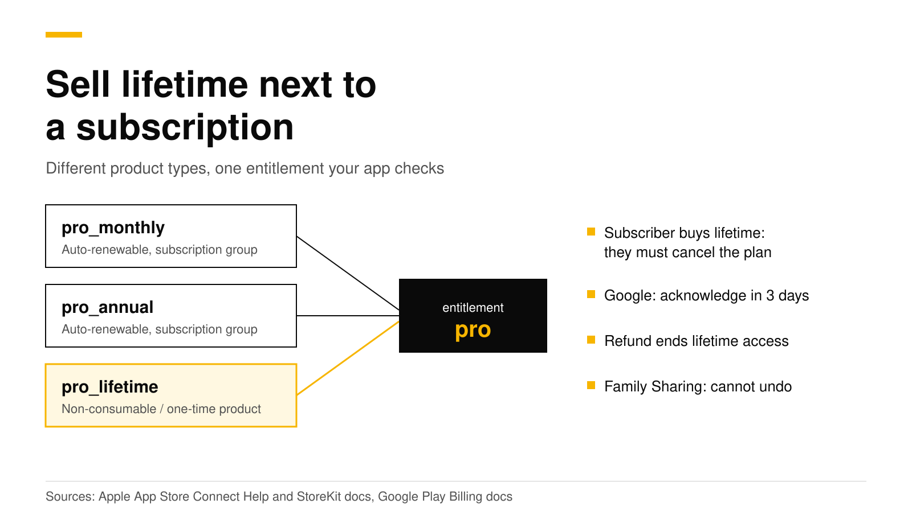

# How to sell a lifetime purchase next to a subscription

To sell a lifetime plan next to a subscription, create the lifetime plan as a non-consumable in App Store Connect and as a one-time product in Google Play Console, then attach it and every subscription to one entitlement such as `pro`. Your app checks that entitlement, not the product. A lifetime product cannot join a subscription group, so the store will not end an active subscription when someone buys lifetime. Your app must tell that customer to cancel the subscription.

This post covers product setup, the entitlement check in code, subscribers who buy lifetime, refunds, Family Sharing and restore. Every Apple, Google and RevenueCat fact links its source and was checked in October 2026.



## The short answer

- **Product type.** On iOS, lifetime is a [non-consumable](https://revenuedot.app/glossary/consumable-and-non-consumable-in-app-purchase): Apple says it "is purchased once and does not expire" ([Apple](https://developer.apple.com/help/app-store-connect/reference/in-app-purchase-types)). On Google Play it is a non-consumable one-time product, which "cannot be purchased again" ([Google](https://developer.android.com/google/play/billing/one-time-products)).
- **No subscription group.** Apple's [subscription groups](https://revenuedot.app/glossary/subscription-group) hold auto-renewable subscriptions only ([Apple](https://developer.apple.com/help/app-store-connect/manage-subscriptions/offer-auto-renewable-subscriptions)). Lifetime sits outside the group.
- **One entitlement.** Attach the monthly, annual and lifetime products to the same [entitlement](https://revenuedot.app/glossary/entitlement). Your app asks one question: is `pro` active?
- **Subscribers who buy lifetime** keep paying until they cancel. Show them Apple's manage sheet or Google's subscription page right after the purchase.
- **Refunds and Family Sharing** can take lifetime access away. Your server must hear about both.

## Why can't lifetime go in a subscription group?

A subscription group is a set of auto-renewable subscriptions, and "users can subscribe to one subscription product per group at a time" ([Apple](https://developer.apple.com/help/app-store-connect/manage-subscriptions/offer-auto-renewable-subscriptions)). That rule is what makes an upgrade from monthly to annual replace the old plan. A non-consumable is a different product type, so it never enters a group.

Google Play works the same way. Subscriptions have base plans and offers. A lifetime plan is a one-time product, "a single transaction that grants access to the purchased content permanently" ([Google](https://developer.android.com/google/play/billing/one-time-products)). It is not a base plan.

| | App Store | Google Play |
|---|---|---|
| Lifetime product type | Non-consumable | One-time product, non-consumable |
| Can join a subscription group or base plan | No | No |
| Found again on a new device | Yes, in `Transaction.currentEntitlements` | Yes, from `queryPurchasesAsync` |

The Google row matters most. Google says your app or server must acknowledge a purchase "within three days so that the purchase isn't automatically refunded and entitlement revoked". For a non-consumable, you acknowledge it and never consume it ([Google](https://developer.android.com/google/play/billing/integrate)). If you consume it by mistake, the customer can buy lifetime again and loses what they paid for.

## How do I check one entitlement for both?

Write one check that passes for an active subscription or an owned lifetime product, and use it on every screen.

### With StoreKit 2 alone

`Transaction.currentEntitlements` returns each non-consumable and the latest transaction of each auto-renewable subscription that is subscribed or in its grace period. Refunded and revoked products do not appear ([Apple](https://developer.apple.com/documentation/storekit/transaction/currententitlements)). That makes the check short:

```swift
import StoreKit

// Every product that gives Pro access, lifetime included.
let proProducts: Set<String> = ["pro_monthly", "pro_annual", "pro_lifetime"]

func hasPro() async -> Bool {
    for await result in Transaction.currentEntitlements {
        // Skip anything StoreKit could not verify.
        guard case .verified(let transaction) = result else { continue }
        if proProducts.contains(transaction.productID) {
            return true
        }
    }
    return false
}
```

This covers one Apple account on one platform. It does not know about a Google Play or web purchase. Our post on [sharing one subscription across iOS, Android and the web](share-subscription-across-ios-android-web.md) explains why that needs a server and one account ID.

### With the RevenueCat SDK

With the RevenueCat SDK, you attach all three products to the `pro` entitlement on the server. RevenueCat's docs say that several products may grant the same entitlement, and that a non-consumable grants it forever ([RevenueCat](https://www.revenuecat.com/docs/getting-started/entitlements)). The app then reads `entitlements.active` ([RevenueCat](https://www.revenuecat.com/docs/customers/customer-info)):

```swift
import RevenueCat

func proStatus() async throws -> (isPro: Bool, ownsLifetime: Bool, hasSubscription: Bool) {
    let info = try await Purchases.shared.customerInfo()
    let isPro = info.entitlements.active["pro"] != nil
    let ownsLifetime = info.nonSubscriptionTransactions.contains { $0.productIdentifier == "pro_lifetime" }
    let hasSubscription = !info.activeSubscriptions.isEmpty
    return (isPro, ownsLifetime, hasSubscription)
}
```

```kotlin
Purchases.sharedInstance.getCustomerInfoWith { info ->
    val isPro = info.entitlements.active.containsKey("pro")
    showPro(isPro)
}
```

The same code runs against RevenueCat or RevenueDot. Only the SDK's proxy URL changes.

## What if a subscriber buys lifetime?

The subscription keeps renewing. The stores treat the two purchases as separate products, and neither store ends one when the other is bought. Your app should catch this case and ask the customer to cancel.

1. **Detect it.** After a lifetime purchase, check whether the customer still has an active subscription. The `ownsLifetime && hasSubscription` result above does this.
2. **Tell them in plain words.** For example: "You now own Pro for life. Your monthly plan will still renew until you cancel it. Cancel it now so you are not charged again."
3. **Open the store's own screen.** On iOS, call `AppStore.showManageSubscriptions(in:)`, or `manageSubscriptionsSheet(isPresented:)` in SwiftUI. It shows the same sheet as the Settings app, with the option to cancel ([Apple](https://developer.apple.com/documentation/storekit/appstore/showmanagesubscriptions(in:))). Apple asks you to "always make it easy" to reach that screen ([Apple](https://developer.apple.com/app-store/subscriptions/)).
4. **On Android, open the subscription's own page** in Google Play with a deep link ([Google](https://developer.android.com/google/play/billing/subscriptions)).

```kotlin
// Opens Google Play on this subscription, where the customer can cancel.
val uri = Uri.parse(
    "https://play.google.com/store/account/subscriptions?sku=pro&package=com.example.app"
)
startActivity(Intent(Intent.ACTION_VIEW, uri))
```

On Google Play you can also stop the renewal from your server. Google's cancel method turns renewal off, and "the subscription remains valid until its expiration time" ([Google](https://developers.google.com/android-publisher/api-ref/rest/v3/purchases.subscriptions/cancel)). Ask the customer first.

The best fix is to avoid the case. You can hide the lifetime option from paying subscribers, or show it with a note that they must cancel their plan. A [manage button](share-subscription-across-ios-android-web.md) on your settings screen also helps.

## What happens when a lifetime purchase is refunded?

Access should end. On the App Store, Apple sends a `REFUND` notification for non-consumables as well as subscriptions, and a refunded product leaves `Transaction.currentEntitlements` ([Apple](https://developer.apple.com/documentation/appstoreservernotifications/notificationtype), [Apple](https://developer.apple.com/documentation/storekit/transaction/currententitlements)). If Apple later sends `REFUND_REVERSED`, Apple says your app "needs to reinstate" the content.

On Google Play, the Voided Purchases API lists refunds, chargebacks and cancellations for one-time orders and subscriptions. It only reaches back 30 days ([Google](https://developers.google.com/android-publisher/voided-purchases)), so check it at least that often.

Apple may also ask you for consumption information before it decides on a refund. Our post on [Apple refund requests](apple-refund-requests-consumption-info.md) covers that flow.

## Does Family Sharing apply to lifetime purchases?

On the App Store, yes, if you turn it on. Family Sharing works for auto-renewable subscriptions and non-consumables, and "once you turn on Family Sharing for an In-App Purchases in App Store Connect, you can't turn it off" ([Apple](https://developer.apple.com/help/app-store-connect/configure-in-app-purchase-settings/turn-on-family-sharing-for-in-app-purchases)). Decide before launch.

Shared access can end. Apple sends `REVOKE` when the buyer turns off sharing, leaves the family, or gets a refund ([Apple](https://developer.apple.com/documentation/appstoreservernotifications/notificationtype)). Each transaction also carries an ownership type, so you can tell the buyer from a family member ([Apple](https://developer.apple.com/app-store/subscriptions/)). See the [Family Sharing](https://revenuedot.app/glossary/family-sharing) glossary entry for the subscription side.

## How does restore work for lifetime?

A lifetime purchase must come back on a new phone. On iOS, StoreKit 2 has the transactions on first launch, and `Transaction.currentEntitlements` already lists the non-consumable. Apple says to call `AppStore.sync()` only from a button, such as Restore purchases ([Apple](https://developer.apple.com/documentation/storekit/appstore/sync())). On Android, call `queryPurchasesAsync` when the app connects to Google Play, which covers purchases made on another device ([Google](https://developer.android.com/google/play/billing/integrate)).

Our [restore purchases guide](restore-purchases-ios-android.md) covers App Review's rules and who owns a restored purchase. The RevenueDot help page on [restore](../docs/help/restore-purchases.md) covers the server side.

## How should I price lifetime?

We found no lifetime price data published this month that we could check, so this section has no benchmark numbers. Start from your annual price. A lifetime plan is paid once, so it must earn what several years of a subscription would earn from the same customer. Then test it: put lifetime in one paywall variant and keep it out of another, and compare revenue per visitor.

For subscription prices, trials and regional pricing, read our [pricing guide](subscription-app-pricing-guide.md) and [weekly vs annual](weekly-vs-annual-subscriptions.md). The [subscription revenue calculator](https://revenuedot.app/tools/subscription-revenue-calculator) helps you model plans side by side.

## Do it with RevenueDot

RevenueDot's entitlement engine handles lifetime purchases, and its tests cover lifetime, refunds, grace periods, promotional grants and transfers. Here is what the docs describe:

- **A product type for lifetime.** Create the product with `type: non_consumable` and attach it to `pro` next to your subscriptions ([Products and entitlements](../docs/concepts/products-and-entitlements.md)).
- **Clear rules.** A lifetime purchase never ends unless it is refunded, and when a customer owns both, the lifetime purchase wins. Consumables never grant an entitlement.
- **A lifetime package.** Put the product in the `$rc_lifetime` package, so `offering.lifetime` works in the SDK ([Offerings and packages](../docs/concepts/offerings-and-packages.md)).
- **Google acknowledgement and refunds.** RevenueDot acknowledges Google Play purchases within the 3-day limit, and checks Google's voided purchases once a day ([Google Play setup](../docs/guides/google-play.md)). Apple's `REFUND` notification ends access ([App Store setup](../docs/guides/app-store.md)).
- **An event for each lifetime sale.** A one-time purchase sends `NON_RENEWING_PURCHASE` to your [webhooks](https://revenuedot.app/features/webhooks), so you can email a buyer who still has a subscription ([Subscriptions and events](../docs/concepts/subscriptions-and-events.md)).
- **A Manage button in the app.** The [Customer Center](https://revenuedot.app/features/customer-center) has a Manage path that opens the store's subscription screen ([Customer Center guide](../docs/guides/customer-center.md)). [Refund Control](https://revenuedot.app/features/refund-control) answers Apple's refund requests for lifetime purchases too ([Refund Control guide](../docs/guides/refund-control.md)).

RevenueDot works with the RevenueCat SDK when you change one line, the proxy URL. The server is open source (AGPL-3.0), the SDK forks are MIT, and you can self-host it with Docker and Postgres or export all your data at any time. RevenueCat is free up to $2,500 in monthly tracked revenue, then 1% of all of it ([RevenueCat](https://www.revenuecat.com/pricing)). RevenueDot Cloud is free up to $10,000, and a paid plan is planned ([pricing](https://revenuedot.app/pricing)). RevenueCat has more years in production. No real store purchase has run end to end against RevenueDot yet, so test each store in its sandbox before launch. The [RevenueCat comparison](https://revenuedot.app/compare/revenuedot-vs-revenuecat) lists the other differences.

[Start free on RevenueDot Cloud](https://app.revenuedot.app/signup).

## FAQ

### Can I put a lifetime purchase in a subscription group?

No. Apple's subscription groups hold auto-renewable subscriptions ([Apple](https://developer.apple.com/help/app-store-connect/manage-subscriptions/offer-auto-renewable-subscriptions)). Create lifetime as a non-consumable and link it to the subscriptions through one entitlement.

### Does buying lifetime cancel my customer's subscription?

No. The subscription renews until the customer cancels it. Show Apple's manage sheet ([Apple](https://developer.apple.com/documentation/storekit/appstore/showmanagesubscriptions(in:))) or Google's subscription page ([Google](https://developer.android.com/google/play/billing/subscriptions)) right after the purchase.

### Should a Google Play lifetime product be consumed?

No. Acknowledge it within three days and never consume it ([Google](https://developer.android.com/google/play/billing/integrate)). A consumed product can be bought again and no longer shows as owned.

### Can family members use a lifetime purchase?

On the App Store, yes, when you turn on Family Sharing for the product. You cannot turn it off later ([Apple](https://developer.apple.com/help/app-store-connect/configure-in-app-purchase-settings/turn-on-family-sharing-for-in-app-purchases)).

### Does a refund remove lifetime access?

It should. Apple sends `REFUND` for non-consumables ([Apple](https://developer.apple.com/documentation/appstoreservernotifications/notificationtype)), and Google lists refunded one-time orders in the Voided Purchases API for 30 days ([Google](https://developers.google.com/android-publisher/voided-purchases)).

**About RevenueDot.** RevenueDot is an open-source (AGPL-3.0) backend for in-app purchases and subscriptions that works with the RevenueCat SDK. Start free on [RevenueDot Cloud](https://app.revenuedot.app/signup), free up to $10,000 in monthly tracked revenue, or self-host it with Docker and Postgres. Point the SDK's proxy URL at RevenueDot and keep your app code, your offerings and your customers. Read the [quickstart](../docs/getting-started/quickstart.md) or the code on [GitHub](https://github.com/revenuedot/revenuedot).
