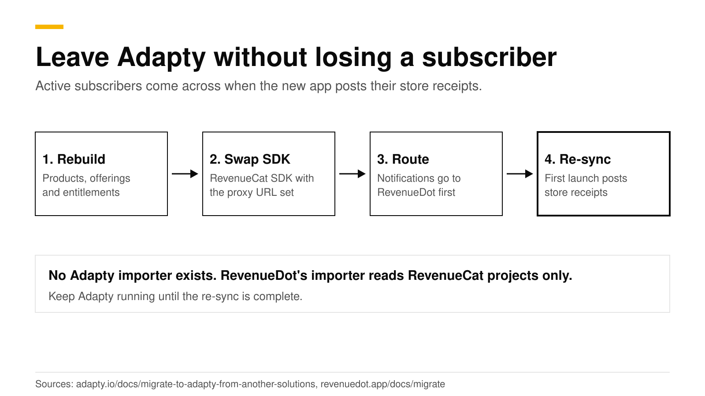
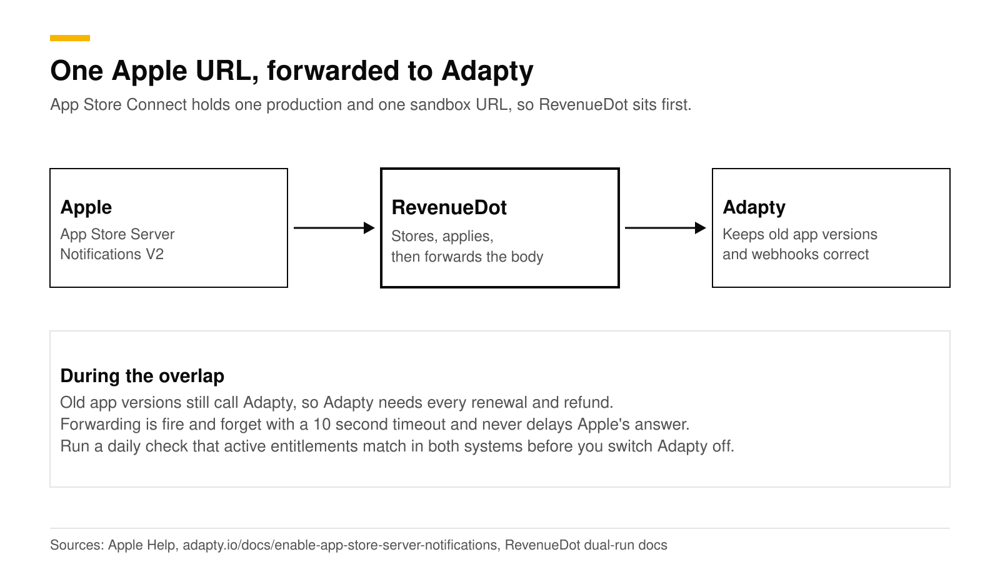

# Migrate from Adapty to an open-source backend (RevenueDot)

You can move an app from Adapty to RevenueDot in four steps: rebuild the catalog, swap the Adapty SDK for the RevenueCat SDK pointed at RevenueDot, send store notifications to RevenueDot, and let active subscribers re-sync when the updated app posts their store receipts. There is no one-command import. RevenueDot's importer reads RevenueCat projects only, so an Adapty move is an SDK swap with a side-by-side run, not a data copy.

This post gives the order of work, what to rebuild by hand, and how to run both systems until the last old app version fades out. It is for apps that use Adapty today and want an open-source backend they can self-host. Facts about Adapty come from its public docs and were checked in October 2026.



## The short answer

- **No importer for Adapty.** RevenueDot's `revenuedot import` command reads RevenueCat projects only ([importer docs](https://revenuedot.app/docs/migrate/importer)). For Adapty you recreate products, entitlements and offerings in RevenueDot.
- **Subscribers move by receipt.** Adapty's own migration guide says users move when they open a version with the new SDK ([Adapty docs](https://adapty.io/docs/migrate-to-adapty-from-another-solutions.md)). The same mechanism works in the other direction: the updated app posts each customer's store purchases to RevenueDot.
- **Apple allows two notification URLs per app**, one for production and one for sandbox ([Apple](https://developer.apple.com/help/app-store-connect/configure-in-app-purchase-settings/enter-server-urls-for-app-store-server-notifications)). Point them at RevenueDot and forward the body to Adapty while old app versions remain.
- **Your code changes.** Adapty's `getProfile()` and access levels become the RevenueCat SDK's customer info and entitlements, and your webhook handler reads RevenueCat's payload shape.
- **Cost.** Adapty is free while you earn under $5K a month, then 1% of monthly revenue ([Adapty pricing](https://adapty.io/pricing/)). RevenueDot Cloud is free up to $10,000 of monthly tracked revenue, and self-hosting is free.

## What does RevenueDot import from Adapty?

Nothing, and it is better to say so up front. The importer calls RevenueCat's API and writes the result into RevenueDot ([the importer](https://revenuedot.app/docs/migrate/importer)). It has no Adapty reader.

What you do instead is rebuild the small things and let the large thing, the subscriber list, rebuild itself.

| Item | How it moves |
|---|---|
| Store products | They stay in App Store Connect and Google Play. You keep the same product ids |
| Entitlements | Adapty calls them access levels. Create the same ones in RevenueDot and attach the same products |
| Offerings and packages | Recreate by hand in **Product catalog** |
| Paywalls | Rebuild from a RevenueDot template, or keep your own screen in the app |
| Active subscribers | Re-sync from store receipts when the updated app launches |
| Purchase history for charts | Not imported. Charts fill from the day you start. Keep Adapty read-only for old reports |
| Webhooks and integrations | Create them in RevenueDot at cutover |
| User ids | Reuse the id you gave Adapty as `customerUserId` as the RevenueCat app user id |

Adapty offers a server-side API with a profile endpoint and a CSV export of analytics such as MRR, churn and cohorts ([server-side API](https://adapty.io/docs/api-adapty.md), [analytics export](https://adapty.io/docs/export-analytics-api.md)). Use them to keep a record of your history before you switch Adapty off. RevenueDot does not read that export.

## How do you swap the SDK?

You replace Adapty calls with the RevenueCat SDK and set its proxy URL to RevenueDot. In proxy mode the change is small. The RevenueDot forks of the SDKs are not on any package registry yet (October 2026), so use the stock RevenueCat SDK.

```swift
// Before: Adapty
let profile = try await Adapty.getProfile()
let isPro = profile.accessLevels["premium"]?.isActive ?? false

// After: the RevenueCat SDK talking to RevenueDot
Purchases.proxyURL = URL(string: "https://api.revenuedot.app")!
Purchases.configure(
    with: Configuration.Builder(withAPIKey: "appl_...")
        .with(entitlementVerificationMode: .disabled)
        .build()
)
let customerInfo = try await Purchases.shared.customerInfo()
let isPro = customerInfo.entitlements["pro"]?.isActive == true
```

Adapty's code uses `Adapty.getProfile()` and `profile.accessLevels[...]` ([Adapty docs](https://adapty.io/docs/ios-check-subscription-status.md)). Set the proxy URL before `configure`. Turn off signature checks, because the stock SDK verifies responses against RevenueCat's key and would log every RevenueDot response as a failed check. The full diffs for all ten SDKs are in the [SDK changes guide](https://revenuedot.app/docs/migrate/sdk-changes).

Three details save a bad week:

1. **Pass the same user id.** Call `Purchases.logIn("<your user id>")` with the value you used as Adapty's `customerUserId` ([Adapty docs](https://adapty.io/docs/identifying-users.md)). Purchases follow the customer, not the device. See [how customers and app user ids work](https://revenuedot.app/docs/concepts/customers-and-app-user-ids).
2. **Call `syncPurchases()` once** on the first launch after the update. It sends the device's store purchases to RevenueDot, so current subscribers keep access even though their history was never imported.
3. **Add store credentials first.** RevenueDot needs your App Store in-app purchase key and a Google Play service account to verify purchases. Without them, StoreKit 1 receipts fail with an error the SDK retries ([store setup](https://revenuedot.app/docs/guides/app-store)).

## How do active subscribers re-sync?

Each customer re-syncs the first time they open the updated app. The SDK posts their store receipt, RevenueDot verifies it with Apple or Google, and the entitlement turns on. Nobody needs to sign in again.

Subscribers who do not open the new version stay on Adapty. That is why the overlap matters. Apple keeps sending their renewals and refunds to the notification URL on file, and your backend still needs to know about them.

## How do you route store notifications?

Send them to RevenueDot first and forward the exact body to Adapty. App Store Connect holds one production URL and one sandbox URL per app, and either can carry only one destination, so one system has to be in front ([Apple](https://developer.apple.com/help/app-store-connect/configure-in-app-purchase-settings/enter-server-urls-for-app-store-server-notifications)).



**App Store.**

1. Copy the notification URL from the app page in RevenueDot.
2. Copy Adapty's URL from its dashboard. Adapty provides it, and tells you to paste it into both the production and sandbox fields. It also says the URL works like a credential: anyone who has it can post a payload to it ([Adapty docs](https://adapty.io/docs/enable-app-store-server-notifications.md)).
3. Set the RevenueDot app's **Forward notifications** field to Adapty's URL.
4. In App Store Connect, set both URLs to RevenueDot's, version 2.

**Google Play.** Adapty creates the Pub/Sub topic in your own Google Cloud project when you save the key file ([Adapty docs](https://adapty.io/docs/enable-real-time-developer-notifications-rtdn.md)). A topic can have many subscriptions, and each one receives every message ([Google Cloud](https://docs.cloud.google.com/pubsub/docs/subscriber)). Add a second push subscription that points at RevenueDot, and Adapty keeps receiving everything. Google asks you to set up notifications per app ([Google](https://developer.android.com/google/play/billing/getting-ready#configure-rtdn)).

RevenueDot stores each notification, forwards the raw body with a 10 second timeout, and never lets forwarding delay its answer to Apple or Google. Forwarding was verified with a test URL and has not been run against Adapty's own endpoint, so send a test notification and check Adapty's event feed before you rely on it. Adapty says that without server notifications it runs with a limited feature set, so a broken forward degrades its data ([Adapty docs](https://adapty.io/docs/migrate-to-adapty-from-another-solutions.md)).

## How do you run both side by side?

Run them in parallel for at least one full billing cycle of your longest plan, and keep acting on Adapty's webhooks until you switch. The full recipe is in the [dual-run guide](https://revenuedot.app/docs/migrate/dual-run); the steps for Adapty are these:

1. Turn on **Track new purchases from server-to-server notifications** for each store app in RevenueDot, so purchases made on old app versions appear.
2. Create a RevenueDot webhook that points at an endpoint that only logs. RevenueDot sends RevenueCat's payload, `{ "api_version": "1.0", "event": { ... } }`, so deduplicate on `event.id` ([webhooks](https://revenuedot.app/docs/guides/webhooks)).
3. Do not point RevenueDot's webhook at the handler Adapty already feeds. Your backend would count every purchase twice.
4. Compare. For ten known customers, check that their entitlements and expiry dates match in both dashboards. Adapty's events such as `subscription_started` and `trial_started` ([Adapty event feed](https://adapty.io/docs/event-feed.md)) have RevenueCat-shaped equivalents such as `INITIAL_PURCHASE`, `RENEWAL`, `CANCELLATION` and `EXPIRATION` in RevenueDot.
5. Cut over when the old versions are a small share of active users. Create the real webhooks in RevenueDot, remove the forward, and switch Adapty off.

The [cutover checklist](https://revenuedot.app/docs/migrate/cutover-checklist) lists the last steps.

## What does Adapty do that RevenueDot does not?

Adapty is a hosted growth suite and RevenueDot is an open-source backend, so each is stronger in different places.

| Area | Adapty | RevenueDot |
|---|---|---|
| Compliance | SOC 2 Type II attestation, available under NDA ([Adapty](https://adapty.io/security-and-compliance/)) | No SOC 2 report yet |
| Source code | SDKs on GitHub (MIT), hosted backend | Server and dashboard open source (AGPL-3.0), self-hostable |
| Client SDK | Adapty's own SDKs | The RevenueCat SDK you may already know |
| Paywalls and A/B tests | Flow and paywall builder with A/B testing and segmentation ([Adapty pricing](https://adapty.io/pricing/)) | Ten paywall templates, a visual editor, audiences and two-offering experiments |
| Add-ons | Refund Saver, Ads Manager, Mail and attribution are priced separately | Refund Control and win-back are included |

The [RevenueDot vs Adapty comparison](https://revenuedot.app/compare/revenuedot-vs-adapty) has the full table with sources. If you need SOC 2 Type II or deeper paywall experiments today, stay on Adapty.

## Do it with RevenueDot

1. Create a free project and add your store credentials ([connect your app](https://revenuedot.app/docs/getting-started/connect-your-app)).
2. Rebuild products, entitlements and offerings, and build a paywall from a [template](https://revenuedot.app/docs/guides/paywalls) if you want one.
3. Ship the app update with the proxy URL and `syncPurchases()`.
4. Route notifications through RevenueDot, forward to Adapty, and compare for a cycle.
5. Cut over and watch the [charts](https://revenuedot.app/features/charts).

[Start free on RevenueDot Cloud](https://app.revenuedot.app/signup) (free up to $10,000 monthly tracked revenue). The [subscription revenue calculator](https://revenuedot.app/tools/subscription-revenue-calculator) helps you model your own numbers.

## FAQ

### Can RevenueDot import my Adapty data?

No. RevenueDot's importer reads RevenueCat projects only. For Adapty you recreate products and offerings, swap the SDK and let active subscribers re-sync from store receipts. Export your Adapty analytics as CSV first if you want a record of old reports.

### Will my active subscribers lose access?

Not if both systems stay on until old app versions fade out. Apple and Google keep sending renewals to the URLs on file, RevenueDot forwards them to Adapty, and each customer's access turns on in RevenueDot when the updated app posts their receipt.

### Can I use the same user ids?

Yes. Call `Purchases.logIn` with the id you gave Adapty as `customerUserId`. Purchases belong to the customer, so history follows the id.

### Do I have to rewrite my paywalls?

If they are Adapty-built, yes. Rebuild them from a RevenueDot template or keep your own screen and read offerings from the SDK. RevenueDot's paywalls are native screens the RevenueCat SDK renders without an app release.

### Is the RevenueCat SDK the only choice?

For now, yes. RevenueDot implements the API the RevenueCat SDKs call. The forks that need no proxy URL are built but not yet published on package registries.

**About RevenueDot.** RevenueDot is an open-source (AGPL-3.0) backend for in-app purchases and subscriptions that works with the RevenueCat SDK. Start free on [RevenueDot Cloud](https://app.revenuedot.app/signup), free up to $10,000 in monthly tracked revenue, or self-host it with Docker and Postgres. Point the SDK's proxy URL at RevenueDot and keep your app code, your offerings and your customers. Read the [quickstart](../docs/getting-started/quickstart.md) or the code on [GitHub](https://github.com/revenuedot/revenuedot).
