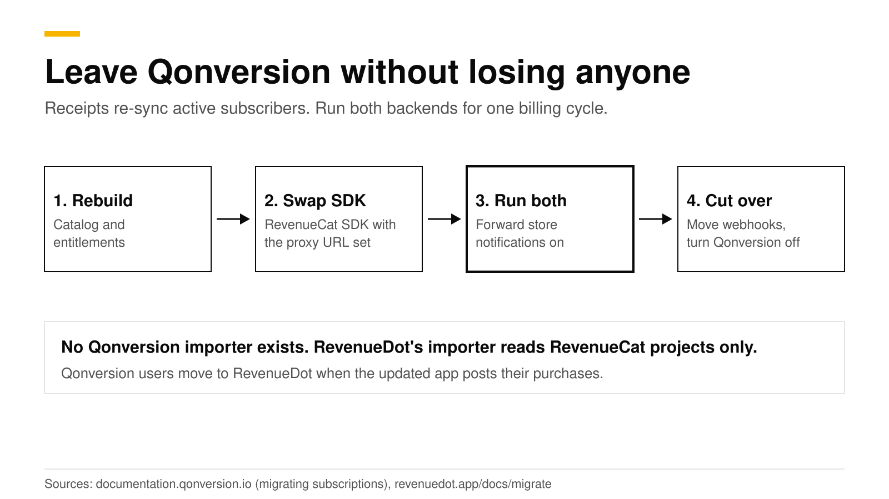
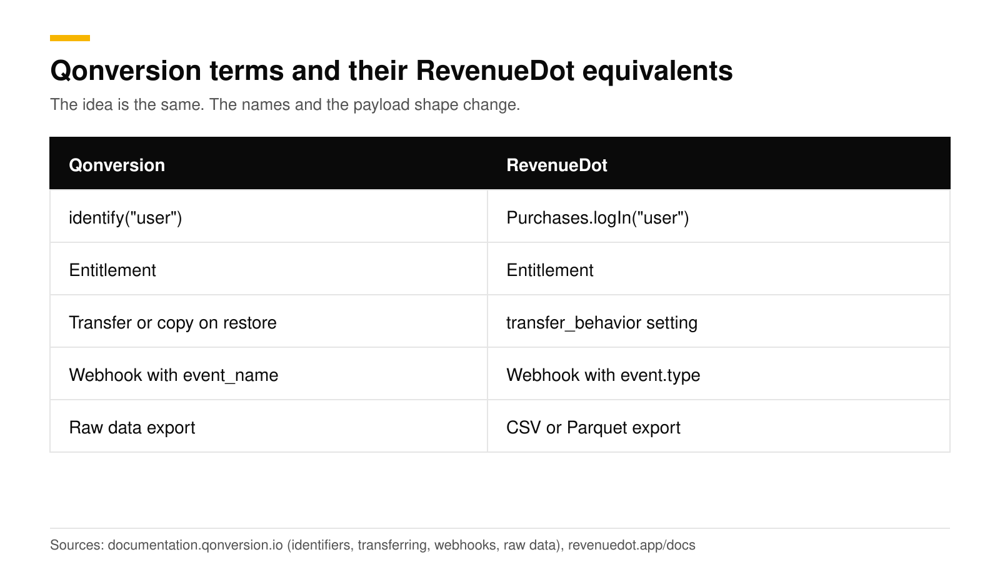

# Migrate from Qonversion to an open-source backend (RevenueDot)

The move from Qonversion to RevenueDot is an SDK swap with a side-by-side run. You rebuild the catalog in RevenueDot, replace the Qonversion SDK with the RevenueDot SDK, forward store notifications to Qonversion while old app versions remain, and let active subscribers re-sync when the updated app posts their store receipts. RevenueDot's importer reads RevenueCat projects only, so it cannot read a Qonversion project.

This post covers the order of work, what Qonversion's own migration guide teaches you in reverse, and the checks that keep entitlements correct. Facts about Qonversion come from its public pricing page and docs, checked in October 2026.



## The short answer

- **Rebuild, then re-sync.** Create products, entitlements and offerings in RevenueDot, ship the updated app, and each customer's purchases arrive as the app posts their receipts.
- **One URL to move.** Qonversion gives you one App Store notification URL per project, version 2, and the same endpoint takes sandbox traffic ([Qonversion docs](https://documentation.qonversion.io/docs/ios-s2s-notifications.md)). Replace it in App Store Connect with RevenueDot's, and forward to Qonversion's during the overlap.
- **Store credentials are required.** Qonversion's guide for moving in says no store credentials are needed, only receipt data ([Qonversion docs](https://documentation.qonversion.io/docs/migrating-subscriptions.md)). RevenueDot verifies purchases itself, so it needs your App Store in-app purchase key and a Google Play service account.
- **Both bills end at once.** Qonversion is free up to $7K of monthly tracked revenue, then 0.8% of all of it ([Qonversion pricing](https://qonversion.io/pricing)). RevenueDot Cloud Pro costs $0 until your apps make $10,000 a month, then 0.5% of revenue above $10,000, never more than $999 a month.
- **Keep Qonversion's exports.** Raw data export and an export API let you save history before you switch it off.

## What does Qonversion's own migration guide teach us?

Qonversion's guide for moving in uses two tracks. The client track installs its SDK and calls `syncHistoricalData()` so that active users are recovered when they open the app. The server track hands Qonversion files with receipts, purchase tokens and Stripe ids, and Qonversion then grants entitlements right after the app launches ([Qonversion docs](https://documentation.qonversion.io/docs/migrating-subscriptions.md)).

RevenueDot has the same two tracks with different names.

| Track | In Qonversion's guide | In RevenueDot |
|---|---|---|
| Client | Install the SDK, call `syncHistoricalData()` | Install the RevenueDot SDK, call `syncPurchases()` once |
| Server | Send receipt files to Qonversion support | Add store credentials, so RevenueDot verifies receipts and Google purchase tokens itself |
| Result | Entitlements granted on app launch | Entitlements granted when the app posts the receipt |

The difference is who does the server work. With Qonversion you hand files to its team. With RevenueDot you give the server your store credentials once, and it reads purchases from Apple and Google directly.

## What to rebuild by hand

RevenueDot has no Qonversion reader, so the catalog is yours to recreate. It is a small job for most apps.

1. **Products** stay in App Store Connect and Google Play. Keep the same product ids.
2. **Entitlements.** Create the same ones in RevenueDot and attach the same products ([products and entitlements](https://revenuedot.app/docs/concepts/products-and-entitlements)).
3. **Offerings and packages.** Qonversion groups products in offerings too. Recreate them under **Product catalog** ([offerings and packages](https://revenuedot.app/docs/concepts/offerings-and-packages)).
4. **Paywalls.** Qonversion has a no-code paywall builder ([Qonversion docs](https://documentation.qonversion.io/docs/no-codes.md)). Rebuild from a [RevenueDot template](https://revenuedot.app/docs/guides/paywalls), or keep your own screen.
5. **Webhooks and integrations.** Create them in RevenueDot at cutover.
6. **Restore behavior.** Qonversion lets an entitlement transfer or copy to another user on restore ([Qonversion docs](https://documentation.qonversion.io/docs/transferring.md)). In RevenueDot the project's `transfer_behavior` decides who owns a restored purchase: `transfer`, `transfer_if_no_active`, `keep` or `share` ([how it works](https://revenuedot.app/docs/concepts/customers-and-app-user-ids#who-owns-a-restored-purchase)). Pick the one that matches what Qonversion did for you.



## How do you swap the SDK?

Replace Qonversion's calls with the RevenueDot SDK. It is published for every platform (2026-10-02), and on RevenueDot Cloud it needs only your app's key. The [SDK guides](https://revenuedot.app/docs/sdks) give the install line for each platform.

```swift
// Before: Qonversion
Qonversion.shared().purchase(product) { result in /* ... */ }
Qonversion.shared().restore { entitlements, error in /* ... */ }

// After: the RevenueDot SDK (import RevenueCat)
Purchases.configure(withAPIKey: "appl_...")
let result = try await Purchases.shared.purchase(package: package)
let customerInfo = try await Purchases.shared.restorePurchases()
```

Qonversion's method names are from its [purchase docs](https://documentation.qonversion.io/docs/making-purchases.md). The RevenueDot SDK is built from RevenueCat's open-source SDK (MIT license), so your code imports `RevenueCat` and calls `Purchases`. It sends every request to RevenueDot and needs no RevenueCat account. If you self-host, set `Purchases.proxyURL` to your server before `configure` and turn entitlement verification off, as the [iOS guide](https://revenuedot.app/docs/sdks/ios) shows.

**Identity.** Qonversion's `identify("your_custom_user_id")` links accounts across devices and stores, and it asks you to call `logout()` when the user signs out ([Qonversion docs](https://documentation.qonversion.io/docs/user-identifiers.md)). The RevenueDot SDK's equivalents are `Purchases.logIn` and `Purchases.logOut`. Pass the same id you passed to `identify`, and purchases follow the customer ([customers and app user ids](https://revenuedot.app/docs/concepts/customers-and-app-user-ids)).

**Sync once.** Call `syncPurchases()` on the first launch after the update. It sends the device's store purchases to RevenueDot, so active subscribers keep access without any imported history.

## How do you move store notifications?

Point both App Store URLs at RevenueDot, and forward the raw body to Qonversion for as long as old app versions run. Apple holds up to two server URLs per app, one for production and one for sandbox ([Apple](https://developer.apple.com/help/app-store-connect/configure-in-app-purchase-settings/enter-server-urls-for-app-store-server-notifications)). With one system in front, the other needs forwarding.

1. Copy the notification URL from the app page in RevenueDot.
2. Copy Qonversion's App Store URL from its Project Settings (Stores, Apple App Store).
3. Paste Qonversion's URL in RevenueDot's **Forward notifications** field.
4. In App Store Connect, set the production and sandbox URLs to RevenueDot's, version 2.

For Google Play, Qonversion creates the Pub/Sub topic when you click Connect to Google, and gives you the topic id to paste into Play Console ([Qonversion docs](https://documentation.qonversion.io/docs/google-developer-notifications.md)). A Pub/Sub topic can carry many subscriptions, and each receives every message ([Google Cloud](https://docs.cloud.google.com/pubsub/docs/subscriber)). Check in Google Cloud Console which project owns the topic. If it is yours, add a second push subscription for RevenueDot. If it is not, point Play Console at RevenueDot and set the Google forwarding URL to Qonversion's.

RevenueDot stores each notification and forwards the exact body with a 10 second timeout, which never delays its answer to Apple or Google. Forwarding was verified with a test URL and has not been run against Qonversion's endpoint, so send a test notification and confirm it appears in Qonversion before you rely on it ([dual-run guide](https://revenuedot.app/docs/migrate/dual-run)).

## How do you run both backends side by side?

Run both for at least one full billing cycle of your longest plan. Keep acting on Qonversion's webhooks until the switch.

1. Turn on **Track new purchases from server-to-server notifications** in RevenueDot, so purchases made on old app versions appear there.
2. Create a RevenueDot webhook pointing at an endpoint that only logs. RevenueDot sends RevenueCat's payload, `{ "api_version": "1.0", "event": { ... } }`, and you can deduplicate on `event.id` ([webhooks](https://revenuedot.app/docs/guides/webhooks)).
3. Do not point RevenueDot's webhook at the handler Qonversion feeds, or every purchase is counted twice.
4. Compare. Qonversion's webhook carries an entitlements snapshot, an `event_name` and retries up to five times over about 24 hours ([Qonversion docs](https://documentation.qonversion.io/docs/webhooks.md)). RevenueDot's carries `event.type` and `entitlement_ids`. For ten known customers, check that entitlements and expiry dates match.
5. When old versions are a small share of active users, create the real webhooks in RevenueDot, remove the forward, and switch Qonversion off ([cutover checklist](https://revenuedot.app/docs/migrate/cutover-checklist)).

## How do you save your Qonversion history?

RevenueDot does not read Qonversion's export, but you should keep it. Qonversion's raw data export has 30 or more fields, including transaction details, user ids, device data and acquisition fields, and you can download it or have the link emailed ([Qonversion docs](https://documentation.qonversion.io/docs/raw-data-reports.md)). An asynchronous export endpoint does the same by API with a secret key ([Qonversion API](https://documentation.qonversion.io/api-reference/exports/create-export-async.md)), and a list-purchases endpoint returns one user's purchases ([Qonversion API](https://documentation.qonversion.io/api-reference/purchases/list-purchases-for-a-user.md)). Store the files next to your finance records. RevenueDot's charts start on the day it receives data.

## What does Qonversion do that RevenueDot does not?

| Area | Qonversion | RevenueDot |
|---|---|---|
| Pricing shape | One Pro plan: free to $7K, then 0.8% of all tracked revenue, every feature included ([pricing](https://qonversion.io/pricing)) | Pro: $0 until your apps make $10,000 a month, then 0.5% of revenue above $10,000, never more than $999 a month |
| Source code | SDKs are MIT on GitHub ([GitHub](https://github.com/qonversion/qonversion-ios-sdk)), backend hosted | Server and dashboard are open source (AGPL-3.0) |
| Web payments | Stripe and Paddle ([Qonversion docs](https://documentation.qonversion.io/docs/initiate-purchase-paddle.md)) | Stripe, through hosted checkout and funnels |
| Support | 24/7 support on the standard plan ([pricing](https://qonversion.io/pricing)) | GitHub and email, free for everyone |

See the [RevenueDot vs Qonversion comparison](https://revenuedot.app/compare/revenuedot-vs-qonversion) for the full table. If you need Paddle, stay on Qonversion for now.

## Do it with RevenueDot

1. Create a free project and add your store credentials ([connect your app](https://revenuedot.app/docs/getting-started/connect-your-app)).
2. Recreate entitlements, products and offerings.
3. Ship the update with the RevenueDot SDK, `logIn` and `syncPurchases()`.
4. Move the Apple URLs to RevenueDot and forward to Qonversion.
5. Compare for a cycle, then cut over.

[Start for free on RevenueDot Cloud](https://app.revenuedot.app/signup). Pro costs $0 until your apps make $10,000 a month. The [subscription revenue calculator](https://revenuedot.app/tools/subscription-revenue-calculator) helps you model your own numbers.

## FAQ

### Can RevenueDot import a Qonversion project?

No. The importer reads RevenueCat projects only. For Qonversion you recreate the catalog, swap the SDK and let subscribers re-sync from their store receipts. Export your Qonversion data first to keep your history.

### Do I need to send receipts to RevenueDot?

No file handoff is needed. You add your App Store in-app purchase key and Google Play service account, and the updated app posts each customer's receipt on first launch. RevenueDot verifies it with Apple or Google.

### What replaces Qonversion's identify call?

`Purchases.logIn` in the RevenueDot SDK. Pass the same custom user id you gave `identify`, and call `Purchases.logOut` where you called Qonversion's `logout`.

### Will users lose premium access during the move?

Not if both backends stay on until old app versions fade out. Apple and Google keep sending renewals to the URLs on file, RevenueDot forwards them to Qonversion, and each customer's entitlement turns on in RevenueDot when their updated app posts the receipt.

### Is Qonversion cheaper than RevenueDot?

For revenue under $7K a month both are free. Above it, Qonversion charges 0.8% of all tracked revenue, while RevenueDot Cloud Pro costs $0 until your apps make $10,000 a month and then charges 0.5% of revenue above $10,000, never more than $999 a month.

**About RevenueDot.** RevenueDot is an open-source (AGPL-3.0) backend for in-app purchases and subscriptions on the App Store, Google Play and the web. Start for free on [RevenueDot Cloud](https://app.revenuedot.app/signup): Pro costs $0 until your apps make $10,000 a month, then 0.5% of revenue above $10,000, never more than $999 a month. New apps install the [RevenueDot SDK](../docs/sdks/README.md) and pass their key. Apps that ship the RevenueCat SDK point its proxy URL at RevenueDot and keep their code, offerings and customers. Read the [quickstart](../docs/getting-started/quickstart.md) or the code on [GitHub](https://github.com/revenuedot/revenuedot).
