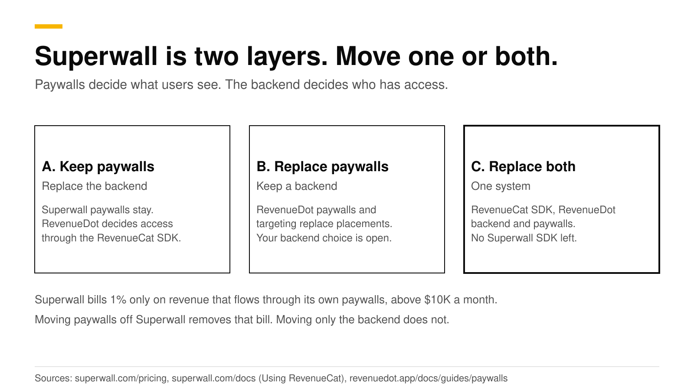
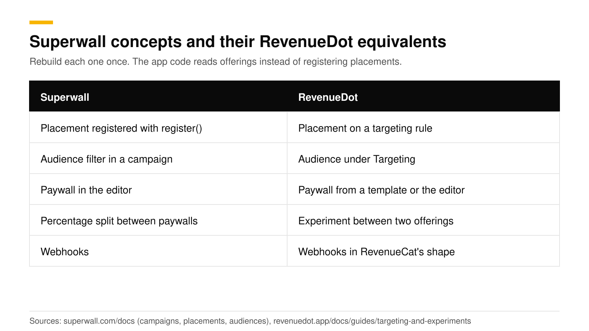

# Move off Superwall: keep its paywalls or replace them

Superwall is two layers: a paywall layer that decides what users see, and a subscription layer that decides who has access. You can move either layer to RevenueDot or both. The backend moves by swapping to the RevenueCat SDK pointed at RevenueDot. The paywalls either stay on Superwall, wired through its documented purchase controller, or get rebuilt as RevenueDot paywalls. RevenueDot's importer reads RevenueCat projects only, so subscribers re-sync from store receipts.

This post helps you pick a path, lists what moves in each, and says where Superwall is stronger. Facts about Superwall come from its public pricing page and docs, checked in October 2026.



## The short answer

- **Path A, keep Superwall paywalls and replace the backend.** Superwall documents a purchase controller that routes purchases through RevenueCat's SDK and syncs subscription status from its customer info ([Superwall docs](https://superwall.com/docs/ios/guides/using-revenuecat)). RevenueDot answers the RevenueCat SDK, so the same wiring should apply. We have not tested Superwall's paywalls against RevenueDot yet.
- **Path B, replace the paywalls.** RevenueDot has ten paywall templates, a visual editor, audiences, placements and two-offering experiments. Your app reads the offering and shows it with the RevenueCat paywall view.
- **Path C, replace both.** One SDK, one backend, one paywall tool, and no Superwall SDK left.
- **The bill.** Superwall's subscription infrastructure is free. It charges 1% only on revenue that flows through its paywalls once that passes $10K a month, so $50,000 a month with half through its paywalls costs about $250 ([Superwall pricing](https://superwall.com/pricing)). Only paths B and C remove that charge.
- **No importer.** There is no Superwall reader in RevenueDot. Rebuild the catalog and let subscribers re-sync.

## What are the two layers?

Superwall's pricing page separates a free infrastructure layer from a billed paywall layer. The free layer is entitlements, purchase APIs, receipt validation, webhooks, revenue analytics and a read-only SQL Query API. The billed layer is revenue converting through Superwall-rendered paywalls: free up to $10,000 a month, then 1% ([Superwall pricing](https://superwall.com/pricing)). Paid plans add $49 (Startup) or $199 (Scale) a month ([Superwall FAQ](https://superwall.com/docs/support/faq/2801653905-how-does-superwalls-pricing-work)).

That split is why a move can be partial. You can leave the cheap, boring layer (who has access) and keep the layer you like (the paywall), or the other way round.

## Path A: keep the paywalls, replace the backend

Superwall supports a custom purchase controller for apps that bill through another system. In its RevenueCat guide, RevenueCat handles the purchase, Superwall draws the paywall, and your app syncs the entitlements by listening to RevenueCat's customer info stream and updating `Superwall.shared.subscriptionStatus` ([Superwall docs](https://superwall.com/docs/ios/guides/using-revenuecat)). Superwall calls the controller an advanced setup ([Superwall docs](https://superwall.com/docs/ios/guides/advanced-configuration)).

RevenueDot is the server behind the RevenueCat SDK, so this is the arrangement to aim for.

1. Recreate entitlements, products and offerings in RevenueDot and add your store credentials.
2. Set the RevenueCat SDK's proxy URL to `https://api.revenuedot.app`, turn off signature checks, and call `syncPurchases()` once on first launch ([SDK changes](https://revenuedot.app/docs/migrate/sdk-changes)).
3. Add the purchase controller from Superwall's guide, so `purchase()` calls `Purchases.shared.purchase` and status follows the customer info stream.
4. Move your store notification URLs to RevenueDot and forward to Superwall while old app versions remain ([dual-run guide](https://revenuedot.app/docs/migrate/dual-run)).

Superwall says it syncs entitlements from App Store Server Notifications V2 and Google real-time notifications on the server side ([Superwall docs](https://superwall.com/docs/dashboard/guides/migrating-from-revenuecat-to-superwall)), so the URLs you move are the ones Superwall uses today.

RevenueDot can also send events to Superwall. It lists Superwall as an integration partner and posts RevenueCat's webhook body to the URL Superwall gives you ([integrations](https://revenuedot.app/docs/guides/integrations#webhook-partners)). Superwall describes its own side as streaming paywall and subscription events into RevenueCat ([Superwall integration](https://superwall.com/integrations/revenue-cat.md)).

**What path A does not change:** your Superwall bill. The 1% still applies to revenue through its paywalls above $10K.

## Path B: replace the paywalls

RevenueDot builds native paywalls in the format the RevenueCat SDK renders, and your app shows them with one view and no release ([paywalls guide](https://revenuedot.app/docs/guides/paywalls)). The concepts map one to one, with some differences.



| Superwall | RevenueDot | Difference |
|---|---|---|
| Campaign with placements and audiences ([Superwall docs](https://superwall.com/docs/dashboard/dashboard-campaigns/campaigns)) | Audiences and targeting rules with placements | The rule picks an offering. Your code decides when to show it |
| `register()` call at a placement | `offerings.currentOffering(forPlacement:)` then the paywall view | You write the "when" in your own code |
| Percentage split between paywalls, with optional holdouts | Experiment between two offerings with a share of customers enrolled | Two variants. The docs describe no holdout group |
| Paywall editor and gallery | Ten templates and a visual editor | Fewer templates and layouts |

In code, a Superwall placement becomes an offering read and a view:

```swift
// Before: Superwall
Superwall.shared.register(placement: "onboarding_end") { /* feature */ }

// After: RevenueDot paywall through the RevenueCat SDK
let offerings = try await Purchases.shared.offerings()
let offering = offerings.currentOffering(forPlacement: "onboarding_end")
// then show PaywallView(offering: offering) in a sheet
```

The targeting guide shows the placement call in full ([targeting and experiments](https://revenuedot.app/docs/guides/targeting-and-experiments)). Rules are checked from the top, the first live rule that matches decides, and an offering you assign to one customer through the API always wins.


Rebuild one paywall per template first. The gallery has Trial timeline, Annual first, Minimal, Story pages, Limited offer and others, each built on a published 2026 result.

## Path C: replace both

Do path B, then remove the Superwall SDK. You end with one SDK (RevenueCat's), one backend (RevenueDot) and one paywall tool. This is the simplest to run and the biggest change in one release, so do the backend first, ship, wait, then move the paywalls in a second release.

## Where is Superwall stronger?

Paywall and experiment depth. Superwall offers campaigns, audiences, placements, holdout groups and an AI paywall builder, and it offers App-to-Web Checkout for customers on the US storefront ([Superwall docs](https://superwall.com/docs/dashboard/dashboard-campaigns/campaigns), [App-to-Web](https://superwall.com/features/app-to-web-checkout)). Its paywall tooling is a specialty, and its free infrastructure layer costs nothing at any scale. RevenueDot's paywalls are single-screen layouts with a smaller template set, and its experiments compare two offerings. If paywall experiments are your main lever, path A is the honest choice.

Where RevenueDot differs: it is open source (AGPL-3.0) and self-hostable, it keeps the RevenueCat SDK, and its bill does not depend on which paywall a purchase came through. Superwall's SDKs are MIT on [GitHub](https://github.com/superwall/Superwall-iOS), and we found no self-host option on its [pricing page](https://superwall.com/pricing) or [docs index](https://superwall.com/llms.txt). See the [RevenueDot vs Superwall comparison](https://revenuedot.app/compare/revenuedot-vs-superwall) for the sourced table.

## How do you keep your data?

Save it before you switch Superwall off. Its pricing page lists the Query API for read-only SQL access to analytics data and webhooks for lifecycle events ([Superwall pricing](https://superwall.com/pricing)). Run your queries and store the results beside your finance records. RevenueDot's charts start when it begins receiving purchases, so keep the old numbers for year-over-year views.

## Do it with RevenueDot

1. Pick a path. If you are unsure, start with A and watch for a billing cycle.
2. Create a free project, add store credentials and recreate your catalog ([connect your app](https://revenuedot.app/docs/getting-started/connect-your-app)).
3. Swap the SDK in proxy mode and call `syncPurchases()` once.
4. Move store notifications to RevenueDot and forward to Superwall for the overlap.
5. For paths B and C, build the paywalls and set up [audiences and an experiment](https://revenuedot.app/features/experiments).

[Start free on RevenueDot Cloud](https://app.revenuedot.app/signup) (free up to $10,000 monthly tracked revenue). The [paywalls feature page](https://revenuedot.app/features/paywalls) shows what the editor supports.

## FAQ

### Can I use Superwall paywalls with RevenueDot?

Superwall documents a purchase controller for RevenueCat's SDK, and RevenueDot answers that SDK, so the wiring should work. We have not tested Superwall paywalls against RevenueDot, so run a sandbox purchase before you ship.

### Is Superwall free?

Its subscription infrastructure is free at any scale. Its paywall product is free up to $10,000 a month of paywall-attributed revenue, then 1% of that revenue, with Startup and Scale plans at $49 and $199 a month.

### Will I lose my active subscribers?

No, if you keep Superwall on until old app versions fade out. Store notifications are forwarded, and each customer's entitlement turns on in RevenueDot when the updated app posts their receipt.

### Does RevenueDot have a Superwall importer?

No. RevenueDot's importer reads RevenueCat projects only. You recreate products, entitlements and offerings, and subscribers re-sync from store receipts.

### Can RevenueDot run the same A/B tests as Superwall?

Partly. RevenueDot experiments compare two offerings, enroll a share of customers deterministically and report conversion, revenue and chance to win. Superwall's campaigns support more splits and holdout groups.

**About RevenueDot.** RevenueDot is an open-source (AGPL-3.0) backend for in-app purchases and subscriptions on the App Store, Google Play and the web. Start free on [RevenueDot Cloud](https://app.revenuedot.app/signup), free up to $10,000 in monthly tracked revenue, or self-host it with Docker and Postgres. New apps install the [RevenueDot SDK](../docs/sdks/README.md) and pass their key. Apps that ship the RevenueCat SDK point its proxy URL at RevenueDot and keep their code, offerings and customers. Read the [quickstart](../docs/getting-started/quickstart.md) or the code on [GitHub](https://github.com/revenuedot/revenuedot).
