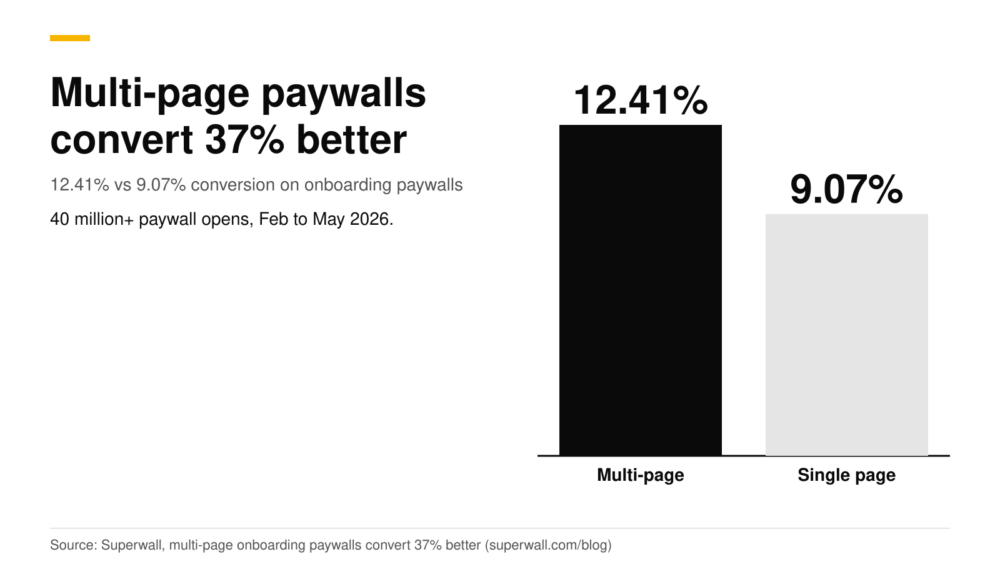
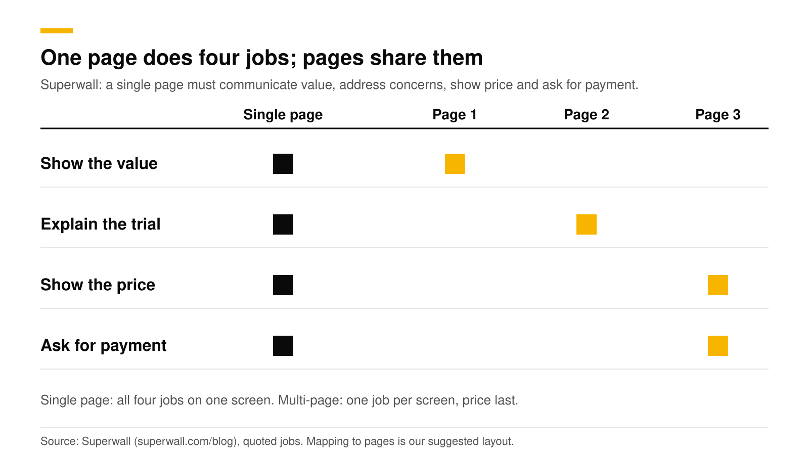
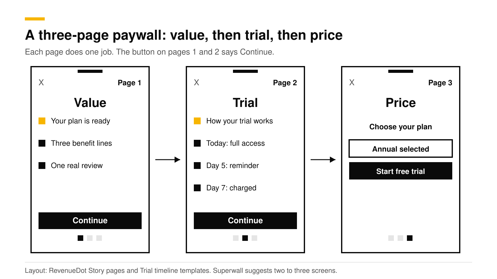
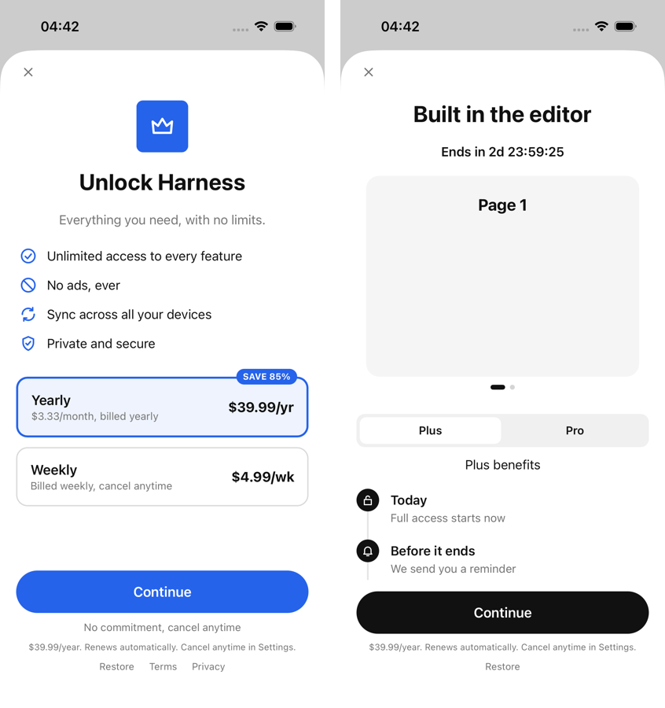

# Multi-page paywalls vs single page: the 2026 data and layout

Multi-page paywalls convert better than single-page ones. In Superwall's 2026 dataset of more than 40 million onboarding paywall opens, paywalls with two or more screens converted at 12.41% against 9.07% for a single screen, a 37% lift. Superwall suggests two to three screens that build value before asking for payment. The best layout is value on page 1, the trial on page 2, and the plans and button on page 3.

This post gives the data, the reasons, a layout, and how to build it, including what RevenueDot supports today. It is part of our [paywall best practices guide](paywall-best-practices-2026.md). Numbers are Superwall's and the other sources', checked in October 2026.

## Key numbers

- **12.41% vs 9.07% conversion**, which is +37% for multi-page paywalls. The sample is 40 million or more onboarding paywall opens from February to May 2026 ([Superwall](https://superwall.com/blog/new-postmulti-page-onboarding-paywalls-convert-37-better-than-single-page-heres-why)).
- **Multi-page flows were 24% of the sample.** Most apps still use a single page.
- **"Multi-page" means two or more screens.** Superwall suggests starting with two to three screens that establish value before payment.
- **Method:** Superwall excluded paywalls with zero transactions and required at least 50 opens per paywall.
- **Simple beats busy on one page too.** A stripped-down paywall beat a feature-comparison chart by 111% in a Superwall test ([Superwall](https://superwall.dev/blog/the-paywall-tactics-behind-usd100k-month-apps)).

## Why would more pages convert better?

Superwall's explanation is cognitive load. A single page has to communicate value, address concerns, show pricing and ask for payment, all at the moment the user is most motivated. A multi-page flow splits those jobs: the user sees the value first, then what to expect, then the price, then the payment request. Superwall says that order feels natural inside onboarding and does not feel like friction.

The split also lines up with how the user decides. Page 1 answers "what do I get?", page 2 answers "what happens if I say yes?", and page 3 answers "how much?". By the time the price shows up, the user has already agreed with the first two answers.

## How reliable is the 37% number?

It is a strong hint and not a promise. Three limits:

1. **It compares paywalls across apps.** It is not one randomized test, so apps that use multi-page paywalls may differ in other ways (better design, more testing, a different audience).
2. **Multi-page paywalls were only 24% of the sample.** The smaller group may be made of teams that test a lot. Adapty's 2026 data shows a similar link: apps running 50 or more experiments earn 18.7 times the median revenue of single-experiment apps ([Adapty](https://adapty.io/state-of-in-app-subscriptions/)).
3. **It covers onboarding paywalls**, not paywalls triggered later by a locked feature.

Run it as an experiment on your own traffic before you rebuild everything.

## What does a good multi-page layout look like?

| Page | Job | Content | Button |
|---|---|---|---|
| 1. Value | Show what the user gets | A headline from the quiz answers, three to five benefit lines, one real review if you have it | Continue |
| 2. Trial | Show what happens | A timeline: today, the reminder, the charge date. See [Free trial timeline paywall](free-trial-timeline-paywall.md) | Continue |
| 3. Price | Ask for payment | Two or three plan cards, one pre-selected, billed amount largest, a disclosure line, Terms, Privacy and Restore | Start free trial |

Layout rules that carry across pages:

1. **Keep the close button on every page**, small and low-contrast, and keep Restore reachable. Apple requires a way to restore purchases on the sign-up screen ([Apple, subscriptions](https://developer.apple.com/app-store/subscriptions/)).
2. **Show progress.** Page dots or a small step counter tell users how much is left.
3. **Pin the button.** Use a fixed bottom button (the Sticky footer component in RevenueDot) so the user never hunts for it.
4. **Put the full price only on the last page, once.** Apple requires the billed amount to be the most prominent price on the purchase screen, and the trial flow must say how long it lasts and what is billed after.
5. **Make page 1 personal.** "Your plan for deep work is ready" beats "Unlock Pro". See [The onboarding quiz before a paywall](onboarding-quiz-before-paywall.md).
6. **Keep the whole flow short.** Two pages is a good first test. Superwall's guidance is two to three.
7. **Add an exit offer** for users who close it on page 3. See [Paywall exit offers](paywall-exit-offers.md).

## What mistakes break a multi-page paywall?

1. **Making the user swipe through filler.** Every page needs one job. If page 2 could be deleted without the user noticing, delete it.
2. **Hiding the price until the end with no warning.** Page 1 can say "Try free for 3 days" so no one feels tricked. The full price still goes on the last page, in the right size.
3. **Dropping the close button on early pages.** A paywall with no visible exit feels like a trap.
4. **Treating the pages as separate tests.** Test the whole flow against your single page first. Test the order of pages after that.
5. **Forgetting the data.** Log which page the user closed on, so you can see where the drop-off happens. A funnel's Analytics tab shows this for web flows.

## Does this work with a free trial?

Yes, it fits well. A free trial is the one thing users most want explained, and page 2 gives it room. Do not use a switch for the trial. Apple rejects free-trial toggles under guideline 3.1.2, so put the trial on a plan card on page 3 and explain it on page 2. See [Apple's free-trial toggle rejection](apple-free-trial-toggle-rejection.md).

## How to do this with RevenueDot

RevenueDot supports multi-page flows in three ways. Be clear about what each one is.

**1. A paywall with a Story pages template.** In **Paywalls**, pick **Story pages**: three swipeable value pages before the plans. In RevenueDot, these are pages inside one screen, built with the Carousel component (pages, peek, spacing, loop, auto-advance, page dots). It is a good fit for pages 1 and 2, with the plan cards and the button pinned below the carousel. Paywalls with several screens and navigation between them are not built yet, and they are served for their first screen only, as the [paywalls guide](https://revenuedot.app/docs/guides/paywalls) says.

1. Open **Paywalls**, pick **Story pages**, choose the offering and select **Create paywall**.
2. Edit the pages in the visual editor. Add a Timeline component inside the page that explains the trial.
3. Check **Problems**, then publish. Show it with `PaywallView()` on iOS or the matching call on other platforms.

**2. Native pages in your app.** The open-source [Focus sample app](https://github.com/revenuedot/examples) has a true two-page paywall: page 1 for value and page 2 for the trial timeline and plans, with annual pre-selected and an exit offer. It reads the plans from your current offering. This is the route to use today for real navigation between pages.

**3. A web funnel.** A [funnel](https://revenuedot.app/docs/guides/funnels) is a sequence of steps (question, info, email, paywall, success) that ends on Stripe Checkout. Use info steps for the value and trial pages, and the paywall step for the plans. See the [funnels feature page](https://revenuedot.app/features/funnels).

To test it, put the multi-page paywall on one offering and your single-page paywall on another, then start an experiment. Customers keep their variant, and the results show conversions, revenue per customer and the chance the treatment is better. Wait for 100 customers in each variant. See [targeting and experiments](https://revenuedot.app/docs/guides/targeting-and-experiments), the [experiments feature page](https://revenuedot.app/features/experiments) and the [paywalls feature page](https://revenuedot.app/features/paywalls). Track results on the [paywall conversion chart](https://revenuedot.app/charts/paywall-conversion-rate).

[Start free on RevenueDot Cloud](https://app.revenuedot.app/signup) (free up to $10,000 monthly tracked revenue).

## FAQ

### Do multi-page paywalls convert better than single-page paywalls?

In Superwall's 2026 dataset, yes: 12.41% against 9.07%, a 37% lift, across more than 40 million onboarding paywall opens. The comparison is across apps and not a single randomized test, so confirm it with your own experiment.

### How many pages should a paywall have?

Two or three. Superwall suggests starting with two to three screens that build value before asking for payment. Start with two and add a third only if a test shows a lift.

### Should the price be on the first page?

No. Put value first and the price on the last page. Superwall's explanation is that pricing feels natural after context has been established.

### Does RevenueDot support multi-screen paywalls?

RevenueDot supports swipeable pages inside one paywall screen today (the Story pages template and the Carousel component). Multiple screens with navigation between them are planned. You can build real multi-page flows with native screens, as the Focus sample app does, or with a web funnel.

### Will Apple reject a multi-page paywall?

We found no rule against it. The rules that matter apply to every paywall: a clear price, the billed amount most prominent, trial terms stated, Restore available, and no free-trial toggle ([Apple guidelines](https://developer.apple.com/app-store/review/guidelines/)).

**About RevenueDot.** RevenueDot is an open-source (AGPL-3.0) backend for in-app purchases and subscriptions that works with the RevenueCat SDK. Start free on [RevenueDot Cloud](https://app.revenuedot.app/signup), free up to $10,000 in monthly tracked revenue, or self-host it with Docker and Postgres. Point the SDK's proxy URL at RevenueDot and keep your app code, your offerings and your customers. Read the [quickstart](../docs/getting-started/quickstart.md) or the code on [GitHub](https://github.com/revenuedot/revenuedot).
