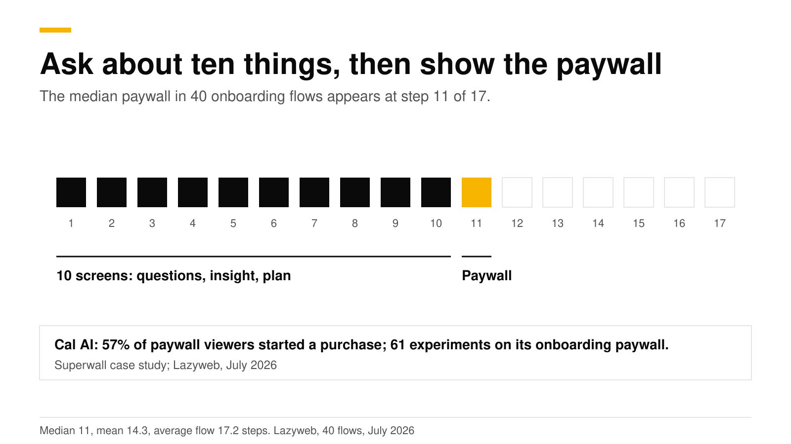
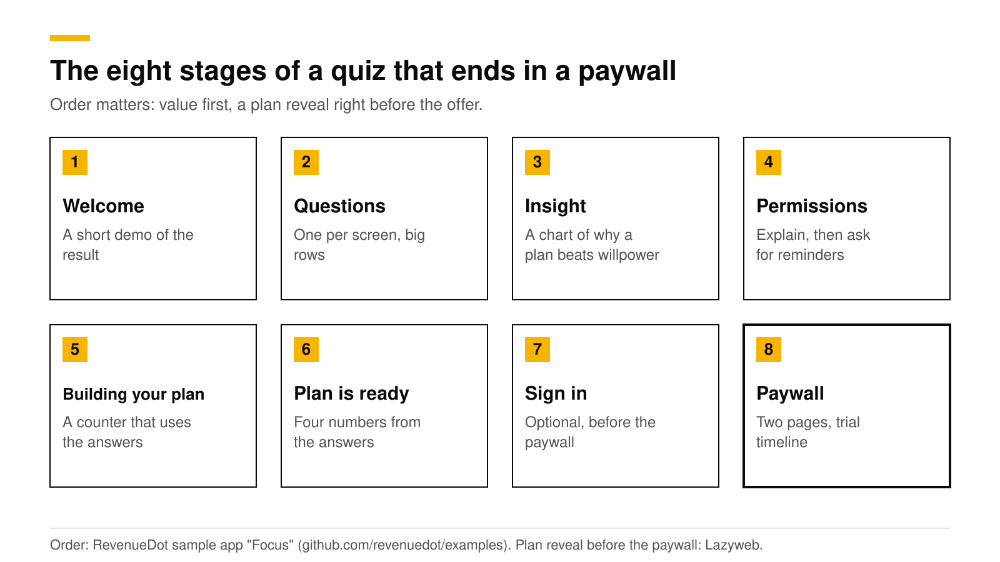
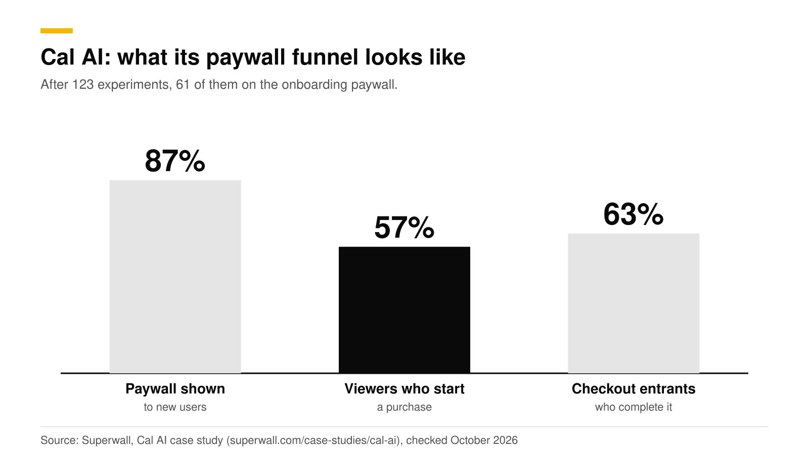
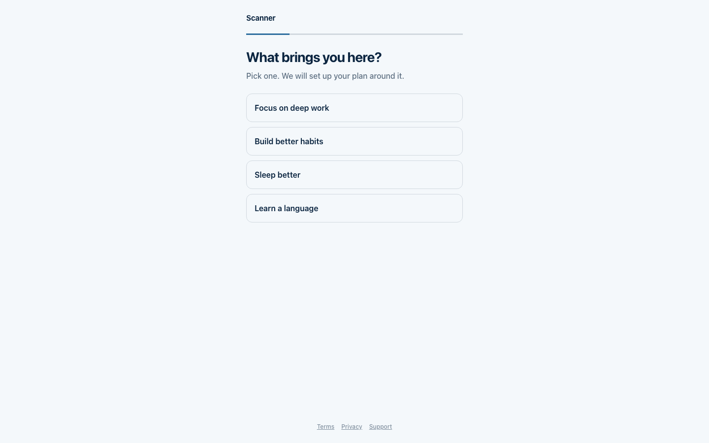

# Onboarding quiz before a paywall: steps, order and why it works

The strongest 2026 pattern for a hard paywall is a long onboarding quiz that ends in a personalized plan, with the paywall right after it. In a July 2026 study of 40 onboarding flows, the median paywall appeared at step 11, in flows averaging 17.2 steps. Cal AI, the best-known example, reports that 57% of the people who see its paywall start a purchase. The quiz works because it makes the user invest effort, and it lets the paywall speak in the user's own words.

This post gives the steps, the order, the reasons, and how to build the pattern. It is part of our [paywall best practices guide](paywall-best-practices-2026.md). We cite each source and checked them in October 2026.

## Key numbers

- **Median paywall position: step 11.** Mean 14.3, average flow 17.2 steps, across 40 onboarding flows in about 800 tracked apps, July 2026. Headspace showed it at step 11 of 17, Strava at 18 of 22, and Finch at 31 of 46 ([Lazyweb](https://www.lazyweb.com/research/how-many-steps-before-the-paywall-in-onboarding)).
- **A generic screen came right before the paywall in 28 of 40 flows.** Lazyweb recommends a value recap or a plan reveal there instead ([Lazyweb](https://www.lazyweb.com/research/what-screen-comes-right-before-the-onboarding-paywall)).
- **Cal AI:** 123 paywall experiments over two years, 61 of them on the onboarding paywall. Trial-to-paid conversion rose 31%, 87% of new users saw a paywall, and 57% of viewers started a purchase ([Superwall case study](https://superwall.com/case-studies/cal-ai)).
- **89.4% of trial starts happen on install day**, so the quiz and paywall decide most of your trials ([Adapty](https://adapty.io/blog/mobile-app-monetization-2026/)).
- **About +10% conversion** from adding a "How did you hear about us?" question to a health and fitness app's onboarding, per Adapty's professional services team ([Adapty](https://adapty.io/blog/how-to-personalize-onboarding-and-paywalls-in-your-mobile-app/)).

## How long should the quiz be?

Ten to fifteen steps is the practical range. The median is step 11, but the spread is wide: Finch asks 30 steps before its paywall, and the average flow in the sample is 17.2 steps long. Length is not the goal. Each question has to change something the user sees later, or it is only friction. Adapty's guidance on personalization says the same: it works best when answers change the screens that follow.

A good test for each question is whether you will use the answer in at least one of three places: the plan summary, the paywall headline, or the app itself after purchase. If not, cut it.

## Why does a long quiz help?

1. **It builds commitment.** A user who has answered ten questions has put in effort and wants to see the result. The paywall arrives at the moment they are most interested.
2. **It makes the paywall personal.** The headline can say "Your plan for deep work is ready" and not "Unlock Pro". Personalized copy gives the paywall something specific to sell.
3. **It shows value before price.** A plan reveal is a small proof that the app works for this person. Lazyweb's finding that most flows skip it, and that the exceptions are plan-ready and summary screens, points at an open opportunity.
4. **It collects data you keep.** Answers become attributes you can use for targeting, copy and analytics after purchase.

A caution: these are reasons the pattern might work, and the hard evidence is on the outcomes (Cal AI's numbers, the median step). No source we found isolates the effect of quiz length alone.

## What are the stages, in order?

1. **Welcome with a short demo of the result.** Show what the app produces. ScreensDesign's capture of Cal AI's onboarding starts with a splash and a preview of food scanning ([ScreensDesign](https://screensdesign.com/explore/apps/cal-ai/onboarding/)).
2. **Questions, one per screen.** Big answer rows, a fixed Continue button at the bottom, a strong selected state, and a progress bar. ScreensDesign describes Cal AI's questionnaire the same way, with binary choices, single-select rows, icon-paired choices and unit toggles for height and weight.
3. **An insight screen.** Halfway through, show a chart or one sentence that explains why a plan beats willpower. Cal AI interrupts its questions with a weight-trend illustration. Label any illustration as one.
4. **Permissions, after a reason.** Explain why you want notifications ("so we can remind you"), then ask.
5. **"Building your plan".** A short counter or progress animation that uses the user's answers. It takes a few seconds and signals that the result is made for them.
6. **Plan is ready.** Show four or five numbers from the answers: daily minutes, start time, days to a habit.
7. **Sign in, if you need it.** Keep it short, or put it after the paywall if your product allows.
8. **The paywall.** See [Multi-page paywalls](multi-page-paywalls.md) for the layout and [Free trial timeline paywall](free-trial-timeline-paywall.md) for the trial section.

| Stage | What the user sees | Where the answers get used |
|---|---|---|
| Questions | One question per screen, a progress bar, a fixed Continue button | Saved as customer attributes |
| Insight | A chart or sentence about why a plan works | Nowhere yet. It rests the user between questions |
| Building your plan | A counter that finishes in a few seconds | Shows the answers back ("for deep work, 30 minutes a day") |
| Plan is ready | Four or five numbers built from the answers | Sets the paywall headline |
| Paywall | Headline in the user's words, trial timeline, plans | Targeting and experiments by attribute |

Steps 5 and 6 are our recommendation, based on Lazyweb's finding that value-reveal screens are rare right before the paywall and its advice to add one.

## What did Cal AI actually do?

Superwall's case study gives these numbers: 123 A/B experiments on iOS in two years, 160 unique paywall designs, 424 variants, 46 trigger points, and about five real experiments a month. The three funnel rates are 87% of new users shown a paywall, 57% of paywall viewers starting a purchase, and 63% of checkout entrants completing it. Trial-to-paid conversion rose 31% over 12 months and monthly revenue more than tripled in 10 months.

Read this as a measure of process as much as design. Cal AI shipped many small tests. Adapty's 2026 data points the same way: apps running 50 or more experiments earned 18.7 times the median revenue of single-experiment apps, a correlation and not a cause ([Adapty](https://adapty.io/state-of-in-app-subscriptions/)).

## What should you avoid?

- **A rating prompt in the quiz.** RevenueCat reports Apple rejecting these under guideline 5.6.3. Ask after the user finishes something instead. See [Apple's rejection rules](apple-free-trial-toggle-rejection.md).
- **A free-trial switch on the paywall.** Apple rejects it under guideline 3.1.2.
- **Questions you never use.** Each one costs a fraction of your audience.
- **A fake plan.** Build the plan from the answers, even with simple rules.

## How to do this with RevenueDot

You can build the quiz in your app, on the web, or both.

**In the app.** The open-source [Focus sample app](https://github.com/revenuedot/examples) has the full pattern: one question per screen, an insight screen, a reminders permission screen, "Building your plan", a plan summary, a two-page paywall with a trial timeline and annual pre-selected, and an exit offer. It saves each answer as a customer attribute named `onboarding_<question id>`, so audiences and experiments can use it.

1. Copy the quiz flow from the sample for your platform.
2. Save answers as attributes with the SDK.
3. Build the paywall from the **Trial timeline** or **Story pages** template in **Paywalls**. See the [paywalls guide](https://revenuedot.app/docs/guides/paywalls).
4. Under **Targeting > Audiences**, build an audience from an attribute such as `onboarding_goal`, and show a different offering to it. A rule can also set an offering for a placement, such as `onboarding_end`. See [targeting and experiments](https://revenuedot.app/docs/guides/targeting-and-experiments).

**On the web.** A RevenueDot [funnel](https://revenuedot.app/docs/guides/funnels) is a web-to-app onboarding quiz: question, info and email steps, then a paywall step that sells your web plans on Stripe Checkout, then a success step that opens the app with a redemption link.

1. Open **Funnels** and select **Create funnel**. Start from the starter, a blank funnel, or **Build with AI**.
2. Add `question` steps with 1 to 8 answers. Give each an `attribute` so the answer is saved on the customer when they pay.
3. Add an `info` step for the plan reveal, an `email` step, and the `paywall` step with your annual package highlighted.
4. Use `next` on an answer to branch the path.
5. Publish, share the public URL, and read drop-off per step on the **Analytics** tab.

Funnels cover the web path. They do not yet support A/B tests of funnel steps. See the [funnels feature page](https://revenuedot.app/features/funnels), and watch the result on the [paywall conversion chart](https://revenuedot.app/charts/paywall-conversion-rate).

[Start free on RevenueDot Cloud](https://app.revenuedot.app/signup) (free up to $10,000 monthly tracked revenue).

## FAQ

### How many questions should an onboarding quiz have?

Plan for ten to fifteen steps before the paywall. The median paywall in Lazyweb's July 2026 sample sat at step 11. Drop any question whose answer you do not use later.

### What is the Cal AI onboarding pattern?

A long personalized quiz, then a plan reveal, then a hard paywall that was tuned through 61 experiments. Superwall's case study reports 57% of Cal AI's paywall viewers start a purchase.

### Should the paywall come before or after sign-in?

Either can work. The flows in the Lazyweb sample vary, and no source we found measured the order. Keep sign-in short, and test both if sign-in is optional.

### Does a quiz work for apps that are not health apps?

The sample app and the sources here are mostly health, habit and lifestyle apps, so the evidence is strongest there. Apps in categories where decisions take longer, such as education, may suit a softer path. Test it.

### Can I run the quiz on the web before the app install?

Yes. A RevenueDot funnel runs on a public URL, takes payment on Stripe Checkout, and sends the user into the app with a redemption link. Keep store rules in mind for what the app itself may promote.

**About RevenueDot.** RevenueDot is an open-source (AGPL-3.0) backend for in-app purchases and subscriptions on the App Store, Google Play and the web. Start free on [RevenueDot Cloud](https://app.revenuedot.app/signup): free up to $10,000 in monthly tracked revenue, then 0.5%, never more than $999 a month. New apps install the [RevenueDot SDK](../docs/sdks/README.md) and pass their key. Apps that ship the RevenueCat SDK point its proxy URL at RevenueDot and keep their code, offerings and customers. Read the [quickstart](../docs/getting-started/quickstart.md) or the code on [GitHub](https://github.com/revenuedot/revenuedot).
