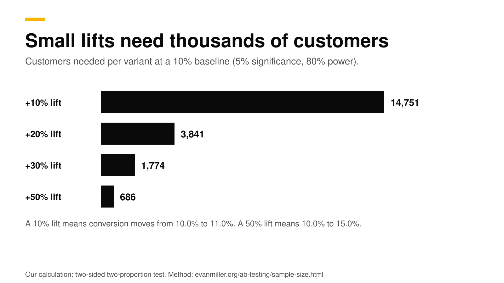
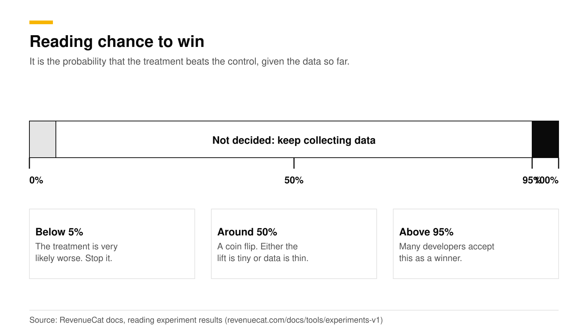
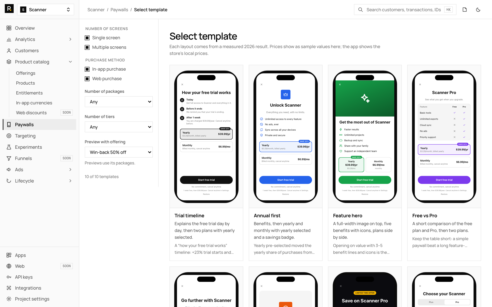

# Paywall A/B testing: what to test, sample size, results

Test one change at a time, start with the plan shown first and the number of plans, and fix the sample size before you launch. A paywall that converts 10% of viewers needs about 3,800 customers per variant to detect a 20% lift, and about 14,800 to detect a 10% lift. Run the test until you reach that number, judge it by revenue per customer and chance to win, and treat 95% as the bar for a winner.

This guide gives a test order with sourced results, a sample size table you can check yourself, run times, and how to read results in RevenueDot's targeting and experiments. It is part of our [paywall best practices guide](paywall-best-practices-2026.md). Facts are the sources', checked in October 2026.

## The short answer

- **Test order:** the plan shown first, the number of plans, the price display, then an exit offer and the page count. These changed results in published studies.
- **Sample size:** at a 10% baseline, 3,841 customers per variant detects a 20% relative lift. At a 2% baseline the same lift needs 21,108 (our calculation, 5% significance, 80% power).
- **Run time:** until you hit the planned sample size, plus the trial length if you judge paid conversion.
- **Do not peek and stop.** Checking until the result looks good raises false wins, from a nominal 5% to 26.1% in one published example ([Evan Miller](https://www.evanmiller.org/how-not-to-run-an-ab-test.html)).
- **Read results by revenue per customer.** RevenueCat's docs say realized LTV per paying customer should often be the primary success measure ([RevenueCat](https://www.revenuecat.com/docs/tools/experiments-v1/experiments-results-v1)).
- **Chance to win:** the probability that the treatment beats the control. Most developers accept 95% (same source).

## What should you test first?

Test the changes with the largest published effects first, since small copy tweaks need far more traffic to show up. RevenueCat's experiments cover product pricing, offers such as trial length, paywall design and retention messages ([RevenueCat docs](https://www.revenuecat.com/docs/tools/experiments-v1)). The table orders ideas by how big the reported effect was.

| Order | Test | Reported result | Source |
|---|---|---|---|
| 1 | Longest plan selected by default | Yearly share of purchases went from 37% to 63% in one case | [Superwall newsletter](https://superwall.com/blog/the-superwall-newsletter-volume-1) |
| 2 | Two or three plans instead of one | Conversion up 61% with two products and 44% with three, against one | [Superwall newsletter](https://superwall.com/blog/the-superwall-newsletter-volume-1) |
| 3 | Annual price shown as a monthly rate | Recommended to reduce sticker shock | [Superwall newsletter](https://superwall.com/blog/the-superwall-newsletter-volume-1) |
| 4 | An offer after a cancelled purchase | 17% of total revenue across 18 companies, with refunds at 3.3% against 6.8% | [Superwall](https://superwall.com/blog/17-revenue-boost-with-transaction-abandon-paywalls-a-case-study) |
| 5 | Several onboarding pages instead of one | 12.41% against 9.07% conversion over 40 million paywall opens | [Superwall](https://superwall.com/blog/new-postmulti-page-onboarding-paywalls-convert-37-better-than-single-page-heres-why) |

These come from vendor data on their own customers. Your result will differ, which is the reason to test. Each row has a deeper post: [weekly vs annual plans](weekly-vs-annual-subscriptions.md), [exit offers](paywall-exit-offers.md) and [multi-page paywalls](multi-page-paywalls.md).

Change one thing per test. If the copy, the price and the layout all change, a win tells you nothing about which part worked.

## How many customers does each variant need?

It depends on your baseline conversion and on the smallest lift you care about. The table uses the standard two-proportion formula with 5% significance (two-sided) and 80% power. It is our calculation, and [Evan Miller's calculator](https://www.evanmiller.org/ab-testing/sample-size.html) lets you check your own numbers.

| Baseline conversion | +10% lift | +20% lift | +30% lift | +50% lift |
|---|---|---|---|---|
| 2% | 80,681 | 21,108 | 9,797 | 3,825 |
| 5% | 31,233 | 8,158 | 3,780 | 1,470 |
| 10% | 14,751 | 3,841 | 1,774 | 686 |

The numbers are customers per variant. A "+20% lift" is relative: 10.0% becomes 12.0%. A paywall with a 10% baseline is realistic for a hard paywall, whose median Day-35 conversion was 10.7% in RevenueCat's 2026 report. For freemium apps it was 2.1% (same report, [RevenueCat](https://www.revenuecat.com/blog/growth/subscription-app-trends-benchmarks-2026)), so freemium tests need far more traffic.

Two things follow from the table.

1. **Small apps should test big changes.** If 150 new customers see your paywall each day, a two-variant test at 10% baseline and a 20% lift needs 7,682 customers, which is about 51 days. A 50% lift needs 1,372, which is about 9 days.
2. **RevenueDot's floor is not a power calculation.** RevenueDot's docs say to wait for at least 100 customers in each variant before reading results ([targeting and experiments](https://revenuedot.app/docs/guides/targeting-and-experiments)). That is the minimum for the numbers to mean anything, and the table is what you need for a reliable call.

## How long should a test run?

Run until you reach the sample size you chose before launch. Then add the time your metric needs to arrive.

- **Fix the stopping rule first.** Evan Miller's advice is short: decide the sample size in advance and wait until the experiment is over before you believe the numbers ([Evan Miller](https://www.evanmiller.org/how-not-to-run-an-ab-test.html)). Looking daily is fine. Stopping because a day looked good is not.
- **Wait for trials to finish.** RevenueCat notes that converted trials lag trial starts by the length of the trial ([RevenueCat docs](https://www.revenuecat.com/docs/tools/experiments-v1/experiments-results-v1)). With a 7-day trial, add a week before you judge paid conversion.
- **Cover whole weeks.** Traffic changes by weekday, so a test that ends mid-week is biased. This is our rule of thumb and not a sourced figure.
- **No time limit exists.** RevenueCat says there is no time limit on tests, so choose the timescale that matters to your business ([RevenueCat docs](https://www.revenuecat.com/docs/tools/experiments-v1/experiments-overview-v1)).

Run several tests at once only on separate audiences, or on different parts of the same audience that do not overlap. RevenueCat says tests can run together on distinct audiences ([RevenueCat docs](https://www.revenuecat.com/docs/tools/experiments-v1)).

## How do you read chance to win?

Chance to win is the probability, given the data so far, that the treatment performs better than the control. RevenueCat defines it that way and says most developers consider 95% enough to declare a winner ([RevenueCat docs](https://www.revenuecat.com/docs/tools/experiments-v1/experiments-results-v1)). RevenueDot's results show the same idea for conversion.

| Chance to win | What it means | What to do |
|---|---|---|
| Below 5% | The treatment is very likely worse | Stop it |
| 5% to 95% (about 50% means no visible difference) | Not decided | Keep running to the planned sample size |
| Above 95% | A likely winner | Check revenue per customer and refunds, then ship |

Conversion is not revenue. RevenueDot's experiment counts conversions as any purchase or trial after enrollment, and it also shows trials, revenue and revenue per customer ([targeting and experiments](https://revenuedot.app/docs/guides/targeting-and-experiments)). A variant can win on trial starts and lose on revenue if its trials do not convert. Read revenue per customer before you ship, and look at refunds. In the Superwall study above, refunds were part of why an offer worked.

## What are Apple's rules for tests?

Remote experiments are allowed, and every variant must meet App Store rules. Superwall's reading is that remote paywall updates and experiments are fine as long as each variant complies, and that Apple banned the free-trial toggle ([Superwall](https://superwall.com/blog/external-checkout-a-b-testing-and-trial-toggles-confirmed-apples-rules-for-ios)). Do not test a trial toggle. Read [what Apple rejects](apple-free-trial-toggle-rejection.md) before you design variants, and keep the real price and period visible on every one ([Apple App Review Guidelines](https://developer.apple.com/app-store/review/guidelines/)).

## Do it with RevenueDot

RevenueDot's experiments compare two offerings: a control and a treatment. Each offering holds its own packages and paywall, so a test is "offering A against offering B".

1. **Build both offerings.** In **Product catalog**, create the variant offering, such as one with the annual plan first. Build or edit the [paywall](https://revenuedot.app/docs/guides/paywalls) for each.
2. **Choose an audience.** Under **Targeting > Audiences**, build one from country, platform, app version, subscription status (`active`, `trialing`, `expired`, `never`), spend or any custom attribute. Use **Preview** to see how many customers match today. A test of a new-user paywall should use `never`.
3. **Create the experiment.** Under **Experiments**, select **New experiment**, pick both offerings, the audience and the share of customers to enroll, then **Start**.
4. **Let enrollment settle.** Matching customers are enrolled the next time the app fetches offerings and always keep the same variant. Enrollment sends an `EXPERIMENT_ENROLLMENT` webhook, and enrolled customers' purchase, renewal and cancellation webhooks carry an `experiments` list, so your own analytics can follow them.
5. **Read Results.** You get customers per variant, conversions, trials, revenue, revenue per customer and the chance the treatment converts better.
6. **Decide.** Use the table above. **Pause** keeps enrolled customers on their variant and enrolls no one new. **Stop** ends it for good.

Targeting rules still apply to everyone else. Rules are checked from the top, and the first live rule that matches decides. An offering assigned to one customer through the API wins over targeting.

RevenueDot's experiments are simpler than some hosted tools: two variants, no early-winner prediction and no multi-variant tests.

See the [experiments feature page](https://revenuedot.app/features/experiments) and the [paywall conversion chart](https://revenuedot.app/charts/paywall-conversion-rate) for what you can measure. The [paywall abandonment chart](https://revenuedot.app/charts/paywall-abandonment-rate) shows how many viewers leave without starting a purchase.

[Start for free on RevenueDot Cloud](https://app.revenuedot.app/signup). Pro costs $0 until your apps make $10,000 a month.

## FAQ

### What should I A/B test on a paywall first?

The plan shown first, the number of plans and how the price is displayed. In Superwall's data, selecting the longest plan by default moved yearly purchases from 37% to 63% in one case, and showing two plans lifted conversion 61% against one.

### How many users do I need for a paywall A/B test?

At a 10% baseline conversion, about 3,841 per variant to detect a 20% relative lift, and 14,751 for a 10% lift. At a 2% baseline the 20% case needs 21,108. These are our calculations at 5% significance and 80% power.

### How long should a paywall test run?

Until you reach the planned sample size, plus the trial length if you judge paid conversion. A 7-day trial adds about a week. Do not stop early because a day looked good.

### What is chance to win in an experiment?

It is the probability that the treatment beats the control given the data so far. RevenueCat says most developers accept 95% to call a winner. Check revenue per customer too.

### Can I run two paywall tests at the same time?

Yes, on distinct audiences, or on separate subsets of one audience. Overlapping tests on the same customers muddy both results.

**About RevenueDot.** RevenueDot is an open-source (AGPL-3.0) backend for in-app purchases and subscriptions that works with the RevenueCat SDK. Start for free on [RevenueDot Cloud](https://app.revenuedot.app/signup): Pro costs $0 until your apps make $10,000 a month, then 0.5% of revenue above $10,000, never more than $999 a month. Point the SDK's proxy URL at RevenueDot and keep your app code, your offerings and your customers. Read the [quickstart](../docs/getting-started/quickstart.md) or the code on [GitHub](https://github.com/revenuedot/revenuedot).
