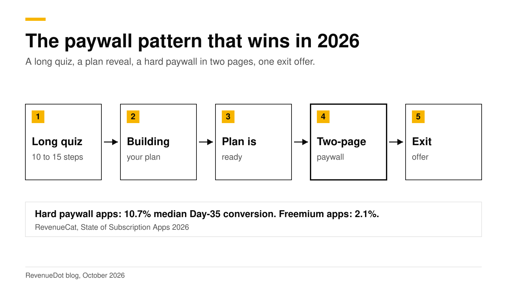
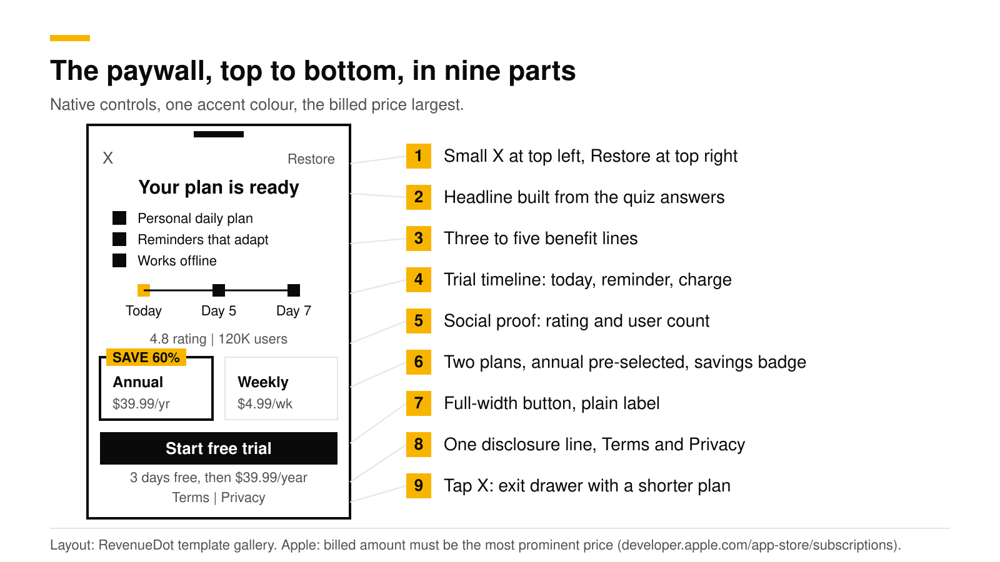
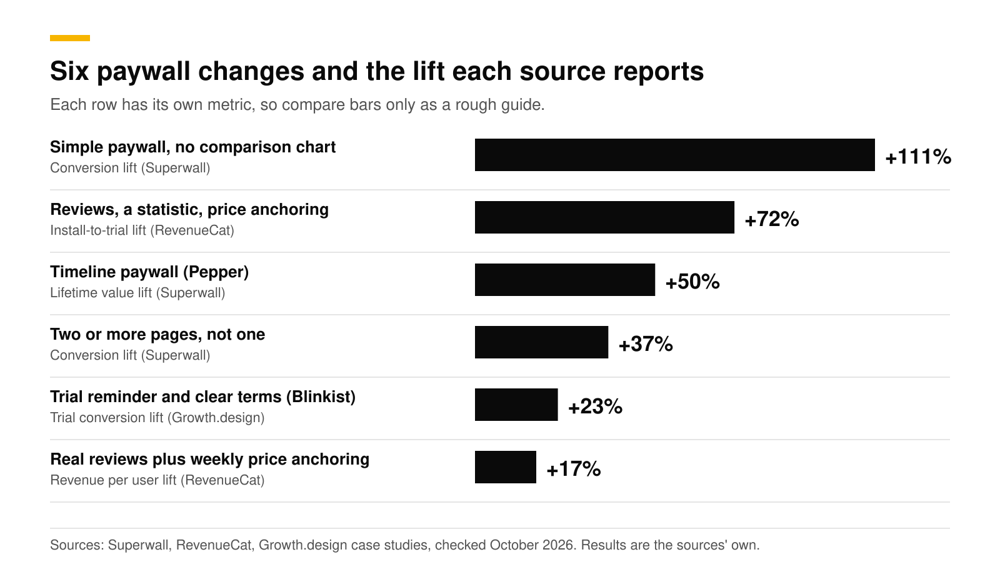

# Paywall best practices for 2026: what the data says

The paywall pattern with the strongest 2026 data is a hard paywall at the end of a long, personalized quiz. The paywall opens on value, explains the free trial as a timeline, pre-selects one plan, and shows a second offer when the user closes it. RevenueCat reports that hard paywalls reach a median 10.7% conversion by Day 35, against 2.1% for freemium apps.

This post is the map. Each section gives the data for one decision and links to a deeper post. Every number is the source's own result, with the source linked, checked in October 2026. We do not publish results from RevenueDot customers.

## Key numbers

- **10.7% vs 2.1%.** Median Day-35 conversion for hard-paywall apps against freemium apps, and $3.09 vs $0.38 revenue per install at day 60 ([RevenueCat, State of Subscription Apps 2026](https://www.revenuecat.com/blog/growth/subscription-app-trends-benchmarks-2026)).
- **89.4% of trial starts happen on install day** ([Adapty, State of In-App Subscriptions 2026](https://adapty.io/blog/mobile-app-monetization-2026/)). RevenueCat's 2025 report puts the share at 82% ([RevenueCat 2025](https://revenuecat.com/state-of-subscription-apps-2025)). Your first session is your trial funnel.
- **12.41% vs 9.07%.** Conversion of multi-page onboarding paywalls against single-page ones, across 40 million paywall opens ([Superwall](https://superwall.com/blog/new-postmulti-page-onboarding-paywalls-convert-37-better-than-single-page-heres-why)).
- **+23% trial conversions and 55% fewer complaints** after Blinkist explained its trial and offered a reminder ([Growth.design](https://growth.design/case-studies/trial-paywall-challenge)).
- **55.5% of subscription revenue comes from weekly plans**, up from 43.3% two years earlier ([Adapty](https://adapty.io/blog/mobile-app-monetization-2026/)).
- **17% of total revenue** came from discounted offers shown after a cancelled purchase, across 18 companies ([Superwall](https://superwall.com/blog/17-revenue-boost-with-transaction-abandon-paywalls-a-case-study)).

## Should the paywall be hard or soft?

A hard paywall is the stronger default for apps whose value shows up in the first session. RevenueCat's 2026 data has hard paywalls at $3.09 per install by day 60 against $0.38 for freemium, and one-year retention of yearly subscribers is close to equal (27% against 28%). The cost is a higher refund rate, which RevenueCat's 2025 report put at 5.8% against 3.4%.

Freemium still wins when your growth comes from a free tier that spreads by word of mouth, or when users need weeks to see value. Read the full numbers in [Hard paywall vs freemium](hard-paywall-vs-freemium.md).

## How long should the quiz be before the paywall?

Ask about ten things, then show the paywall. Lazyweb studied 40 onboarding flows in July 2026: the median paywall appeared at step 11, the average flow had 17.2 steps, and some flows put it at step 31 of 46 ([Lazyweb](https://www.lazyweb.com/research/how-many-steps-before-the-paywall-in-onboarding)). Cal AI, a calorie-tracking app, ran 61 experiments on its onboarding paywall and reports that 57% of paywall viewers start a purchase ([Superwall case study](https://superwall.com/case-studies/cal-ai)).

The order we suggest: questions, an insight screen, a "building your plan" moment, a plan summary, then the paywall. Lazyweb found a generic screen right before the paywall in 28 of 40 flows, and recommends a value recap or plan reveal there instead. The steps are in [The onboarding quiz before a hard paywall](onboarding-quiz-before-paywall.md).

## What belongs on the paywall?

Top to bottom:

1. A small, low-contrast X at the top left and Restore at the top right. Apple requires a way to restore purchases on the sign-up screen ([Apple, subscriptions](https://developer.apple.com/app-store/subscriptions/)).
2. A headline built from the user's answers.
3. Three to five benefit lines.
4. The trial timeline: today, a reminder, the charge date.
5. Social proof that is real: a rating, a user count, one review.
6. Two plan cards with one pre-selected and a savings badge.
7. A full-width button with a plain label.
8. One disclosure line with the trial length and the price after it, then Terms and Privacy.
9. An exit drawer when the user taps X.

Plain beats busy. In a Superwall test, a stripped-down paywall (an image, a headline and a button) beat a feature-comparison chart by 111% ([Superwall](https://superwall.dev/blog/the-paywall-tactics-behind-usd100k-month-apps)). In the same article, plain plan names plus "No commitment, cancel anytime" under the button added 10%.

## Which changes moved the numbers most?

| Change | Reported result | Source |
|---|---|---|
| Simple paywall instead of a comparison chart | +111% | [Superwall](https://superwall.dev/blog/the-paywall-tactics-behind-usd100k-month-apps) |
| Reviews, a strong statistic and price anchoring | +72% install-to-trial | [RevenueCat case studies](https://www.revenuecat.com/blog/growth/paywall-redesigns-case-studies/) |
| Timeline paywall (Pepper) | +50% lifetime value | [Superwall](https://superwall.com/case-studies/pepper) |
| Two or more pages instead of one | 12.41% vs 9.07% conversion | [Superwall](https://superwall.com/blog/new-postmulti-page-onboarding-paywalls-convert-37-better-than-single-page-heres-why) |
| Trial transparency and a reminder offer (Blinkist) | +23% trial conversions | [Growth.design](https://growth.design/case-studies/trial-paywall-challenge) |
| Real reviews plus weekly price anchoring | +17% revenue per user | [RevenueCat case studies](https://www.revenuecat.com/blog/growth/paywall-redesigns-case-studies/) |

Two cautions. The metrics differ by row, so compare within a row only. And the RevenueCat redesigns also added a trial toggle, which Apple now rejects (next section).

## What does Apple reject in 2026?

Two common 2025 tactics now cause App Review problems:

- **The free-trial toggle.** Since mid-January 2026, apps with a switch that adds or removes the trial have been rejected under guideline 3.1.2 ([RevenueCat](https://www.revenuecat.com/blog/growth/rip-toggle-paywall)). Ship a separate plan card with the trial instead. See [Apple's free-trial toggle rejection](apple-free-trial-toggle-rejection.md).
- **A rating prompt in onboarding.** RevenueCat reports Apple citing guideline 5.6.3 for this ([RevenueCat](https://www.revenuecat.com/blog/engineering/dont-prompt-ratings-during-onboarding)). Guideline 5.6.1 says to use Apple's own review prompt and disallows custom review prompts ([Apple](https://developer.apple.com/app-store/review/guidelines/)). Ask after the user finishes something.

Apple also requires that the billed amount be the most prominent price on the purchase screen, with any per-week breakdown smaller and below it ([Apple, subscriptions](https://developer.apple.com/app-store/subscriptions/)).

## How should you show the free trial?

As a timeline with dates. Blinkist's variant addressed the fear of forgetting to cancel, and push-reminder opt-in went from 6% to 74% ([Growth.design](https://growth.design/case-studies/trial-paywall-challenge)). Pepper's timeline paywall raised lifetime value by 50% and outperformed every other paywall the team tested. Build instructions are in [Free trial timeline paywall](free-trial-timeline-paywall.md).

## Weekly, monthly or annual?

Show at least two plans and pre-select one. Weekly plans now earn 55.5% of subscription revenue, and install-to-trial conversion is 9.8% for weekly plans against 1.8% for annual ([Adapty](https://adapty.io/blog/mobile-app-monetization-2026/)). Health & Fitness is the exception, where annual plans earn 60.6% of revenue. Superwall's example is an app where 37% of buyers picked yearly: switching the default to annual could lift that to 63% ([Superwall newsletter](https://superwall.dev/blog/the-superwall-newsletter-volume-1)). See [Weekly vs annual subscriptions](weekly-vs-annual-subscriptions.md).

## One page or several?

Several. Superwall's 2026 sample compared 40 million onboarding paywall opens from February to May 2026 and found 12.41% conversion for multi-page flows against 9.07% for single pages. Multi-page flows were only 24% of the sample, and the comparison is across apps rather than one randomized test, so test it on your own traffic. Layouts are in [Multi-page paywalls](multi-page-paywalls.md).

## What happens when the user leaves?

Show a second offer once. Superwall's study of transaction-abandon offers had a 3.3% refund rate in the offer group and 6.8% in the control group. Superwall also notes that such offers can draw App Review scrutiny, so name the real price and period. See [Paywall exit offers](paywall-exit-offers.md).

## How do you know a change worked?

Test it. Adapty reports that apps running 50 or more experiments earn 18.7 times the median revenue of single-experiment apps, and that trial setup and plan-length changes show larger lifetime value uplifts (59.6% and 58.7%) than price changes (45.5%) ([Adapty](https://adapty.io/state-of-in-app-subscriptions/)). That is a correlation across apps, but the direction is clear: change structure before price.

## How to do this with RevenueDot

1. Open **Paywalls** and pick a template from the gallery: Trial timeline, Annual first, Story pages, Reviews, Limited offer or Web checkout. Choose the offering, add your app name, accent color and Terms and Privacy links. See the [paywalls guide](https://revenuedot.app/docs/guides/paywalls) and the [paywalls feature page](https://revenuedot.app/features/paywalls).
2. Edit it in the visual editor, or describe the app and let the AI generator draft it.
3. Show it with `PaywallView()` (iOS) or the matching call on Android, React Native and Flutter. Publishing changes the paywall without an app release.
4. Build a second paywall and run an A/B test between two offerings. Results show customers per variant, conversions, revenue per customer and the chance the treatment converts better. See [targeting and experiments](https://revenuedot.app/docs/guides/targeting-and-experiments) and the [experiments feature page](https://revenuedot.app/features/experiments).
5. For a quiz that runs on the web before the app, use [funnels](https://revenuedot.app/docs/guides/funnels) ([funnels feature page](https://revenuedot.app/features/funnels)). Answers become customer attributes.
6. Track the result on the [paywall conversion chart](https://revenuedot.app/charts/paywall-conversion-rate) and the [trial conversion rate chart](https://revenuedot.app/charts/trial-conversion-rate).

The open-source [Focus sample app](https://github.com/revenuedot/examples) follows this pattern end to end: an onboarding quiz, a "building your plan" screen, a two-page paywall with a trial timeline, annual pre-selected, and an exit offer. RevenueCat's paywall builder is more mature, and it has an exit-offer editor that RevenueDot does not have yet.

[Start free on RevenueDot Cloud](https://app.revenuedot.app/signup) (free up to $10,000 monthly tracked revenue).

## FAQ

### What is the best paywall type in 2026?

A hard paywall after a long personalized quiz, with a trial timeline and two or more plans. RevenueCat's 2026 data has hard-paywall apps at a 10.7% median Day-35 conversion against 2.1% for freemium. Freemium suits apps that grow through a free tier.

### How many steps should onboarding have before the paywall?

About ten to fifteen. The median paywall in Lazyweb's July 2026 sample of 40 flows sat at step 11 of an average 17.2 steps. Keep one question per screen and show progress.

### Should the paywall have a close button?

Yes, a small low-contrast one. No source we found publishes a measured lift for delaying the close button, and a visible exit lets you show an exit offer. Always include Restore.

### Can I A/B test paywalls on iOS?

Yes. Superwall reports that Apple said remote paywall updates and A/B tests are allowed, and that every variant must still follow the guidelines ([Superwall](https://superwall.com/blog/external-checkout-a-b-testing-and-trial-toggles-confirmed-apples-rules-for-ios)).

### Does RevenueDot give me these paywalls?

RevenueDot has templates for most of this pattern, a visual editor, AI generation, targeting and A/B experiments. Multi-screen navigation inside one paywall and an exit-offer editor are not built yet, as the [paywalls guide](https://revenuedot.app/docs/guides/paywalls) says.

**About RevenueDot.** RevenueDot is an open-source (AGPL-3.0) backend for in-app purchases and subscriptions that works with the RevenueCat SDK. Start free on [RevenueDot Cloud](https://app.revenuedot.app/signup): free up to $10,000 in monthly tracked revenue, then 0.5%, never more than $999 a month. Point the SDK's proxy URL at RevenueDot and keep your app code, your offerings and your customers. Read the [quickstart](../docs/getting-started/quickstart.md) or the code on [GitHub](https://github.com/revenuedot/revenuedot).
