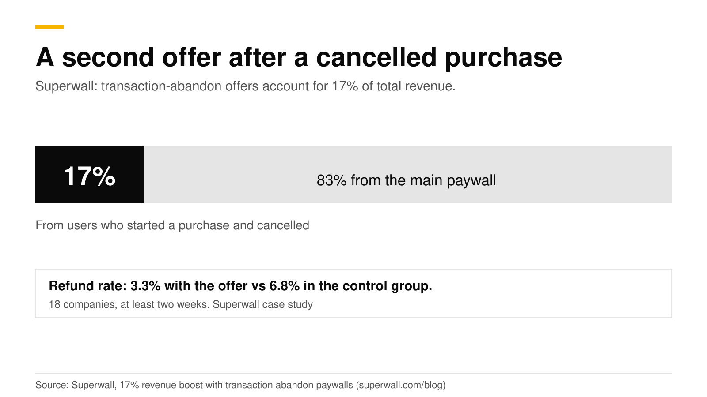
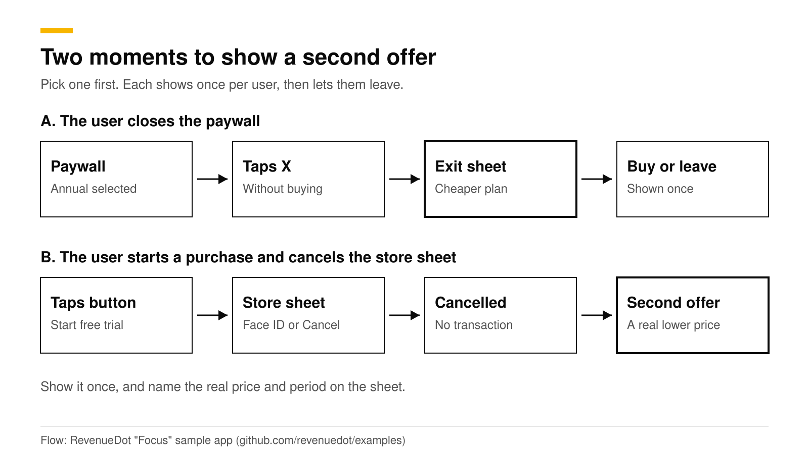
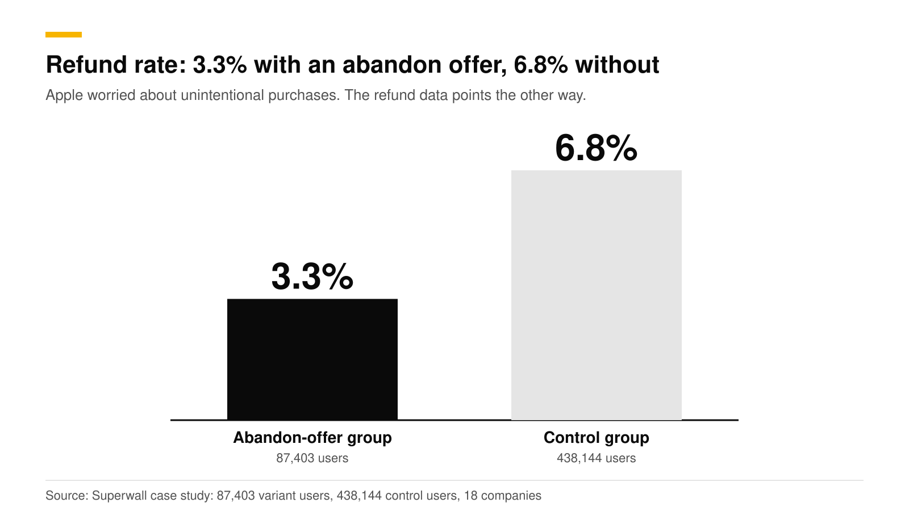

# Paywall exit offers: discount after a cancelled purchase

An exit offer is a second offer shown when a user leaves your paywall, or cancels the store's purchase sheet, without buying. In Superwall's study of 18 companies, discounted offers shown after an abandoned purchase accounted for 17% of total revenue, and the refund rate in the offer group was 3.3% against 6.8% in the control group. Apple has scrutinized the tactic, so show the real price and period, show it once, and let the user leave.

This post separates the two kinds of exit offer, gives the data and the App Store rules, and shows how to build one with RevenueDot. It is part of our [paywall best practices guide](paywall-best-practices-2026.md). Facts are the sources', checked in October 2026.

## The short answer

- **17% of total revenue** came from transaction-abandon paywalls across 18 companies, tested for at least two weeks ([Superwall](https://superwall.com/blog/17-revenue-boost-with-transaction-abandon-paywalls-a-case-study)).
- **Refund rate: 3.3% in the offer group, 6.8% in the control group.** The control group was 438,144 newly installed users. The offer group was 87,403 users who started a purchase and abandoned it (same source).
- **About 20% of paywalled users** reach these offers (same source).
- **Early findings said 25 to 40%.** The final aggregate was the lower 17%, so plan on the lower number.
- **Apple flagged "unintentional purchases"**, and Superwall warns the tactic can lead to App Review issues. The refund data points the other way, but follow the rules below.
- **RevenueCat has a version too:** an exit offer shows another offering when a paywall is dismissed ([RevenueCat](https://www.revenuecat.com/blog/engineering/exit-offers-in-revenuecat-paywalls)).

## What are the two kinds of exit offer?

1. **Exit offer on close.** The user taps X on the paywall without buying. You show a second offer, usually a shorter or cheaper plan: "Not ready to commit for a year?" with a weekly or monthly plan. RevenueCat describes it as presenting another offering at the moment of dismissal, such as a lower price, a longer trial or a monthly option after an annual pitch.
2. **Transaction-abandon offer.** The user taps the purchase button, then cancels at the store's sheet, for example at the Face ID step. Superwall's study is about this moment. The user has shown intent, and a lower price may close the sale.

They solve different problems. The exit-on-close offer catches price-shy users who never started. The abandon offer catches users who got as far as the checkout.

## What do the data say about refunds?

Apple's worry is that a second offer tricks people into buying by accident. Superwall's data does not show it: the offer group's refund rate was about half the control's. Two cautions apply. The groups were not identical in kind (one was all new installs, the other users who abandoned a purchase), and Superwall does not publish which apps took part or the discount sizes. Treat the numbers as a reason to test, not as proof for your app.

## What are the App Store rules?

We checked Apple's guidelines (last updated June 8, 2026) and subscription page in October 2026. We found no rule that bans a second offer. These rules do apply to it:

| Rule | Where | What to do |
|---|---|---|
| Describe what the user gets for the price before asking them to subscribe | Guideline 3.1.2(c) | Name the plan, the price and the period on the offer screen |
| No tricking users into subscribing, no bait-and-switch | Guideline 3.1.2(a) | Do not fake a countdown or a "last chance" that resets |
| Subscription period at least seven days | Guideline 3.1.2(a) | Do not sell a plan shorter than a week |
| Billed amount is the most prominent price | [Apple subscriptions page](https://developer.apple.com/app-store/subscriptions/) | Per-week breakdowns go below it in smaller type |
| A free trial flow must say its length and the price billed after | Apple subscriptions page | State both |
| No free-trial toggle | Guideline 3.1.2 (as enforced) | Offer a separate plan, not a switch |

Source for the guidelines: [Apple App Review Guidelines](https://developer.apple.com/app-store/review/guidelines/). Apple also has its own offer types: introductory offers for new subscribers, promotional offers for existing and former subscribers, offer codes, and win-back offers for people who lapsed ([Apple](https://developer.apple.com/app-store/subscriptions/)). An in-paywall second offer is usually a different product or plan you create in App Store Connect. Introductory offers serve new subscribers, while promotional and win-back offers are for people who already subscribed once.

Superwall's guidance is to act accordingly and expect review attention. A plain, honest second offer is the safest version.

## How do you design an exit offer that works?

1. **Choose what changes.** Options from RevenueCat's list: a lower price, a longer trial, or a shorter plan after an annual pitch. Shorter plans are the easiest to justify because they are a real product with a real price.
2. **Show it once.** After the first dismissal, the next close leaves. Repeating it feels like a trap.
3. **Say the exact price and period.** "$4.99 a week, billed weekly" and the disclosure line.
4. **Make the countdown real.** If the offer says it ends, it must end. A fake timer is a bait-and-switch risk.
5. **Keep an easy way out.** A visible close button and Restore.
6. **Skip people who already bought.** An exit offer must not appear after a purchase. RevenueCat's version does not trigger when the user has completed a purchase.
7. **Measure net revenue.** Count refunds. A higher refund rate can erase the gain, even though Superwall's data showed the opposite.

## How to do this with RevenueDot

RevenueDot gives you four building blocks. The exit-offer setting has no dashboard editor yet.

1. **Build the second offer.** In **Product catalog**, create an offering with the plan you want to show, such as a weekly or lower-priced plan. In **Paywalls**, pick the **Limited offer** template (a countdown, one plan, dark) or **Minimal**, and publish it. See the [paywalls guide](https://revenuedot.app/docs/guides/paywalls). Use a real end date in the countdown.
2. **Attach it to the main paywall.** A paywall's JSON has an `exit_offers.dismiss.offering_id` field. It names the offering to show when the paywall is dismissed, and the server validates its shape. In RevenueDot you set it through the API (`PATCH` the paywall draft), because the editor has no exit-offer control yet. RevenueCat documents the SDK side: the offer shows when the app presents the paywall with `presentPaywall` or `presentPaywallIfNeeded`, and not after a purchase ([RevenueCat](https://www.revenuecat.com/blog/engineering/exit-offers-in-revenuecat-paywalls)).
3. **Or build it in your app.** The open-source [Focus sample app](https://github.com/revenuedot/examples) shows the first close of the paywall with a short sheet offering the shortest plan ("Not ready for a year?"). The second close leaves. For a cancelled purchase, check the result the SDK returns: the RevenueCat SDK reports a user cancellation on `purchase`, and your code can then show the second offer.
4. **Target and test it.** Use **Targeting > Audiences** to show the exit-offer paywall only to the customers you choose, for example those whose subscription status is `never`. Then run an experiment between an offering with the exit offer and one without. Wait for at least 100 customers per variant, and compare revenue per customer and refunds. See [targeting and experiments](https://revenuedot.app/docs/guides/targeting-and-experiments) and the [experiments feature page](https://revenuedot.app/features/experiments).

For customers who already lapsed, Apple's win-back offers work with RevenueDot unchanged. The SDK does the work on the device, and RevenueDot records the offer on each purchase and sends it as `offer_code` in webhooks. See [win-back offers](https://revenuedot.app/docs/guides/win-back-offers).

RevenueCat's paywall builder has an exit-offer editor today, and RevenueDot does not. If a no-code exit-offer toggle is a must-have for you, plan on the API or app code for now. See the [paywalls feature page](https://revenuedot.app/features/paywalls) and the [paywall conversion chart](https://revenuedot.app/charts/paywall-conversion-rate).

[Start free on RevenueDot Cloud](https://app.revenuedot.app/signup) (free up to $10,000 monthly tracked revenue).

## FAQ

### What is a transaction-abandon paywall?

It is a discounted offer shown after a user starts a purchase and cancels it, for example at the Face ID step. Superwall's study of 18 companies found these offers accounted for 17% of total revenue.

### Is an exit offer allowed by Apple?

We found no guideline that bans it. Superwall reports that Apple flagged concerns about unintentional purchases and that the tactic can cause App Review issues. Name the real price and period, avoid fake urgency and show it once.

### Do exit offers increase refunds?

In Superwall's study, no: the refund rate was 3.3% in the offer group and 6.8% in the control group. Check refunds in your own data, since the groups were not alike and the apps were not named.

### What should the offer be: a discount, a shorter plan or a longer trial?

RevenueCat lists a lower price, a longer trial, or a monthly option after an annual pitch. Start with a shorter or cheaper plan, since it is a real product with a clear price, and test the others after.

### Can I build an exit offer in the RevenueDot dashboard?

Not yet. The dashboard builds the second paywall, and the exit-offer link to it is set through the API or in your app code. The [paywalls guide](https://revenuedot.app/docs/guides/paywalls) lists exit offers among the features without an editor.

**About RevenueDot.** RevenueDot is an open-source (AGPL-3.0) backend for in-app purchases and subscriptions on the App Store, Google Play and the web. Start free on [RevenueDot Cloud](https://app.revenuedot.app/signup), free up to $10,000 in monthly tracked revenue, or self-host it with Docker and Postgres. New apps install the [RevenueDot SDK](../docs/sdks/README.md) and pass their key. Apps that ship the RevenueCat SDK point its proxy URL at RevenueDot and keep their code, offerings and customers. Read the [quickstart](../docs/getting-started/quickstart.md) or the code on [GitHub](https://github.com/revenuedot/revenuedot).
