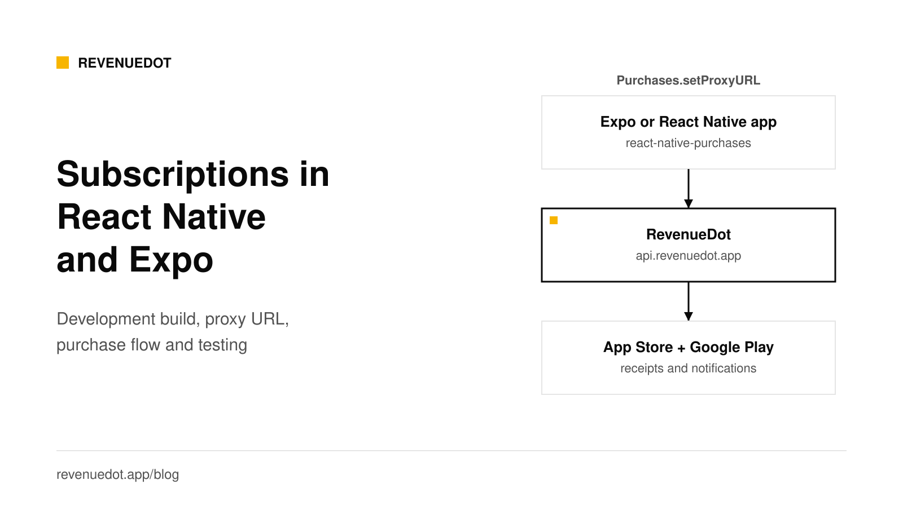
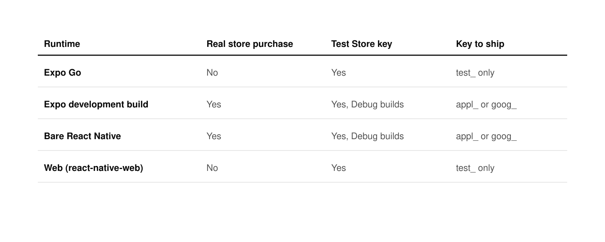

# React Native and Expo subscriptions with react-native-purchases

To add subscriptions to a React Native or Expo app, install the RevenueDot SDK with `npm install react-native-purchases@npm:@revenuedot/react-native-purchases@10.10.2`, build a development build (Expo Go cannot make real store purchases), call `Purchases.configure` with your app's keys, then call `getOfferings`, `purchasePackage` and read `customerInfo.entitlements.active`. RevenueDot is the backend that verifies purchases with Apple and Google. On RevenueDot Cloud the keys are the only setup.



## What you need

- A React Native or Expo project. This tutorial uses Expo with `npx expo`, and notes the bare React Native differences.
- A subscription in App Store Connect, Google Play Console or both.
- A RevenueDot Cloud project. [Sign up free](https://app.revenuedot.app/signup).
- A way to make a native build: Xcode or Android Studio locally, or EAS Build.

## Step 1: Create the subscription in each store

Create the same plan in each store you ship. Apple's [help page](https://developer.apple.com/help/app-store-connect/manage-subscriptions/offer-auto-renewable-subscriptions) covers the subscription group, product ID, duration, price and localizations. Google's [help page](https://support.google.com/googleplay/android-developer/answer/140504) covers the subscription, base plan, prices and activation. Our [SwiftUI](https://revenuedot.app/blog/swiftui-subscriptions-tutorial) and [Android](https://revenuedot.app/blog/android-google-play-billing-subscriptions) tutorials show each store screen.

## Step 2: Connect the stores to RevenueDot

Add an App Store app and a Google Play app in the dashboard.

- **App Store:** the bundle ID, an In-App Purchase key and the Version 2 notification URL. See the [App Store guide](https://revenuedot.app/docs/guides/app-store).
- **Google Play:** the package name, a service account and a Pub/Sub push subscription. See the [Google Play guide](https://revenuedot.app/docs/guides/google-play).

Then create the product on each app, an entitlement `pro` with both products attached, and a current offering `default` with a `$rc_monthly` package. A package holds one product per app, so one offering serves both platforms.


## Step 3: Install the RevenueDot SDK and make a development build

Install the RevenueDot SDK under the name `react-native-purchases` with an npm alias. Use the same command in an Expo app and in a bare React Native app:

```bash
npm install react-native-purchases@npm:@revenuedot/react-native-purchases@10.10.2
```

Your `package.json` then lists `"react-native-purchases": "npm:@revenuedot/react-native-purchases@10.10.2"`, so every `import Purchases from "react-native-purchases"` works. The RevenueDot SDK is built from RevenueCat's open-source SDK (MIT license), so your code imports `react-native-purchases` and calls `Purchases`. It sends every request to RevenueDot and needs no RevenueCat account. The [React Native SDK guide](https://revenuedot.app/docs/sdks/react-native) has the details.

**Set your identifiers.** In `app.json`, the bundle ID and the Android package must match the apps you made in the stores and in RevenueDot:

```json
{
  "expo": {
    "name": "Focus",
    "slug": "focus",
    "ios": { "bundleIdentifier": "com.example.focus" },
    "android": { "package": "com.example.focus" }
  }
}
```

**Why a development build.** The SDK includes native code, and Expo Go is a fixed app that cannot include third-party native libraries. Expo's [development build guide](https://docs.expo.dev/develop/development-builds/introduction/) says to start with `npx expo install expo-dev-client`, then build locally or in the cloud:

```bash
npx expo install expo-dev-client
npx expo run:ios                                            # local iOS build
npx expo run:android                                        # local Android build
eas build --platform ios --profile development              # EAS cloud build
```

RevenueCat's [Expo guide](https://www.revenuecat.com/docs/getting-started/installation/expo) says the SDK detects Expo Go by itself and swaps native calls for JavaScript mocks, and that you need a development build to test real purchases.



With RevenueDot, Expo Go and the web run in a browser mode that accepts only a Test Store key (`test_...`). That is useful for building a paywall before you have any store account. Real purchases need a development build.

## Step 4: Configure the SDK with your app's keys

Call `configure` once at startup with each store's public key from RevenueDot. On RevenueDot Cloud there is nothing else to set, because the SDK already sends its requests to `https://api.revenuedot.app`. Entitlement verification is off by default (`ENTITLEMENT_VERIFICATION_MODE.DISABLED`), so leave it unset.

```ts
// revenuedot.ts
import { Platform } from "react-native";
import Purchases, { LOG_LEVEL } from "react-native-purchases";

let configured: Promise<void> | null = null;

export function configurePurchases(): Promise<void> {
  configured ??= (async () => {
    if (__DEV__) Purchases.setLogLevel(LOG_LEVEL.DEBUG);
    Purchases.configure({
      apiKey: Platform.OS === "ios" ? "appl_YourKey" : "goog_YourKey",
    });
  })();
  return configured;
}
```

Call it once at startup, for example in your root component's effect, and wait for it before you read offerings.

**Expected output:** with debug logging on, Metro shows the SDK's requests going to `api.revenuedot.app`.

**Self-hosting?** Await `Purchases.setProxyURL` with your own server's address before `configure`, and keep the verification mode at its default, `DISABLED`, because your server signs its responses with its own key. The [React Native SDK guide](https://revenuedot.app/docs/sdks/react-native) shows the code.

## Step 5: Build the paywall

A hook keeps the entitlement in sync, and a component shows the packages.

```tsx
// usePro.ts
import { useEffect, useState } from "react";
import Purchases, { CustomerInfo } from "react-native-purchases";

export function usePro() {
  const [isPro, setIsPro] = useState(false);
  useEffect(() => {
    const apply = (info: CustomerInfo) =>
      setIsPro(info.entitlements.active["pro"] !== undefined);
    Purchases.getCustomerInfo().then(apply);
    Purchases.addCustomerInfoUpdateListener(apply);
    return () => { Purchases.removeCustomerInfoUpdateListener(apply); };
  }, []);
  return isPro;
}
```

```tsx
// Paywall.tsx
import { useEffect, useState } from "react";
import { Button, Text, View } from "react-native";
import Purchases, { PurchasesPackage } from "react-native-purchases";
import { configurePurchases } from "./revenuedot";
import { usePro } from "./usePro";

export function Paywall() {
  const [packages, setPackages] = useState<PurchasesPackage[]>([]);
  const [error, setError] = useState<string | null>(null);
  const isPro = usePro();

  useEffect(() => {
    configurePurchases()
      .then(() => Purchases.getOfferings())
      .then((offerings) => setPackages(offerings.current?.availablePackages ?? []))
      .catch((e) => setError(e.message));
  }, []);

  async function buy(pkg: PurchasesPackage) {
    try {
      await Purchases.purchasePackage(pkg);
    } catch (e: any) {
      if (!e.userCancelled) setError(e.message);
    }
  }

  if (isPro) return <Text>You have Pro</Text>;
  return (
    <View style={{ padding: 16, gap: 12 }}>
      {packages.map((pkg) => (
        <Button
          key={pkg.identifier}
          title={`${pkg.product.title}, ${pkg.product.priceString}`}
          onPress={() => buy(pkg)}
        />
      ))}
      <Button title="Restore purchases" onPress={() => Purchases.restorePurchases()} />
      {error ? <Text style={{ color: "red" }}>{error}</Text> : null}
    </View>
  );
}
```

Show your terms and privacy links on the paywall as well. The [restore guide](https://revenuedot.app/docs/help/restore-purchases) explains who owns a restored purchase.

## Optional: identify your own users

Until you tell it otherwise, the SDK uses an anonymous app user ID that starts with `$RCAnonymousID:`. If your app has sign-in, call `logIn` once the customer signs in. Their purchases then follow them across devices, and an anonymous customer's earlier purchases move to the identified user.

```ts
// After your own sign-in succeeds:
const { customerInfo } = await Purchases.logIn(myUserId);

// When the customer signs out:
await Purchases.logOut();
```

RevenueDot keeps one customer record per app user ID and lists the old anonymous ID as an alias. If two accounts restore the same store purchase, the project's transfer behavior decides who owns it. See [customers and app user IDs](https://revenuedot.app/docs/concepts/customers-and-app-user-ids). Use the same ID on iOS, Android and the web, and never put a secret in it, because it appears in dashboards and webhooks.

## Already ship the RevenueCat SDK? Keep it and add one line

If your app already ships RevenueCat's `react-native-purchases` with RevenueCat's backend, you can keep it. Add the proxy URL before `configure`, remove any verification mode setting, and sync once on the first launch of the update.

```diff
 import Purchases from "react-native-purchases";

+await Purchases.setProxyURL("https://api.revenuedot.app");
 Purchases.configure({
   apiKey: Platform.OS === "ios" ? "appl_YourKey" : "goog_YourKey",
 });
+// Once, after this update: send purchases made while the app talked to RevenueCat.
+await Purchases.syncPurchasesForResult();
```

Keep your existing public keys if you ran the [importer](https://revenuedot.app/docs/migrate/importer). Keep the verification mode at its default, `DISABLED`, because RevenueCat's package checks signatures against RevenueCat's key and `ENFORCED` would fail every request. Old app versions keep calling RevenueCat until their owners update, so run both systems side by side for a while. [Connect your app](https://revenuedot.app/docs/getting-started/connect-your-app) shows the code, and [Migrate from RevenueCat](https://revenuedot.app/migrate-from-revenuecat) gives the order of steps.

## Step 6: Test

1. **Without store accounts.** Create a **Test Store** app in RevenueDot, add a product with a Test Store price, and put its `test_` key in `configure`. Run in Expo Go, on the web or in a development build. Tap a package, then **Test valid purchase**. Native builds accept `test_` keys only in debug builds, so switch to `appl_` and `goog_` keys for release.
2. **iOS sandbox.** Build with `npx expo run:ios` or EAS, sign in with a sandbox tester under **Settings, App Store, Sandbox Account**, and buy.
3. **Android.** Add license testers in Play Console, publish an internal test track and install from it.
4. Check the customer in the RevenueDot dashboard. Sandbox purchases are marked as sandbox.

Before you ship, run one sandbox purchase on each store from a development build and check that it reaches the customer page and your webhooks. See [sandbox testing](https://revenuedot.app/docs/guides/sandbox-testing).

## Common errors and fixes

| Symptom | Cause | Fix |
|---|---|---|
| "Wrong API Key" or the app stops in release | A `test_` key in a release build | Ship with `appl_` and `goog_` keys |
| Purchases never complete in Expo Go | Expo Go cannot run native store code | Use a development build |
| Offerings are empty | Offering not current, or product IDs differ from the store | Make the offering current and match the IDs |
| Requests fail with a signature error | `ENFORCED` verification mode with RevenueCat's package or a self-hosted server | Remove it. `DISABLED` is the default |
| Android purchase retries | Google Play app has no service account (RevenueDot answers 503, code 7101) | Add it, then the SDK's retry succeeds |
| Native iOS Test Store shows "No base price found" | A server older than the 2026-09-30 fix | Update your server. Cloud already has it |

## Do it with RevenueDot

1. [Create a free account](https://app.revenuedot.app/signup). Cloud is free up to $10,000 in monthly tracked revenue.
2. Add your App Store and Google Play apps with their credentials.
3. Create the product, the `pro` entitlement and the `default` offering.
4. Install the RevenueDot SDK and call `Purchases.configure` with your `appl_` and `goog_` keys.
5. Build a development build and make a sandbox purchase.

[Start free on RevenueDot Cloud](https://app.revenuedot.app/signup)

## FAQ

### Can I use in-app purchases in Expo Go?

Not real ones. Expo Go cannot include native libraries, and RevenueCat's docs say real purchase testing needs a development build. With RevenueDot you can still run a Test Store purchase in Expo Go using a `test_` key.

### Do I need to eject from Expo?

No. A development build is still an Expo project. Run `npx expo install expo-dev-client` and build with `npx expo run:ios`, `npx expo run:android` or EAS Build.

### Which key goes in `configure`?

Each store has its own public key from RevenueDot: `appl_...` for the App Store and `goog_...` for Google Play. Use a `test_...` key only in debug builds.

### Does react-native-purchases work with a RevenueCat alternative?

Yes. RevenueDot publishes its own build of `react-native-purchases`, which calls RevenueDot by default, so you pass only your keys. RevenueCat's own package works too: set `await Purchases.setProxyURL("https://api.revenuedot.app")` before `configure`, and your other code stays the same.

### How do I migrate an Expo app from RevenueCat to RevenueDot?

Add the proxy URL line, remove any verification mode setting, and call `syncPurchases` once on the first launch of the update. The [migration guide](https://revenuedot.app/blog/migrating-from-revenuecat-without-data-loss) covers importing customers and running both systems side by side.

**About RevenueDot.** RevenueDot is an open-source (AGPL-3.0) backend for in-app purchases and subscriptions on the App Store, Google Play and the web. Start free on [RevenueDot Cloud](https://app.revenuedot.app/signup), free up to $10,000 in monthly tracked revenue, or self-host it with Docker and Postgres. New apps install the [RevenueDot SDK](../docs/sdks/README.md) and pass their key. Apps that ship the RevenueCat SDK point its proxy URL at RevenueDot and keep their code, offerings and customers. Read the [quickstart](../docs/getting-started/quickstart.md) or the code on [GitHub](https://github.com/revenuedot/revenuedot).
