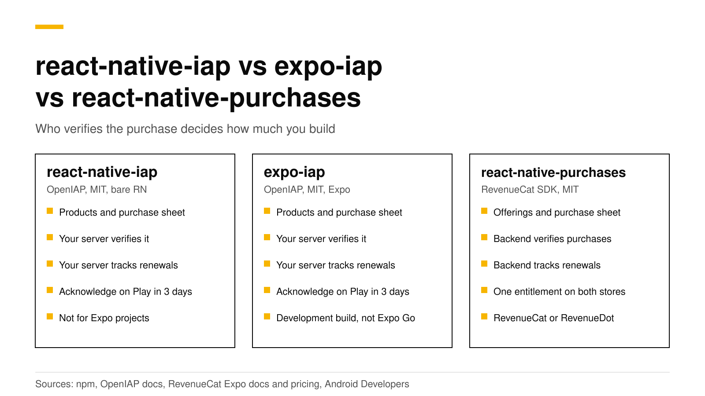

# react-native-iap vs expo-iap vs react-native-purchases: which to use

Use `expo-iap` in an Expo app, or `react-native-iap` in a bare React Native app, when you will run your own server to verify purchases. Use `react-native-purchases` when you want a backend to verify purchases and track subscriptions for you. The first two come from the same OpenIAP project. `react-native-purchases` is RevenueCat's MIT-licensed SDK. It sends every purchase to a backend, which can be RevenueCat or an open-source server such as RevenueDot, and tells your app if the user is Pro on iOS and Android.

This post compares the three packages with code, cost and fit. Every fact about the packages, Expo, Google and RevenueCat links its source and was checked in October 2026.



## The short answer

- **`react-native-iap`** is version 16.7.2, MIT, built on Nitro Modules ([npm](https://www.npmjs.com/package/react-native-iap)). It targets bare React Native 0.79 or later, and its docs say Expo support ended in v15.0.0 ([OpenIAP](https://openiap.dev/docs/setup/react-native)).
- **`expo-iap`** is version 5.8.2, MIT, an Expo Module from the same team ([npm](https://www.npmjs.com/package/expo-iap)). It is the one the OpenIAP docs tell Expo users to install.
- **`react-native-purchases`** is version 10.11.0, MIT, published by RevenueCat ([npm](https://www.npmjs.com/package/react-native-purchases)). It needs a backend that speaks RevenueCat's API.
- **Pick an OpenIAP package** if you already run a backend or must not depend on any vendor.
- **Pick `react-native-purchases`** if you want entitlements, webhooks and charts without writing store server code.
- **Cost:** the OpenIAP packages cost your engineering time. `react-native-purchases` with RevenueCat is free up to $2,500 in monthly tracked revenue, then 1% ([RevenueCat](https://www.revenuecat.com/pricing/)). With RevenueDot Cloud Pro it costs $0 until your apps make $10,000 a month, then 0.5% of revenue above that, never more than $999 a month.

## Is react-native-iap still maintained?

Yes, but it moved. The old `hyochan/react-native-iap` repository is archived, and its notice says the package "is now developed in the monorepo" at `hyodotdev/openiap` ([GitHub](https://github.com/hyochan/react-native-iap)). `expo-iap` lives in the same monorepo, and its README says it "has been migrated from react-native-iap" as an Expo Module ([GitHub](https://github.com/hyodotdev/openiap/tree/main/libraries/expo-iap)).

The `react-native-iap` README says "Use `expo-iap` for Expo projects" ([GitHub](https://github.com/hyodotdev/openiap/tree/main/libraries/react-native-iap)). It also needs `react-native-nitro-modules` installed next to it.

## What does each package do?

The two OpenIAP packages are thin layers over StoreKit 2 and Google Play Billing. `react-native-purchases` wraps the same store libraries and adds a client for a backend.

| | `react-native-iap` | `expo-iap` | `react-native-purchases` |
|---|---|---|---|
| Publisher and license | OpenIAP, MIT | OpenIAP, MIT | RevenueCat, MIT |
| Project type | Bare React Native 0.79+ | Expo | Bare React Native or Expo |
| Verify a purchase | Your server or IAPKit | Your server or IAPKit | The backend |
| Acknowledge Google purchases within 3 days | Your code calls `finishTransaction` | Your code calls `finishTransaction` | The backend |
| Renewals, refunds and billing failures | Your server | Your server | The backend |
| One entitlement across iOS and Android | Your server and database | Your server and database | Built in (`entitlements.active`) |

IAPKit is the OpenIAP team's own verifier, described as "open-source (MIT) purchase validation and entitlement infrastructure" ([OpenIAP](https://openiap.dev/docs/features/validation)). So the OpenIAP path still expects a server.

## Which ones work in Expo Go?

None of them makes a real purchase in Expo Go. Expo describes a development build as "your own version of Expo Go where you are free to use any native libraries" ([Expo](https://docs.expo.dev/develop/development-builds/introduction/)), and every package here has native code.

| | Expo Go | Development build | Bare React Native |
|---|---|---|---|
| `react-native-iap` | No | Use `expo-iap` instead | Yes |
| `expo-iap` | No | Yes | Yes, with the `expo` package |
| `react-native-purchases` | Mock calls only | Yes | Yes |

The `expo-iap` guide says its native modules "are not available in Expo Go" ([OpenIAP](https://openiap.dev/docs/setup/expo)). In Expo Go, `react-native-purchases` "replaces native calls with JavaScript-level mock APIs", so you can build a paywall, but real purchases need a development build ([RevenueCat](https://www.revenuecat.com/docs/getting-started/installation/expo)). Against RevenueDot, Expo Go and the web also accept a Test Store (`test_`) key ([React Native docs](../docs/sdks/react-native.md)).

Our [Expo tutorial](react-native-expo-subscriptions-tutorial.md) walks through the development build.

## The same purchase, side by side

### With expo-iap

`react-native-iap` code is almost the same.

```tsx
import { useEffect } from 'react';
import { useIAP, finishTransaction, ErrorCode } from 'expo-iap';

export function usePro() {
  const { connected, subscriptions, fetchProducts, requestPurchase, restorePurchases } = useIAP({
    onPurchaseSuccess: async (purchase) => {
      // Your server checks the token with Apple or Google.
      const ok = await myServer.verify(purchase.productId, purchase.purchaseToken);
      if (ok) setPro(true);
      // Within 3 days on Android, or Google refunds it.
      await finishTransaction({ purchase, isConsumable: false });
    },
    onPurchaseError: (error) => {
      if (error.code !== ErrorCode.UserCancelled) console.warn(error.message);
    },
  });

  useEffect(() => {
    if (connected) fetchProducts({ skus: ['pro_monthly'], type: 'subs' });
  }, [connected]);

  const buyPro = async () => {
    const sub = subscriptions.find((s) => s.id === 'pro_monthly');
    if (!sub) return;
    // Android needs an offer token from the product. The result arrives in onPurchaseSuccess.
    const offerToken = sub.subscriptionOffers?.[0]?.offerTokenAndroid ?? '';
    await requestPurchase({
      type: 'subs',
      request: {
        apple: { sku: sub.id },
        google: { skus: [sub.id], subscriptionOffers: [{ sku: sub.id, offerToken }] },
      },
    });
  };

  // The Restore purchases button: restored purchases come back through the same flow.
  return { buyPro, restore: restorePurchases };
}
```

`myServer.verify` is the part you write. It calls each store with your keys, stores the result, and must follow renewals and refunds through store notifications. The hook also offers `hasActiveSubscriptions`, but the docs call it a device-side check that should not grant access without server validation ([OpenIAP](https://openiap.dev/docs/apis/has-active-subscriptions)).

### With react-native-purchases and RevenueDot

```ts
import { Platform } from 'react-native';
import Purchases from 'react-native-purchases';

export async function startStore() {
  // One line of setup sends the SDK to RevenueDot instead of RevenueCat.
  await Purchases.setProxyURL('https://api.revenuedot.app');
  Purchases.configure({ apiKey: Platform.OS === 'ios' ? 'appl_YourKey' : 'goog_YourKey' });
}

export async function buyPro() {
  const offerings = await Purchases.getOfferings();
  const pkg = offerings.current?.monthly;
  if (!pkg) return false;
  const { customerInfo } = await Purchases.purchasePackage(pkg);
  return customerInfo.entitlements.active['pro'] !== undefined;
}

// The Restore purchases button
export async function restore() {
  const info = await Purchases.restorePurchases();
  return info.entitlements.active['pro'] !== undefined;
}
```

There is no `verify` function to write. The backend verifies each purchase, acknowledges Google purchases, follows store notifications, and returns entitlements. Drop the `setProxyURL` line and the same code talks to RevenueCat.

## What goes wrong most often?

**With `expo-iap` or `react-native-iap`:**

1. **Granting access without a server check.** The OpenIAP docs warn that "local StoreKit or Play Billing state alone can be bypassed" ([OpenIAP](https://openiap.dev/docs/features/validation)). Google says the same thing: send the purchase "to your secure backend" before you grant anything ([Android Developers](https://developer.android.com/google/play/billing/integrate)). Our [server-side validation guide](server-side-receipt-validation.md) shows how much code that step takes.
2. **Forgetting `finishTransaction`.** Google requires each purchase to be acknowledged "within three days so that the purchase isn't automatically refunded" ([Android Developers](https://developer.android.com/google/play/billing/integrate)). In the OpenIAP packages, `finishTransaction` does that ([OpenIAP](https://openiap.dev/docs/setup/expo)).
3. **Treating restore as a server sync.** `restorePurchases` refreshes purchases on the device, not on your server ([OpenIAP](https://openiap.dev/docs/apis/restore-purchases)). See [restore purchases on iOS and Android](restore-purchases-ios-android.md).

**With `react-native-purchases` against RevenueDot, from our [React Native docs](../docs/sdks/react-native.md):**

1. **Calling `configure` before `setProxyURL` finishes.** It returns a promise. Await it first, or the first requests go to RevenueCat.
2. **Turning on entitlement verification.** The stock package checks signatures against RevenueCat's key, so `ENFORCED` fails every request. The default, `DISABLED`, is correct.
3. **Shipping a Test Store key.** Native builds accept `test_` keys only in debug builds. Release builds need the `appl_` and `goog_` keys.

The first list is code you maintain. The second is setup you do once.

## What does each choice cost?

| | Package | Backend | What you pay |
|---|---|---|---|
| `expo-iap` or `react-native-iap` + your server | Free (MIT) | You build and run it | Engineering time, hosting and upkeep |
| `react-native-purchases` + RevenueCat | Free (MIT) | Hosted by RevenueCat | Free to $2,500 in monthly tracked revenue, then 1% ([RevenueCat](https://www.revenuecat.com/pricing/)) |
| `react-native-purchases` + RevenueDot Cloud | Free (MIT) | Hosted by RevenueDot | Pro: $0 until your apps make $10,000 a month, then 0.5% of revenue above $10,000, never more than $999 a month ([pricing](https://revenuedot.app/pricing)) |

At $50,000 in monthly tracked revenue, RevenueCat's fee is $500 a month. The [fee calculator](https://revenuedot.app/tools/revenuecat-fee-calculator) works it out for your numbers. Our [RevenueCat pricing explainer](revenuecat-pricing-explained.md) shows worked bills.

RevenueCat earns part of that fee with maturity. It has a longer track record in production than RevenueDot, and that can matter more than price.

## When does each one fit?

**`expo-iap` or `react-native-iap` fits when:**

- You sell on one store, or only consumables whose balance lives on your server.
- You already run a backend, and someone will own both stores' server APIs and notifications.
- Your rules forbid any purchase vendor, even a self-hosted one.

Choose `expo-iap` for an Expo app and `react-native-iap` for a bare app on React Native 0.79 or later.

**`react-native-purchases` fits when:**

- You sell subscriptions on iOS and Android and want one entitlement across them.
- You want webhooks, charts and paywalls without building them.
- You want to switch backends later without rewriting purchase code.

## Do it with RevenueDot

RevenueDot is an open-source server that speaks the RevenueCat SDK's API. You install the stock `react-native-purchases` package, add one `setProxyURL` line, and get:

- Purchase verification and Google acknowledgement for the [App Store](https://revenuedot.app/stores/app-store) and [Google Play](https://revenuedot.app/stores/google-play).
- One entitlement across platforms, plus [webhooks](https://revenuedot.app/features/webhooks), [charts](https://revenuedot.app/charts/mrr) and [paywalls](https://revenuedot.app/features/paywalls).
- Setup details on the [React Native SDK page](https://revenuedot.app/sdks/react-native) and in the [React Native docs](../docs/sdks/react-native.md).

You can also install RevenueDot's fork. Version 10.10.2 is on npm as `@revenuedot/react-native-purchases`, and an npm alias keeps every `import ... from "react-native-purchases"` as it is ([React Native docs](../docs/sdks/react-native.md)). It has passed a Test Store purchase on the web, and native builds are not verified yet. [Why we forked the RevenueCat SDKs](why-we-forked-the-revenuecat-sdks.md) explains the reasons.

The limits matter. No real store purchase has run end to end against RevenueDot yet, so test each store in its [sandbox](sandbox-testing-in-app-purchases.md) before launch. The [RevenueCat comparison](https://revenuedot.app/compare/revenuedot-vs-revenuecat) lists the other differences.

[Start for free on RevenueDot Cloud](https://app.revenuedot.app/signup). Pro costs $0 until your apps make $10,000 a month.

## FAQ

### Should I use react-native-iap or expo-iap in an Expo app?

Use `expo-iap`. The OpenIAP docs say Expo support in `react-native-iap` ended in v15.0.0, and that `expo-iap` "provides the same API on Expo Modules" ([OpenIAP](https://openiap.dev/docs/setup/react-native)).

### Can I test in-app purchases in Expo Go?

Not real ones. Both need a development build for real purchases (see the table above). With RevenueDot, a `test_` key lets you buy from the Test Store in Expo Go ([Test Store](../docs/guides/test-store.md)).

### Do I need a server with expo-iap?

Yes, if you want to trust the purchase. The docs say to validate each receipt with your backend or IAPKit before you grant access ([OpenIAP](https://openiap.dev/docs/setup/expo)). Renewals and refunds also reach a server, not the app.

### Can I move from expo-iap to react-native-purchases later?

Yes. Replace the purchase code, configure the backend, and call `Purchases.syncPurchases()` once on the first launch of the update so existing subscribers are recorded ([React Native docs](../docs/sdks/react-native.md)). Do not run both packages at once.

**About RevenueDot.** RevenueDot is an open-source (AGPL-3.0) backend for in-app purchases and subscriptions that works with the RevenueCat SDK. Start for free on [RevenueDot Cloud](https://app.revenuedot.app/signup): Pro costs $0 until your apps make $10,000 a month, then 0.5% of revenue above $10,000, never more than $999 a month. Point the SDK's proxy URL at RevenueDot and keep your app code, your offerings and your customers. Read the [quickstart](../docs/getting-started/quickstart.md) or the code on [GitHub](https://github.com/revenuedot/revenuedot).
