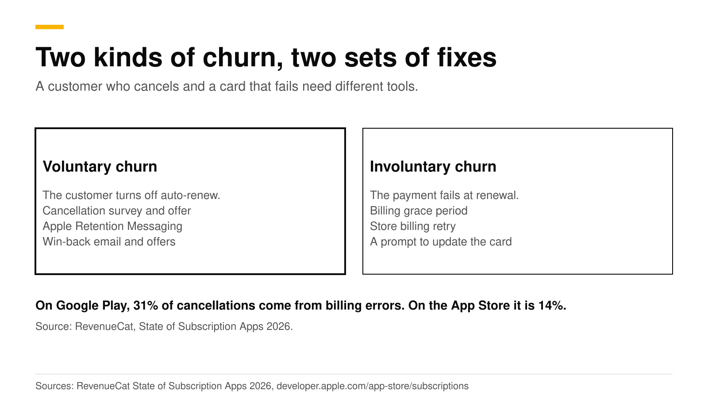
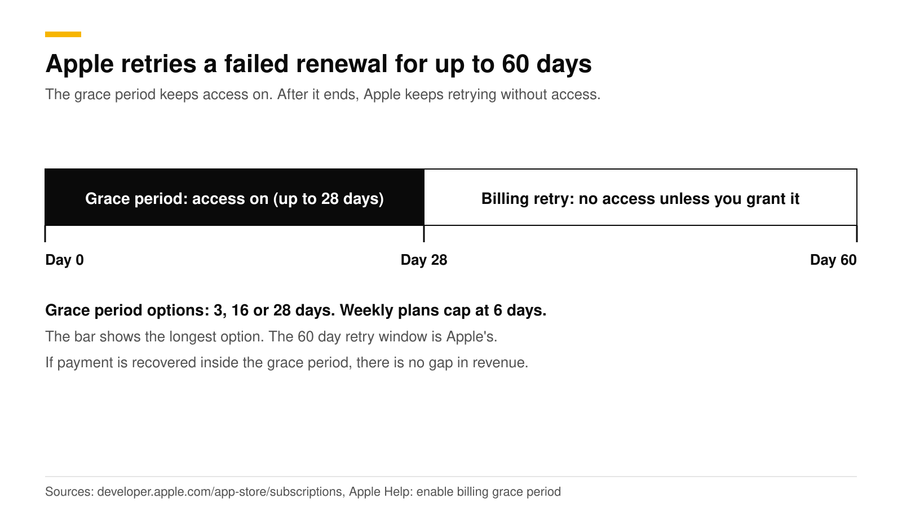
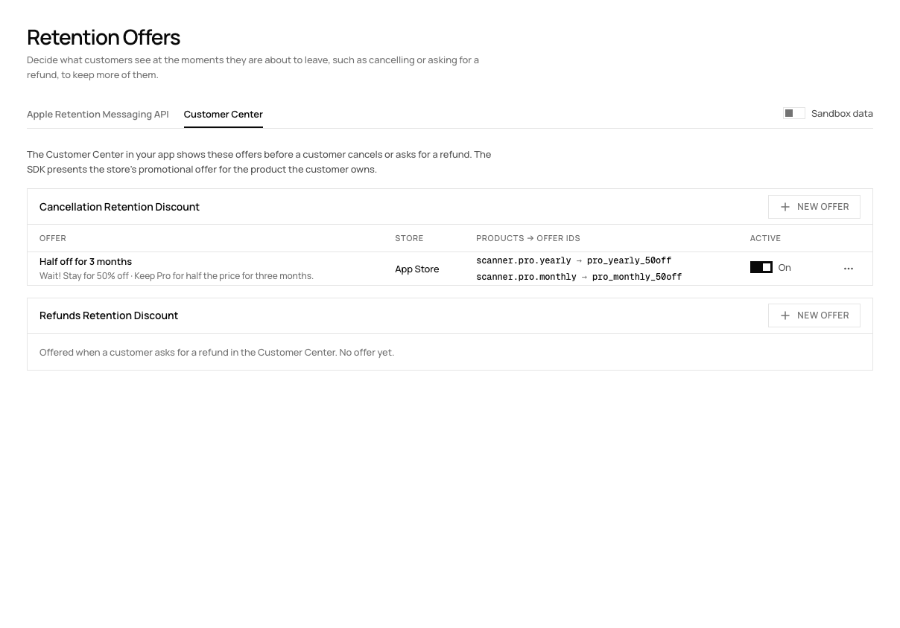
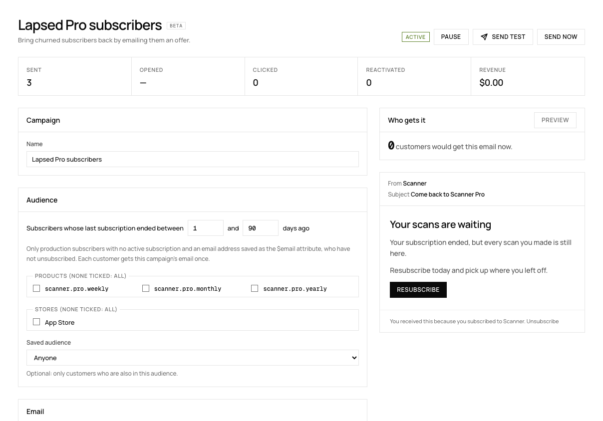

# How to reduce subscription churn: voluntary and involuntary

Subscription churn has two causes with two sets of fixes. Voluntary churn is a customer turning off auto-renew, and you fight it with a cancellation survey, a retention offer, Apple's cancel-screen message and win-back campaigns. Involuntary churn is a payment that fails at renewal, and you fight it with a billing grace period, the stores' retry windows and a prompt to update the card. On Google Play, 31% of cancellations come from billing errors, against 14% on the App Store.

This post shows each fix, what it does, and where to set it up in RevenueDot. The numbers come from RevenueCat's 2026 report and from Apple's and Google's docs, checked in October 2026.

## The short answer

- **Know which churn you have.** RevenueCat's State of Subscription Apps 2026 reports that 31% of Google Play cancellations are billing errors, against 14% on the App Store ([RevenueCat](https://www.revenuecat.com/blog/growth/subscription-app-trends-benchmarks-2026)). If you have more Android users, start with involuntary churn.
- **Turn on a billing grace period.** Apple offers 3, 16 or 28 days, and retries a failed renewal for up to 60 days ([Apple](https://developer.apple.com/app-store/subscriptions/)).
- **Ask before they leave.** Show a survey and a promotional offer in the Customer Center cancel flow. Apple allows up to 10 promotional offers per subscription (same Apple source).
- **Use Apple's cancel screen.** The Retention Messaging API shows your message or offer on Apple's Confirm Cancellation page ([Apple](https://developer.apple.com/documentation/retentionmessaging)). It needs Apple's approval.
- **Email lapsed subscribers once.** A win-back campaign sends one email per customer with a link back to the store, where Apple lists the offers they qualify for.
- **Measure it.** The churn, retention and cancel-reason charts show whether each fix works.

## What are voluntary and involuntary churn?

Voluntary churn happens when a customer decides to leave. Involuntary churn happens when a renewal payment fails and the customer never meant to leave.

| | Voluntary | Involuntary |
|---|---|---|
| What happens | The customer turns off auto-renew | The card declines, expires or has no funds |
| Signal | A cancellation event | A `BILLING_ISSUE` event |
| Best fixes | Survey, retention offer, Apple's cancel message, win-back | Grace period, retry window, card-update prompt |
| Chart to watch | Churn rate, cancel reasons | Subscription status (billing issue) |

Apple's own subscription guidance separates the two. For voluntary churn it suggests you detect that auto-renew is off and then present an offer or a cheaper tier, or run a survey. For involuntary churn it points to billing grace period and retry ([Apple](https://developer.apple.com/app-store/subscriptions/)).

When do customers cancel? RevenueCat found that over one third of users on annual plans turn off auto-renewal within the first month, and that 55% of trial cancellations on 3-day trials happen on Day 0 ([RevenueCat](https://www.revenuecat.com/blog/growth/subscription-app-trends-benchmarks-2026)). The early moments matter most, so test your first-week experience before the late-lifecycle tools.

## How do you cut involuntary churn?

Keep the customer's access on while the store tries to collect, and tell the customer. Both stores retry a failed payment for a while. You decide how long access stays on.

**Apple.** Enable the billing grace period in App Store Connect. Apple tries to recover the subscription while the subscriber keeps access, and says there is no gap in paid service or revenue if it recovers inside the grace period. The options are 3, 16 or 28 days, and weekly subscriptions cap at 6 days ([Apple Help](https://developer.apple.com/help/app-store-connect/manage-subscriptions/enable-billing-grace-period-for-auto-renewable-subscriptions)). When a renewal fails, Apple attempts recovery for 60 days in total ([Apple](https://developer.apple.com/app-store/subscriptions/)).

**Google Play.** Recovery is a grace period followed by an account hold. Users keep access during the grace period and lose it during the hold. You set both lengths in Play Console, and Google warns that lengths below the defaults may reduce the subscriptions recovered ([Google](https://developer.android.com/google/play/billing/subscriptions)). After expiry, users can resubscribe from the Play Store for up to one year (same source).

**What RevenueDot does.** The entitlement engine keeps access on during a grace period, and Active Subscriptions counts subscriptions in grace ([charts](https://revenuedot.app/docs/guides/charts)). RevenueDot sends a `BILLING_ISSUE` webhook when payment fails ([webhooks](https://revenuedot.app/docs/guides/webhooks)), so your backend or messaging tool can act on it. Use that event to show an in-app banner and send an email that says "Update your payment method". The [Subscription Status chart](https://revenuedot.app/charts/subscription-status) splits subscriptions into set to renew, set to cancel and billing issue, so you see how many are at risk.

## How do you cut voluntary churn?

Meet the customer at the moment of cancellation with a reason to stay, and ask why they leave.

### Cancellation flow and retention offer

The Customer Center is the subscription screen the RevenueCat SDK shows in your app. It lets customers cancel, restore purchases and, on iOS, request refunds, and it can show a survey and promotional offers during the cancel path ([RevenueCat docs](https://www.revenuecat.com/docs/tools/customer-center)).

RevenueDot serves the Customer Center configuration. To add an offer:

1. Create a promotional offer in App Store Connect, or a developer-determined offer in Google Play Console, on each subscription you want to discount.
2. Open **Lifecycle > Retention > Customer Center** and select **New offer** under **Cancellation Retention Discount** or **Refunds Retention Discount**.
3. Write the title and subtitle the customer sees, pick the store and link each product to its offer id.

The SDK shows the offer before the customer finishes. On iOS it asks your server to sign the promotional offer, which RevenueDot does with your In-App Purchase key ([retention guide](https://revenuedot.app/docs/guides/retention)).

Keep the discount bounded, such as half price for three months, so the price returns to normal on a known date. The [Customer Center survey chart](https://revenuedot.app/charts/customer-center-survey-responses) shows the reasons customers give, and the [Google Play cancel reasons chart](https://revenuedot.app/charts/google-play-cancel-reasons) shows Google's own survey answers.

### Apple's cancel screen

Apple's Retention Messaging API lets your server choose the message that appears on the Confirm Cancellation page after a customer taps Cancel Subscription in their Apple account. The message can be text, a suggested plan or a promotional offer ([Apple](https://developer.apple.com/documentation/retentionmessaging)). Apple's API is still described as a pre-release and needs Apple's approval for your developer account. Our [Retention Messaging guide](apple-retention-messaging-api.md) covers it.

### Win-back

Win-back works on customers who already left, so it never conflicts with the cancel flow.

- **Apple win-back offers** go to lapsed subscribers. Eligibility uses how long they paid and how long ago they left, with the offer shown on the Manage Subscriptions page, in an in-app offer sheet on iOS 18 and later, or through a link you send ([Apple Help](https://developer.apple.com/help/app-store-connect/manage-subscriptions/set-up-win-back-offers)). RevenueDot records each purchase's offer type, including `win_back`, and sends it as `offer_code` in webhooks ([win-back offers](https://revenuedot.app/docs/guides/win-back-offers)).
- **Win-back campaigns** in RevenueDot email customers whose subscription ended between N and M days ago. Each customer gets a campaign's email once, with click tracking, an unsubscribe link and a count of customers who came back within 30 days. The button leads to the store, where Apple lists the offers the customer qualifies for, or to your own link ([win-back campaigns](https://revenuedot.app/docs/guides/win-back-campaigns)).

Customers need an email address in the `$email` attribute, and the email goes out once a day at the hour you choose, to at most 500 customers a day. See the [win-back feature page](https://revenuedot.app/features/win-back) and the [Customer Center feature page](https://revenuedot.app/features/customer-center).

## Which fix should you build first?

Start with the fix that matches your largest cause.

| Situation | Build first | Why |
|---|---|---|
| Many Android subscribers | Grace period and billing prompts | 31% of Google Play cancellations are billing errors |
| Many cancellations in week one | Survey in the Customer Center | You need the reasons before you offer anything |
| iOS-heavy, steady monthly churn | Retention offer, then Apple's cancel message | Both reach customers while they are still subscribed |
| Large pool of lapsed customers | Win-back campaign | It costs one email per customer |

## Do it with RevenueDot

1. Enable the billing grace period in App Store Connect and Play Console.
2. Connect a messaging tool or webhook to the `BILLING_ISSUE` event ([integrations](https://revenuedot.app/docs/guides/integrations)).
3. Create a retention offer under **Lifecycle > Retention > Customer Center**.
4. Request access to Apple's Retention Messaging API if you want the cancel-screen message.
5. Start a win-back campaign under **Lifecycle > Win-back**.
6. Watch the [churn rate chart](https://revenuedot.app/charts/churn-rate) and the [subscription retention chart](https://revenuedot.app/charts/subscription-retention).

[Start for free on RevenueDot Cloud](https://app.revenuedot.app/signup). Pro costs $0 until your apps make $10,000 a month. The [metrics guide](subscription-app-metrics.md) defines each number.

## FAQ

### What is the difference between voluntary and involuntary churn?

Voluntary churn is a customer turning off auto-renew. Involuntary churn is a renewal payment that fails. They need different fixes: offers and surveys for the first, grace periods and card prompts for the second.

### How long is Apple's billing grace period?

You choose 3, 16 or 28 days, and weekly subscriptions cap at 6 days. Apple retries a failed renewal for up to 60 days in total.

### Does a retention offer work?

The offer is cheap to test. Apple allows up to 10 promotional offers per subscription, so you can compare discounts. RevenueDot's experiments compare two offerings, and the survey chart shows the reasons customers give.

### Can I show a message when someone cancels on the App Store?

Yes, with Apple's Retention Messaging API. Apple shows your message or offer on the Confirm Cancellation page. The API needs Apple's approval for your account, and Apple reviews each message.

### How do I win back users who already cancelled?

Use Apple win-back offers and an email campaign that links to the store. RevenueDot sends each customer a campaign's email once and counts reactivations within 30 days.

**About RevenueDot.** RevenueDot is an open-source (AGPL-3.0) backend for in-app purchases and subscriptions that works with the RevenueCat SDK. Start for free on [RevenueDot Cloud](https://app.revenuedot.app/signup): Pro costs $0 until your apps make $10,000 a month, then 0.5% of revenue above $10,000, never more than $999 a month. Point the SDK's proxy URL at RevenueDot and keep your app code, your offerings and your customers. Read the [quickstart](../docs/getting-started/quickstart.md) or the code on [GitHub](https://github.com/revenuedot/revenuedot).
