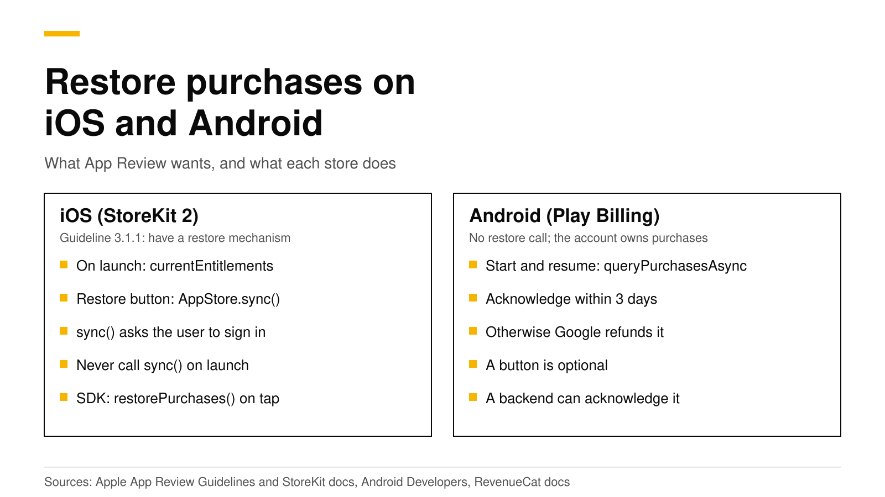

# Restore purchases on iOS and Android: what App Review wants

Apple's App Review Guidelines ask every app with restorable in-app purchases to have a restore mechanism, and in practice that means a **Restore purchases** button on your paywall or settings screen. With StoreKit 2, the button calls `AppStore.sync()`, which Apple says to call only after an explicit user action because it asks the user to sign in. On launch you read `Transaction.currentEntitlements` instead, which needs no restore at all. Google Play has no restore step: your app calls `queryPurchasesAsync` when it starts or resumes, and every purchase must be acknowledged within three days. With the RevenueCat SDK, the button calls `restorePurchases()` and silent checks call `syncPurchases()`.

This post covers what each store expects, the SDK calls, who owns a purchase that a second account restores, and how to test it. Every Apple, Google and RevenueCat fact links its source and was checked in October 2026.



## The short answer

- **Apple requires a restore mechanism.** Guideline 3.1.1 says to "make sure you have a restore mechanism for any restorable in-app purchases" ([Apple](https://developer.apple.com/app-store/review/guidelines/#3.1.1)).
- **On iOS, call `AppStore.sync()` only from a button.** It shows a sign-in prompt ([Apple](https://developer.apple.com/documentation/storekit/appstore/sync%28%29)).
- **On launch, read `Transaction.currentEntitlements`.** Reinstalls and new devices get all transactions automatically ([Apple](https://developer.apple.com/documentation/storekit/appstore/sync%28%29)).
- **On Android, query purchases on start and resume.** Acknowledge each purchase within three days, or Google refunds it ([Android Developers](https://developer.android.com/google/play/billing/integrate)).
- **With the RevenueCat SDK,** `restorePurchases()` is for the button and `syncPurchases()` is for silent calls ([RevenueCat](https://www.revenuecat.com/docs/getting-started/restoring-purchases)).
- **Decide who owns a restored purchase.** When a second account restores the same store purchase, your server's transfer rule decides who keeps access.

## What does Apple App Review require?

Guideline 3.1.1 is short on this point. It says "you should make sure you have a restore mechanism for any restorable in-app purchases" ([Apple](https://developer.apple.com/app-store/review/guidelines/#3.1.1)). Restorable purchases are subscriptions and non-consumables. Consumables, such as a pack of credits, are not restorable from the store, so you keep their balance on your own server.

Apple's StoreKit documentation says the same thing in code terms: include some mechanism, "such as a Restore Purchases button", to let users restore their purchases ([Apple](https://developer.apple.com/documentation/storekit/appstore/sync%28%29)). Put the button where a returning customer looks for it:

1. **On the paywall**, next to the buy buttons. A customer who reinstalls the app often sees the paywall first.
2. **In settings or the account screen**, so they can find it later.

## How does restore work with StoreKit 2?

StoreKit 2 keeps the device up to date by itself. Apple's documentation for `AppStore.sync()` says "in regular operations, there's no need to call" it, because StoreKit keeps transactions and subscription status current. When users reinstall or move to a new device, the app "automatically has all transactions available to it upon initial launch" ([Apple](https://developer.apple.com/documentation/storekit/appstore/sync%28%29)).

So the launch path and the button path are different:

- **On app launch, read `Transaction.currentEntitlements`.** It lists the latest transaction for each active subscription and non-consumable, and leaves out refunded or revoked products ([Apple](https://developer.apple.com/documentation/storekit/transaction/currententitlements)).
- **While the app runs, listen to `Transaction.updates`.** It delivers renewals, Ask to Buy approvals, offer code redemptions and purchases from other devices ([Apple](https://developer.apple.com/documentation/storekit/transaction/updates)).
- **When the customer taps Restore purchases, call `AppStore.sync()`.** It forces a fetch from the App Store and "displays a system prompt that asks users to authenticate" ([Apple](https://developer.apple.com/documentation/storekit/appstore/sync%28%29)).

```swift
import StoreKit

func refreshEntitlements() async -> Set<String> {
    var owned = Set<String>()
    for await result in Transaction.currentEntitlements {
        if case .verified(let transaction) = result {
            owned.insert(transaction.productID)
        }
    }
    return owned
}

// Only from the Restore purchases button:
func restoreTapped() async {
    do {
        try await AppStore.sync()
    } catch {
        // The customer cancelled the sign-in, or the network failed.
    }
    let owned = await refreshEntitlements()
    // Update your UI from `owned`.
}
```

Never call `AppStore.sync()` on launch. Apple says to call it "only in response to an explicit user action", and a sign-in prompt that appears by itself confuses customers and reviewers alike.

## How does restore work on Google Play?

Google Play has no restore call. The Play Billing Library returns the purchases the signed-in Google account owns, and your app asks for them. Google's integration guide says to call `queryPurchasesAsync()` when the billing client connects, which it recommends doing when the app launches or comes to the foreground. Google gives two reasons: a purchase can succeed while the device loses network, and "a user may buy an item on one device and then expect to see the item when they switch devices" ([Android Developers](https://developer.android.com/google/play/billing/integrate)). The same guide says to call it in `onResume()` for purchases that finished while the app was not running.

```kotlin
override fun onResume() {
    super.onResume()
    val params = QueryPurchasesParams.newBuilder()
        .setProductType(BillingClient.ProductType.SUBS)
        .build()
    billingClient.queryPurchasesAsync(params) { billingResult, purchases ->
        if (billingResult.responseCode == BillingClient.BillingResponseCode.OK) {
            // Send each purchase token to your server, which verifies it,
            // grants access and acknowledges it if needed.
        }
    }
}
```

**The three-day rule.** After you grant access, the purchase must be acknowledged "within three days so that the purchase isn't automatically refunded and entitlement revoked" ([Android Developers](https://developer.android.com/google/play/billing/integrate)). A purchase that only lives on the device is at risk if the customer never reopens the app. Acknowledging it from a server removes that risk.

You can still show a **Restore purchases** button on Android. It is harmless and helps customers who switch between platforms, but Google's guide does not require one.

## restorePurchases or syncPurchases in the RevenueCat SDK?

The RevenueCat SDK wraps both stores and sends every purchase to a backend. It has two calls that look alike:

| Call | Use it for | What the customer sees |
|---|---|---|
| `restorePurchases()` | The **Restore purchases** button | On iOS it "may cause OS level sign-in prompts to appear" |
| `syncPurchases()` | Silent calls, for example once after a migration | Nothing; it "will not cause OS level sign-in prompts to appear" |

Both quotes are from RevenueCat's restore guide, which says `restorePurchases` "should not be triggered programmatically" ([RevenueCat](https://www.revenuecat.com/docs/getting-started/restoring-purchases)).

```swift
// The Restore purchases button
let customerInfo = try await Purchases.shared.restorePurchases()
let isPro = customerInfo.entitlements["pro"]?.isActive == true

// Once, silently, after you move an existing app to a new backend
let synced = try await Purchases.shared.syncPurchases()
```

On Android, the backend reads each restored or synced purchase from the Play Developer API. RevenueDot also acknowledges it there, within Google's three-day limit, so a purchase is safe even if the customer never reopens the app ([Google Play guide](../docs/guides/google-play.md)).

## Who owns a restored purchase?

A restore can surprise you. Say Alice buys Pro on her iPhone while signed in to your app as `alice`. Later her partner signs in as `bob` on the same iPhone and taps **Restore purchases**. The App Store purchase belongs to the Apple account on the device, not to your user. Your server must decide whether Pro moves to `bob`, stays with `alice`, or both keep it.

RevenueCat calls this restore behavior and offers four options; the default for new projects transfers the purchase to the user who restored it ([RevenueCat](https://www.revenuecat.com/docs/projects/restore-behavior)). RevenueDot uses the same four values in its `transfer_behavior` project setting ([customers and app user IDs](../docs/concepts/customers-and-app-user-ids.md)):

| `transfer_behavior` | What happens when `bob` restores Alice's purchase |
|---|---|
| `transfer` (default) | Pro moves to `bob`. RevenueDot sends a `TRANSFER` webhook |
| `transfer_if_no_active` | Pro moves only if `alice` has no active subscription. Otherwise the restore fails with code 7102 |
| `keep` | Pro stays with `alice`. The restore fails with code 7102, "receipt already in use" |
| `share` | The two customers are merged, so both IDs have Pro |

Two cases never depend on the setting. If the current owner is anonymous, it is merged into the customer who restored. If the customer restoring is anonymous and the owner has a real ID, the anonymous ID joins the owner, as if they had logged in. Store notifications never move a purchase; only a receipt posted from a device does.

Pick the rule by how your app treats accounts:

- **One person, one device, accounts optional:** keep `transfer`. Restores always work.
- **Accounts that must not share Pro,** such as a business seat: use `transfer_if_no_active` or `keep`, and show a clear message on code 7102: "This purchase belongs to another account. Sign in with that account to use it."
- **Your own database grants access too:** listen for the `TRANSFER` webhook and move access from the `transferred_from` IDs to the `transferred_to` IDs ([restore guide](../docs/help/restore-purchases.md)).

## How do I test restore?

Test each path once before you submit.

1. **iOS sandbox.** Buy with a sandbox account, delete the app, reinstall it and launch. The entitlement should be active before you tap anything, because `currentEntitlements` returns it. Then tap **Restore purchases** and check that the sign-in prompt appears only then.
2. **Android test track.** Buy as a license tester, clear the app's data or install on a second device with the same Google account, and open the app. The purchase should appear from `queryPurchasesAsync` on start.
3. **A second account.** Sign in as a second user on the same device and restore. Check that the result matches your transfer rule and that your webhook receives `TRANSFER` when the purchase moves.
4. **No store at all.** RevenueDot's Test Store runs purchases in debug builds without a store account. The `TRANSFER` webhook example in our restore guide was captured from a Test Store run ([Test Store](../docs/guides/test-store.md)).

Our [sandbox testing guide](sandbox-testing-in-app-purchases.md) shows the store screens for sandbox accounts and license testers.

## Do it with RevenueDot

RevenueDot is an open-source server that works with the RevenueCat SDK. Your `restorePurchases()` and `syncPurchases()` code stays the same; the SDK's proxy URL points at RevenueDot. What you get:

- Receipts from restores verified with the [App Store](https://revenuedot.app/stores/app-store) and [Google Play](https://revenuedot.app/stores/google-play), and Google purchases acknowledged on the server.
- The four transfer rules in **Project settings**, with a separate rule for sandbox purchases.
- `TRANSFER` events on [webhooks](https://revenuedot.app/features/webhooks) and integrations, with RevenueCat's field names.
- A [Customer Center](https://revenuedot.app/features/customer-center) configuration for the SDK's self-service screens.

No real App Store or Google Play purchase has run end to end against RevenueDot yet. Store paths are tested against Apple's and Google's formats with mocked stores, so run your sandbox tests before launch. Compare the cost on the [RevenueCat comparison](https://revenuedot.app/compare/revenuedot-vs-revenuecat) and the [fee calculator](https://revenuedot.app/tools/revenuecat-fee-calculator), or see [pricing](https://revenuedot.app/pricing).

[Start free on RevenueDot Cloud](https://app.revenuedot.app/signup) (free up to $10,000 monthly tracked revenue).

## FAQ

### Will Apple reject my app without a Restore purchases button?

Guideline 3.1.1 asks for a restore mechanism for restorable in-app purchases ([Apple](https://developer.apple.com/app-store/review/guidelines/#3.1.1)), and Apple's StoreKit docs name a Restore Purchases button as the example ([Apple](https://developer.apple.com/documentation/storekit/appstore/sync%28%29)). Adding the button is the safe choice for any app that sells subscriptions or non-consumables.

### Should I restore purchases automatically on launch?

No. On iOS, read `Transaction.currentEntitlements`, or let the RevenueCat SDK fetch customer info. Call `AppStore.sync()` or `restorePurchases()` only from a button, because both can show a sign-in prompt ([RevenueCat](https://www.revenuecat.com/docs/getting-started/restoring-purchases)).

### Does Android need a restore button?

Google's guide does not ask for one. It asks you to call `queryPurchasesAsync()` when the app starts or resumes ([Android Developers](https://developer.android.com/google/play/billing/integrate)). A button does no harm and keeps your UI the same on both platforms.

### Why does restore say the receipt is already in use?

The purchase belongs to another account in your app, and your transfer rule is `keep`, or `transfer_if_no_active` while the owner's subscription is active. Ask the customer to sign in with the account that bought, or switch the rule to `transfer` ([restore guide](../docs/help/restore-purchases.md)).

### Can consumables be restored?

Not from the store. Apple's `currentEntitlements` leaves consumables out ([Apple](https://developer.apple.com/documentation/storekit/transaction/currententitlements)), so keep credit balances on your server. RevenueDot's in-app currencies do that per customer.

**About RevenueDot.** RevenueDot is an open-source (AGPL-3.0) backend for in-app purchases and subscriptions that works with the RevenueCat SDK. Start free on [RevenueDot Cloud](https://app.revenuedot.app/signup), free up to $10,000 in monthly tracked revenue, or self-host it with Docker and Postgres. Point the SDK's proxy URL at RevenueDot and keep your app code, your offerings and your customers. Read the [quickstart](../docs/getting-started/quickstart.md) or the code on [GitHub](https://github.com/revenuedot/revenuedot).
