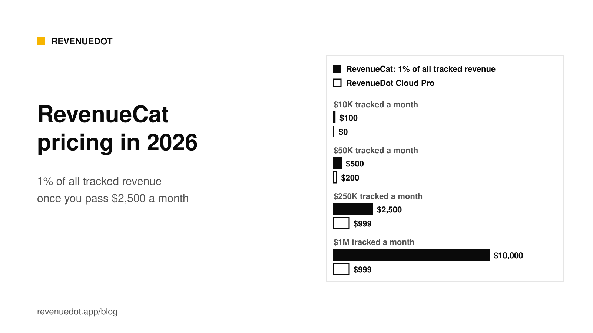
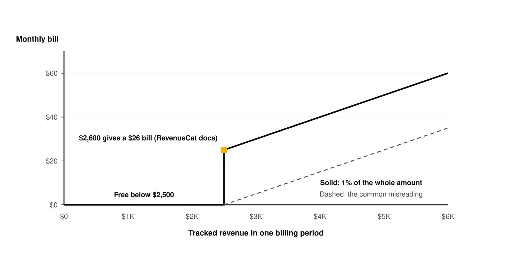
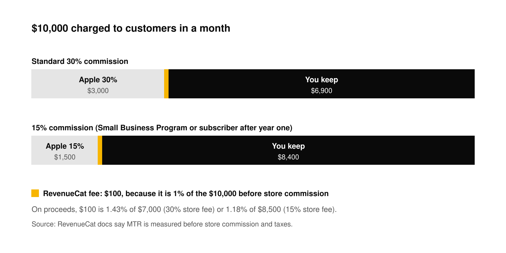

# RevenueCat pricing in 2026, explained (and how to pay less)

RevenueCat is free until your app tracks $2,500 in a month. After that it charges 1% of **all** your monthly tracked revenue, not only the part above $2,500, and it measures that revenue before Apple, Google and tax take their share. At $50,000 of tracked revenue a month the bill is $500, or $6,000 a year. You can pay less by negotiating, by moving to RevenueDot Cloud (free to $10,000 a month, with a planned 0.5% price above that, capped at $999), or by self-hosting.

We checked RevenueCat's pricing page, its documentation and its community forum on October 1, 2026. Every claim about RevenueCat below links to the page it came from.

## The short answer

- **Free tier:** RevenueCat's [pricing page](https://www.revenuecat.com/pricing) says you pay nothing up to $2,500 in monthly tracked revenue.
- **Paid tier:** the same page says you then pay 1% of what you track once you reach $2,500 in MTR. MTR means monthly tracked revenue.
- **The 1% applies to everything.** RevenueCat's [account management docs](https://www.revenuecat.com/docs/welcome/set-up-revenuecat/account-management) say the service stays free until MTR reaches $2,500, and that above that limit everyone on the Pro plan is billed 1% of MTR. Their example: $2,600 in MTR in the previous billing cycle means a $26 charge.
- **The base is gross.** The same page says MTR is measured before store commission and taxes.
- **Large apps can negotiate.** The pricing page lists an Enterprise plan with "Custom Pricing & Usage" for apps with high transaction volume.

## How RevenueCat calculates the bill

Three details decide your invoice.

### The 1% covers the whole amount

Many developers read "1% above $2,500" and expect to pay 1% of the excess. That is not how RevenueCat bills. In a November 2023 [community thread](https://community.revenuecat.com/general-questions-7/questions-about-pro-plan-payments-3618), a developer asked whether an app with $3,000 of monthly revenue pays $5 (1% of the $500 over the line) or $30 (1% of the full $3,000). A RevenueCat staff member answered that RevenueCat will not charge until you hit $2,500 in MTR, but that the price is still 1% of the whole amount. The docs example agrees: $2,600 gives $26, not $1.

So the bill has a step in it. At $2,499 you pay nothing. At $2,600 you pay $26.

### MTR is not MRR

RevenueCat's docs say MTR is not the same as monthly recurring revenue (MRR): it counts all purchases and renewals, including non-subscription products. A one-time $49.99 lifetime purchase counts. So does a consumable pack. If you sell both subscriptions and one-time products, your MTR is higher than your MRR.

### The billing period is not the calendar month

The docs say billing periods are not calendar months. They run from a date in one month to the same date in the next, for example July 15 to August 15. RevenueCat emails an invoice to the project owner at the end of the period.

## The bill at $5K, $10K, $50K, $250K and $1M

This table uses RevenueCat's published rule (1% of all MTR once MTR is above $2,500) and the RevenueDot Cloud prices from our [pricing page](https://revenuedot.app/pricing).

| Monthly tracked revenue | RevenueCat | RevenueDot Cloud | Self-hosted RevenueDot |
|---|---|---|---|
| $5,000 | $50 | $0 (free today) | Your server, about $12 to $30 |
| $10,000 | $100 | $0 (free today) | Your server, about $12 to $30 |
| $50,000 | $500 | $200 (planned price) | Your server, about $12 to $30 |
| $250,000 | $2,500 | $999 (planned price, capped) | Your server, size it for your load |
| $1,000,000 | $10,000 | $999 (planned price, capped) | Your server, size it for your load |

Three notes on the RevenueDot column:

- **Free to $10,000 is live.** RevenueDot Cloud is free while your app tracks up to $10,000 a month.
- **The paid plan is planned.** The planned price is 0.5% of tracked revenue above $10,000, never more than $999 a month. It is not billing anyone yet. Treat it as a plan, not a contract.
- **Self-host costs your servers.** The software is free (AGPL-3.0). DigitalOcean's [Droplet pricing](https://www.digitalocean.com/pricing/droplets) lists a 2 GiB server at $12 a month, and its [managed PostgreSQL](https://www.digitalocean.com/pricing/managed-databases) starts at $15.15 a month. Prices change, so check them before you plan.

Over a year, the gap at $50,000 a month is $6,000 for RevenueCat against $2,400 for the planned RevenueDot Cloud price. At $1,000,000 a month it is $120,000 against $11,988.

## Gross versus net: what 1% really costs you

Apple and Google take their commission first, and RevenueCat's 1% is calculated on the amount before that. The percentage of what you actually keep is therefore higher than 1%.

Take $10,000 charged to customers in a month:

| Store commission | Apple takes | You receive from Apple | RevenueCat fee (1% of $10,000) | Fee as a share of what you receive |
|---|---|---|---|---|
| 30% | $3,000 | $7,000 | $100 | 1.43% |
| 15% | $1,500 | $8,500 | $100 | 1.18% |

Apple's rate is 15% for apps in the [Small Business Program](https://developer.apple.com/app-store/small-business-program/) (up to $1 million in proceeds in the prior calendar year) and for subscribers who have paid for more than a year. Otherwise a subscriber's first year is at 30%, per Apple's [subscriptions page](https://developer.apple.com/app-store/subscriptions/). Taxes are collected on top of the price in many countries, and RevenueCat's base includes them, which pushes the fee slightly higher still.

## Four ways to pay less

### 1. Stay and plan for it

RevenueCat is the older and larger product. It lists [SOC 2 Type II](https://www.revenuecat.com/security-and-compliance) controls audited each year by an independent CPA firm, and it has years of production use behind its SDKs. If you are small, $26 or $100 a month is cheap for a service that works. Staying is a fair choice. Do the sum once a year so the bill never surprises you.

### 2. Negotiate

The pricing page says the Enterprise plan has custom pricing and usage terms for apps with high volume, and it names volume discounts among the benefits. If you track $250,000 a month or more, that is a $2,500 monthly bill, so a conversation costs you nothing. Ask for a rate or a cap in writing. We do not know what RevenueCat offers, so treat any number here as a question to ask, not a promise.

### 3. Move to RevenueDot Cloud

RevenueDot is an open-source backend that speaks the same API as RevenueCat's. You keep the RevenueCat SDK in your app and change one setting, the proxy URL, to `https://api.revenuedot.app`. Your offerings, entitlements and purchase code stay as they are. See [Connect your app](https://revenuedot.app/docs/getting-started/connect-your-app) for the exact call in each SDK.

Cloud is free up to $10,000 of monthly tracked revenue today. The planned paid price above that is 0.5%, capped at $999 a month. Because it is not live, do not budget on it until it ships.

Be clear about what you give up. RevenueDot launched in 2026, so it has far less production history than RevenueCat. You can keep the RevenueCat SDK in proxy mode, or swap in the RevenueDot SDK, which is published for every platform (2026-10-02) and keeps the same imports ([SDK guides](https://revenuedot.app/docs/sdks)). Test in sandbox before you ship. The [migration guide](https://revenuedot.app/blog/migrating-from-revenuecat-without-data-loss) shows how to run both systems side by side so that a customer never loses access.

### 4. Self-host

The same code runs on your own server with Docker Compose and Postgres. The software costs nothing, and there is no revenue share and no limit on tracked revenue. You pay for the server, the backups and your own time. See [Self-hosting your in-app purchase backend](https://revenuedot.app/blog/self-hosted-in-app-purchase-server) for what it costs and how to run it.

## How to choose

| Your situation | Likely best option |
|---|---|
| Under $2,500 a month | Stay. RevenueCat is free. |
| $2,500 to $10,000 a month | Stay, or try RevenueDot Cloud free if you want to own your data. |
| $10,000 to $50,000 a month | Compare the planned Cloud price with your bill. Run a test project first. |
| Above $50,000 a month | Ask RevenueCat for Enterprise terms and test RevenueDot Cloud or self-hosting in parallel. |
| You must keep data in your own region | Self-host. |

## Do it with RevenueDot

1. [Create a free account](https://app.revenuedot.app/signup) and a project.
2. Add your App Store or Google Play app and its store credentials. The guides for [App Store](https://revenuedot.app/docs/guides/app-store) and [Google Play](https://revenuedot.app/docs/guides/google-play) list each step.
3. Import your RevenueCat catalog and customers with the [importer](https://revenuedot.app/docs/migrate/importer). It runs on your machine.
4. In a test build, set the SDK's proxy URL to `https://api.revenuedot.app` and make a sandbox purchase.
5. Run both systems side by side with the [dual-run guide](https://revenuedot.app/docs/migrate/dual-run), then switch with an app update.

[Start free on RevenueDot Cloud](https://app.revenuedot.app/signup). It is free up to $10,000 in monthly tracked revenue.

## FAQ

### How much does RevenueCat cost per month?

RevenueCat is free up to $2,500 in monthly tracked revenue. Above that it charges 1% of all tracked revenue ([RevenueCat pricing](https://www.revenuecat.com/pricing)). That is $50 at $5,000, $500 at $50,000 and $10,000 at $1,000,000.

### Does RevenueCat charge 1% of all revenue or only the part above $2,500?

All of it. RevenueCat's [docs](https://www.revenuecat.com/docs/welcome/set-up-revenuecat/account-management) give $2,600 of MTR as a $26 charge, and a RevenueCat staff member confirmed the same reading in a [community thread](https://community.revenuecat.com/general-questions-7/questions-about-pro-plan-payments-3618).

### Is RevenueCat's fee calculated before or after Apple's commission?

Before. The docs say MTR is measured before store commission and taxes. At a 30% store commission, a 1% fee on gross is about 1.43% of what you receive.

### What is the cheapest alternative to RevenueCat?

Self-hosting RevenueDot costs only your server, about $12 to $30 a month at DigitalOcean list prices for a small app. RevenueDot Cloud is free up to $10,000 a month in tracked revenue. Both keep the RevenueCat SDK in your app.

### Can I negotiate RevenueCat's price?

RevenueCat's pricing page lists an Enterprise plan with custom pricing for high-volume apps. Contact them with your tracked revenue and ask for terms in writing.

**About RevenueDot.** RevenueDot is an open-source (AGPL-3.0) backend for in-app purchases and subscriptions that works with the RevenueCat SDK. Start free on [RevenueDot Cloud](https://app.revenuedot.app/signup), free up to $10,000 in monthly tracked revenue, or self-host it with Docker and Postgres. Point the SDK's proxy URL at RevenueDot and keep your app code, your offerings and your customers. Read the [quickstart](../docs/getting-started/quickstart.md) or the code on [GitHub](https://github.com/revenuedot/revenuedot).
