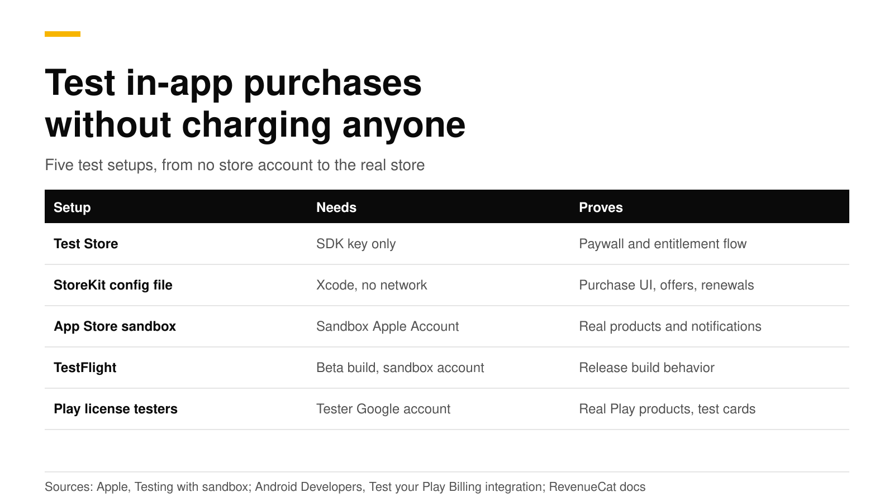
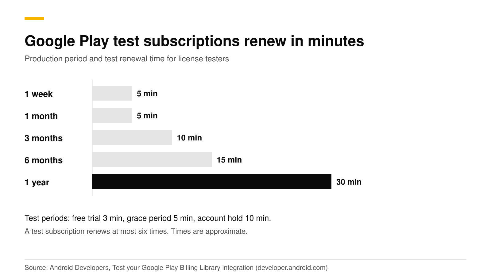

# Test in-app purchases: StoreKit, sandbox, TestFlight and Play

You test in-app purchases in layers. Start with a Test Store or an Xcode StoreKit configuration file, which need no store account. Then use Apple sandbox accounts and TestFlight, and Google Play license testers, to see real store products and real server notifications. Each layer proves something the one before cannot.

This post explains each setup, what it can and cannot prove, how fast test subscriptions renew, and how to check that your backend recorded the purchase. The Apple, Google and RevenueCat facts link their sources and were checked in October 2026.



## The short answer

- **No store account at all.** RevenueDot's Test Store and RevenueCat's Test Store give you test purchases that grant entitlements and send events ([RevenueCat](https://www.revenuecat.com/docs/test-and-launch/sandbox)).
- **iOS, local.** A StoreKit configuration file in Xcode tests purchases without App Store servers ([Apple](https://developer.apple.com/documentation/xcode/setting-up-storekit-testing-in-xcode)).
- **iOS, real products.** Sandbox Apple Accounts work with development builds and TestFlight. Apps from TestFlight always run in the sandbox ([Apple](https://developer.apple.com/documentation/storekit/testing-in-app-purchases-with-sandbox)).
- **Android.** License testers get test payment methods and fast renewals, and Play Billing Lab can move a test subscription into grace period or account hold ([Android Developers](https://developer.android.com/google/play/billing/test)).
- **Before launch.** Test with the real store keys, and check that store notifications reach your server.

## Which test setup should I use?

| Setup | Needs | Proves | Does not prove |
|---|---|---|---|
| Test Store | Nothing but the SDK key | Your paywall, purchase code and entitlement flow | Anything specific to Apple or Google |
| StoreKit configuration file | Xcode | Purchase UI, offers, renewals, billing retry, refunds | Real App Store servers and notifications |
| App Store sandbox | Sandbox Apple Account, products in App Store Connect | Real products, accelerated renewals, server notifications | Real money flows |
| TestFlight | Beta build, sandbox account | Release-build behavior with sandbox purchases | Real money flows |
| Play license testers | Tester Google account, app set up in Play Console | Real Play products, test payment methods, notifications | Behavior for non-testers |

RevenueCat makes the same point about its Test Store. It does not test platform-specific features such as grace periods or StoreKit behavior, and a platform sandbox is required before launch ([RevenueCat](https://www.revenuecat.com/docs/test-and-launch/sandbox)).

## How do I test with a Test Store and no store account?

Use this when you are building the paywall or the entitlement logic and do not want to wait for App Store Connect or Play Console. RevenueDot's Test Store is an app type with its own `test_` SDK key. Purchases go through a dialog in the SDK instead of Apple or Google. They grant entitlements, record events and send webhooks, and they are always marked sandbox ([Test Store guide](https://revenuedot.app/docs/guides/test-store)).

```bash
B="https://api.revenuedot.app/v2/projects/$PROJECT_ID"; H="Authorization: Bearer $SECRET_KEY"
curl -s -X POST "$B/apps" -H "$H" -H "Content-Type: application/json" \
  -d '{"name":"Test Store","type":"test_store"}'
curl -s "$B/apps/$APP_ID/public_api_keys" -H "$H"   # -> "key": "test_..."
```

Configure the SDK with that key and your proxy URL, then call `purchase` as usual. Two rules to follow. Use `test_` keys only in development builds, because the SDK stops an app that ships a Test Store key in a release build, as the [SwiftUI tutorial](swiftui-subscriptions-tutorial.md) explains. And a product's price comes from its Test Store price.

The Test Store can also run a whole lifecycle in one call. This is the fastest way to see a renewal, a cancellation, a billing issue or a refund come through your webhooks:

```bash
curl -s -X POST "$B/test_purchases" -H "$H" -H "Content-Type: application/json" \
  -d '{"app_user_id":"user_renewal","product_id":"pro_monthly","scenario":"renewal","price":9.99}'
```

The scenarios are `purchase`, `trial`, `trial_conversion`, `renewal`, `cancel`, `billing_issue`, `refund` and `expire`. Pick your own start date with `offset_days` to create three renewals at once.

## How do I test with a StoreKit configuration file in Xcode?

A StoreKit configuration file lets you test purchases locally with no connection to App Store servers. You define products, groups and offers in a `.storekit` file, and Xcode shows a payment sheet with localized values. Apple lists it as useful for features you build before App Store Connect is ready, offline testing, and cases that are hard to reproduce in the sandbox, such as promotional offer eligibility ([Apple](https://developer.apple.com/documentation/xcode/setting-up-storekit-testing-in-xcode)).

1. In Xcode choose **File, New, File from Template** and pick **StoreKit Configuration File**. Make it local, or synced with App Store Connect.
2. Add your subscription group and products.
3. Edit the scheme. Under **Run, Options**, set **StoreKit Configuration** to the file.

You can also drive it from tests with `SKTestSession`:

```swift
import StoreKitTest

let session = try SKTestSession(configurationFileNamed: "Configuration")
session.resetToDefaultState()
session.disableDialogs = true
session.clearTransactions()

try await session.buyProduct(identifier: "pro_monthly")
try session.forceRenewalOfSubscription(productIdentifier: "pro_monthly")

// Simulate a failed renewal with a grace period, then fix it.
session.billingGracePeriodIsEnabled = true
session.shouldEnterBillingRetryOnRenewal = true
```

All these calls are documented in Apple's [SKTestSession](https://developer.apple.com/documentation/storekittest/sktestsession) reference. Xcode signs the transactions, not Apple, so a backend that verifies Apple's signature will refuse them. In RevenueDot you export the public certificate with **Editor, Save Public Certificate** in the `.storekit` editor, and save it on the app as `xcode_certificate` ([sandbox guide](https://revenuedot.app/docs/guides/sandbox-testing)). RevenueDot then trusts those local transactions and does not call Apple for them.

## How do I test with sandbox accounts and TestFlight?

Use this to test real products and your server's Apple integration.

1. Create a Sandbox Apple Account in App Store Connect under **Users and Access**, then **Sandbox**. It works only for apps of the same developer account ([Apple](https://developer.apple.com/documentation/storekit/testing-in-app-purchases-with-sandbox)).
2. On the device, open **Settings, Developer** and sign in under Sandbox Apple Account. For development builds there is no need to sign out of your normal account. When you buy, the sheet shows `[Environment: Sandbox]`.
3. For TestFlight, which always runs in the sandbox, you must sign out of **Media & Purchases** to reach the sandbox controls. Apple warns that this can remove access to production apps on that device, so use a spare device.
4. Change settings as needed: renewal speed, clear purchase history, interrupted purchases, storefront country.
5. In App Store Connect set the **Sandbox Server URL** for server notifications, so your backend sees the test events ([Apple](https://developer.apple.com/documentation/storekit/testing-in-app-purchases-with-sandbox)).

Apple accelerates sandbox renewals, and a sandbox subscription renews up to 12 times after the first purchase ([Apple](https://developer.apple.com/documentation/storekit/testing-an-auto-renewable-subscription)). Changes to product data in App Store Connect can take up to one hour to reach the sandbox. If you test again and a subscription offer is no longer eligible, clear the account's purchase history.

## How do I test with Google Play license testers?

License testers can sideload debug builds, use test payment methods and renew subscriptions quickly. Add testers under **Setup, License testing** in Play Console. Their purchases show a test notice, and no tax is computed ([Android Developers](https://developer.android.com/google/play/billing/test)).



Things to know from Google's test guide:

- **Test payment methods.** "Test card, always approves", "always declines" and slow cards that settle after a few minutes.
- **Renewals.** A test subscription can renew at most six times, not counting free trials and introductory periods.
- **Acknowledgement.** A test purchase is refunded after 3 minutes if you do not acknowledge it.
- **Play Billing Lab.** It changes the Play country, repeats trial or introductory offers with one account, tests price changes for one tester only, and moves a subscription to grace period or account hold.
- **Test tracks.** Use them for QA. Users who are not license testers pay real money for test-track purchases.
- **Not just testers.** Also test with a normal account now and then, because license testers always have features such as resubscribe and pause turned on.

## How do I check that my backend saw the purchase?

RevenueDot reads the environment from the store, so these purchases are marked sandbox, grant entitlements and send webhooks with `environment: SANDBOX`. Metrics count production only unless you ask for sandbox ([sandbox and production](https://revenuedot.app/docs/concepts/sandbox)).

```bash
curl -s "https://api.revenuedot.app/v2/projects/$PROJECT_ID/customers/user_1/subscriptions?environment=sandbox" \
  -H "Authorization: Bearer $SECRET_KEY"
```

Point both the App Store sandbox and production notification URLs at the same RevenueDot URL, because each notification says which environment it is from. For Google Play, test purchases arrive at the same Pub/Sub push endpoint as real ones.

## Do it with RevenueDot

1. Create a RevenueDot Cloud project.
2. Add a Test Store app, a product, an entitlement and an offering. Use its `test_` key in a debug build and run `test_purchases` scenarios.
3. Connect the [App Store](https://revenuedot.app/docs/guides/app-store) and [Google Play](https://revenuedot.app/docs/guides/google-play) and make sandbox purchases.
4. Switch the SDK to your `appl_` or `goog_` key for release builds.

The unmodified RevenueCat iOS and Android SDKs pass Test Store purchases against RevenueDot on a simulator and an emulator in its test suite. If something looks wrong in your sandbox run, tell us on [GitHub](https://github.com/revenuedot/revenuedot/issues). See the [Test Store page](https://revenuedot.app/stores/test-store) and the [SwiftUI tutorial](swiftui-subscriptions-tutorial.md).

[Start for free on RevenueDot Cloud](https://app.revenuedot.app/signup). Pro costs $0 until your apps make $10,000 a month.

## FAQ

### Do sandbox purchases cost money?

No. Apple says sandbox transactions simulate success without processing payments ([Apple](https://developer.apple.com/documentation/storekit/testing-in-app-purchases-with-sandbox)). Google's license testers use test payment methods and are not charged for test purchases ([Android Developers](https://developer.android.com/google/play/billing/test)).

### Can I test in-app purchases in the iOS simulator?

Yes, with a StoreKit configuration file. Xcode provides a local test environment that needs no App Store connection ([Apple](https://developer.apple.com/documentation/xcode/setting-up-storekit-testing-in-xcode)).

### How long does a sandbox subscription last?

Apple speeds up sandbox renewals and you can pick the speed per account. On Google Play a one-month test subscription renews after 5 minutes, and a one-year one after 30 ([Android Developers](https://developer.android.com/google/play/billing/test)).

### Why does my TestFlight purchase not show sandbox settings?

Apps from TestFlight always run in the sandbox, but the sandbox controls appear only after you sign out of Media & Purchases and sign in to a Sandbox Apple Account in Developer settings ([Apple](https://developer.apple.com/documentation/storekit/testing-in-app-purchases-with-sandbox)).

### Which key do I ship in the release build?

The store key, which starts with `appl_` for the App Store or `goog_` for Google Play. A `test_` key in a release build triggers a "Wrong API Key" alert and stops the app on purpose ([SwiftUI tutorial](swiftui-subscriptions-tutorial.md), [Test Store guide](https://revenuedot.app/docs/guides/test-store)).

**About RevenueDot.** RevenueDot is an open-source (AGPL-3.0) backend for in-app purchases and subscriptions that works with the RevenueCat SDK. Start for free on [RevenueDot Cloud](https://app.revenuedot.app/signup): Pro costs $0 until your apps make $10,000 a month, then 0.5% of revenue above $10,000, never more than $999 a month. Point the SDK's proxy URL at RevenueDot and keep your app code, your offerings and your customers. Read the [quickstart](../docs/getting-started/quickstart.md) or the code on [GitHub](https://github.com/revenuedot/revenuedot).
