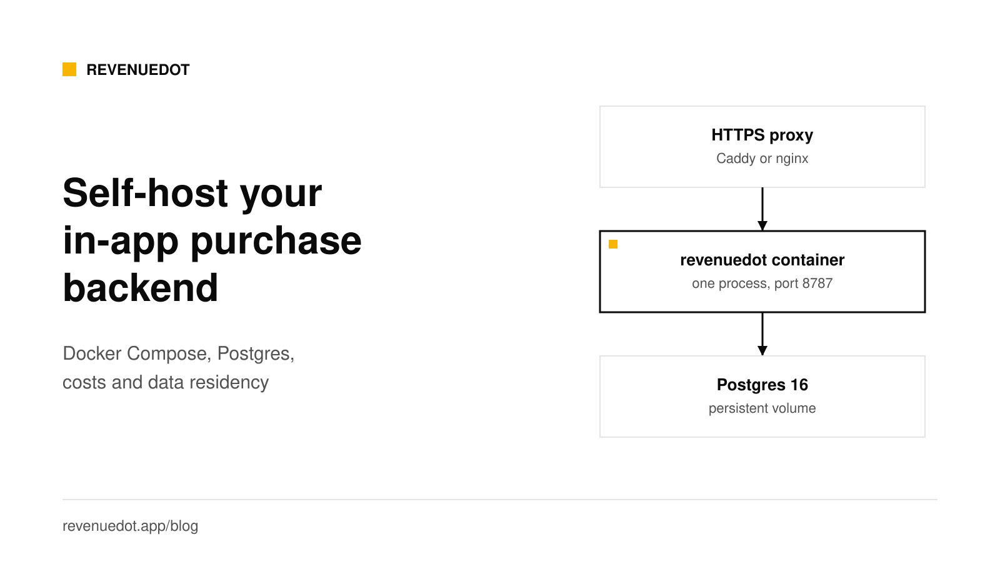
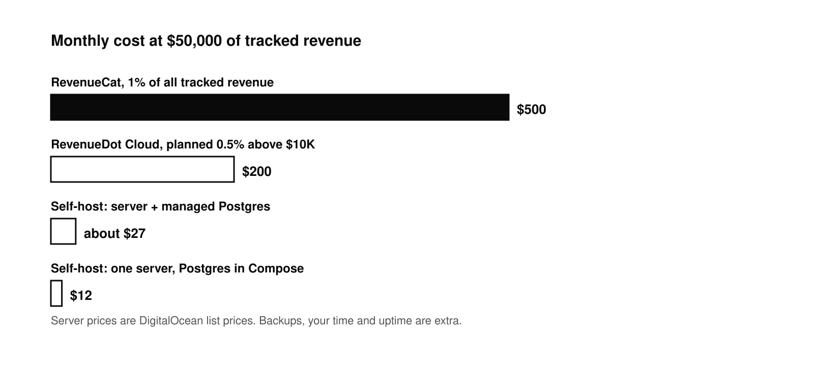

# Self-hosting an in-app purchase backend: when, cost, how to run

Most apps should start on [RevenueDot Cloud](https://app.revenuedot.app/signup), where Pro costs $0 until your apps make $10,000 a month and there is no server to run. This post is for teams that must run their own.

Self-hosting an in-app purchase backend makes sense when you must keep purchase data in a region you choose, when you want no revenue share at scale, or when your company requires software it can read and run itself. With RevenueDot it is one Docker image next to Postgres 16, served on one port. A small app fits on a $12 server, plus $15 for managed Postgres if you want one. The real cost is your time: you own uptime, backups and upgrades.



## The short answer

- **Run it:** `git clone`, copy `.env.example` to `.env`, set `POSTGRES_PASSWORD`, run `docker compose up -d`.
- **What runs:** one `revenuedot` container (SDK API, REST API, store notifications and the dashboard) and one Postgres 16 container with a persistent volume.
- **Cost:** the software is free (AGPL-3.0). Servers start at about $12 a month at list prices.
- **Choose it for:** data residency, no revenue share, running inside your own cloud, or code you can read.
- **Skip it if:** you want no operations work. RevenueDot Cloud Pro costs $0 until your apps make $10,000 a month.

## When self-hosting makes sense

| Reason | Why self-hosting fits | Alternative |
|---|---|---|
| Data residency | Purchases, customers and receipts live in your own Postgres, in the region you pick | Cloud, if its region and terms are enough for you |
| Cost at scale | No revenue share and no limit on tracked revenue. RevenueCat's 1% of tracked revenue is [$500 a month at $50,000](https://www.revenuecat.com/docs/welcome/set-up-revenuecat/account-management) | RevenueDot Cloud Pro, 0.5% above $10,000, never more than $999 a month |
| Regulated apps | You control who can read data and how long it is kept | Ask your compliance team what a hosted vendor must show |
| Agencies with many apps | One server holds many projects and apps | Cloud projects |
| Reading and changing the code | The server decides who gets paid access. You can read it, test it and patch it | Not possible with a closed service |
| An internal network | The server can sit behind your own firewall, reachable by Apple and Google over HTTPS only | Not possible on a hosted service |

It does not make sense when you are small, do not want to be on call, and a hosted service costs you nothing at your size. See [RevenueCat pricing in 2026](https://revenuedot.app/blog/revenuecat-pricing-explained) for the break-even sums.

### Data residency in plain terms

If your customers are in the EU, you may need to keep personal data in the EU or rely on a legal transfer mechanism. The European Commission's [page on international data protection](https://commission.europa.eu/law/law-topic/data-protection/international-dimension-data-protection_en) lists adequacy decisions and standard contractual clauses as the two main routes for transfers outside the EU and EEA. Self-hosting is the simplest way to keep the database in a region of your choice, for example Frankfurt or Amsterdam. DigitalOcean's [regional availability page](https://docs.digitalocean.com/platform/regional-availability/) lists Frankfurt (FRA1) and Amsterdam (AMS3), among other regions, for both servers and managed databases. Other clouds offer EU regions too. Remember that the stores themselves (Apple, Google) still process purchases under their own terms. This is not legal advice.

## What it costs

These are list prices checked on October 1, 2026. They change, so check before you plan.

| Option | Price | What you get |
|---|---|---|
| DigitalOcean Droplet, [Basic](https://www.digitalocean.com/pricing/droplets) | $12 a month | 2 GiB RAM, 1 vCPU, 50 GiB SSD, 2,000 GiB transfer |
| DigitalOcean Droplet, larger | $24 a month | 2 GiB RAM, 2 vCPU, 60 GiB SSD, 3,000 GiB transfer |
| DigitalOcean [managed PostgreSQL](https://www.digitalocean.com/pricing/managed-databases) | $15.15 a month and up | 1 GiB RAM, 1 vCPU, 10 to 30 GiB storage |
| [Railway](https://railway.com/pricing) Hobby | $5 a month with $5 of included usage | Memory at $10 per GB a month and CPU at $20 per vCPU a month beyond that |
| Your own hardware or cloud account | Your cost | Everything |



A sensible starting setup is a $12 Droplet that runs the Compose file, which includes Postgres, or the same Droplet plus the $15.15 managed database. That is $12 to about $27 a month. At $50,000 of monthly tracked revenue, RevenueCat bills $500, so the saving is over $470 a month, or about $5,700 a year. We have not load-tested RevenueDot at your scale. A large app should size the server and the database by watching real use, and may need a bigger plan.

Add the costs that are not on a price list:

- **Backups.** Object storage for daily dumps is cheap, and a managed database has point-in-time recovery.
- **Email.** Password resets, team invites and alerts need an SMTP provider. Many have free tiers.
- **Domain and TLS.** A domain, and a proxy such as Caddy that renews certificates itself.
- **Monitoring.** An uptime check on `GET /v1/health`.
- **Your time.** The first start takes a few minutes, mostly the image build. HTTPS, email and backups take longer. After that you watch alerts and run upgrades, until something breaks.

The break-even against RevenueCat's published rule, 1% of all tracked revenue once above $2,500, is a $27 server at about $2,700 of monthly revenue. Below $10,000 a month, RevenueDot Cloud Pro costs $0, so self-hosting there is about control, not cost.

## How to run it

You need Docker, Docker Compose, a server with a public IP and a domain name. The [self-hosting guide](https://revenuedot.app/docs/guides/self-hosting) has every setting.

### Step 1: Start it

```bash
git clone https://github.com/revenuedot/revenuedot.git
cd revenuedot
cp .env.example .env          # set POSTGRES_PASSWORD before the first start
docker compose up -d          # pulls ghcr.io/revenuedot/revenuedot and starts RevenueDot and Postgres
curl http://localhost:8787/v1/health        # {"status":"ok"}
```

Compose pulls the published image, `ghcr.io/revenuedot/revenuedot` (amd64 and arm64). The server applies database migrations itself when it starts.

Open `http://localhost:8787/login` and sign up. **The first account is the owner.** After that, sign-up closes to everyone except the people you invite, unless you set `REVENUEDOT_ALLOW_SIGNUP=true`.

**Expected output:** `{"status":"ok"}` from the health check, and the dashboard at `/login`.

### Step 2: Put HTTPS in front

Apple and Google send store notifications only to public HTTPS URLs, and apps should never talk to your server over plain HTTP. Caddy gets and renews certificates by itself:

```text
# Caddyfile
revenuedot.example.com {
  reverse_proxy localhost:8787
}
```

RevenueDot builds the notification URLs and the proxy URL it shows in the dashboard from `X-Forwarded-Host` and `X-Forwarded-Proto`. Check that the app page shows `https://revenuedot.example.com/v1/notifications/...`.

### Step 3: Set the important variables

| Variable | What it does |
|---|---|
| `POSTGRES_PASSWORD` | Password of the bundled Postgres. Set it before the first start, because it is written into the volume then |
| `REVENUEDOT_PORT` | Host port, default `8787` |
| `REVENUEDOT_ALLOW_SIGNUP` | Default `false`. Only the owner can sign up, plus invitees |
| `REVENUEDOT_SMTP_URL`, `REVENUEDOT_MAIL_FROM`, `REVENUEDOT_PUBLIC_URL` | Outgoing email for resets, invites and alerts. Without SMTP, emails are printed to the server log |
| `REVENUEDOT_SIGNING_KEY` | Turns on response signing. Optional |
| `DATABASE_URL` | Use your own Postgres 16, for example a managed one, and remove the `db` service |

Run one `revenuedot` container per database. Its background job has no lock across processes, so two containers could send a webhook twice.

### Step 4: Connect your stores and your app

Add each store app, its credentials and its notification URL, as in the [App Store guide](https://revenuedot.app/docs/guides/app-store) and the [Google Play guide](https://revenuedot.app/docs/guides/google-play). Then point the SDK at your server:

```swift
Purchases.proxyURL = URL(string: "https://revenuedot.example.com")!
Purchases.configure(
    with: Configuration.Builder(withAPIKey: "appl_YourKey")
        .with(entitlementVerificationMode: .disabled)
        .build()
)
```

Every SDK has the same setting. The [SDK guides](https://revenuedot.app/docs/sdks) show each one. A self-hosted server signs responses with its own key, which neither the RevenueDot SDK nor RevenueCat's SDK trusts. So set entitlement verification to disabled, as above. The iOS and Android SDKs default to informational mode and need the setting.

### Step 5: Back up

Everything is in Postgres, including store credentials, so encrypt backups. A daily dump:

```bash
docker compose exec -T db pg_dump -U revenuedot -Fc revenuedot > revenuedot-$(date +%F).dump
```

Copy the file off the server, and do one test restore before you need it. Keep `REVENUEDOT_SIGNING_KEY` in a password manager, because it is not in the database. See [Backups](https://revenuedot.app/docs/guides/backups).

### Step 6: Upgrade

```bash
docker compose exec -T db pg_dump -U revenuedot -Fc revenuedot > revenuedot-before-upgrade.dump
git pull
docker compose up -d --build
curl -s http://localhost:8787/v1/health
```

Requests fail for a few seconds during the restart. The SDKs keep the purchase on the device and retry, and customer info comes from the SDK's cache. Apple and Google resend notifications that got no 2xx answer. Pending webhooks wait in the database. See [Upgrades](https://revenuedot.app/docs/guides/upgrades).


## What happens when your server is down

This is the question every self-hoster asks. Short outages are survivable:

- **Paying customers keep access.** When the server answers 5xx or is unreachable, the SDKs compute entitlements on the device from the store's record of purchases, using a product-to-entitlement mapping they cached. See [offline entitlements](https://revenuedot.app/docs/guides/offline-entitlements).
- **Apple retries.** For V2 notifications, five times, at 1, 12, 24, 48 and 72 hours after the previous attempt in production ([Apple](https://developer.apple.com/documentation/appstoreservernotifications/responding-to-app-store-server-notifications)). Apple's Get Notification History endpoint covers 180 days of missed messages.
- **Google retries** through Pub/Sub when your endpoint answers 500 or 503.
- **Purchases wait.** An app keeps an unposted purchase and tries again when your server returns.

Long outages are another matter. New customers cannot finish a purchase in your backend, and webhooks stop. Use uptime monitoring and a runbook. The [production checklist](https://revenuedot.app/docs/guides/going-to-production) lists what to check before you go live.

## Honest limits

- RevenueDot launched in 2026, so it has far less production history than RevenueCat. Run your own sandbox purchase before you depend on it.
- Run one server container per database for now.
- You carry security patches, backups and on-call duty.
- RevenueCat has years of production use and a [SOC 2 Type II](https://www.revenuecat.com/security-and-compliance) audit. If you need that paper today, check whether you can meet your own review another way.

## Do it with RevenueDot

1. Try the same software on [RevenueDot Cloud](https://app.revenuedot.app/signup) first. Pro costs $0 until your apps make $10,000 a month, and Cloud uses the same code and API as self-hosting, so you can move either way.
2. When you are ready, run the Compose file on a $12 server and point a domain at it.
3. Add HTTPS, SMTP and a daily backup.
4. Connect your stores and set the proxy URL in a test build.
5. Import from RevenueCat and run both systems side by side with the [migration guide](https://revenuedot.app/blog/migrating-from-revenuecat-without-data-loss).

[Start for free on RevenueDot Cloud](https://app.revenuedot.app/signup)

## FAQ

### How much does it cost to self-host an in-app purchase server?

The RevenueDot software is free. A small app runs on a $12-a-month server at DigitalOcean list prices, or about $27 with a managed Postgres database. Backups, email and your own time are extra.

### What do I need to run RevenueDot myself?

Docker with Compose, a server with a public IP, a domain with HTTPS in front, and Postgres 16, which the Compose file includes. Apple and Google must be able to reach the notification URLs over HTTPS.

### Does self-hosting give me data residency?

You choose where the server and the database run, so you can keep purchase data in a region such as Frankfurt. Apple and Google still process the purchases themselves. Ask a lawyer about your own obligations.

### Can I move between Cloud and self-hosted later?

Yes. Cloud and self-host run the same code and the same API, so you can start on one and move to the other. Your SDK change is only the proxy URL.

### Can I run more than one server for high availability?

Not yet. Run one RevenueDot container per database. The background job has no lock across processes, so two containers could send a webhook twice.

**About RevenueDot.** RevenueDot is an open-source (AGPL-3.0) backend for in-app purchases and subscriptions on the App Store, Google Play and the web. Start for free on [RevenueDot Cloud](https://app.revenuedot.app/signup): Pro costs $0 until your apps make $10,000 a month, then 0.5% of revenue above $10,000, never more than $999 a month. New apps install the [RevenueDot SDK](../docs/sdks/README.md) and pass their key. Apps that ship the RevenueCat SDK point its proxy URL at RevenueDot and keep their code, offerings and customers. Read the [quickstart](../docs/getting-started/quickstart.md) or the code on [GitHub](https://github.com/revenuedot/revenuedot).
