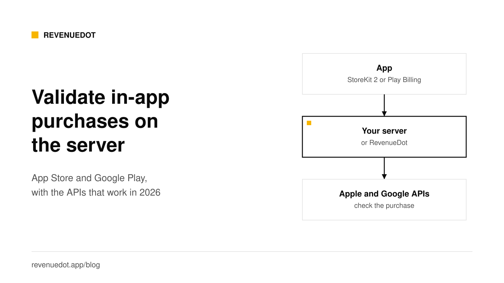
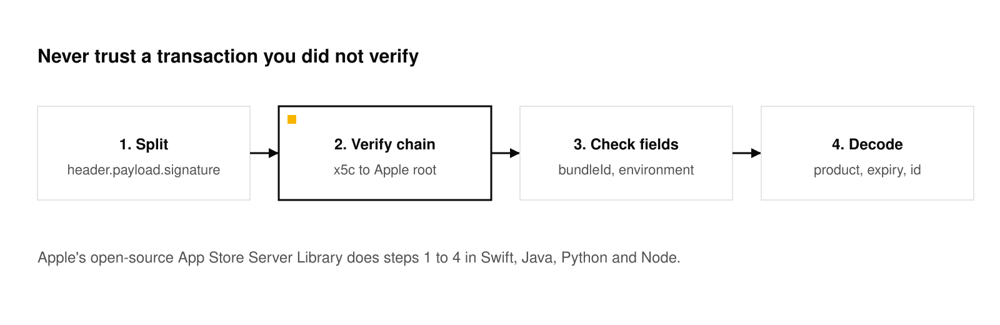
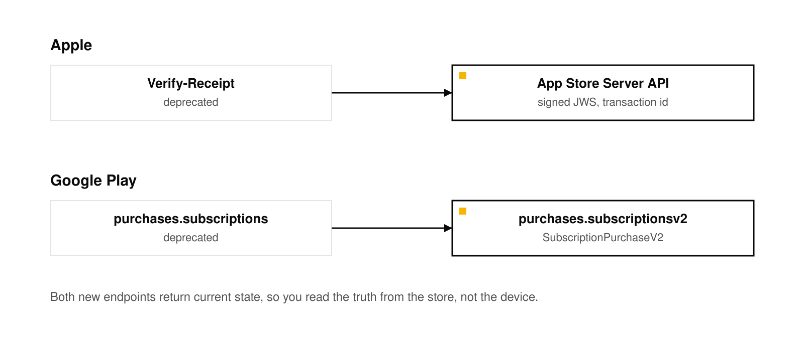

# Server-side in-app purchase validation: App Store and Google Play

In 2026 you validate an App Store purchase by verifying Apple's signed JWS transaction and calling the App Store Server API, and you validate a Google Play subscription by calling `purchases.subscriptionsv2.get` with the purchase token. Apple's `verifyReceipt` endpoint is deprecated. Google's older `purchases.subscriptions` resource is deprecated. Do both checks from your server, never from the app alone, and use store notifications to keep the result current.



All Apple and Google facts below link to the vendor's documentation and were read on October 1, 2026.

## The short answer

- **Apple:** verify the `signedTransactionInfo` JWS against Apple's root certificate, then call [Get Transaction Info](https://developer.apple.com/documentation/appstoreserverapi/get-transaction-info) or [Get All Subscription Statuses](https://developer.apple.com/documentation/appstoreserverapi/get-all-subscription-statuses) with an ES256 JWT.
- **Do not build on `verifyReceipt`.** Apple's [documentation](https://developer.apple.com/documentation/appstorereceipts) says "The Verify-Receipt endpoint is deprecated."
- **Google:** send the `purchaseToken` to your backend and call [`purchases.subscriptionsv2.get`](https://developers.google.com/android-publisher/api-ref/rest/v3/purchases.subscriptionsv2/get). Acknowledge the purchase from the server within three days.
- **Keep it current** with App Store Server Notifications V2 and Google real-time developer notifications.
- **Build or use a server.** The checks are small. The state machine around them is not.

## Why validate on a server

A purchase proof that stays on the device can be copied, replayed or faked. Apple's [receipt validation guide](https://developer.apple.com/documentation/storekit/choosing-a-receipt-validation-technique) compares the two options. For auto-renewable subscriptions, server-side validation provides additional subscription information and resistance to device clock changes, and on-device validation does neither. Google's [security guidance](https://developer.android.com/google/play/billing/security) says server-side APIs add protection against poor connectivity and malicious activity.

Your server is also the place that grants access across devices. A customer buys on an iPhone and opens your web app. Only a server that records the purchase can say yes.

## Apple: the three parts

### 1. The signed transaction from the device

StoreKit 2 gives the app a transaction signed in JSON Web Signature (JWS) format. Apple's [notification guide](https://developer.apple.com/documentation/appstoreservernotifications/receiving-app-store-server-notifications) says the App Store Server API and StoreKit use the same JWS format for transaction and subscription status information. The app sends it, or just the transaction ID, to your server.

### 2. Verify the JWS

A JWS has a header, a payload and a signature. The header carries a certificate chain. You must check that the chain ends at Apple's root certificate, that the signature matches, and that the payload is for your app.



Do not write this yourself. Apple's [App Store Server Library](https://developer.apple.com/documentation/appstoreserverapi/simplifying-your-implementation-by-using-the-app-store-server-library) exists in Swift, Java, Python and Node. It provides `verifyAndDecodeTransaction`, `verifyAndDecodeAppTransaction` and `verifyAndDecodeRenewalInfo`, an API client that creates the JWTs for you, and a utility that extracts transaction IDs from legacy receipts so you can leave `verifyReceipt`.

In Node, using the [library's examples](https://github.com/apple/app-store-server-library-node):

```typescript
import { SignedDataVerifier, AppStoreServerAPIClient, Environment } from "@apple/app-store-server-library";

const verifier = new SignedDataVerifier(appleRootCAs, true, Environment.PRODUCTION, bundleId, appAppleId);
const client = new AppStoreServerAPIClient(privateKey, keyId, issuerId, bundleId, Environment.PRODUCTION);

// The app sent a transaction ID. Ask Apple for the signed truth, then verify it.
const info = await client.getTransactionInfo(transactionId);
const tx = await verifier.verifyAndDecodeTransaction(info.signedTransactionInfo!);
// tx.bundleId, tx.productId, tx.expiresDate, tx.revocationDate ...
```

The first constructor argument is Apple's root certificates from its PKI site. Use `Environment.SANDBOX` for sandbox transactions.

### 3. Call the App Store Server API

Apple's [API overview](https://developer.apple.com/documentation/appstoreserverapi) lists what it gives you: single transaction info, full history, current subscription statuses, refund history, notification history and testing, renewal extensions and order lookup. The calls are authorized with a JWT that you sign with the In-App Purchase key you download from App Store Connect.

Apple's [JWT guide](https://developer.apple.com/documentation/appstoreserverapi/generating-json-web-tokens-for-api-requests) gives the rules:

| Part | Value |
|---|---|
| Header `alg` | `ES256` |
| Header `kid` | Your key ID |
| Payload `iss` | Your issuer ID |
| Payload `iat`, `exp` | Issue and expiry in Unix seconds. A token valid for more than 60 minutes is rejected |
| Payload `aud` | `appstoreconnect-v1` |
| Payload `bid` | Your bundle ID |

The sandbox base URL is `https://api.storekit-sandbox.apple.com/`. Apple says to call the endpoint in the same environment that created the transaction ID. If you do not know it, call production first. On error `4040010` (`TransactionIdNotFoundError`), call the sandbox. If that also fails with `4040010`, the ID is in neither environment. The `environment` field in the decoded transaction tells you directly.

### What not to use

`verifyReceipt` takes a base64 app receipt and a shared secret and answers with a JSON copy of the receipt. Apple lists it under **Deprecated** in its receipts documentation. If you still hold app receipts, the library's extraction utility gets you the transaction ID, and from there you use the App Store Server API.

## Google Play: purchase tokens and subscriptionsv2

### 1. Collect the purchase token

When a purchase completes, Google's Billing Library gives the app a `purchaseToken`. Google's [security guidance](https://developer.android.com/google/play/billing/security) says to send it to your backend, to keep a record of all tokens, and to treat the token as globally unique, so you can use it as a primary key. It also warns against using `orderId` as a duplicate check or primary key, because not every purchase has one.

### 2. Call the Developer API

Google says to use `Purchases.products:get` for one-time products or `Purchases.subscriptionsv2:get` for subscriptions. The subscription endpoint is:

```text
GET https://androidpublisher.googleapis.com/androidpublisher/v3/applications/{packageName}/purchases/subscriptionsv2/tokens/{token}
```

It needs the OAuth scope `https://www.googleapis.com/auth/androidpublisher`. You authenticate with a service account that you invite in Play Console under Users and permissions with financial data and order management rights ([API access guide](https://developers.google.com/android-publisher/getting_started)).

In Node, with the `googleapis` package:

```typescript
import { google } from "googleapis";

const auth = new google.auth.GoogleAuth({
  keyFile: "service-account.json",
  scopes: ["https://www.googleapis.com/auth/androidpublisher"],
});
const publisher = google.androidpublisher({ version: "v3", auth });

const { data } = await publisher.purchases.subscriptionsv2.get({
  packageName: "com.example.app",
  token: purchaseToken,
});
// data.subscriptionState, data.lineItems, data.latestOrderId, data.acknowledgementState
```

The response is a [`SubscriptionPurchaseV2`](https://developers.google.com/android-publisher/api-ref/rest/v3/purchases.subscriptionsv2). Its `subscriptionState` is one of `PENDING`, `ACTIVE`, `PAUSED`, `IN_GRACE_PERIOD`, `ON_HOLD`, `CANCELED`, `EXPIRED` or `PENDING_PURCHASE_CANCELED`. `CANCELED` means canceled but not yet expired, so access continues until the expiry time in `lineItems`.

### 3. Handle the details

- **Acknowledge.** Google's guidance says that if the purchase is not acknowledged and the customer does not sign back in within three days, it is refunded. Acknowledge from the server.
- **Linked tokens.** When `linkedPurchaseToken` is set (a re-signup, upgrade or downgrade), remove the old token from your database and revoke what it granted, so two users are not entitled to the same purchase.
- **Stay off the old resource.** Google marks `purchases.subscriptions` deprecated and points to `SubscriptionPurchaseV2`.



## Keep the result current

A one-time check goes stale when the customer cancels, gets a refund or fails to renew. Use the stores' notifications:

- Apple: [App Store Server Notifications V2](https://revenuedot.app/blog/app-store-server-notifications-v2).
- Google: real-time developer notifications on Pub/Sub. Google says to call the Developer API after each message to get the full status. See [Android subscriptions with Google Play Billing](https://revenuedot.app/blog/android-google-play-billing-subscriptions).

Add a daily job that checks Google's voided purchases and Apple's refund history, as a backup for missed messages.

## Build it or use a server?

| Piece you must own | Building it yourself | With RevenueDot |
|---|---|---|
| Apple JWS verification and JWT signing | Use Apple's library, then keep it updated | Built in |
| Google service account calls and acknowledgment | Write and monitor it | Built in |
| One record per subscription, with grace, billing retry, pause and refund rules | Design and test a state machine | Built in, from the stores' own states |
| Store notifications, deduplication and ordering | Write an endpoint and a queue | Built in |
| Restores and moving a purchase between users | Decide the rules | Four restore rules, you choose |
| Webhooks to your own backend, with retries | Build the delivery system | Signed webhooks with retries |
| Dashboard, charts and customer lookup | Build or skip | Included |
| Cost | Your engineering time | Cloud Pro: $0 until your apps make $10,000 a month, then 0.5% above that, never more than $999 a month |

Building is a reasonable choice if you have one store, a simple catalog and engineers who want to own it. The risk is in the edges: a grace period you forgot, a refund that arrives late, a restore that gives access to the wrong account. Those are the cases a mature server has already met.

RevenueDot is open source (AGPL-3.0). Your SDK posts each purchase to `POST /v1/receipts`. For Apple it verifies StoreKit 2 signed transactions against Apple's root certificate, and with the In-App Purchase key it reads history and renewal state from the App Store Server API. It does not call the deprecated `verifyReceipt` endpoint. For Google it reads the purchase with the service account and acknowledges it. A StoreKit 1 receipt needs the key, and without it RevenueDot answers 500 (code 7234), so the SDK keeps the transaction and retries.

Whatever backend you choose, run a sandbox purchase on each store before you ship. See [sandbox testing](https://revenuedot.app/docs/guides/sandbox-testing).

## Security checklist

1. Verify every JWS before you read a field. Check bundle ID and environment.
2. Keep the `.p8` key and the service account JSON in a secret store, never in the app or the repo.
3. Answer receipt errors correctly. A 4xx tells the SDK the purchase can never be accepted and ends it. A 5xx means retry. Return 5xx for your own failures so a bug cannot cost a paying customer. See [4xx vs 5xx](https://revenuedot.app/docs/help/receipt-errors-4xx-vs-5xx).
4. Store the raw notification body before you process it.
5. Deduplicate: Apple by `notificationUUID` and transaction ID, Google by purchase token.
6. Grant access from your server's record, not from a flag the app sends.

## Do it with RevenueDot

1. [Create an account](https://app.revenuedot.app/signup).
2. Add your App Store app with the In-App Purchase key ([guide](https://revenuedot.app/docs/guides/app-store)) and your Google Play app with the service account ([guide](https://revenuedot.app/docs/guides/google-play)).
3. Set the notification URLs in both stores.
4. Point the SDK's proxy URL at `https://api.revenuedot.app`.
5. Make a sandbox purchase and check the customer in the dashboard.

[Start for free on RevenueDot Cloud](https://app.revenuedot.app/signup)

## FAQ

### Is verifyReceipt still supported?

Apple's documentation says the Verify-Receipt endpoint is deprecated. Use the App Store Server API with signed JWS transactions. Apple's App Store Server Library includes a utility that extracts transaction IDs from legacy receipts.

### How do I validate a StoreKit 2 transaction on my server?

Verify the JWS signature and certificate chain against Apple's root certificate, check the bundle ID and environment, then call Get Transaction Info or Get All Subscription Statuses for the current state. Apple's library does the verification.

### Which Google Play API do I call for subscriptions?

`purchases.subscriptionsv2.get` with the package name and the purchase token, authenticated by a service account. For one-time products, use `purchases.products.get`.

### Do I need to validate on the server if I use RevenueCat or RevenueDot?

The server in those products does it. The SDK posts the purchase, and the backend checks it with Apple or Google. You write no validation code.

### Can I validate purchases without a backend?

You can check locally on the device, but Apple's comparison says server-side validation adds subscription information and resists device clock changes. For anything that grants paid access across devices, use a server.

**About RevenueDot.** RevenueDot is an open-source (AGPL-3.0) backend for in-app purchases and subscriptions on the App Store, Google Play and the web. Start for free on [RevenueDot Cloud](https://app.revenuedot.app/signup): Pro costs $0 until your apps make $10,000 a month, then 0.5% of revenue above $10,000, never more than $999 a month. New apps install the [RevenueDot SDK](../docs/sdks/README.md) and pass their key. Apps that ship the RevenueCat SDK point its proxy URL at RevenueDot and keep their code, offerings and customers. Read the [quickstart](../docs/getting-started/quickstart.md) or the code on [GitHub](https://github.com/revenuedot/revenuedot).
