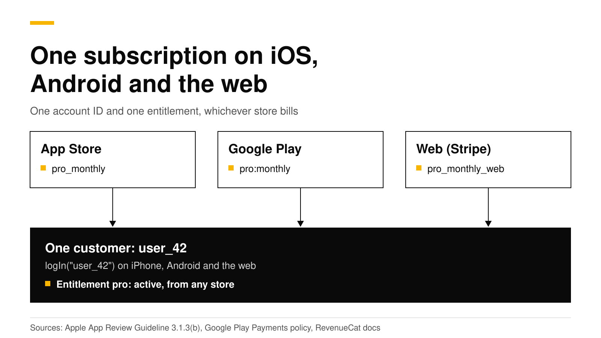

# How to share one subscription across iOS, Android and the web

To share one subscription across iOS, Android and the web, give every customer one account ID from your own sign-in, call `logIn` with that ID on every platform, and attach the App Store, Google Play and web products to one entitlement. Your app then checks the entitlement, not the store. Apple's guideline 3.1.3(b) lets customers use a subscription they bought on another platform or your website, as long as you also sell it as an in-app purchase in the iOS app. Google Play lets a signed-in customer use content they paid for somewhere else. Before you show a paywall, check whether the customer already has the entitlement from another store, so nobody pays twice.

This post walks through the account ID, the entitlement, what each store's rules allow, how to stop double billing, and where the "Manage subscription" button should point. Every Apple, Google and RevenueCat fact links its source and was checked in October 2026.



## The short answer

- **One account ID.** Call `logIn` with your own user ID after sign-in. RevenueCat's docs say anonymous IDs cannot share subscriptions across platforms ([RevenueCat](https://www.revenuecat.com/docs/customers/identifying-customers)).
- **One entitlement.** Attach `pro_monthly` (App Store), `pro:monthly` (Google Play) and the web product to the same `pro` entitlement.
- **Apple allows it.** Guideline 3.1.3(b) allows access to subscriptions bought on other platforms, if the iOS app also sells them as in-app purchases ([Apple](https://developer.apple.com/app-store/review/guidelines/#3.1.3b)).
- **Google allows it.** Google says a user "could log in when the app opens and access content paid for somewhere else" ([Google Play](https://support.google.com/googleplay/android-developer/answer/10281818)).
- **No double billing.** The stores cannot see each other, so your app must hide the buy buttons when the entitlement is already active from another store.
- **Manage in the right place.** A subscription can only be cancelled in the store that bills it, so the button must open that store's page.

## What does "one subscription on every platform" mean?

It means one person pays once and gets Pro everywhere they sign in. The purchase still happens in one store: Apple bills an iPhone purchase, Google bills an Android purchase, and Stripe bills a web purchase. None of the three knows about the others. A server ties them together with two records:

1. **A customer** with your user ID. Every purchase the customer makes, in any store, is stored on that customer.
2. **An entitlement** such as `pro`. Each store's product is attached to it, so a purchase in any store makes `pro` active.

Your app asks one question on every platform: "Is `pro` active for this customer?" It never asks "Did this person buy on the App Store?" That is the whole design. The rest of this post is the code and the rules around it.

## Step 1: use one account ID everywhere

Without your own ID, the SDK creates an anonymous ID such as `$RCAnonymousID:4f2c...` and keeps it on that one device. RevenueCat's docs say a user logged in with the same app user ID on different platforms "will be considered the same user" and can use what they bought on any platform ([RevenueCat](https://www.revenuecat.com/docs/customers/identifying-customers)). Anonymous IDs cannot do that.

So call `logIn` right after your own sign-in succeeds, with the same ID on every platform. Use your database's user ID. RevenueCat recommends against email addresses, hard-coded strings and guessable values ([RevenueCat](https://www.revenuecat.com/docs/customers/identifying-customers)), because the ID appears in dashboards, webhooks and logs.

```swift
// iOS: after your sign-in succeeds
let (customerInfo, _) = try await Purchases.shared.logIn(user.id)
let isPro = customerInfo.entitlements["pro"]?.isActive == true
```

```kotlin
// Android: after your sign-in succeeds
val result = Purchases.sharedInstance.awaitLogIn(user.id)
val isPro = result.customerInfo.entitlements["pro"]?.isActive == true
```

```ts
// Web (purchases-js): pass the same ID when you configure
const purchases = Purchases.configure({
  apiKey: "test_...",
  appUserId: user.id,
  httpConfig: { proxyURL: "https://api.revenuedot.app" },
  flags: { collectAnalyticsEvents: false },
});
```

If a customer bought while still anonymous and then signs in, `logIn` moves that purchase to their account. RevenueDot's exact merge rules are in [customers and app user IDs](../docs/concepts/customers-and-app-user-ids.md).

## Step 2: attach every store's product to one entitlement

Create the plan in each store, then connect the products in one place:

| Store | Product ID example | Attached to |
|---|---|---|
| App Store | `pro_monthly` | `pro` |
| Google Play | `pro:monthly` (subscription and base plan) | `pro` |
| Web (your Stripe account) | `pro_monthly_web` | `pro` |

Put the App Store and Google Play products in one package of your `default` offering, so one paywall configuration serves both apps. The web product goes in a web offering that a [purchase link](../docs/guides/purchase-links.md) or [funnel](../docs/guides/funnels.md) sells. See [products and entitlements](../docs/concepts/products-and-entitlements.md) and [offerings and packages](../docs/concepts/offerings-and-packages.md).

## What does Apple allow?

Apple allows access to subscriptions bought elsewhere, with one condition. Guideline 3.1.3(b), Multiplatform Services, says apps that work across platforms "may allow users to access content, subscriptions, or features they have acquired in your app on other platforms or your web site", "provided those items are also available as in-app purchases within the app" ([Apple](https://developer.apple.com/app-store/review/guidelines/#3.1.3b)).

In practice that gives you three rules for the iOS app:

1. **Sell Pro in the iOS app too.** If a customer can buy Pro on the web, the iOS app must also offer Pro as an in-app purchase.
2. **Unlock Pro for anyone who has it.** A customer who signs in with a web or Android subscription gets Pro on iPhone with no extra step.
3. **Be careful with links to your web checkout.** Guideline 3.1.3 says apps in that section cannot encourage users, within the app, to use a purchasing method other than in-app purchase, except on the United States storefront and in the cases Apple lists ([Apple](https://developer.apple.com/app-store/review/guidelines/#3.1.3)). Our post on [web checkout for iOS apps](web-checkout-for-ios-apps-stripe.md) covers the US rules.

Apple's subscription guideline adds one more expectation: an auto-renewable subscription must "be available across all of the user's devices" ([Apple](https://developer.apple.com/app-store/review/guidelines/#3.1.2a)). One account ID and one entitlement give you that.

## What does Google Play allow?

Google requires its billing system for in-app purchases of digital goods and subscriptions, and apps "may not lead users to a payment method other than Google Play's billing system", except under the sections and programs the policy lists ([Google Play Payments policy](https://support.google.com/googleplay/android-developer/answer/9858738)).

Using a subscription bought elsewhere is allowed. Google's policy FAQ says an app can be consumption-only "even if it is part of a paid service", and that "a user could log in when the app opens and access content paid for somewhere else" ([Google Play](https://support.google.com/googleplay/android-developer/answer/10281818)). The same FAQ says Google does not require the same features or prices across platforms, and that you may email customers about offers outside the app.

| Question | App Store | Google Play |
|---|---|---|
| Can a customer use a subscription bought on another platform? | Yes, under 3.1.3(b) | Yes, a signed-in user can access content paid for elsewhere |
| Must the app also sell it in-app? | Yes, if it is for sale elsewhere | No, consumption-only apps are allowed, but any in-app sale must use Play billing |
| Can the app link to your web checkout? | Only on the US storefront or under Apple's listed cases | Only through Google's programs in eligible regions, such as the EEA and the US |

## How do you avoid double billing?

The stores cannot see each other. If a customer already pays you through Stripe and opens the iOS paywall, Apple will happily sell them a second subscription. Your app is the only place that can prevent it.

Check the entitlement before you show buy buttons. If `pro` is active and came from a different store than the one this app sells through, show a message instead of a paywall. Each active entitlement records the store that unlocked it, in the `store` property ([purchases_flutter reference](https://pub.dev/documentation/purchases_flutter/latest/models_entitlement_info_wrapper/EntitlementInfo-class.html); the native SDKs have the same field).

```swift
let info = try await Purchases.shared.customerInfo()
if let pro = info.entitlements["pro"], pro.isActive {
    switch pro.store {
    case .appStore, .macAppStore:
        showManageButton()              // they pay through Apple
    case .playStore:
        showMessage("You subscribe on Google Play. Manage it on your Android device.")
    case .stripe:
        showMessage("You subscribe on our website. Manage it in your account there.")
    default:
        showMessage("You already have Pro.")
    }
} else {
    showPaywall()
}
```

Three more habits help:

- **Ask customers to sign in before they buy** on every platform, so every purchase lands on a known account. A purchase made while anonymous is still safe, because `logIn` moves it later.
- **Pass the user ID to your web checkout.** A RevenueDot purchase link with `?app_user_id=` records the purchase on that customer at once ([purchase links](../docs/guides/purchase-links.md)).
- **Watch for two active subscriptions.** If a customer ends up with two, only they can cancel the one billed by Apple or Google, in that store. Send them to the right page with the button below.

## Where should the "Manage subscription" button go?

To the store that bills the customer, because only that store can cancel or change the plan.

| Store that bills | Where to send the customer | Source |
|---|---|---|
| App Store | `AppStore.showManageSubscriptions(in:)`, which shows the same sheet as the App Store app's subscription settings | [Apple](https://developer.apple.com/documentation/storekit/appstore/showmanagesubscriptions%28in:%29) |
| Google Play | `https://play.google.com/store/account/subscriptions?sku=<productId>&package=<package>` | [Android Developers](https://developer.android.com/google/play/billing/subscriptions) |
| Stripe (web) | Your Stripe customer portal, where customers update payment methods and cancel | [Stripe](https://docs.stripe.com/customer-management) |

RevenueCat's SDK exposes a `managementURL` on customer info that points to the store of the active subscription, and is null when there is none ([RevenueCat](https://www.revenuecat.com/docs/customers/customer-info)). **With RevenueDot, the SDK's `managementURL` is always null today** ([API reference](../api/sdk-endpoints.md)). Build the link from the entitlement's `store` as in the code above, or ask your server: RevenueDot's REST API returns the App Store or Google Play page for any subscription at `GET /v2/projects/{project_id}/subscriptions/{subscription_id}/authenticated_management_url` ([REST API](../api/rest-v2.md)).

## Do it with RevenueDot

RevenueDot is an open-source server that works with the RevenueCat SDK, so the code above runs unchanged once the SDK's proxy URL points at RevenueDot. What it gives a cross-platform app:

- One customer record with purchases from the [App Store](https://revenuedot.app/stores/app-store), [Google Play](https://revenuedot.app/stores/google-play) and [Stripe](https://revenuedot.app/stores/stripe), unlocking one entitlement.
- [Web checkout](https://revenuedot.app/features/web-billing) and [purchase links](https://revenuedot.app/features/purchase-links) on your own Stripe account, with `?app_user_id=` for signed-in buyers and [redemption links](../docs/guides/redemption-links.md) for anonymous ones.
- [Webhooks](https://revenuedot.app/features/webhooks) with RevenueCat's event names, so your own backend hears about every store.
- A `TRANSFER` event when a purchase moves between accounts, under the [restore rules](restore-purchases-ios-android.md) you choose.

The limits: the stock web SDK buys only with Test Store keys against RevenueDot, so real web payments go through RevenueDot's hosted Stripe checkout ([web SDK guide](../docs/sdks/web.md)). No real store purchase has run end to end against RevenueDot yet, so test each store in its sandbox before you launch. The [RevenueCat comparison](https://revenuedot.app/compare/revenuedot-vs-revenuecat) and the [fee calculator](https://revenuedot.app/tools/revenuecat-fee-calculator) show the cost side by side, and [pricing](https://revenuedot.app/pricing) has the plans.

[Start free on RevenueDot Cloud](https://app.revenuedot.app/signup) (free up to $10,000 monthly tracked revenue).

## FAQ

### Can a user who subscribed on Android use the subscription on iPhone?

Yes. Apple's guideline 3.1.3(b) allows access to subscriptions bought on other platforms, as long as the iOS app also sells the subscription as an in-app purchase ([Apple](https://developer.apple.com/app-store/review/guidelines/#3.1.3b)). The customer signs in, your app calls `logIn`, and the `pro` entitlement is active.

### Do I need my own login system to share a subscription?

Yes. The share works through one account ID that the customer proves on every device, which means some sign-in. It can be email, Sign in with Apple, Google or a magic link. Anonymous IDs stay on one device ([RevenueCat](https://www.revenuecat.com/docs/customers/identifying-customers)).

### Can I sell only on the web and unlock the Android app?

Google's FAQ allows consumption-only apps where users "access content paid for somewhere else" ([Google Play](https://support.google.com/googleplay/android-developer/answer/10281818)). Any purchase inside the Android app must still use Google Play billing, and the app may not point users to your web checkout outside Google's programs.

### What happens if a customer pays on two platforms?

Both stores bill them, and the entitlement simply stays active. Show the subscription's store on your account screen, and send the customer to that store to cancel the one they do not want. Checking the entitlement before the paywall prevents most cases.

### Does the price have to be the same on every platform?

No for Google: its FAQ says it does not require parity across platforms ([Google Play](https://support.google.com/googleplay/android-developer/answer/10281818)). Apple's 3.1.3(b) asks only that the items are also available as in-app purchases. Many apps charge less on the web, where the store fee does not apply.

**About RevenueDot.** RevenueDot is an open-source (AGPL-3.0) backend for in-app purchases and subscriptions that works with the RevenueCat SDK. Start free on [RevenueDot Cloud](https://app.revenuedot.app/signup), free up to $10,000 in monthly tracked revenue, or self-host it with Docker and Postgres. Point the SDK's proxy URL at RevenueDot and keep your app code, your offerings and your customers. Read the [quickstart](../docs/getting-started/quickstart.md) or the code on [GitHub](https://github.com/revenuedot/revenuedot).
