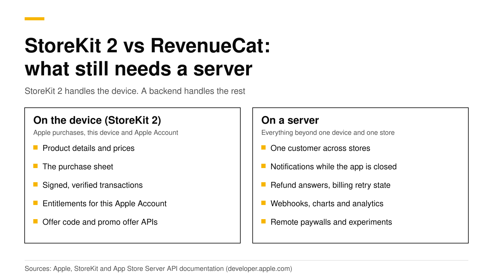
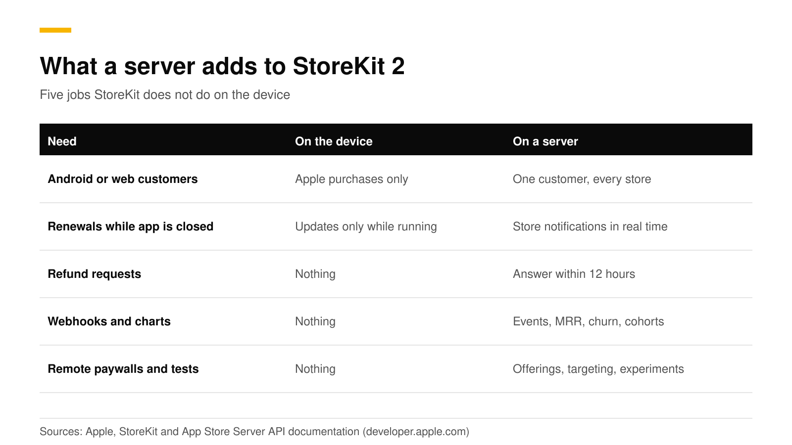
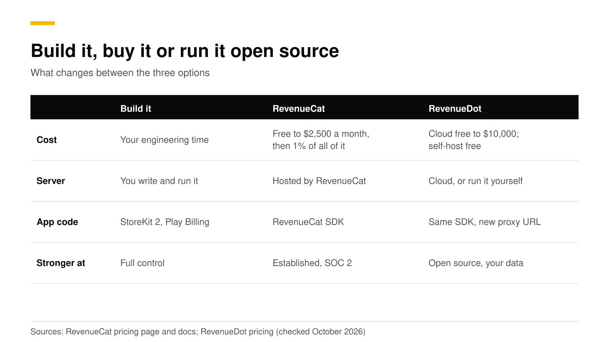

# Do you still need RevenueCat with StoreKit 2?

You do not need RevenueCat to sell an iOS subscription. StoreKit 2 loads products, runs the purchase, verifies the signed transaction on the device and tells you what the customer owns. You do need a backend once you have Android or web customers, once you want events and charts, or once you want to react to refunds and billing failures while the app is closed. That backend can be code you write, RevenueCat, or an open-source server such as RevenueDot.

This post lists what StoreKit 2 gives you, what it leaves out, and how the three options compare. We build a RevenueCat alternative, so every RevenueCat and Apple fact below links its source and was checked in October 2026.



## The short answer

- **iOS only, small app:** StoreKit 2 alone works. Apple gives you products, purchase, offer code and promotional offer APIs, and entitlements.
- **Android or web too:** you need a server to give one customer one set of entitlements across stores.
- **Events and charts:** StoreKit does not send webhooks or draw MRR. A server does.
- **Refunds:** Apple asks your server, not your app, for consumption data, and you have 12 hours to answer ([Apple](https://developer.apple.com/documentation/appstoreserverapi/send-consumption-information)).
- **Cost:** RevenueCat is free to $2,500 in monthly tracked revenue, then 1% ([RevenueCat](https://www.revenuecat.com/pricing/)). RevenueDot Cloud is free to $10,000 and self-hosting is free.

## What does StoreKit 2 give you on the device?

StoreKit 2 is Apple's Swift API for in-app purchases. For subscriptions, it covers these jobs:

- **Products.** `Product.products(for:)` requests product data from the App Store ([Apple](https://developer.apple.com/documentation/storekit/product/products%28for:%29)).
- **Store views.** `SubscriptionStoreView` shows a subscription group's names, prices and a buy button ([Apple](https://developer.apple.com/documentation/storekit/subscriptionstoreview)).
- **Verified transactions.** StoreKit validates transactions and returns them as verified results ([Apple](https://developer.apple.com/documentation/storekit/supporting-offer-codes-in-your-app)).
- **Entitlements.** `Transaction.currentEntitlements` emits the latest transaction for each subscription in the `subscribed` or `inGracePeriod` state, and leaves out refunded or revoked ones ([Apple](https://developer.apple.com/documentation/storekit/transaction/currententitlements)).
- **Outside purchases.** `Transaction.updates` delivers offer code redemptions, Ask to Buy approvals and purchases from other devices while the app runs ([Apple](https://developer.apple.com/documentation/storekit/transaction/updates)).
- **Offers.** Offer code sheets, promotional offers and win-back offers ([offer codes](ios-subscription-offer-codes.md), [promotional offers](ios-promotional-offers-signature.md)).
- **Testing.** Local StoreKit testing in Xcode ([testing guide](sandbox-testing-in-app-purchases.md)).

A working "is the user Pro" check is short:

```swift
func isPro() async -> Bool {
    for await result in Transaction.currentEntitlements {
        if case .verified(let transaction) = result,
           transaction.productID == "pro_monthly" || transaction.productID == "pro_annual" {
            return true
        }
    }
    return false
}
```

For one iOS app with one subscription, that and a `Transaction.updates` listener are enough to ship.

## What does StoreKit 2 not do?

StoreKit lives on the device and talks to Apple. These jobs need something on a server.



| Need | On the device with StoreKit 2 | What a server adds |
|---|---|---|
| Same customer on iOS, Android and web | Entitlements are for Apple purchases | One customer record with entitlements from every store |
| Learn about a renewal or refund while the app is closed | `Transaction.updates` fires only while the app runs | Apple's server notifications arrive at your server in real time ([Apple](https://developer.apple.com/documentation/appstoreserverapi)) |
| Answer a refund request | Nothing | Reply to `CONSUMPTION_REQUEST` within 12 hours ([Apple](https://developer.apple.com/documentation/appstoreserverapi/send-consumption-information)) |
| Send purchase events to your backend or tools | Nothing | Webhooks and integrations |
| Revenue, MRR, churn and cohort charts | Nothing | Computed from every transaction |
| Change paywalls and offerings without a release | Nothing | Remote offerings, targeting and experiments |
| Trust a purchase in your own backend | The device verifies, your backend cannot | Server-side verification ([how it works](server-side-receipt-validation.md)) |

Apple's App Store Server API is built for this. It works whether or not the app is installed, returns transaction history and subscription status, and sends refund and renewal information ([Apple](https://developer.apple.com/documentation/appstoreserverapi)). Google Play has the same split: your app handles the purchase flow, but Google recommends processing purchases in your backend for better security, and an unacknowledged purchase is refunded after three days ([Android Developers](https://developer.android.com/google/play/billing/lifecycle/subscriptions)).

## What does RevenueCat add, and does it still use StoreKit 2?

RevenueCat's iOS SDK uses StoreKit 2 by default since version 5.0, and RevenueCat's backend then reads Apple's data with your In-App Purchase key ([RevenueCat](https://www.revenuecat.com/docs/sdk-guides/ios-native-4x-to-5x-migration)). So the question is not StoreKit 2 versus RevenueCat. RevenueCat wraps StoreKit 2 and Google Play Billing in one SDK and adds the server.

Its pricing page lists what that includes: open-source SDKs, a unified subscription backend, a REST API, paywalls and A/B testing, integrations with attribution and analytics tools, webhooks, and more than 40 metrics ([RevenueCat pricing](https://www.revenuecat.com/pricing/)).

Where RevenueCat is stronger today: RevenueDot launched in September 2026, and RevenueCat's docs say it maintains SOC 2 compliance ([RevenueCat](https://www.revenuecat.com/docs/welcome/set-up-revenuecat/hackerone)). If you need a security audit report on day one, that is a real reason to pick RevenueCat.

## Build, buy or use open source?



| | Build it | RevenueCat | RevenueDot |
|---|---|---|---|
| Cost | Your engineering time | Free to $2,500 in monthly tracked revenue, then 1% of all of it | Cloud free to $10,000, a paid plan is planned. Self-host free (AGPL-3.0) |
| Server | You write and run it | Hosted by RevenueCat | Hosted by RevenueDot, or run it yourself |
| Your app code | StoreKit 2 and Play Billing | RevenueCat SDK | The same RevenueCat SDK, with a proxy URL |
| Stronger at | Full control, no vendor | An established product with SOC 2 | Open source, you own the data, no revenue share on Cloud's free tier |

If you build, plan for each of these parts: verify Apple's signed transactions, call the App Store Server API with signed tokens, receive and verify notifications V2, call Google's `subscriptionsv2` API, acknowledge purchases within three days, handle Pub/Sub, merge identities across stores, send webhooks with retries, and compute metrics. Our [server-side validation guide](server-side-receipt-validation.md) walks through the first half and shows how much code it is.

## How do I decide?

Use these four checks.

1. **One store, no outside systems.** StoreKit 2 alone is fine. Add a backend when you add a second store.
2. **A second store, or web checkout.** Use a server. Writing your own is the slowest option for a small team.
3. **Revenue near the point where a percentage fee hurts.** Compare the bill. At $50,000 of monthly tracked revenue RevenueCat's fee is $500 a month ([our pricing explainer](revenuecat-pricing-explained.md)). RevenueDot is free to $10,000 on Cloud, and self-hosting has no revenue share.
4. **Data ownership or regulated data.** Self-host an open-source server.

You can also start with StoreKit 2 and add a server later. RevenueCat documents a mode for apps that make purchases with their own StoreKit code, where the SDK only tracks them ([RevenueCat](https://www.revenuecat.com/docs/sdk-guides/ios-native-4x-to-5x-migration)).

## Do it with RevenueDot

RevenueDot is an open-source server that speaks the RevenueCat SDK's protocol. You keep the RevenueCat SDK, point its `proxyURL` at RevenueDot, and keep your offerings and customers. The SwiftUI code is the same as with RevenueCat ([SwiftUI tutorial](swiftui-subscriptions-tutorial.md)). What you get on the server side:

- Entitlements across the [App Store](https://revenuedot.app/stores/app-store), [Google Play](https://revenuedot.app/stores/google-play) and [Stripe](https://revenuedot.app/stores/stripe) in one customer record.
- [Webhooks](https://revenuedot.app/features/webhooks) and [integrations](https://revenuedot.app/integrations/slack) with RevenueCat's event names.
- [Refund Control](https://revenuedot.app/features/refund-control), which answers Apple's consumption request for you.
- [Charts](https://revenuedot.app/charts/mrr), [paywalls](https://revenuedot.app/features/paywalls) and [experiments](https://revenuedot.app/features/experiments).
- The [RevenueCat comparison](https://revenuedot.app/compare/revenuedot-vs-revenuecat) and the [fee calculator](https://revenuedot.app/tools/revenuecat-fee-calculator) show the cost side by side.

The limits matter too. RevenueDot launched in 2026, has far less production history than RevenueCat, and has no SOC 2 report. Test your app in each store's sandbox before launch.

[Start free on RevenueDot Cloud](https://app.revenuedot.app/signup) (free up to $10,000 monthly tracked revenue).

## FAQ

### Is StoreKit 2 enough for a subscription app?

For an iOS-only app that needs no events, charts or cross-platform accounts, yes. StoreKit 2 handles products, purchases, offers and entitlements on the device. You need a server for everything that happens when the app is closed or on another platform.

### Do I need a server to verify StoreKit 2 transactions?

StoreKit verifies transactions on the device. You need a server when your backend must trust the purchase, for example to give access to content or an API. Apple's App Store Server API and notifications are made for that ([Apple](https://developer.apple.com/documentation/appstoreserverapi)).

### Does RevenueCat still add value if I use StoreKit 2?

Yes, because it is a server and a set of tools around StoreKit and Google Play Billing, and its own iOS SDK uses StoreKit 2 ([RevenueCat](https://www.revenuecat.com/docs/sdk-guides/ios-native-4x-to-5x-migration)). The value is cross-platform entitlements, webhooks, charts, paywalls and experiments.

### How much does RevenueCat cost compared with building my own?

RevenueCat's page says nothing is due up to $2,500 in monthly tracked revenue, then 1% ([RevenueCat](https://www.revenuecat.com/pricing/)). Building your own costs engineering time up front, plus running and updating the server as Apple and Google change their APIs.

### Can I move from RevenueCat to an open-source server?

Yes. RevenueDot imports your data and works with the same SDK, so the app change is the proxy URL. See [migrating without losing a subscriber](migrating-from-revenuecat-without-data-loss.md).

**About RevenueDot.** RevenueDot is an open-source (AGPL-3.0) backend for in-app purchases and subscriptions that works with the RevenueCat SDK. Start free on [RevenueDot Cloud](https://app.revenuedot.app/signup), free up to $10,000 in monthly tracked revenue, or self-host it with Docker and Postgres. Point the SDK's proxy URL at RevenueDot and keep your app code, your offerings and your customers. Read the [quickstart](../docs/getting-started/quickstart.md) or the code on [GitHub](https://github.com/revenuedot/revenuedot).
