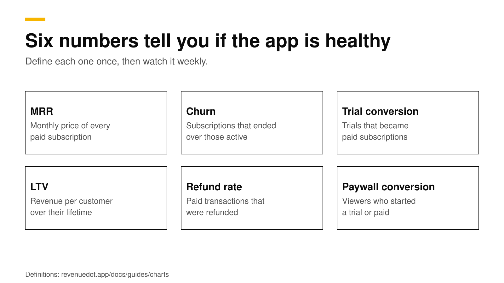
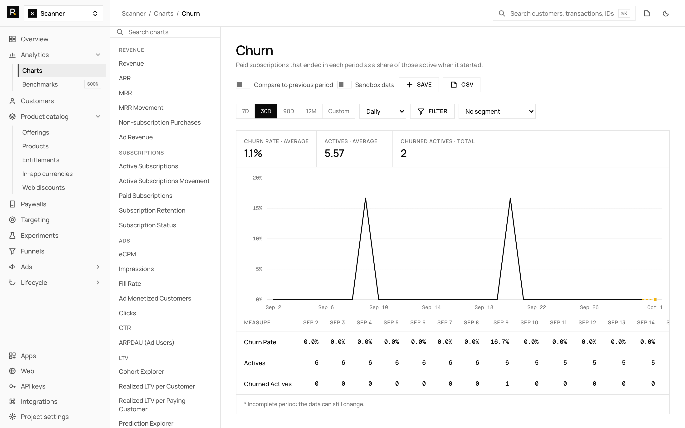
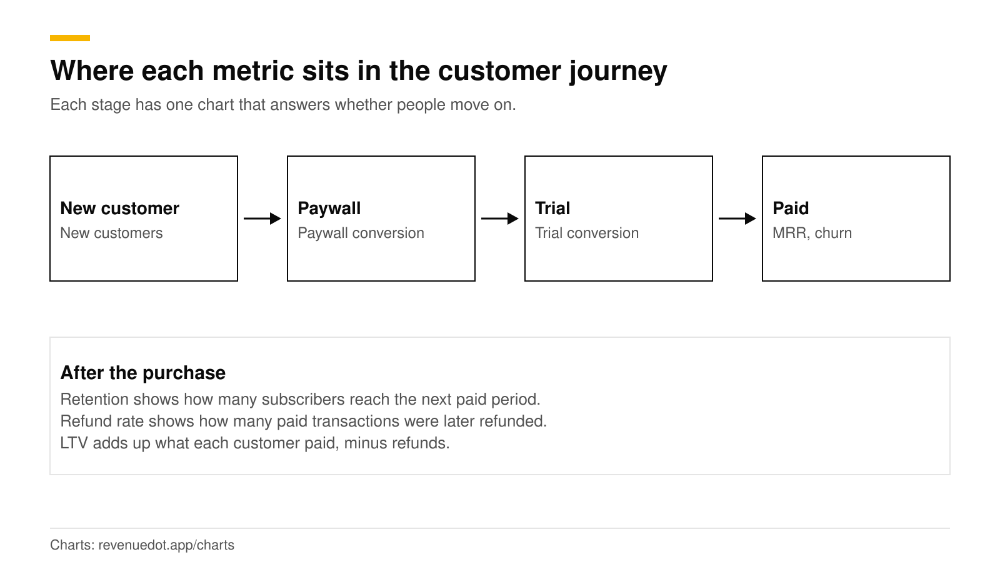
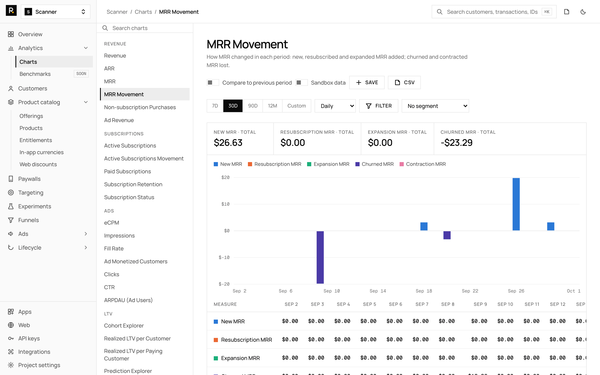

# Subscription app metrics that matter: MRR, churn, LTV and more

Six numbers tell you whether a subscription app is healthy: monthly recurring revenue (MRR), churn, trial conversion, paywall conversion, lifetime value (LTV) and refund rate. MRR is the monthly price of every paid subscription added up. Churn is the share of subscriptions that ended. Trial conversion is the share of trials that became paid. This post defines each one in plain words, shows a worked example, gives published benchmarks, and links to every chart page so you can see how it is calculated.

Definitions differ between tools. RevenueCat's own charts page says it cannot guarantee its definitions match third-party ones ([RevenueCat](https://www.revenuecat.com/docs/dashboard-and-metrics/charts)). The definitions below are RevenueDot's, listed in the [charts guide](https://revenuedot.app/docs/guides/charts). Benchmarks come from vendor reports and were checked in October 2026.

## The short answer

- **MRR:** every paid subscription's price normalized to one month, added up at the end of the period. Trials count zero.
- **Churn:** paid subscriptions that ended in the period, divided by paid subscriptions active when it started.
- **Trial conversion rate:** customers who started a trial in the period and converted to paid, over all who started one.
- **Paywall conversion:** viewers of a paywall who started a trial or paid.
- **Realized LTV per customer:** revenue from each period's new customers over their first N days, minus refunds, divided by those customers.
- **Refund rate:** paid transactions of a period and the share refunded since.
- **Watch these weekly,** and read the rest when one of them moves.

## How does the customer journey map to metrics?

Each stage of the journey has one chart that tells you whether people move to the next stage.

| Stage | Question | Metric | Chart |
|---|---|---|---|
| Install | How many people arrive? | New customers | [New customers](https://revenuedot.app/charts/new-customers) |
| Paywall | Do they see it and act? | Paywall encounter and conversion | [Paywall conversion](https://revenuedot.app/charts/paywall-conversion-rate) |
| Trial | Do trials turn into payers? | Trial conversion rate | [Trial conversion rate](https://revenuedot.app/charts/trial-conversion-rate) |
| Paid | How much comes in each month? | MRR | [MRR](https://revenuedot.app/charts/mrr) |
| Renewal | Do they stay? | Churn, retention | [Churn rate](https://revenuedot.app/charts/churn-rate) |
| After | Is the money real? | Refund rate, LTV | [Refund rate](https://revenuedot.app/charts/refund-rate) |

## What is MRR?

MRR is the monthly value of all paid subscriptions at the end of a period. Each subscription's price is normalized to one month: a day counts ×30, a week ×4, two weeks ×2, a month ×1, three months ×⅓, six months ×⅙ and a year ×1/12. Cancelled subscriptions count until they expire, and trials count zero ([charts guide](https://revenuedot.app/docs/guides/charts)).

**Worked example.** A $9.99 monthly plan adds $9.99. A $59.99 annual plan adds $5.00. A $4.99 weekly plan adds $19.96. Together that is $34.95 of MRR.

- [MRR](https://revenuedot.app/charts/mrr) is the number itself, and [ARR](https://revenuedot.app/charts/arr) is MRR times 12.
- [MRR movement](https://revenuedot.app/charts/mrr-movement) splits the change into new, resubscription, expansion, churned and contraction MRR. The movement equals MRR at the end minus MRR at the start.
- [Revenue](https://revenuedot.app/charts/revenue) is money received in the period, with gross, net of taxes or proceeds (gross minus the store's commission) as options.

## What is churn?

Churn is the share of paid subscriptions that ended in a period. RevenueDot divides paid subscriptions that ended in the period by those active when it started. Billing recoveries are subtracted, and the result can be negative or above 100% ([charts guide](https://revenuedot.app/docs/guides/charts)).

**Worked example.** You start the month with 200 paid subscriptions. 14 end. Monthly churn is 14 ÷ 200 = 7%.

Churn rate depends on plan length. A weekly plan gets a renewal chance every week, and an annual plan once a year, so compare churn within the same plan length. For early churn, [subscription retention](https://revenuedot.app/charts/subscription-retention) shows what share of each cohort reaches its next paid period.

RevenueCat's 2026 report says over a third of users on annual plans turn off auto-renewal within the first month, and 55% of trial cancellations on 3-day trials happen on Day 0 ([RevenueCat](https://www.revenuecat.com/blog/growth/subscription-app-trends-benchmarks-2026)). Our guide to [reducing churn](reduce-subscription-churn.md) covers the fixes.

## What is trial conversion?

Trial conversion is the share of trials that become paid subscriptions. RevenueDot's [trial conversion rate](https://revenuedot.app/charts/trial-conversion-rate) counts customers who started a trial in the period once each, how many converted, and how many are still in the trial. The [trial conversion funnel](https://revenuedot.app/charts/trial-conversion-funnel) shows where each trial ended: converted, set to convert, set to cancel, billing issue or abandoned.

**Worked example.** 100 customers start a trial in June. 30 converted by the end of July, 10 are still in the trial and 60 did not convert. The rate for finished trials is 30 ÷ 90, or 33%, and 30% if you count all 100.

Adapty reports a global average of 10.9% install-to-trial and 25.6% trial-to-paid, with Health & Fitness highest at 35.0% trial-to-paid ([Adapty](https://adapty.io/state-of-in-app-subscriptions/)). RevenueCat reports a median Day-35 conversion of 10.7% for hard paywalls and 2.1% for freemium apps ([RevenueCat](https://www.revenuecat.com/blog/growth/subscription-app-trends-benchmarks-2026)). The vendors define conversion differently, so compare a benchmark only with its own definition.

Related charts: [initial conversion rate](https://revenuedot.app/charts/initial-conversion-rate), [conversion to paying](https://revenuedot.app/charts/conversion-to-paying), [trial cancellation rate](https://revenuedot.app/charts/trial-cancellation-rate), [new trials](https://revenuedot.app/charts/new-trials), [active trials](https://revenuedot.app/charts/active-trials) and [active trials movement](https://revenuedot.app/charts/active-trials-movement).

## What is paywall conversion?

Paywall conversion tells you how many people who see your paywall act on it. RevenueDot counts customer and paywall pairs by their first impression. Initial conversions are trials or purchases on calendar days 0 to 3 ([charts guide](https://revenuedot.app/docs/guides/charts)).

- [Paywall encounter rate](https://revenuedot.app/charts/paywall-encounter-rate): the share of new customers who saw a paywall.
- [Paywall conversion rate](https://revenuedot.app/charts/paywall-conversion-rate): the share who then converted.
- [Paywall abandonment rate](https://revenuedot.app/charts/paywall-abandonment-rate): bounces (no purchase started) against cancelled purchases (a purchase started, none finished).
- [Paywall LTV](https://revenuedot.app/charts/paywall-ltv): revenue per paywall viewer and per conversion.

This is the number you move with [paywall A/B tests](paywall-ab-testing-guide.md).

## What is LTV?

Lifetime value is what a customer pays over their life with the app. Realized LTV counts only money already received. RevenueDot's [realized LTV per customer](https://revenuedot.app/charts/ltv-per-customer) adds revenue of each period's new customers from day 0 through day N, subtracts refunds in that window and divides by new customers. [Realized LTV per paying customer](https://revenuedot.app/charts/ltv-per-paying-customer) divides by the paying ones only.

**Worked example.** 1,000 new customers pay $6,000 in their first 90 days, and $500 is refunded in that window. Realized LTV at day 90 is ($6,000 − $500) ÷ 1,000 = $5.50 per customer.

For cohorts too young to show a full year, the [Prediction Explorer](https://revenuedot.app/charts/ltv-prediction) fills missing months with the chain-ladder method: each month grows by the average growth older cohorts showed between the same two months. Predicted values are flagged. The [Cohort Explorer](https://revenuedot.app/charts/cohort-explorer) groups customers by first seen, first conversion or first payment and follows revenue, retention or LTV month by month.

## What is refund rate?

Refund rate is the share of paid transactions that have been refunded. RevenueDot cohorts it by the transaction's date, and counts refunds on the refund date ([charts guide](https://revenuedot.app/docs/guides/charts)).

- [Refund rate](https://revenuedot.app/charts/refund-rate) and [refunds](https://revenuedot.app/charts/refunds) show the share and the money.
- [Refund requests](https://revenuedot.app/charts/refund-requests) show Apple's refund requests by outcome. See [Apple refund requests and CONSUMPTION_REQUEST](apple-refund-requests-consumption-info.md).

## Where are the other charts?

The charts index at [revenuedot.app/charts](https://revenuedot.app/charts) lists all 43 pages, each with its definition.

- **Revenue and MRR:** [revenue](https://revenuedot.app/charts/revenue), [ARR](https://revenuedot.app/charts/arr), [MRR](https://revenuedot.app/charts/mrr), [MRR movement](https://revenuedot.app/charts/mrr-movement), [one-time purchases](https://revenuedot.app/charts/one-time-purchases).
- **Subscriptions:** [active subscriptions](https://revenuedot.app/charts/active-subscriptions), [active subscriptions movement](https://revenuedot.app/charts/active-subscriptions-movement), [new paid subscriptions](https://revenuedot.app/charts/new-paid-subscriptions), [subscription retention](https://revenuedot.app/charts/subscription-retention), [subscription status](https://revenuedot.app/charts/subscription-status).
- **Customers:** [new customers](https://revenuedot.app/charts/new-customers), [active customers](https://revenuedot.app/charts/active-customers).
- **Conversion:** [initial conversion rate](https://revenuedot.app/charts/initial-conversion-rate), [conversion to paying](https://revenuedot.app/charts/conversion-to-paying), [trial conversion funnel](https://revenuedot.app/charts/trial-conversion-funnel), [trial conversion rate](https://revenuedot.app/charts/trial-conversion-rate).
- **Trials:** [new trials](https://revenuedot.app/charts/new-trials), [active trials](https://revenuedot.app/charts/active-trials), [active trials movement](https://revenuedot.app/charts/active-trials-movement), [trial cancellation rate](https://revenuedot.app/charts/trial-cancellation-rate).
- **Paywalls:** [encounter rate](https://revenuedot.app/charts/paywall-encounter-rate), [conversion rate](https://revenuedot.app/charts/paywall-conversion-rate), [LTV](https://revenuedot.app/charts/paywall-ltv), [abandonment rate](https://revenuedot.app/charts/paywall-abandonment-rate).
- **LTV and cohorts:** [cohort explorer](https://revenuedot.app/charts/cohort-explorer), [realized LTV per customer](https://revenuedot.app/charts/ltv-per-customer), [per paying customer](https://revenuedot.app/charts/ltv-per-paying-customer), [LTV prediction](https://revenuedot.app/charts/ltv-prediction).
- **Churn and refunds:** [churn rate](https://revenuedot.app/charts/churn-rate), [refund rate](https://revenuedot.app/charts/refund-rate), [refunds](https://revenuedot.app/charts/refunds), [refund requests](https://revenuedot.app/charts/refund-requests).
- **Why customers leave:** [Google Play cancel reasons](https://revenuedot.app/charts/google-play-cancel-reasons), [Customer Center survey responses](https://revenuedot.app/charts/customer-center-survey-responses), [App Store save outcomes](https://revenuedot.app/charts/app-store-save-outcomes).
- **Ads:** [ad revenue](https://revenuedot.app/charts/ad-revenue), [eCPM](https://revenuedot.app/charts/ad-ecpm), [impressions](https://revenuedot.app/charts/ad-impressions), [fill rate](https://revenuedot.app/charts/ad-fill-rate), [monetized customers](https://revenuedot.app/charts/ad-monetized-customers), [clicks](https://revenuedot.app/charts/ad-clicks), [CTR](https://revenuedot.app/charts/ad-ctr), [ARPDAU](https://revenuedot.app/charts/ad-arpdau).

## How does RevenueDot calculate them?

The same rules apply to every chart ([charts guide](https://revenuedot.app/docs/guides/charts)):

| Rule | What it means for you |
|---|---|
| Sandbox purchases are excluded | A switch shows sandbox data on its own |
| Money is in USD at the purchase-date rate | You can switch the display currency (14 are available) |
| Periods are UTC | Days start at 00:00 UTC, weeks on Monday |
| Stock numbers are end-of-period snapshots | MRR, ARR, actives and trials are counted at the period's end |
| Refunds count on the refund date | A refund lowers the month it happened in |
| A resubscription is a new subscription | A returning customer starts a new one |

You can filter and segment by app, store, product, offering, country, platform and app version, compare to the previous period, save a chart with its view and read the same numbers from the API. Known gaps: no tax data, no attribution dimension and no custom-attribute dimension yet, and charts are computed per request ([charts guide](https://revenuedot.app/docs/guides/charts)). The [subscription revenue calculator](https://revenuedot.app/tools/subscription-revenue-calculator) lets you model MRR before you have data.

## Do it with RevenueDot

1. Create a free project and connect your app ([quickstart](https://revenuedot.app/docs/getting-started/quickstart)).
2. Open **Analytics > Charts** and save the six charts above to a saved view.
3. Set a weekly habit: MRR, churn, trial conversion, paywall conversion, LTV and refund rate.
4. Segment by store and product when one moves, then drill into the cohort chart.
5. Read the charts from the [API](https://revenuedot.app/docs/guides/charts) if you want them in your own report.

[Start for free on RevenueDot Cloud](https://app.revenuedot.app/signup). Pro costs $0 until your apps make $10,000 a month. The [feature page for charts](https://revenuedot.app/features/charts) lists everything included.

## FAQ

### What is MRR in a subscription app?

MRR is the monthly price of every paid subscription added up at the end of a period. Yearly prices are divided by 12, weekly prices multiplied by 4, and trials count zero. A $59.99 annual plan adds $5.00.

### How do you calculate churn?

Divide the paid subscriptions that ended in the period by those active when it started. 14 ended out of 200 is 7%. Compare churn within one plan length, since weekly and annual plans renew at different rhythms.

### What is a good trial conversion rate?

It depends on the definition. Adapty reports a 25.6% global average trial-to-paid rate, with Health & Fitness at 35.0%. RevenueCat reports a 10.7% median Day-35 conversion for hard paywalls. Track your own trend.

### What is realized LTV?

Realized LTV is the money a cohort has actually paid by a given day, minus refunds, divided by the number of customers. It excludes predictions, which a separate chart provides.

### Which metrics should I watch every week?

MRR, churn, trial conversion, paywall conversion, realized LTV and refund rate. If one moves, segment it by store, product and country to find the cause.

**About RevenueDot.** RevenueDot is an open-source (AGPL-3.0) backend for in-app purchases and subscriptions on the App Store, Google Play and the web. Start for free on [RevenueDot Cloud](https://app.revenuedot.app/signup): Pro costs $0 until your apps make $10,000 a month, then 0.5% of revenue above $10,000, never more than $999 a month. New apps install the [RevenueDot SDK](../docs/sdks/README.md) and pass their key. Apps that ship the RevenueCat SDK point its proxy URL at RevenueDot and keep their code, offerings and customers. Read the [quickstart](../docs/getting-started/quickstart.md) or the code on [GitHub](https://github.com/revenuedot/revenuedot).
