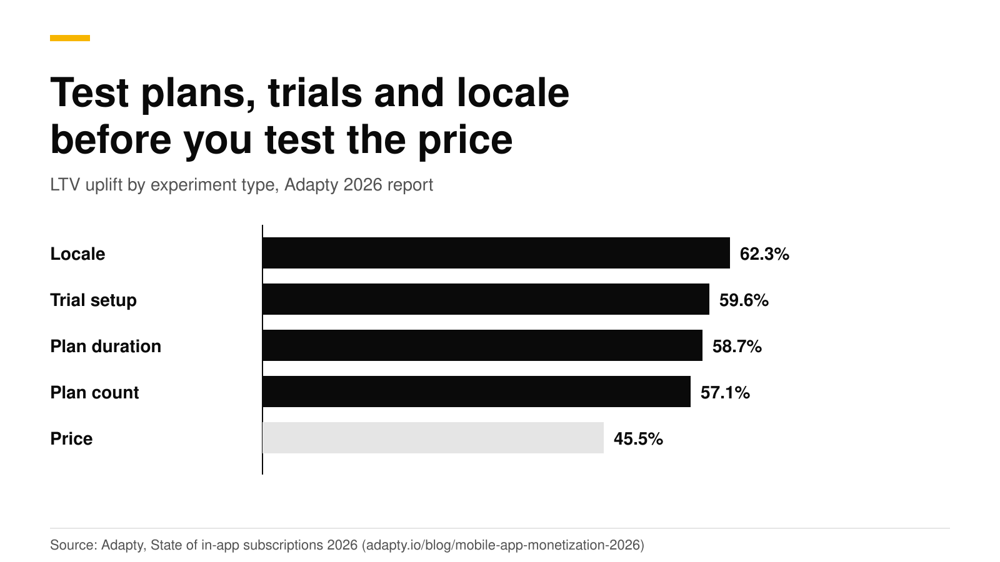

# How to price a subscription app in 2026: plans, trials, regions

Start with the market's medians, then test structure before price. Adapty's 2026 report puts global median prices at $7.48 a week, $12.99 a month and $38.42 a year. Its experiment data ranks tests of locale, trial, plan duration and plan count above tests of the price itself. So the order is: pick two or three plans, set a trial, price each country, and only then tune the number.

This guide covers each step, the consent rules that apply when you raise a price on the App Store and Google Play, and how to run price tests without an app release. All numbers link their source and were checked in October 2026. They are medians across many apps, so use them as a starting line and not as an answer.

## The short answer

- **Median prices (2025 data):** $7.48 weekly, $12.99 monthly, $38.42 yearly ([Adapty](https://adapty.io/state-of-in-app-subscriptions/)).
- **Plans:** weekly plans earned 55.5% of subscription revenue, monthly 11.7% and annual 22.5% ([Adapty](https://adapty.io/blog/mobile-app-monetization-2026/)). Health and fitness is the exception, where annual earns 60.6%.
- **Trials:** trials of 17 to 32 days convert at a median of 42.5%, against 25.5% for trials under 4 days, yet 46.5% of apps use the short ones ([RevenueCat](https://www.revenuecat.com/blog/growth/subscription-app-trends-benchmarks-2026)).
- **Regions:** European apps charge 29% to 39% more than North American ones, and one global price likely under-charges Europe ([Adapty](https://adapty.io/blog/mobile-app-monetization-2026/)).
- **Price increases:** Apple asks for consent only in some cases. Google Play defaults to opt-in. Both stores expire the subscription if a customer who must consent does not.
- **Testing:** run offering experiments, compare revenue per new customer, and wait for at least 100 customers in each variant.

## What do subscription apps charge in 2026?

| Plan | Median price | Share of subscription revenue |
|---|---|---|
| Weekly | $7.48 | 55.5% |
| Monthly | $12.99 | 11.7% |
| Annual | $38.42 | 22.5% |

Source: [Adapty, State of In-App Subscriptions 2026](https://adapty.io/state-of-in-app-subscriptions/) and the [report summary](https://adapty.io/blog/mobile-app-monetization-2026/). The shares are for 2025.

Weekly plans start trials at up to 5.4 times the rate of annual plans. Adapty reports 9.8% install-to-trial conversion for weekly plans and 1.8% for annual, in the upper-mid price tier. The weekly-with-trial group is worth $54.50 per user by day 380, from $7.40 at day 0 ([Adapty](https://adapty.io/blog/mobile-app-monetization-2026/)). Our [weekly vs annual post](weekly-vs-annual-subscriptions.md) has the detail. Apple's rule applies when you show several plans: the amount billed must be the most prominent price, and a per-week breakdown must be smaller ([Apple](https://developer.apple.com/app-store/subscriptions/)).

## How many plans should I offer?

Two or three. Adapty's data puts plan-count tests at a 57.1% lifetime value uplift, close to plan-duration tests at 58.7%. A common starting set is annual, which many apps pre-select, plus either weekly or monthly. Monthly is the weakest top of funnel in Adapty's data, at 0.3% install-to-trial, so check whether you need it.

Annual plans have one trap. RevenueCat found that the first month accounts for 35% of all annual cancellations, as customers switch off auto-renew early ([RevenueCat](https://www.revenuecat.com/blog/growth/subscription-app-trends-benchmarks-2026)). Price the annual plan as a first purchase that must earn the second one.

On the App Store, put weekly, monthly and annual products in one subscription group so customers can move between them ([Apple](https://developer.apple.com/help/app-store-connect/manage-subscriptions/offer-auto-renewable-subscriptions)). See [upgrades and downgrades](subscription-upgrades-downgrades.md). On Google Play, make them base plans of one subscription ([base plans guide](google-play-base-plans-and-offers.md)).

## Should I offer a free trial, and how long?

Test it. RevenueCat's 2026 data shows three things:

- **Longer trials convert better.** 17 to 32 day trials convert 70% better than trials under 4 days, 42.5% against 25.5%.
- **Short trials end fast.** 55.4% of 3-day trial cancellations happen on day 0, and 84% happen by day 1.
- **Most apps still use short trials.** The share of trials under 4 days rose from 42.1% to 46.5%.

All three are from the [RevenueCat report](https://www.revenuecat.com/blog/growth/subscription-app-trends-benchmarks-2026). Adapty adds that 89.4% of trial starts happen on install day, so your first paywall carries almost all of your trial starts. It also finds that trials do not help everywhere. The trial's lifetime value premium over direct buyers is +85.1% in Utilities and -21.2% in Lifestyle ([Adapty](https://adapty.io/blog/mobile-app-monetization-2026/)).

Platform rules to design around:

- **Apple.** Customers can redeem one introductory offer per subscription group. A free-trial purchase flow must clearly show how long the trial lasts and the price billed after it ([Apple](https://developer.apple.com/app-store/subscriptions/)). See [Apple's free trial toggle rejection](apple-free-trial-toggle-rejection.md).
- **Google Play.** A free trial is an offer phase that can last from 3 days to 3 years ([Google](https://support.google.com/googleplay/android-developer/answer/12154973)).

## How do I set prices by country?

Both stores price per country, and both convert for you.

- **App Store.** Price each subscription per storefront from 800 price points, with 100 more on request. App Store Connect suggests comparable prices for all 175 countries and regions, taking taxes and exchange rates into account, and you can change any of them ([Apple](https://developer.apple.com/help/app-store-connect/manage-subscriptions/manage-pricing-for-auto-renewable-subscriptions)).
- **Google Play.** Enter a tax-exclusive price. Play converts it to each currency, adds tax where prices include it, and rounds to local price endings. You can also set one country by hand ([Google](https://support.google.com/googleplay/android-developer/answer/140504)).

Why bother? Adapty finds locale tests, which cover translation and currency, give the highest lifetime value uplift of any experiment type, at 62.3%. It also finds European monthly prices at $15.25 against $10.95 in North America. Its advice is that one global price likely under-charges Europe and may over-charge markets with lower purchasing power, such as Latin America ([Adapty](https://adapty.io/blog/mobile-app-monetization-2026/)). Start with your top five revenue countries and set their prices by hand.

Prices are one half of the work. Apple's net revenue is 70% of the price in a subscriber's first year and 85% after a year of paid service, or 85% from day one for Small Business Program members, before taxes ([Apple](https://developer.apple.com/app-store/subscriptions/)). Google changed its service fees by region in 2026, so read its [fee page](https://support.google.com/googleplay/android-developer/answer/112622) before you model margins.

## How do price increases work on each store?

**Price decreases** are automatic on both stores. Existing subscribers renew at the lower price. On Apple you cannot keep the higher price for them ([Apple](https://developer.apple.com/help/app-store-connect/manage-subscriptions/manage-pricing-for-auto-renewable-subscriptions)).

**Apple.** You can schedule one price change at a time per storefront. A raise needs subscriber consent when any of these is true: the region requires consent for any change, the raise is more than 50% and more than about US$5 per period (US$50 for annual plans), or the subscriber already had a raise in the past 12 months. Otherwise Apple sends notices only. Apple asks consent about 60 days ahead for plans of two months or longer, 27 days for monthly and 7 days for weekly. A subscriber who does not agree is expired at the end of the current cycle. You can keep any number of active subscribers at their old price ([Apple](https://developer.apple.com/help/app-store-connect/manage-subscriptions/manage-pricing-for-auto-renewable-subscriptions), [Apple](https://developer.apple.com/app-store/subscriptions/)). If you have several price cohorts, raise the one closest to the current price first so nobody sees two raises.

**Google Play.** Changing a base plan's price puts current payers in a legacy price cohort. A raise is opt-in or opt-out ([Google](https://support.google.com/googleplay/android-developer/answer/12154973)):

| | Opt-in | Opt-out |
|---|---|---|
| Customer action | Must agree, or the subscription is canceled before the first higher charge | Can cancel, otherwise pays the new price |
| Notice | At least 30 days | At least 30 or 60 days, by country |
| Where | Any country | Only some countries, for developers in good standing |
| Limits | None stated | One per base plan and country in 365 days. The raise may not exceed the greater of 50% or 17 US cents a day |
| You must | Nothing extra | Certify your terms reserve the right, and show an in-app notice at least 30 days ahead |

You can end a legacy cohort to move its users to the current price, and a raise that fails the opt-out criteria becomes opt-in. Play Billing Lab can test a price change for one license tester without touching other subscribers ([Android Developers](https://developer.android.com/google/play/billing/test)).

Warn customers first. Apple's guide suggests an in-app message that explains the value before the consent sheet appears ([Apple](https://developer.apple.com/app-store/subscriptions/)).

## How do I test prices?

Treat each price as a separate store product, because a product has one price per storefront. Put each product in its own offering, and split new customers between the offerings.

1. Create a product for each price in App Store Connect and Play Console, for example `pro_annual_39` and `pro_annual_49`.
2. Add both to RevenueDot and attach them to the same `pro` entitlement.
3. Create two offerings, each with its own paywall. See [targeting and experiments](https://revenuedot.app/docs/guides/targeting-and-experiments).
4. Open **Experiments**, select **New experiment**, pick the two offerings and the share of customers to enroll, and select **Start**. Customers keep the same variant.
5. Read **Results**: customers, conversions, trials, revenue, revenue per customer and the chance the treatment converts better. Wait for at least 100 customers in each variant.

Judge by revenue per new customer over 30 to 60 days, not trial starts. Experiments compare two offerings at a time, and results show revenue and conversions, so also check refunds in store reports. To price by country, make an audience on the customer's country and a targeting rule that shows a different offering ([docs](https://revenuedot.app/docs/guides/targeting-and-experiments)).

Adapty reports that apps running experiments earn about 40 times more revenue than apps that do not. That is a correlation, since bigger apps test more, but it shows testing is normal practice ([Adapty](https://adapty.io/blog/mobile-app-monetization-2026/)).

## Do it with RevenueDot

- **Experiments** compare offerings with a deterministic split and a results page ([experiments feature](https://revenuedot.app/features/experiments)).
- **Targeting** shows a different offering by country, platform or app version.
- **Charts** show the result: [MRR](https://revenuedot.app/charts/mrr), [trial conversion rate](https://revenuedot.app/charts/trial-conversion-rate) and [paywall conversion rate](https://revenuedot.app/charts/paywall-conversion-rate).
- **Price increase events.** RevenueDot sends `PRICE_INCREASE_CONSENT_REQUIRED` and `PRICE_INCREASE_CONSENT_APPROVED` webhooks, so you can message affected customers ([lifecycle reference](https://revenuedot.app/docs/concepts/subscriptions-and-events)).
- **Model the margin** with the [subscription revenue calculator](https://revenuedot.app/tools/subscription-revenue-calculator) and the [App Store fee calculator](https://revenuedot.app/tools/app-store-fee-calculator).

For the App Store and Google Play, prices live in the stores, not in RevenueDot. You change a price in App Store Connect or Play Console, and RevenueDot records what customers actually pay.

[Start for free on RevenueDot Cloud](https://app.revenuedot.app/signup). Pro costs $0 until your apps make $10,000 a month.

## FAQ

### What is a good price for a subscription app?

Start near the medians, $7.48 a week, $12.99 a month and $38.42 a year in Adapty's data, then adjust for your category and country ([Adapty](https://adapty.io/state-of-in-app-subscriptions/)). Medians hide big category gaps, so test.

### Should I use weekly, monthly or annual pricing?

Weekly earned the largest share of subscription revenue in 2025, annual leads in Health and Fitness, and monthly is the weakest at the top of the funnel in Adapty's data. Offer two or three plans and let an experiment pick the default ([weekly vs annual](weekly-vs-annual-subscriptions.md)).

### Can I raise prices on existing subscribers without their consent?

Sometimes. Apple notifies without asking for consent unless a trigger applies, such as a raise over 50% and about $5. Google allows opt-out raises only in some countries, once per year per base plan ([Apple](https://developer.apple.com/help/app-store-connect/manage-subscriptions/manage-pricing-for-auto-renewable-subscriptions), [Google](https://support.google.com/googleplay/android-developer/answer/12154973)).

### What happens to a subscriber who ignores a price increase?

If consent is required and the subscriber does not respond, Apple expires the subscription at the end of the billing cycle. On Google Play an opt-in raise cancels the subscription before the first charge at the new price ([Apple](https://developer.apple.com/app-store/subscriptions/), [Google](https://support.google.com/googleplay/android-developer/answer/12154973)).

### How long should a price test run?

Until each variant has at least 100 customers, and then until the revenue per customer reflects the 30 to 60 days you care about. RevenueDot's results page shows the numbers and the chance the treatment is better ([experiments](https://revenuedot.app/docs/guides/targeting-and-experiments)).

**About RevenueDot.** RevenueDot is an open-source (AGPL-3.0) backend for in-app purchases and subscriptions that works with the RevenueCat SDK. Start for free on [RevenueDot Cloud](https://app.revenuedot.app/signup): Pro costs $0 until your apps make $10,000 a month, then 0.5% of revenue above $10,000, never more than $999 a month. Point the SDK's proxy URL at RevenueDot and keep your app code, your offerings and your customers. Read the [quickstart](../docs/getting-started/quickstart.md) or the code on [GitHub](https://github.com/revenuedot/revenuedot).
