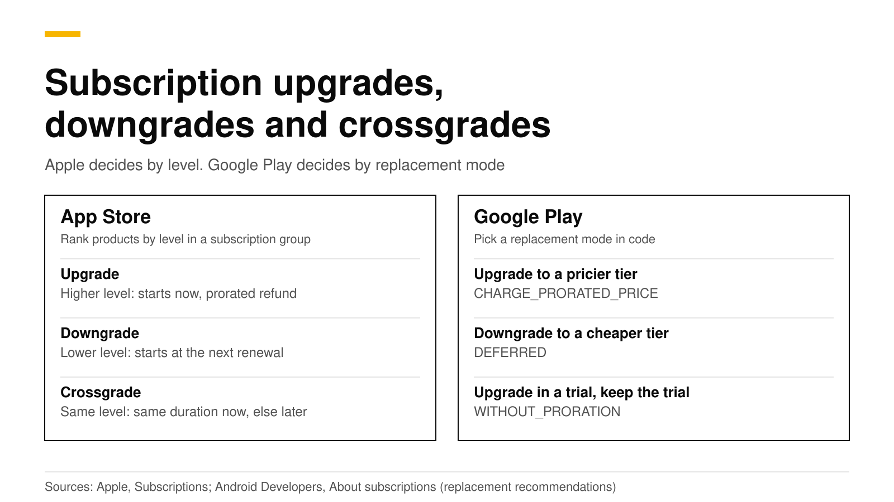
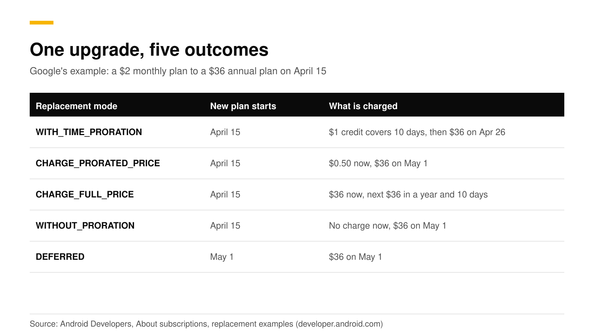

# Subscription upgrades and downgrades: iOS levels, Play proration

On iOS you do not write code to upgrade or downgrade a subscriber. You put your products in one subscription group, rank them by level, and Apple decides what happens. A higher level starts now with a prorated refund, a lower level waits for the next renewal, and an equal level depends on the duration. On Google Play you do write code: you pick a replacement mode that decides when access changes and how the price is prorated.

This post covers both stores, shows the Kotlin and RevenueCat calls for Android, and explains the events your server sees. Sources are Apple, Google and RevenueCat docs, checked in October 2026.



## The short answer

- **iOS: levels decide.** Rank products from level 1 (the most access) downward in a subscription group. People can change plans as often as they like ([Apple](https://developer.apple.com/app-store/subscriptions/)).
- **iOS upgrade:** immediate, with a refund of the prorated amount of the old plan (same source).
- **iOS downgrade:** the current plan runs to the next renewal date, then renews at the lower level and price (same source).
- **iOS crossgrade:** same level. If both plans have the same duration, the new one starts now, and if durations differ, it starts at the next renewal (same source).
- **Android: you choose a replacement mode.** The modes are `WITH_TIME_PRORATION`, `CHARGE_PRORATED_PRICE`, `CHARGE_FULL_PRICE`, `WITHOUT_PRORATION`, `DEFERRED` and `KEEP_EXISTING` ([Android Developers](https://developer.android.com/google/play/billing/subscriptions)).
- **Only the customer changes a plan.** The stores do not let a developer upgrade or downgrade a subscription for a customer ([RevenueCat](https://www.revenuecat.com/docs/subscription-guidance/managing-subscriptions)).

## How do subscription groups and levels work on iOS?

A subscription group holds products with different levels, prices and durations. A customer can have one active subscription per group. Apple recommends one group for most apps, because two groups bill separately and a customer could pay twice. A group can hold up to 100 subscriptions ([Apple](https://developer.apple.com/help/app-store-connect/manage-subscriptions/offer-auto-renewable-subscriptions)).

To set levels in App Store Connect, open the group, click **Edit Order**, and drag products so the one with the most access is on top. You can put several products at the same level, such as a monthly and an annual version of Pro. Moving between them is then a crossgrade, and it does not change the days of paid service that earn the 85% proceeds rate after a year ([Apple](https://developer.apple.com/app-store/subscriptions/)).

| Change | When it happens | What the customer pays |
|---|---|---|
| Upgrade (higher level) | Immediately | Refund of the old plan's prorated amount, then the new plan |
| Downgrade (lower level) | At the next renewal date | The lower price from then on |
| Crossgrade, same duration | Immediately | The new plan's price, starting now |
| Crossgrade, different duration | At the next renewal date | New price from then on |

Source: [Apple](https://developer.apple.com/app-store/subscriptions/). If you want an upgrade to give instant access, rank the new product higher.

Your app does not run any purchase code for a plan change. The customer buys the other product in the usual way, and Apple applies the rule. To let people manage plans without leaving your app, call the `showManageSubscriptions(in:)` method ([Apple](https://developer.apple.com/app-store/subscriptions/)). RevenueCat adds one quirk: if a customer upgrades during an introductory period such as a free trial, Apple keeps the introductory offer active, so two products in the group can be active at once ([RevenueCat](https://www.revenuecat.com/docs/subscription-guidance/managing-subscriptions)).

Offers follow the same ranking. Existing subscribers can redeem an [offer code](ios-subscription-offer-codes.md) only if it upgrades them or keeps them at their level ([Apple](https://developer.apple.com/app-store/subscriptions/)). A [promotional offer](ios-promotional-offers-signature.md) can promote an upgrade at a special price ([Apple](https://developer.apple.com/help/app-store-connect/manage-subscriptions/set-up-promotional-offers-for-auto-renewable-subscriptions)).

## How do replacement modes work on Google Play?

When a user changes plan, you tell Google Play how to treat the unused value of the current period and when the change takes effect. The mode names and meanings below are from Google's [subscriptions guide](https://developer.android.com/google/play/billing/subscriptions).

| Replacement mode | New plan starts | What is charged |
|---|---|---|
| `WITH_TIME_PRORATION` | Immediately | No extra charge now. The remaining time is credited and pushes the next bill date forward. This is the default |
| `CHARGE_PRORATED_PRICE` | Immediately | The price difference for the rest of the period, same billing date. Upgrades only, where the price per unit of time rises |
| `CHARGE_FULL_PRICE` | Immediately | The full new price now. The old plan's remaining value is carried over |
| `WITHOUT_PRORATION` | Immediately | The new price at the next renewal. The billing cycle stays the same |
| `DEFERRED` | At the next renewal | The new price at the next renewal |
| `KEEP_EXISTING` | Unchanged | For subscriptions with add-ons: keeps one item's payment schedule |

You can also set a default in Play Console for switching base plans within the same subscription. It offers "Charge immediately" (like `CHARGE_FULL_PRICE`) or "Charge at the next billing date" (like `WITHOUT_PRORATION`). When you switch to a different subscription, you must pass the mode in code ([Android Developers](https://developer.android.com/google/play/billing/subscriptions)).

### What does one upgrade cost in each mode?

Google's example: a customer pays $2 a month for Tier 1 and, on April 15, moves to the $36-a-year Tier 2 plan.



With `WITH_TIME_PRORATION` the $1 left of the month pays for about 10 days, then $36 is charged on April 26. With `CHARGE_PRORATED_PRICE` the customer pays $0.50 now and $36 on May 1. With `WITHOUT_PRORATION` there is no extra charge and $36 is due on May 1. With `DEFERRED`, Tier 1 runs to April 30 and Tier 2 starts on May 1.

### Which mode should I pick?

Google recommends these ([Android Developers](https://developer.android.com/google/play/billing/subscriptions)):

| Scenario | Mode |
|---|---|
| Upgrade to a more expensive tier | `CHARGE_PRORATED_PRICE` |
| Downgrade to a less expensive tier | `DEFERRED` |
| Upgrade during a free trial and keep the trial | `WITHOUT_PRORATION` |
| Upgrade during a free trial and end the trial | `CHARGE_PRORATED_PRICE` |

Google's own example for moving from a shorter to a longer billing period is `CHARGE_FULL_PRICE`. Restrictions apply: a switch to a prepaid plan allows only `CHARGE_FULL_PRICE`, and a switch between auto-renewing base plans of one subscription allows only `CHARGE_FULL_PRICE` and `WITHOUT_PRORATION`. Any other mode fails the purchase.

## How do I write the Android code?

Pass the old purchase token and the replacement mode when you launch the billing flow. This is the current approach, `SubscriptionProductReplacementParams`, from Google's guide. The older `SubscriptionUpdateParams.setSubscriptionReplacementMode` is deprecated from Play Billing Library 8.1.

```kotlin
val replacement = BillingFlowParams.SubscriptionProductReplacementParams.newBuilder()
    .setOldProductId("basic") // the subscription being replaced
    .setReplacementMode(
        BillingFlowParams.SubscriptionProductReplacementParams.ReplacementMode.CHARGE_PRORATED_PRICE
    )
    .build()

val productParams = BillingFlowParams.ProductDetailsParams.newBuilder()
    .setProductDetails(premiumDetails)   // from queryProductDetails
    .setOfferToken(premiumOfferToken)
    .setSubscriptionProductReplacementParams(replacement)
    .build()

val flowParams = BillingFlowParams.newBuilder()
    .setProductDetailsParamsList(listOf(productParams))
    .setSubscriptionUpdateParams(
        BillingFlowParams.SubscriptionUpdateParams.newBuilder()
            .setOldPurchaseToken(oldPurchaseToken)
            .build()
    )
    .build()
billingClient.launchBillingFlow(activity, flowParams)
```

A plan change is a new purchase. Google says to process and acknowledge it as you would any purchase, and to retire the purchase it replaces. With `DEFERRED`, your backend gets `SUBSCRIPTION_PURCHASED` immediately, and the new subscription's start time is set when the old one expires, at which point a `SUBSCRIPTION_RENEWED` notification arrives ([Android Developers](https://developer.android.com/google/play/billing/subscriptions)).

With the RevenueCat SDK, give the old product ID and, if you want one, a mode. RevenueCat's default is `WITHOUT_PRORATION`, and it warns that `DEFERRED` only works when Google server notifications are set up ([RevenueCat](https://www.revenuecat.com/docs/subscription-guidance/managing-subscriptions)):

```kotlin
Purchases.sharedInstance.purchase(
    PurchaseParams.Builder(requireActivity(), pkg)
        .oldProductId("oldProductId:oldBasePlanId")
        .replacementMode(StoreReplacementMode.DEFERRED)
        .build(),
    object : PurchaseCallback {
        override fun onCompleted(storeTransaction: StoreTransaction, customerInfo: CustomerInfo) {
            // Check customerInfo.entitlements as usual.
        }
        override fun onError(purchasesError: PurchasesError, userCancelled: Boolean) { }
    }
)
```

## What does my server see when a plan changes?

| Store | Signal |
|---|---|
| App Store | Notification `DID_CHANGE_RENEWAL_PREF` with subtype `UPGRADE` or `DOWNGRADE`. A customer who reverts a downgrade gets `DID_CHANGE_RENEWAL_PREF` with no subtype ([Apple](https://developer.apple.com/documentation/appstoreservernotifications/notificationtype)) |
| Google Play | `SUBSCRIPTION_PURCHASED` for the new plan, and `SUBSCRIPTION_RENEWED` when a deferred change takes effect ([Android Developers](https://developer.android.com/google/play/billing/subscriptions)) |
| RevenueDot | A `PRODUCT_CHANGE` event with `new_product_id`, and `auto_renewal_status: will_change_product` while a change is scheduled ([lifecycle reference](https://revenuedot.app/docs/concepts/subscriptions-and-events)) |

RevenueCat says `PRODUCT_CHANGE` is informative and that the change goes into effect with a later `RENEWAL` event on Apple and Stripe or `INITIAL_PURCHASE` on Google. In the webhook the `product_id` is the product the customer is leaving ([RevenueCat](https://www.revenuecat.com/docs/subscription-guidance/managing-subscriptions)). RevenueDot uses RevenueCat's event names, so check the order of events in your sandbox before you build billing logic on it.

## Do it with RevenueDot

1. Give each tier its own entitlement, for example `basic` and `pro`, and attach the monthly and annual products of a tier to it. See [products and entitlements](https://revenuedot.app/docs/concepts/products-and-entitlements). A customer who upgrades then gains `pro`, and the same entitlement check works on both stores.
2. Put iOS products in one subscription group and Android plans in one subscription per tier, then add them to an [offering](https://revenuedot.app/docs/concepts/offerings-and-packages) so one paywall serves both.
3. Connect [App Store](https://revenuedot.app/docs/guides/app-store) and [Google Play](https://revenuedot.app/docs/guides/google-play) notifications, so a change made in Settings or the Play Store reaches your server when the store sends it.
4. Add a [webhook](https://revenuedot.app/docs/guides/webhooks) and handle `PRODUCT_CHANGE`.
5. Watch [MRR movement](https://revenuedot.app/charts/mrr-movement) to see upgrades and downgrades in revenue terms.

RevenueDot's Test Store has no replacement-mode scenario yet, so test a real plan change in each store's sandbox ([testing guide](sandbox-testing-in-app-purchases.md)).

[Start for free on RevenueDot Cloud](https://app.revenuedot.app/signup). Pro costs $0 until your apps make $10,000 a month. See also the [Android SDK guide](https://revenuedot.app/sdks/android) and the [iOS SDK guide](https://revenuedot.app/sdks/ios).

## FAQ

### What is a crossgrade?

A move between two subscriptions at the same level of a subscription group, such as monthly to annual Pro. With equal durations the new one starts immediately, and with different durations it starts at the next renewal date ([Apple](https://developer.apple.com/app-store/subscriptions/)).

### Can I choose proration for an iOS upgrade?

No. Apple prorates and refunds an upgrade and starts the downgrade at renewal. You control the outcome by how you rank the products ([Apple](https://developer.apple.com/app-store/subscriptions/)).

### What is the default replacement mode on Google Play?

In the Play Billing Library the default is `WITH_TIME_PRORATION`, and RevenueCat's SDK defaults to `WITHOUT_PRORATION`. Set the mode yourself so the two defaults cannot surprise you ([Android Developers](https://developer.android.com/google/play/billing/subscriptions), [RevenueCat](https://www.revenuecat.com/docs/subscription-guidance/managing-subscriptions)).

### Does a plan change reset the subscriber's one-year count for Apple's 85% rate?

No. Upgrades, downgrades and crossgrades inside one subscription group do not affect the one year of paid service ([Apple](https://developer.apple.com/app-store/subscriptions/)).

### Does Amazon support upgrades?

No. RevenueCat's docs say customers must cancel and subscribe to a different product on the Amazon Appstore ([RevenueCat](https://www.revenuecat.com/docs/subscription-guidance/managing-subscriptions)).

**About RevenueDot.** RevenueDot is an open-source (AGPL-3.0) backend for in-app purchases and subscriptions that works with the RevenueCat SDK. Start for free on [RevenueDot Cloud](https://app.revenuedot.app/signup): Pro costs $0 until your apps make $10,000 a month, then 0.5% of revenue above $10,000, never more than $999 a month. Point the SDK's proxy URL at RevenueDot and keep your app code, your offerings and your customers. Read the [quickstart](../docs/getting-started/quickstart.md) or the code on [GitHub](https://github.com/revenuedot/revenuedot).
