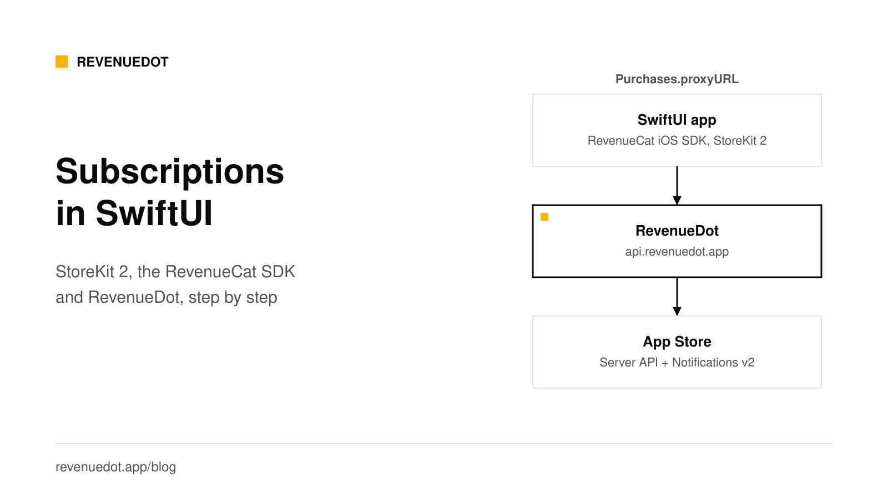
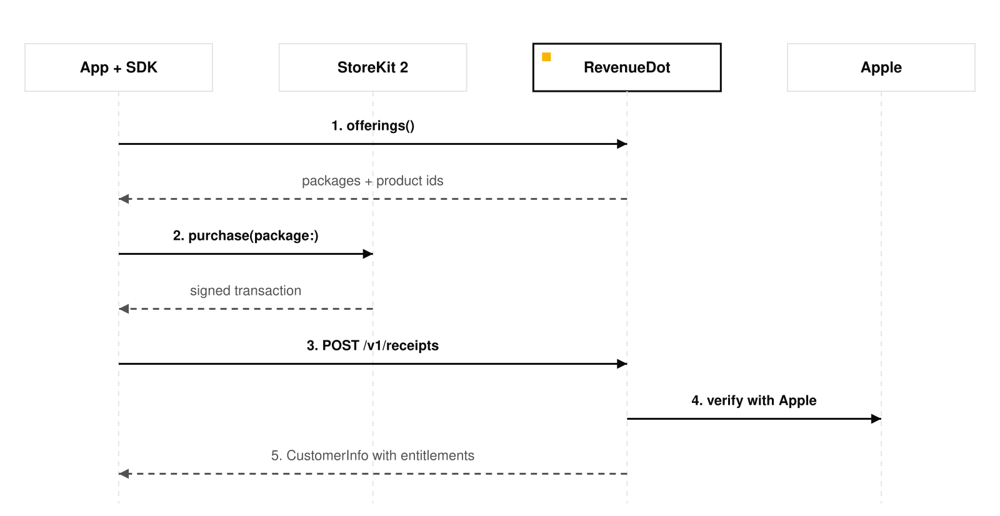

# Add subscriptions to a SwiftUI app: StoreKit 2 and RevenueDot

To add subscriptions to a SwiftUI app, create an auto-renewable subscription in App Store Connect, add the RevenueCat iOS SDK with Swift Package Manager, point it at a backend with `Purchases.proxyURL`, then call `offerings()`, `purchase(package:)` and check `customerInfo.entitlements`. The backend verifies each purchase with Apple and tells the app what the customer may use. This tutorial uses RevenueDot as that backend, so there is no revenue share and no server code to write.



## What you need

- An Apple Developer Program account and an app record in App Store Connect with a bundle ID.
- Xcode and a SwiftUI app. Check the SDK's current minimum iOS version in its [README](https://github.com/RevenueCat/purchases-ios).
- A RevenueDot Cloud project. [Sign up free](https://app.revenuedot.app/signup).
- An iPhone or simulator, and a sandbox tester account for real store purchases.

The flow has seven steps: create the product, connect the App Store, create the catalog, install the SDK, configure it, build the paywall, then test.

## Step 1: Create the subscription in App Store Connect

Apple's [App Store Connect help](https://developer.apple.com/help/app-store-connect/manage-subscriptions/offer-auto-renewable-subscriptions) lists the steps. In short:

1. In your app, open **Monetization, Subscriptions** and click **+** to create a **subscription group**. Give it a reference name such as `Pro`.
2. In the group, click **Create** and enter a reference name and a **Product ID**, for example `pro_monthly`. The product ID is permanent, so choose it with care.
3. Set the **Subscription Duration**, the **price**, and the countries where it is available.
4. Add a localized display name and description.
5. Fill in the review information.

Apple says your first auto-renewable subscription must be submitted together with a new app version. Until then, the subscription page offers **Add for Review** next to the app version.

**Common error:** the SDK returns an empty offering and logs that products could not be found. The usual causes are a mistyped product ID, a product whose details are incomplete, or a product that is not available in your tester's country. Check each in App Store Connect.

## Step 2: Connect the App Store to RevenueDot

In the RevenueDot dashboard, add an **App Store** app with your bundle ID. The [App Store guide](https://revenuedot.app/docs/guides/app-store) walks through the two things RevenueDot needs.

**An In-App Purchase key.** RevenueDot uses it to call Apple's App Store Server API and confirm each purchase.

1. Open [App Store Connect, Users and Access, Integrations, In-App Purchase](https://appstoreconnect.apple.com/access/integrations/api/subs).
2. Click **+**, name the key `RevenueDot` and click **Generate**.
3. Download the `.p8` file. Apple lets you download it once.
4. Copy the **Key ID** and the **Issuer ID**.
5. In RevenueDot, open the app, drop in the `.p8` file, fill in both IDs and click **Check credentials**.

Without the key, RevenueDot still verifies StoreKit 2 signed transactions against Apple's root certificate, but it knows only what the device sent: no renewal state and no history.

**The notification URL.** Apple's [App Store Server Notifications](https://developer.apple.com/documentation/appstoreservernotifications) tell RevenueDot about renewals, cancellations and refunds when they happen. Copy the app's URL from the dashboard. On RevenueDot Cloud it looks like `https://api.revenuedot.app/v1/notifications/apple/{app_id}`. In App Store Connect, open your app, then **App Information, App Store Server Notifications**. Per Apple's [setup page](https://developer.apple.com/help/app-store-connect/configure-in-app-purchase-settings/enter-server-urls-for-app-store-server-notifications), set a **Production Server URL** and a **Sandbox Server URL**, and choose **Version 2** for each. If you give only a production URL, Apple sends both environments there.

The full list of notification types is in [App Store Server Notifications V2](https://revenuedot.app/blog/app-store-server-notifications-v2).

## Step 3: Create the product, entitlement and offering

Your app should never check a product ID. It checks an **entitlement**, which is the access a customer has. In RevenueDot's dashboard:

1. **Products:** add `pro_monthly` for the App Store app, type subscription, one month.
2. **Entitlements:** add `pro` and attach the product.
3. **Offerings:** create `default` with a `$rc_monthly` package that holds the product, and make it current.

The [products and entitlements](https://revenuedot.app/docs/concepts/products-and-entitlements) and [offerings and packages](https://revenuedot.app/docs/concepts/offerings-and-packages) pages explain each field. Later you can add a yearly plan to the same entitlement without shipping an app update.


## Step 4: Install the SDK

In Xcode, choose **File, Add Package Dependencies** and enter the SDK's package URL. RevenueCat's [installation guide](https://www.revenuecat.com/docs/getting-started/installation/ios) gives `https://github.com/RevenueCat/purchases-ios-spm.git`. Add the `RevenueCat` product to your app target.

RevenueDot also maintains a [fork](https://revenuedot.app/docs/sdks/ios) that keeps the same Swift module names, so `import RevenueCat` stays. It is not published to a package registry yet, so this tutorial uses the stock SDK in proxy mode.

## Step 5: Configure the SDK with a proxy URL

Set the proxy URL before you call `configure`. Turn off entitlement verification, because the stock SDK checks response signatures against RevenueCat's key and would log every RevenueDot response as failed.

```swift
import RevenueCat
import SwiftUI

@main
struct FocusApp: App {
    init() {
        Purchases.logLevel = .debug
        // Point the SDK at RevenueDot. Set it before configure.
        Purchases.proxyURL = URL(string: "https://api.revenuedot.app")!
        Purchases.configure(
            with: Configuration.Builder(withAPIKey: "appl_YourPublicKey")
                .with(entitlementVerificationMode: .disabled)
                .build()
        )
    }

    var body: some Scene {
        WindowGroup { ContentView() }
    }
}
```

Use the app's public key from RevenueDot (`appl_...`). If you ran the importer from RevenueCat, your existing key keeps working. For development without any Apple account, create a **Test Store** app and use its `test_...` key. Test Store keys work only in Debug builds: in a Release build the SDK shows a "Wrong API Key" alert and stops the app on purpose. Ship with the `appl_` key.

**Expected output:** in Xcode's console, a debug log shows the SDK's requests going to `api.revenuedot.app`, and `Purchases is configured`.

## Step 6: Load offerings, buy, restore and check access

Keep the purchase logic in one observable model. These calls are the SDK's public API, unchanged.

```swift
import RevenueCat
import SwiftUI

@MainActor
final class PaywallModel: ObservableObject {
    @Published var packages: [Package] = []
    @Published var customerInfo: CustomerInfo?
    @Published var message: String?

    var isPro: Bool { customerInfo?.entitlements["pro"]?.isActive == true }

    func load() async {
        do {
            let offerings = try await Purchases.shared.offerings()
            packages = offerings.current?.availablePackages ?? []
            customerInfo = try await Purchases.shared.customerInfo()
        } catch {
            message = error.localizedDescription
        }
    }

    // Keeps the screen in sync after renewals, restores and purchases on other devices.
    func watch() async {
        for await info in Purchases.shared.customerInfoStream { customerInfo = info }
    }

    func buy(_ package: Package) async {
        do {
            let result = try await Purchases.shared.purchase(package: package)
            if !result.userCancelled { customerInfo = result.customerInfo }
        } catch ErrorCode.purchaseCancelledError {
            // The customer closed the sheet. Show nothing.
        } catch {
            message = error.localizedDescription
        }
    }

    func restore() async {
        do { customerInfo = try await Purchases.shared.restorePurchases() }
        catch { message = error.localizedDescription }
    }
}
```

Then the SwiftUI view:

```swift
struct PaywallView: View {
    @StateObject private var model = PaywallModel()

    var body: some View {
        VStack(spacing: 16) {
            if model.isPro {
                Text("You have Pro").font(.title2)
            } else {
                ForEach(model.packages, id: \.identifier) { package in
                    Button {
                        Task { await model.buy(package) }
                    } label: {
                        Text("\(package.storeProduct.localizedTitle), \(package.localizedPriceString)")
                            .frame(maxWidth: .infinity)
                    }
                    .buttonStyle(.borderedProminent)
                }
                Button("Restore purchases") { Task { await model.restore() } }
            }
            if let message = model.message { Text(message).foregroundStyle(.red) }
        }
        .padding()
        .task { await model.load() }
        .task { await model.watch() }
    }
}
```

Put a visible **Restore purchases** button, terms and a privacy link on your paywall, as RevenueDot's example app does. [RevenueCat advises](https://www.revenuecat.com/docs/getting-started/restoring-purchases) calling restore only from a button. The [restore guide](https://revenuedot.app/docs/help/restore-purchases) explains who owns a restored purchase when two accounts share an Apple ID.

### What happens when the customer taps buy



1. `offerings()` calls `GET /v1/subscribers/{id}/offerings` on RevenueDot and loads the matching products from StoreKit.
2. `purchase(package:)` shows Apple's payment sheet.
3. The SDK posts the signed transaction to `POST /v1/receipts`.
4. RevenueDot verifies the signature and, with the In-App Purchase key, reads the customer's history from Apple.
5. RevenueDot answers with customer info. The `pro` entitlement is now active, and your webhook receives an `INITIAL_PURCHASE` event.

## Step 7: Test in the sandbox

1. In App Store Connect, open **Users and Access, Sandbox** and create a sandbox tester.
2. On the device, sign in with it under **Settings, App Store, Sandbox Account**. TestFlight builds also use sandbox purchases.
3. Run the app with the `appl_` key. Buy the plan. Sandbox subscriptions renew in minutes, so you can watch renewals and expirations arrive.
4. Check the customer in the RevenueDot dashboard. The purchase is marked **sandbox**.
5. For StoreKit testing inside Xcode, save the StoreKit test certificate on the app. See [sandbox testing](https://revenuedot.app/docs/guides/sandbox-testing).

Run a sandbox purchase before you ship, and tell us what you find in a [GitHub issue](https://github.com/revenuedot/revenuedot/issues).

## Common errors and fixes

| Symptom | Cause | Fix |
|---|---|---|
| Empty offering | Product ID mismatch or product not ready | Match the ID exactly in RevenueDot's product and App Store Connect |
| "Wrong API Key" alert | A `test_` key in a Release build | Use the `appl_` key for Release |
| Purchase succeeds, entitlement not active | Product not attached to the `pro` entitlement | Attach it in the dashboard. See [entitlement not active](https://revenuedot.app/docs/help/entitlement-not-active) |
| Purchase retries forever | RevenueDot answered 5xx, for example a missing In-App Purchase key (code 7234) | Add the key. A 5xx tells the SDK to keep the transaction and retry. See [4xx vs 5xx](https://revenuedot.app/docs/help/receipt-errors-4xx-vs-5xx) |
| Logs say signature verification failed | Verification left on with the stock SDK | Set `.disabled` as in Step 5 |
| No notifications arrive | Wrong URL, or the Sandbox URL is empty | See [notifications not arriving](https://revenuedot.app/docs/help/store-notifications-not-arriving) |

## Do it with RevenueDot

1. [Create an account](https://app.revenuedot.app/signup). Building and testing are free, no card needed. Add a card when you go live; Pro costs $0 until your apps make $10,000 a month.
2. Add your App Store app, the In-App Purchase key and the notification URL (Step 2).
3. Create the product, the `pro` entitlement and the `default` offering (Step 3).
4. Set `Purchases.proxyURL` to `https://api.revenuedot.app` and configure with your `appl_` key (Step 5).
5. Add a webhook under **Integrations, Webhooks** to tell your own backend about purchases.

If you already use RevenueCat, the [migration guide](https://revenuedot.app/blog/migrating-from-revenuecat-without-data-loss) shows how to move without losing a subscriber.

[Start for free on RevenueDot Cloud](https://app.revenuedot.app/signup)

## FAQ

### Do I need a server to add subscriptions to a SwiftUI app?

You need something that verifies purchases and keeps entitlement state, and you can use a hosted or self-hosted backend for that. RevenueDot does it for you: the SDK posts each purchase, and RevenueDot checks it with Apple and returns the customer's entitlements.

### Is StoreKit 2 required?

You do not call StoreKit 2 yourself when you use the SDK. RevenueDot verifies StoreKit 2 signed transactions against Apple's certificate chain, and it needs the In-App Purchase key to read history and renewal state. StoreKit 1 receipts also need that key.

### How do I check whether a user is subscribed in SwiftUI?

Read `customerInfo.entitlements["pro"]?.isActive`. Call `Purchases.shared.customerInfo()` for a one-time read, or loop over `Purchases.shared.customerInfoStream` to update the screen when the state changes.

### What URL do I give App Store Connect for server notifications?

Use the app's notification URL from RevenueDot, in the form `https://api.revenuedot.app/v1/notifications/apple/{app_id}`. Set it for production and sandbox, and choose Version 2.

### Can I test without an Apple account?

Yes. Create a Test Store app in RevenueDot and use its `test_` key in a Debug build. The SDK shows a Test Store dialog instead of Apple's sheet. It proves your code path, not Apple's.

**About RevenueDot.** RevenueDot is an open-source (AGPL-3.0) backend for in-app purchases and subscriptions that works with the RevenueCat SDK. Start for free on [RevenueDot Cloud](https://app.revenuedot.app/signup): Pro costs $0 until your apps make $10,000 a month, then 0.5% of revenue above $10,000, never more than $999 a month. Point the SDK's proxy URL at RevenueDot and keep your app code, your offerings and your customers. Read the [quickstart](../docs/getting-started/quickstart.md) or the code on [GitHub](https://github.com/revenuedot/revenuedot).
