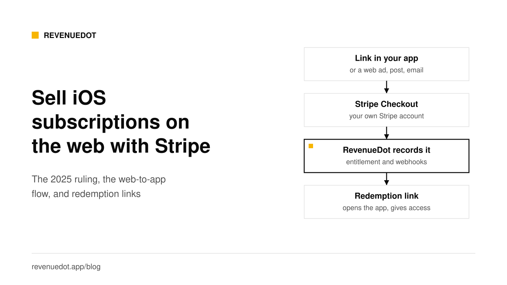
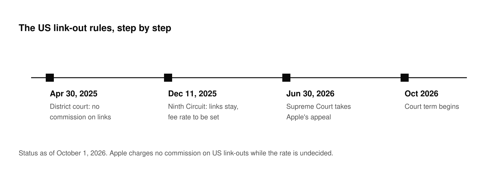
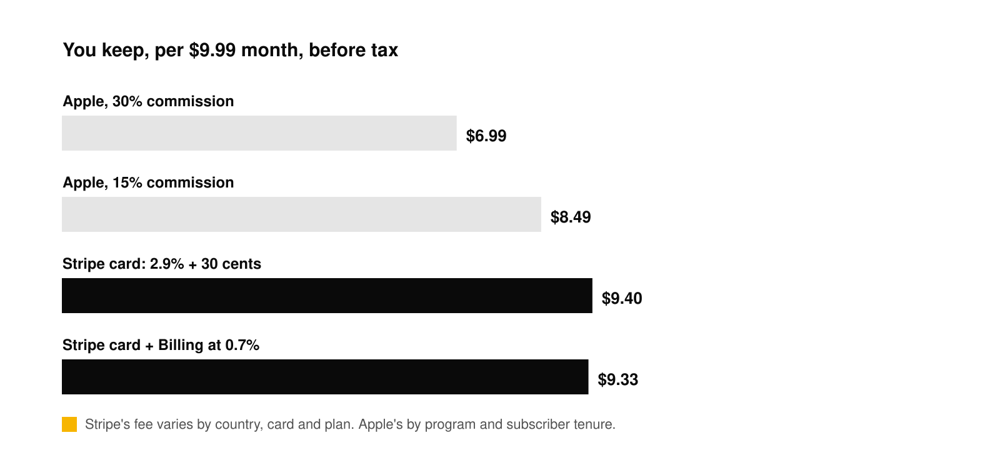
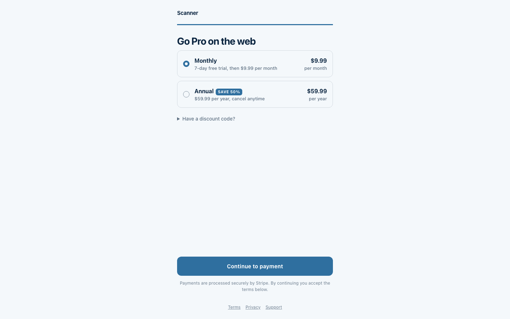

# Selling iOS subscriptions on the web with Stripe in 2026

In the United States you can link from your iOS app to your own website, sell the subscription there with Stripe, and give the customer access in the app. A federal court ordered this in April 2025, an appeals court upheld the core of it in December 2025, and Apple's own review guidelines now say the US storefront is exempt from the ban on external purchase links. The commission Apple may charge on those purchases is still undecided, and the Supreme Court has agreed to hear Apple's appeal, so treat the rules as live. This post covers the ruling, the fee math and the flow, with a RevenueDot setup.



This is not legal advice. Facts below were checked on October 1, 2026 and link to their sources.

## The short answer

- **US storefront:** Apple's [App Review Guidelines](https://developer.apple.com/app-store/review/guidelines/) say that in all storefronts except the United States, apps may not include buttons, external links or other calls to action that direct customers to purchasing mechanisms other than in-app purchase. The United States storefront is excluded from that prohibition.
- **Other storefronts:** the same guideline allows external links only through StoreKit External Purchase Link Entitlements in specific storefronts. Check them before you ship outside the US.
- **Commission:** Apple charges nothing on US link-out purchases while the court sets a rate, per [MacRumors](https://www.macrumors.com/2026/06/30/apple-epic-games-supreme-court/). The Ninth Circuit said Apple may charge a fee based on its genuinely and reasonably necessary costs.
- **Risk:** the Supreme Court will hear Apple's appeal in the term that begins in October 2026. The rules can change.

## How we got here: the ruling in four dates



1. **April 30, 2025.** Judge Yvonne Gonzalez Rogers of the Northern District of California found Apple in willful violation of her 2021 injunction in *Epic Games v. Apple*. She ordered Apple to stop interfering with developers' ability to tell users about other ways to pay, and barred its 27% commission on external purchases ([MacTech summary](https://www.mactech.com/2025/05/01/epic-scores-a-big-win-in-its-legal-battle-with-apple)).
2. **December 11, 2025.** The Ninth Circuit unanimously confirmed the contempt finding. It agreed Apple's "scare screen" violated the injunction and that the 27% commission was prohibitive. It reversed the zero-commission order as too punitive and sent the fee back to the district court ([Courthouse News](https://www.courthousenews.com/ninth-circuit-confirms-contempt-finding-against-apple-in-epic-games-battle/)). Per [Fenwick's analysis](https://www.fenwick.com/insights/publications/ninth-circuit-largely-upholds-ruling-in-epic-v-apple), Apple may charge a commission based on the costs genuinely and reasonably necessary to coordinate external links, but no more, and may stop developers from making their purchase links more prominent than Apple's own, while developers may match Apple's link styling.
3. **May 6, 2026.** The Supreme Court declined to pause the return of the case to the district court ([9to5Mac](https://9to5mac.com/2026/05/06/supreme-court-rejects-apples-stay-request-epic-games-case-to-head-back-to-district-court/)).
4. **June 30, 2026.** The Supreme Court agreed to hear Apple's appeal, on whether a court may hold a party in civil contempt for violating an injunction's spirit when the injunction is silent on the conduct. Argument comes in the term that starts in October. Meanwhile the district court is working on fee calculations that apply if the contempt ruling stands ([MacRumors](https://www.macrumors.com/2026/06/30/apple-epic-games-supreme-court/)).

What this means for you today: you may link out in a US-storefront app, and Apple currently takes no cut of what happens on your site. Build the flow so you can turn it off or reroute it, and read each ruling's detail before you change your paywall design.

## What you keep: the fee math

Take a $9.99 monthly subscription. Apple pays 70% of the subscription price in a subscriber's first year and 85% after one year of paid service, or 85% throughout in the Small Business Program ([Apple](https://developer.apple.com/app-store/subscriptions/)). Stripe's standard US card price is 2.9% plus 30 cents, and Stripe Billing is 0.7% of billing volume on pay-as-you-go ([Stripe pricing](https://stripe.com/pricing)).



| Channel | Fee on $9.99 | You keep |
|---|---|---|
| Apple, 30% (first year) | $3.00 | $6.99 |
| Apple, 15% (after year one, or Small Business Program) | $1.50 | $8.49 |
| Stripe card, 2.9% + $0.30 | $0.59 | $9.40 |
| Stripe card plus Billing at 0.7% | $0.66 | $9.33 |

These figures are before tax. On the web, you or your tax tool handle sales tax and VAT. Stripe's Checkout supports automatic tax collection with [Stripe Tax](https://docs.stripe.com/checkout/quickstart), which has its own fee. International cards add 1.5% and a currency conversion fee. You also carry refunds, chargebacks and support. The saving is real, but it is not the whole difference.

## How the web-to-app flow works

1. The customer taps a link in your app, or arrives from an ad, email or QR code, and lands on a page that sells your plans.
2. The page creates a Stripe Checkout Session on **your own Stripe account** and sends the customer to Stripe's payment page. Stripe's [Checkout docs](https://docs.stripe.com/checkout/quickstart) describe the `mode` parameter: `subscription` for recurring prices, `payment` for one-time.
3. Stripe returns the customer to a success page. A Stripe webhook, `checkout.session.completed`, is the backup if the customer closes the tab. Stripe says to verify the signature on the raw body and to answer 2xx quickly. Live-mode retries last up to three days ([Stripe webhooks](https://docs.stripe.com/webhooks)).
4. RevenueDot records the purchase like any Stripe purchase, sends your webhooks and shows it in the dashboard.
5. The customer opens a **redemption link**, `<scheme>://redeem_web_purchase?redemption_token=...`. Your app passes it to the SDK's `redeemWebPurchase`, and the purchase moves to the app's user. The entitlement is active. If the page already knows the app user ID (`?app_user_id=` on a link), the purchase goes straight to that user and no redemption is needed.

## Step 1: Connect Stripe

In RevenueDot, open **Web** and add Stripe, or create a Stripe app with the API. Then create a **restricted key** in the [Stripe Dashboard](https://dashboard.stripe.com/apikeys/create). RevenueDot creates products, prices, Checkout Sessions, coupons and promotion codes in your account, so it needs write access to those:

| Stripe resource | Permission |
|---|---|
| Products, Prices, Checkout Sessions, Coupons, Promotion Codes | Write |
| Subscriptions, Invoices, Charges, Customers | Read |

Everything else stays at None. Save the key on the Stripe app page. A key without write access fails when you create the first web product, with a 422 `store_error`.

Add a webhook endpoint in Stripe at `https://api.revenuedot.app/v1/notifications/stripe/{app_id}`, select `checkout.session.completed` (and `checkout.session.async_payment_succeeded` for payment methods that confirm later), and save its signing secret in RevenueDot.


## Step 2: Add a web config, web products and an offering

- **Web config:** your app name, logo, colors, terms and privacy links, support email, success behavior, your app's URL scheme (for example `scanner`), and store buttons. Every URL must be https.
- **Web products:** click **Create web product**. RevenueDot creates the Stripe product and price, and a RevenueDot product whose `store_identifier` is the Stripe price ID. Use periods `P1W`, `P1M`, `P3M`, `P6M` or `P1Y`, and `trial_days` for a free trial.
- **Offering:** put the web product in a package. A package holds one product per app, so the same package can hold your App Store product, your Google Play product and your web product. That is how one entitlement, `pro`, covers every channel.

The [web billing guide](https://revenuedot.app/docs/guides/web-billing) has every field and the API calls.

## Step 3: Share a purchase link or publish a funnel

A **purchase link** is a hosted checkout page for one offering, for example `https://api.revenuedot.app/pay/scanner/spring-sale`. Add `?app_user_id=` for a signed-in user, `?email=` to prefill the email and `?code=` to prefill a discount code.



A **funnel** is a few screens in a row: a quiz question, an info step, an email field, the plans and a success page. Edit it in the builder, publish it to a public URL and read the drop-off in the Analytics tab. See [purchase links](https://revenuedot.app/docs/guides/purchase-links) and [funnels](https://revenuedot.app/docs/guides/funnels). You can put the pages on your own domain with [custom domains](https://revenuedot.app/docs/guides/custom-domains).

## Step 4: Redeem in the app

Register your URL scheme in `Info.plist` so the link opens your app:

```xml
<key>CFBundleURLTypes</key>
<array>
  <dict>
    <key>CFBundleURLName</key>
    <string>com.example.scanner.redeem</string>
    <key>CFBundleURLSchemes</key>
    <array><string>scanner</string></array>
  </dict>
</array>
```

Then pass the URL to the SDK. Call `logIn` first if your app has accounts, so the purchase lands on the signed-in user.

```swift
.onOpenURL { url in
    guard let redemption = url.asWebPurchaseRedemption else { return }
    Task {
        switch await Purchases.shared.redeemWebPurchase(redemption) {
        case .success: break  // The entitlement is active.
        case .expired(let email): print("Expired. A new link went to \(email).")
        case .invalidToken, .purchaseBelongsToOtherUser, .error: print("Could not redeem.")
        }
    }
}
```

Android uses an intent filter for the scheme and `Purchases.sharedInstance.redeemWebPurchase`. The link works for 24 hours by default (`redemption_link_hours`, 1 to 720) and RevenueDot stores only a hash of its token. The buyer also gets it by email when the server can send email, which RevenueDot Cloud always can. See [redemption links](https://revenuedot.app/docs/guides/redemption-links).

A RevenueCatUI paywall's web checkout button also works on iOS. It opens a Stripe Checkout for the current app user and the purchase lands on that user with no redemption link.

## Step 5: Test in Stripe test mode

Use a test-mode restricted key (`rk_test_...`). Purchases are then sandbox data, kept out of production charts, and webhooks carry `environment: SANDBOX`. Pay with [Stripe's test cards](https://docs.stripe.com/testing), such as `4242 4242 4242 4242`. For production, create a second Stripe app with a live key, its own webhook endpoint and its own web products, because Stripe keeps test and live products apart.

**Before you send buyers,** run a purchase in Stripe test mode. Not available yet: "Connect with Stripe" OAuth on RevenueDot Cloud (paste a restricted key and a webhook signing secret for now), Paddle as a web provider, an embedded checkout on your own page, and Apple Pay domain registration for a custom domain.

## Design rules that protect you

- **Keep in-app purchase next to the web option** and measure which one wins, instead of removing either on day one.
- **Follow link presentation rules.** The Ninth Circuit allows Apple to stop your link from being more prominent than Apple's own purchase option, and bars scare screens. Match, do not outshine.
- **Outside the US, check the entitlement rules first.** Apple's guidelines name the specific storefronts and entitlements that allow external links.
- **Keep your terms, price and renewal details clear** on the web page, since that is where the customer agrees to pay.
- **Keep the SDK's restore button.** Customers still switch phones.

## Do it with RevenueDot

1. [Create a free account](https://app.revenuedot.app/signup). Cloud is free up to $10,000 in monthly tracked revenue.
2. Open **Web**, connect Stripe with a restricted key and add the webhook.
3. Add a web config, create web products and put them in an offering with your App Store product.
4. Create a purchase link or publish a funnel.
5. Register your URL scheme and call `redeemWebPurchase` in the app.
6. Run a test-mode purchase end to end.

[Start free on RevenueDot Cloud](https://app.revenuedot.app/signup)

## FAQ

### Can iOS apps link to web checkout in the US?

Yes. Apple's App Review Guidelines say the prohibition on buttons, external links and calls to action that point to other purchase methods does not apply to the United States storefront. A federal court ordered this in the Epic Games case, and the Ninth Circuit upheld the core of it in December 2025.

### Does Apple take a commission on web purchases from in-app links?

Not at the moment. The district court barred the 27% commission in April 2025. The Ninth Circuit said Apple may charge a fee based on its genuinely and reasonably necessary costs, and sent the rate back to the district court. The Supreme Court has agreed to hear Apple's appeal.

### How does a web purchase give access in the app?

Through a redemption link. The buyer opens it on their phone, your app passes it to `redeemWebPurchase`, and the purchase moves to the app's user. If the web page already knew the app user ID, no link is needed.

### What does Stripe charge for subscriptions?

Stripe's standard US card price is 2.9% plus 30 cents, and Stripe Billing is 0.7% of billing volume on pay-as-you-go ([Stripe pricing](https://stripe.com/pricing)). Your plan and country can differ.

### Does this work outside the US?

Not on the same terms. Apple's guideline restricts external purchase links in other storefronts, except where a StoreKit External Purchase Link Entitlement allows them. Check Apple's guidelines for the storefronts you serve.

**About RevenueDot.** RevenueDot is an open-source (AGPL-3.0) backend for in-app purchases and subscriptions on the App Store, Google Play and the web. Start free on [RevenueDot Cloud](https://app.revenuedot.app/signup), free up to $10,000 in monthly tracked revenue, or self-host it with Docker and Postgres. New apps install the [RevenueDot SDK](../docs/sdks/README.md) and pass their key. Apps that ship the RevenueCat SDK point its proxy URL at RevenueDot and keep their code, offerings and customers. Read the [quickstart](../docs/getting-started/quickstart.md) or the code on [GitHub](https://github.com/revenuedot/revenuedot).
