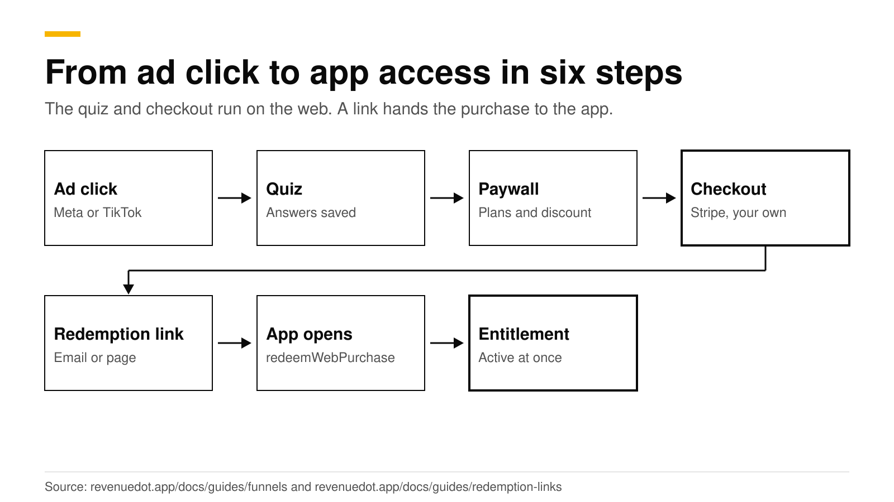
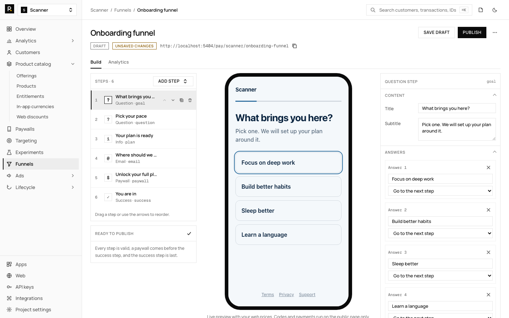
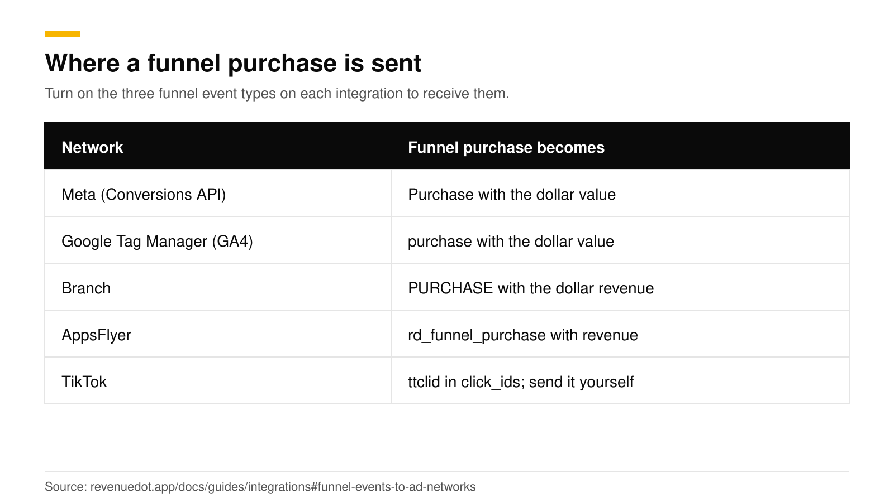
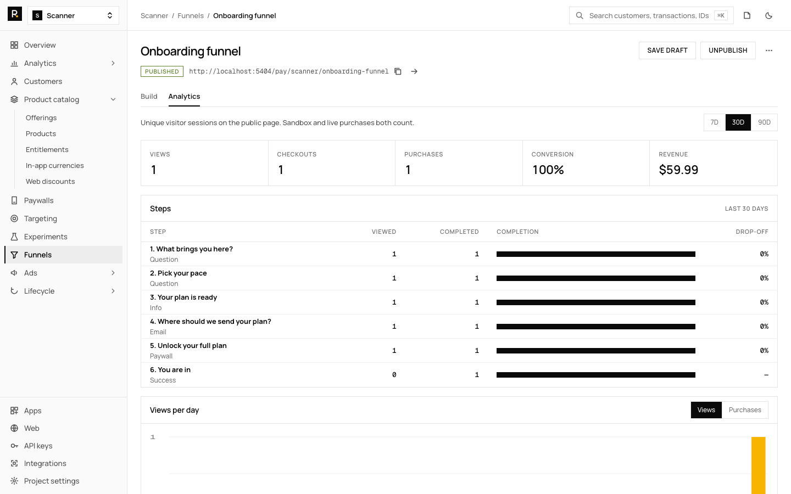

# Web-to-app funnels: quiz, checkout and app access

A web-to-app funnel sends a visitor from an ad to a web quiz, takes payment on a web checkout, and then gives the subscription to your app with a link. The visitor answers questions, sees plans, pays on Stripe Checkout, and opens the app through a redemption link. The app passes that link to the RevenueCat SDK, and RevenueDot moves the purchase to the app's user, so the entitlement is active at once, even if the buyer paid before they installed the app.

This post covers the flow, how to build each step in RevenueDot, how redemption works, and how funnel events reach Meta and your ad reporting. RevenueDot's own docs describe the product details. Facts about Apple, Meta and TikTok link to their pages and were checked in October 2026.



## The short answer

- **The flow:** ad click, quiz, email, plans, Stripe Checkout on your own account, a success page with an **Open the app** button, and a redemption link that the app passes to `redeemWebPurchase`.
- **What RevenueDot adds:** a funnel builder with five step types, a public URL, step-by-step analytics, answers saved as customer attributes, and funnel events sent to Meta, Google Tag Manager, Branch, AppsFlyer and your webhooks.
- **Attribution:** every funnel event carries the ad click ids from the landing URL (`fbclid`, `gclid`, `ttclid` and others), and RevenueDot builds Meta's `fbc` value from `fbclid`.
- **TikTok:** RevenueDot records `ttclid` but has no TikTok connector. Send the event to TikTok's Events API from a webhook handler.
- **Rules:** inside an app, Apple's guideline 3.1.1(a) decides where you may link to the web. In the US storefront no entitlement is needed.
- **Cost:** RevenueDot Cloud is free up to $10,000 of monthly tracked revenue. Stripe charges its own fees.

## Why build the purchase on the web?

You keep more of each sale, and you can show a longer story than a store paywall allows. Our post on [selling iOS subscriptions on the web with Stripe](web-checkout-for-ios-apps-stripe.md) covers the US ruling, the fee math and the timeline.

The rule to know: Apple's App Review Guidelines say entitlements for external purchase links are not required for buttons, external links or calls to action in United States storefront apps. In all other storefronts apart from the US, apps may not direct customers to purchasing mechanisms other than in-app purchase, except through StoreKit External Purchase Link Entitlements in specific storefronts ([Apple](https://developer.apple.com/app-store/review/guidelines/)). A funnel that starts from an ad or your website is outside the app, and a link to it from inside an iOS app falls under that guideline. This is not legal advice, and the court case behind it is still live.

## How does the funnel work in RevenueDot?

A funnel is a few screens in a row. Open **Funnels**, select **Create funnel**, edit the steps, check the phone preview and select **Publish**. The funnel then lives at a public URL such as `https://api.revenuedot.app/pay/scanner/focus-quiz`, and visitors pay on Stripe Checkout ([funnels guide](https://revenuedot.app/docs/guides/funnels)).



| Step type | What the visitor sees |
|---|---|
| `question` | One question with 1 to 8 answers |
| `info` | A short text, with an optional image |
| `email` | An email field |
| `paywall` | The offering's web plans and the pay button |
| `success` | The end page after payment |

A funnel has 1 to 30 steps, exactly one paywall and one success step, with the paywall before the success step. You can start from a starter template (a question, an info step, an email step, the paywall and the success step), from a blank funnel, or describe it and let **Build with AI** draft it. Nothing is published until you publish.

**Paths.** An answer can jump to another step. In the example in the guide, "Sleep better" skips to a sleep tip while the other answers go to the plan step.

**Answers become attributes.** Give a question an `attribute`, such as `goal`. When the visitor pays, the answer is saved on the customer under that name, and it reaches the app user when the purchase is redeemed. Only the question's own option labels are saved, so a visitor cannot write free text into an attribute. Use them to personalize the app after sign-up.

**Email.** The address goes to Stripe Checkout as `customer_email` and becomes the customer's `$email` attribute. The redemption link is emailed there.

For the quiz itself, our post on the [onboarding quiz before a paywall](onboarding-quiz-before-paywall.md) covers the stages and the order.

You need four things first: a connected Stripe account with a restricted key, a web config, web products and an offering that holds them. The [web billing guide](https://revenuedot.app/docs/guides/web-billing) walks through all four. RevenueDot runs every payment on your own Stripe account, and it has been tested against a mocked Stripe API, so run a Stripe test-mode purchase before you send traffic.

## How does a web purchase reach the app?

Through a redemption link. A buyer who paid on the web without an app user id gets a link to open on their phone. The link opens your app, your app passes it to the SDK's `redeemWebPurchase`, and RevenueDot moves the purchase to the app's user ([redemption links](https://revenuedot.app/docs/guides/redemption-links)).

| Form | Looks like | Where it is used |
|---|---|---|
| Deep link | `scanner://redeem_web_purchase?redemption_token=rdrt_…` | Opens the app. The SDK parses it |
| https link | `https://api.revenuedot.app/pay/r/rdrt_…` | Emails and QR codes. It shows **Open the app** and store buttons |

The buyer gets the link on the success page, by email when Stripe has their address, and as `redemption_url` on your own page when the success mode is `redirect`. A link works for 24 hours by default.

Your app does three things:

1. **Register the URL scheme** in `Info.plist` on iOS or an intent filter on Android.
2. **Call `logIn`** first if the app has accounts, so the purchase lands on the signed-in user.
3. **Redeem the link.** In Swift, `url.asWebPurchaseRedemption` parses it and `Purchases.shared.redeemWebPurchase(redemption)` redeems it.

| SDK result | What happened |
|---|---|
| `success` | The purchase is on the app's user. A repeat by the same customer also succeeds |
| `invalidToken` | The token is unknown or malformed (code 7849) |
| `purchaseBelongsToOtherUser` | Another customer already redeemed it (code 7852) |
| `expired` | The link is older than the window. RevenueDot emails a new one (code 7853) |
| `error` | A network or server problem. Show an error and let the buyer retry |

RevenueDot stores only the hash of each token. It sends a `PURCHASE_REDEEMED` webhook once, with the funnel id in `workflow_id`, so your backend can tell funnel buyers apart. Buyers whose app user id the page already knew (through `?app_user_id=`) need no redemption link.

## How do you attribute funnel visits to Meta and TikTok?

Turn on the funnel event types on each integration, and every step reaches the network with the ad click id attached. Funnel events are opt-in: add `funnel_viewed`, `funnel_step_completed` and `funnel_purchase` to the integration's event types ([integrations guide](https://revenuedot.app/docs/guides/integrations#funnel-events-to-ad-networks)).



**Meta.** Funnel events go to Meta's Conversions API as website events. Meta's API takes web, app, business messaging and offline events ([Meta](https://developers.facebook.com/docs/marketing-api/conversions-api/)). It requires `event_source_url` for website events ([Meta](https://developers.facebook.com/docs/marketing-api/conversions-api/parameters/server-event)), and RevenueDot sends the funnel page address. RevenueDot builds `fbc` from the landing URL's `fbclid`, in Meta's format `fb.<subdomain index>.<creation time>.<fbclid>` ([Meta](https://developers.facebook.com/docs/marketing-api/conversions-api/parameters/fbp-and-fbc)), plus an `external_id` that is the SHA-256 of the visitor's app user id. A funnel purchase arrives as `Purchase` with the US dollar value, a finished email step as `Lead` and a viewed funnel as `ViewContent`.

**Google Ads and GA4.** The Google Tag Manager integration sends GA4 events whose `page_location` is the funnel page with its `utm_*` parameters and `gclid`, `gbraid` or `wbraid`.

**TikTok.** RevenueDot reads `ttclid` from the landing URL and attaches it to every funnel event as `click_ids`, and `FUNNEL_PURCHASE` carries `revenue_usd` and `currency`. It has no TikTok connector today. Create a webhook for the funnel events and forward them from your server to TikTok's Events API, which accepts web, app and offline events and recommends running with the TikTok Pixel using event deduplication ([TikTok](https://ads.tiktok.com/help/article/events-api?lang=en)).

```bash
curl -s -X POST "$REVENUEDOT_URL/v2/projects/$PROJECT_ID/integrations/webhooks" \
  -H "Authorization: Bearer $SECRET_KEY" -H "Content-Type: application/json" \
  -d '{"name":"Funnels","url":"https://api.example.com/webhooks/funnels","event_types":["funnel_viewed","funnel_step_completed","funnel_purchase","initial_purchase"]}'
```

**Privacy.** While at least one integration asks for funnel events, each event also stores the page address. The visitor's IP address and user agent are stored only while the integration is Meta or Branch, and they are deleted after 7 days. Visitors whose browser sends Global Privacy Control (`Sec-GPC: 1`) get no IP, user agent, page address or click ids. Mention the IP address and ad click ids in your privacy policy. Adjust, Kochava, Singular, Tenjin and Airbridge never get funnel events, because they match mobile device ids that a web visitor does not have.

## How do you read funnel results?

The **Analytics** tab shows views, checkouts, purchases, conversion (purchases divided by views) and revenue for the last 7, 30 or 90 days. It also shows each step's viewers, completions and drop-off, which is one minus completed divided by viewed. Drop-off tells you which question loses people.



Read it in this order: the step with the highest drop-off first, then paywall to checkout, then checkout to purchase. Each visitor gets an anonymous app user id when the page loads, so analytics tools see one user from the first view to the purchase. The [funnels feature page](https://revenuedot.app/features/funnels) and [web billing page](https://revenuedot.app/features/web-billing) list the details.

## What is not built yet?

- **A/B tests of funnel steps** and a template gallery. Test the paywall step with offerings ([paywall A/B testing guide](paywall-ab-testing-guide.md)).
- **Image upload.** Use an https image URL.
- **Funnel events to Adjust, Kochava, Singular, Tenjin and Airbridge.** They match mobile device ids only.
- **A TikTok connector.** Use a webhook for now.

## Do it with RevenueDot

1. Create a free project and connect Stripe ([web billing guide](https://revenuedot.app/docs/guides/web-billing)).
2. Add a web config, web products and an offering.
3. Build the funnel under **Funnels** and publish it.
4. Register your URL scheme and add `redeemWebPurchase` to the app.
5. Turn on funnel events for Meta or Google, and a webhook for TikTok.
6. Run a test-mode purchase, then send traffic.

[Start free on RevenueDot Cloud](https://app.revenuedot.app/signup) (free up to $10,000 monthly tracked revenue). A single-page option, a [purchase link](https://revenuedot.app/features/purchase-links), skips the steps. The [web-to-app solution page](https://revenuedot.app/solutions/web-to-app) gives the overview.

## FAQ

### What is a web-to-app funnel?

It is a web flow that sells a subscription before the user opens the app. A visitor answers a quiz, sees plans and pays on Stripe Checkout, then opens the app through a link that redeems the purchase and grants access.

### How does the app know someone paid on the web?

The buyer opens a redemption link. The app passes it to `redeemWebPurchase`, and RevenueDot moves the purchase to the signed-in user. If the buyer paid before installing, the entitlement is active as soon as they redeem.

### Can I track TikTok and Meta ads in the funnel?

Yes for Meta, through the Conversions API with `fbc` built from `fbclid`. For TikTok, RevenueDot records `ttclid` and sends it in webhooks, and you forward the event to TikTok's Events API yourself.

### Does Apple allow linking to web checkout?

In the US storefront, Apple's guidelines say no entitlement is needed for buttons or external links in apps. In other storefronts, links need a StoreKit External Purchase Link Entitlement in specific storefronts. Check the current guideline before you ship.

### What if the redemption link expires?

The SDK answers `expired`, and RevenueDot emails a new link, at most once an hour per purchase. If the buyer gave no email, no message is sent and they should contact support.

**About RevenueDot.** RevenueDot is an open-source (AGPL-3.0) backend for in-app purchases and subscriptions on the App Store, Google Play and the web. Start free on [RevenueDot Cloud](https://app.revenuedot.app/signup), free up to $10,000 in monthly tracked revenue, or self-host it with Docker and Postgres. New apps install the [RevenueDot SDK](../docs/sdks/README.md) and pass their key. Apps that ship the RevenueCat SDK point its proxy URL at RevenueDot and keep their code, offerings and customers. Read the [quickstart](../docs/getting-started/quickstart.md) or the code on [GitHub](https://github.com/revenuedot/revenuedot).
