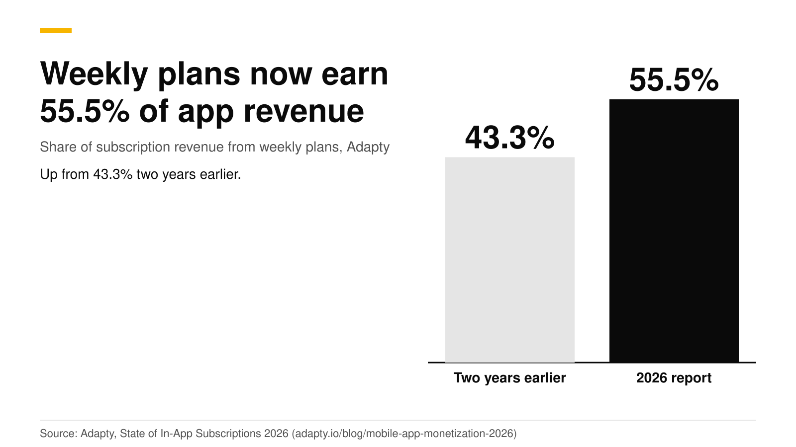
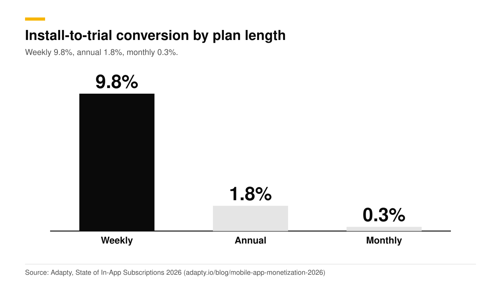
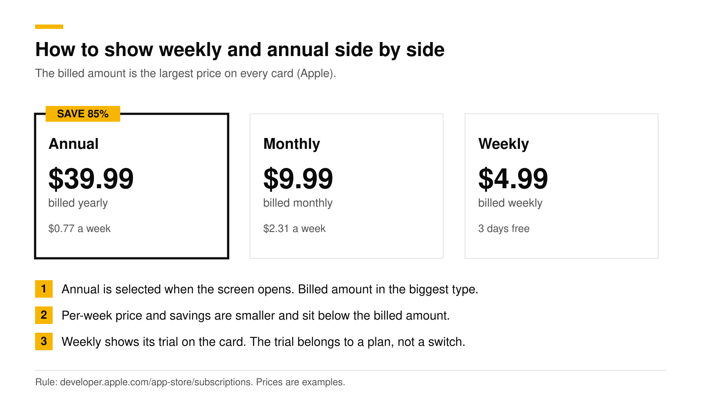

# Weekly vs annual subscriptions: which earns more in 2026

Weekly plans earn the most in most categories in 2026. Adapty's data has them at 55.5% of all subscription revenue, up from 43.3% two years earlier, and install-to-trial conversion is 9.8% for weekly plans against 1.8% for annual. Annual plans still lead in Health & Fitness, where they earn 60.6% of revenue. The best setup for most apps is to show both plans, pre-select one, and let a test decide which.

This post gives the numbers, explains the gap, and shows how to present weekly and annual plans on one screen without breaking Apple's pricing rule. It is part of our [paywall best practices guide](paywall-best-practices-2026.md). Every number is the source's own, checked in October 2026.

## Key numbers

- **Weekly plans earn 55.5% of subscription revenue**, up from 43.3% two years earlier ([Adapty, State of In-App Subscriptions 2026](https://adapty.io/blog/mobile-app-monetization-2026/)).
- **Install-to-trial conversion is 9.8% for weekly plans, 1.8% for annual and 0.3% for monthly** (same source).
- **A weekly plan with a trial reaches $54.50 per user by day 380**, from about $7.40 at day 0, a 636% rise (same source). Adapty's report page calls weekly with a trial the highest-value paywall configuration and gives $49.27 over 12 months for it, so read the exact figure as roughly $50 to $55 ([Adapty](https://adapty.io/state-of-in-app-subscriptions/)).
- **Health & Fitness is the exception.** Annual plans are 60.6% of revenue in that category, up from 51% in 2023 ([Adapty](https://adapty.io/state-of-in-app-subscriptions/)).
- **89.4% of trial starts happen on install day** ([Adapty](https://adapty.io/blog/mobile-app-monetization-2026/)), so the plans on your first paywall matter most.
- **Superwall's example:** an app where 37% of buyers chose yearly could see 63% after switching the default to annual ([Superwall newsletter](https://superwall.dev/blog/the-superwall-newsletter-volume-1)).

## Which plan earns more?

| Measure | Weekly | Annual | Source |
|---|---|---|---|
| Share of subscription revenue | 55.5% | Leads only in Health & Fitness (60.6%) | [Adapty](https://adapty.io/blog/mobile-app-monetization-2026/) |
| Install-to-trial conversion | 9.8% | 1.8% | [Adapty](https://adapty.io/blog/mobile-app-monetization-2026/) |
| Value per user with a trial | $54.50 at day 380 | Grew 18.6% with a trial | [Adapty](https://adapty.io/blog/mobile-app-monetization-2026/) |
| Where it wins | Most categories | Health & Fitness | [Adapty](https://adapty.io/state-of-in-app-subscriptions/) |

Why does weekly win on revenue? Three reasons fit the data, and none is proven alone:

1. **A low first price lowers the barrier.** A $4.99 weekly charge feels small beside $39.99 up front.
2. **Weekly plans pair well with a trial.** Weekly with a trial is the best-performing configuration in Adapty's data.
3. **Users who stay pay a lot over time.** Revenue per user climbs for months on a weekly plan, which is why the day-380 number is so much higher than day 0.

Annual plans have their own strengths. Users who pick annual are committed for a year, and in Health & Fitness, where goals and habits run long, they are the main revenue source. Superwall's best-practices guide says pushing annual plans commonly gives a 10 to 30% lifetime value uplift ([Superwall](https://api.superwall.me/blog/superwall-best-practices-winning-paywall-strategies-and-experiments-to)). Those two findings do not conflict. They describe different apps.

## Does the trial change the answer?

Yes. Adapty's data shows trial users converting well on weekly plans, and the benefit of a trial varies a lot by category. Utilities apps showed an 85.1% lifetime value premium for trial users over direct buyers, while lifestyle apps showed a 21.2% discount, which means trial users there were worth less ([Adapty](https://adapty.io/state-of-in-app-subscriptions/)). So test the trial, not just the plan length. Changing trial setup or plan duration also shows a larger lifetime value uplift in Adapty's experiment data (59.6% and 58.7%) than changing the price (45.5%).

## Does the price level change the result?

Adapty's report says weekly plans convert 1.7 to 7.4 times better than annual plans across all price tiers ([Adapty](https://adapty.io/state-of-in-app-subscriptions/)). So the weekly advantage in conversion holds from cheap markets to expensive ones. It does not say weekly always earns more, because annual buyers pay more per purchase. That is why the test in this post compares revenue per new customer, not conversion alone.

Fewer plans can also help. One of RevenueCat's published redesigns, a party game, reached a 64% revenue uplift after simplifying the design and offering fewer plan options. That redesign also added a trial toggle, which Apple now rejects, so read it as a hint to try two or three plans and not five ([RevenueCat case studies](https://www.revenuecat.com/blog/growth/paywall-redesigns-case-studies/)).

## How should you show both plans?

Apple has one hard rule for the layout. On the purchase screen, the amount that will be billed must be the most prominent pricing element. An annual plan shows the total billed per year, and a per-week breakdown or a savings figure sits below it, in smaller type ([Apple, subscriptions](https://developer.apple.com/app-store/subscriptions/)). A trial purchase flow must say how long the trial lasts and what is billed after it.

A layout that follows the rule:

1. **Two or three cards, one selected.** Annual selected is the classic choice. If your category follows the weekly pattern, test weekly selected.
2. **Billed amount largest.** "$39.99" in the biggest type, "billed yearly" below it.
3. **Per-week price smaller, below.** "$0.77 a week" in secondary type.
4. **A savings badge on the plan you want chosen.** "SAVE 85%" is computed against the weekly price, so state what it is computed against.
5. **The trial on a plan, never on a switch.** Apple rejects trial toggles. See [Apple's free-trial toggle rejection](apple-free-trial-toggle-rejection.md).
6. **Plain names.** Superwall found "Annual Plan, Monthly Plan, Weekly Plan" with "No commitment, cancel anytime" under the button beat redundant names by 10% ([Superwall](https://superwall.dev/blog/the-paywall-tactics-behind-usd100k-month-apps)).

## How do you decide for your app?

1. **Start with your category.** Health & Fitness points to annual. Most others point to weekly.
2. **Look at your refunds and churn by plan.** A cheap weekly plan can bring users who leave fast. Check this in your own store reports.
3. **Test the default.** Two offerings, same plans, different pre-selection. Measure revenue per new customer over 30 to 60 days.
4. **Test the trial separately.** Put the trial on one plan and compare.
5. **Show the full price once.** Whatever wins, state the billed amount and renewal clearly.

## How to do this with RevenueDot

1. In **Product catalog**, create an offering with packages for weekly, monthly and annual. See the [paywalls guide](https://revenuedot.app/docs/guides/paywalls).
2. In **Paywalls**, start from **Annual first** (benefits, then yearly and monthly with a savings badge) or **Minimal** (a headline, your plans and one button).
3. In the editor, select a Package component and choose which package it sells and whether it is selected when the paywall opens. Switch the preview's **Intro offer** setting to check the trial wording.
4. Use the store variables in text: `{{ product.price_per_period }}` for the billed amount, `{{ product.price_per_month }}` for a monthly breakdown and `{{ product.relative_discount }}` for the savings badge. They fill in the local price in the device's currency.
5. Build a second paywall with weekly selected on another offering. Open **Experiments**, pick both offerings, enroll a share of customers and **Start**. Read customers per variant, conversions, revenue per customer and the chance the treatment converts better. Wait for 100 customers in each variant. See [targeting and experiments](https://revenuedot.app/docs/guides/targeting-and-experiments) and the [experiments feature page](https://revenuedot.app/features/experiments).
6. Use **Targeting** to give an audience, such as one country, a different offering. Prices vary by country, so this matters.

Track the outcome on the [paywall conversion chart](https://revenuedot.app/charts/paywall-conversion-rate) and the [trial conversion rate chart](https://revenuedot.app/charts/trial-conversion-rate). See also the [paywalls feature page](https://revenuedot.app/features/paywalls).

[Start for free on RevenueDot Cloud](https://app.revenuedot.app/signup). Pro costs $0 until your apps make $10,000 a month.

## FAQ

### Do weekly subscriptions make more money than annual?

In most categories, yes. Adapty's 2026 data has weekly plans at 55.5% of subscription revenue. Health & Fitness is the exception, with annual plans earning 60.6% of revenue.

### Should I pre-select annual or weekly?

Pre-select the plan you want most users to take, and test it. Superwall's example shows a yearly share moving from 37% to 63% when annual became the default, but a higher yearly share does not always mean higher revenue. Measure revenue per new customer.

### Can I show a per-week price for an annual plan?

Yes, if the billed amount stays the most prominent price. Apple's rule is that the amount billed must be the most prominent element, and breakdowns or savings must be smaller and in a subordinate position.

### How long should the trial be on a weekly plan?

We found no published trial length benchmark for weekly plans. RevenueCat's 2025 report found trials of 17 to 32 days convert best overall (about 45.7%) and trials under 4 days convert worst (about 25.5%), but those are figures across all plans, not weekly plans alone. Test two lengths, and remember Apple requires a subscription period of at least seven days ([Apple guidelines](https://developer.apple.com/app-store/review/guidelines/)).

### Does RevenueDot support weekly, monthly and annual plans?

Yes. RevenueDot reads your store products and offerings, so any plan length you create in App Store Connect or Google Play works, and the paywall editor can show them on cards.

**About RevenueDot.** RevenueDot is an open-source (AGPL-3.0) backend for in-app purchases and subscriptions that works with the RevenueCat SDK. Start for free on [RevenueDot Cloud](https://app.revenuedot.app/signup): Pro costs $0 until your apps make $10,000 a month, then 0.5% of revenue above $10,000, never more than $999 a month. Point the SDK's proxy URL at RevenueDot and keep your app code, your offerings and your customers. Read the [quickstart](../docs/getting-started/quickstart.md) or the code on [GitHub](https://github.com/revenuedot/revenuedot).
